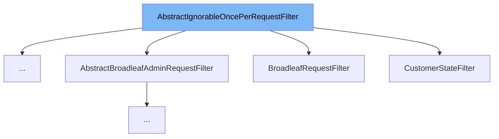

This document will cover the `AbstractIgnorableOncePerRequestFilter` class. We will cover:

1. What the `AbstractIgnorableOncePerRequestFilter` class is and its purpose.
2. The main variables and functions of the `AbstractIgnorableOncePerRequestFilter` class.
3. An example of how to use the `AbstractIgnorableOncePerRequestFilter` class.



# What is AbstractIgnorableOncePerRequestFilter

`AbstractIgnorableOncePerRequestFilter` is an abstract class that extends `OncePerRequestFilter` and implements `Ordered`. It provides common logic for `OncePerRequestFilter` implementations to allow for ignoring behavior based on the presence (or absence) of a request parameter. Subclasses should implement `doFilterInternalUnlessIgnored(HttpServletRequest, HttpServletResponse, FilterChain)`, knowing that this method will faithfully be called unless the logic here determines the filter should pass the request through without processing.

<SwmSnippet path="/common/src/main/java/org/broadleafcommerce/common/web/filter/AbstractIgnorableOncePerRequestFilter.java" line="45">

---

# Variables and functions

The `LOG` variable is a static final Log instance used for logging trace information. It is initialized with the LogFactory's `getLog` method, passing in the `AbstractIgnorableOncePerRequestFilter` class.

```java
    private static final Log LOG = LogFactory.getLog(AbstractIgnorableOncePerRequestFilter.class);
```

---

</SwmSnippet>

<SwmSnippet path="/common/src/main/java/org/broadleafcommerce/common/web/filter/AbstractIgnorableOncePerRequestFilter.java" line="48">

---

The `doFilterInternal` function is an overridden method from `OncePerRequestFilter`. It checks if the request is ignored by calling the `isIgnored` method. If the request is ignored, it logs a trace message and passes the request through the filter chain without processing. If the request is not ignored, it logs a trace message and calls the `doFilterInternalUnlessIgnored` method.

```java
    public void doFilterInternal(HttpServletRequest httpServletRequest, HttpServletResponse httpServletResponse, FilterChain filterChain) throws ServletException, IOException {
        if (isIgnored(httpServletRequest, httpServletResponse)) {
            if (LOG.isTraceEnabled()) {
                LOG.trace(String.format("%s filtering is disabled for %s", this.getClass().getName(), httpServletRequest.getRequestURI()));
            }
            filterChain.doFilter(httpServletRequest, httpServletResponse);
        } else {
            if (LOG.isTraceEnabled()) {
                LOG.trace(String.format("%s filtering is enabled for %s", this.getClass().getName(), httpServletRequest.getRequestURI()));
            }
            doFilterInternalUnlessIgnored(httpServletRequest, httpServletResponse, filterChain);
        }
    }
```

---

</SwmSnippet>

<SwmSnippet path="/common/src/main/java/org/broadleafcommerce/common/web/filter/AbstractIgnorableOncePerRequestFilter.java" line="62">

---

The `isIgnored` function checks if the URI security is ignored by calling the `isFilteringIgnoredForUri` method from `BLCRequestUtils` and returns the result. It takes in `HttpServletRequest` and `HttpServletResponse` as parameters.

```java
    protected boolean isIgnored(HttpServletRequest httpServletRequest, HttpServletResponse httpServletResponse) {
        boolean isUriSecurityIgnored = BLCRequestUtils.isFilteringIgnoredForUri(new ServletWebRequest(httpServletRequest, httpServletResponse));
        return isUriSecurityIgnored;
    }
```

---

</SwmSnippet>

<SwmSnippet path="/common/src/main/java/org/broadleafcommerce/common/web/filter/AbstractIgnorableOncePerRequestFilter.java" line="67">

---

The `doFilterInternalUnlessIgnored` function is an abstract method that must be implemented by subclasses. It is called by `doFilterInternal` when the request is not ignored. It takes in `HttpServletRequest`, `HttpServletResponse`, and `FilterChain` as parameters.

```java
    protected abstract void doFilterInternalUnlessIgnored(HttpServletRequest request, HttpServletResponse response, FilterChain chain) throws IOException, ServletException;
```

---

</SwmSnippet>

<SwmSnippet path="/admin/broadleaf-open-admin-platform/src/main/java/org/broadleafcommerce/openadmin/web/compatibility/JSCompatibilityRequestFilter.java" line="36">

---

# Usage example

`JSCompatibilityRequestFilter` is an example of a class that extends `AbstractIgnorableOncePerRequestFilter`. This shows how the `AbstractIgnorableOncePerRequestFilter` can be used as a base class for other filters.

```java
public class JSCompatibilityRequestFilter extends AbstractIgnorableOncePerRequestFilter {
```

---

</SwmSnippet>

&nbsp;

*This is an auto-generated document by Swimm AI 🌊 and has not yet been verified by a human*

<SwmMeta version="3.0.0" repo-id="Z2l0aHViJTNBJTNBQnJvYWRsZWFmQ29tbWVyY2UtZGVtbyUzQSUzQWdpbGFkbmF2b3Q=" repo-name="BroadleafCommerce-demo" doc-type="class"><sup>Powered by [Swimm](/)</sup></SwmMeta>
