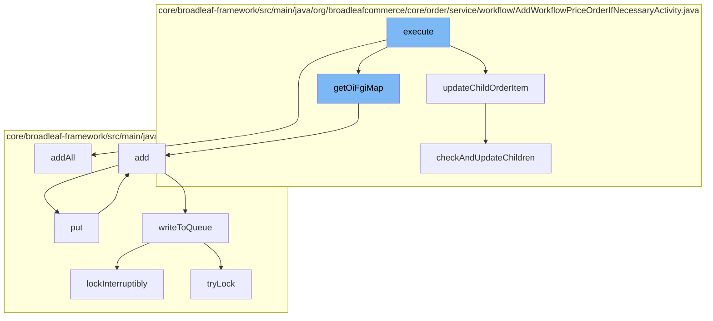

This document will cover the process of adding workflow price order in Broadleaf Commerce, which includes:

1. Updating child order items
2. Constructing and adding to the order item fulfillment group map
3. Adding entries to the resource purge service
4. Writing to the distributed queue.



<SwmSnippet path="/core/broadleaf-framework/src/main/java/org/broadleafcommerce/core/order/service/workflow/AddWorkflowPriceOrderIfNecessaryActivity.java" line="195">

---

# Updating Child Order Items

The `updateChildOrderItem` function traverses the current OrderItem for a match to the parentOrderItemId. If a match is found, it populates and returns true. This is the first step in the process of adding a workflow price order.

```java
    /**
     * Traverses the current OrderItem for a match to the parentOrderItemId.
     * If found, populates and returns true.
     *
     * @param request
     * @param orderItem
     * @return
     */
    protected void updateChildOrderItem(CartOperationRequest request, Order order) {
        boolean updated = false;
        for (OrderItem oi : order.getOrderItems()) {
            if (oi instanceof BundleOrderItem) {
                BundleOrderItem boi = (BundleOrderItem) oi;
                updated = checkAndUpdateChildren(request, boi); //check the bundle children
                if (!updated) {
                    for (OrderItem discreteOrderItem : boi.getDiscreteOrderItems()) { //check the bundle discrete items
                        if (checkAndUpdateChildren(request, discreteOrderItem)) {
                            updated = true;
                            break; //break out of the discrete items loop
                        }
                    }
```

---

</SwmSnippet>

<SwmSnippet path="/core/broadleaf-framework/src/main/java/org/broadleafcommerce/core/order/service/workflow/AddWorkflowPriceOrderIfNecessaryActivity.java" line="226">

---

# Constructing and Adding to the Order Item Fulfillment Group Map

The `checkAndUpdateChildren` function is used to check and update children of the order item. If the order item ID matches the parent order item ID from the request, the order item is added to the child order items of the order item. This step is crucial for maintaining the hierarchy of order items.

```java
    protected boolean checkAndUpdateChildren(CartOperationRequest request, OrderItem orderItem) {
        boolean parentUpdated = false;
        if (orderItem.getId().equals(request.getItemRequest().getParentOrderItemId())) {
            orderItem.getChildOrderItems().add(request.getOrderItem());
            parentUpdated = true;
        } else {
            if (CollectionUtils.isNotEmpty(orderItem.getChildOrderItems())) {
                for (OrderItem childOrderItem : orderItem.getChildOrderItems()) {
                    parentUpdated = checkAndUpdateChildren(request, childOrderItem);
                    if (parentUpdated) {
                        break;
                    }
                }
            }
        }
        return parentUpdated;
    }
```

---

</SwmSnippet>

<SwmSnippet path="/core/broadleaf-framework/src/main/java/org/broadleafcommerce/core/util/service/ResourcePurgeServiceImpl.java" line="593">

---

# Adding Entries to the Resource Purge Service

The `add` function in the `ResourcePurgeServiceImpl` class is used to add entries to the resource purge service. If the cache does not already contain the entry, it is added to the cache with the current time in milliseconds. This step is important for managing resources and ensuring that they are purged when no longer needed.

```java
        public Long add(Long entry) {
            if (! cache.containsKey(entry)) {
                return cache.put(entry, new Long(System.currentTimeMillis()));
            }
            return null;
        }
```

---

</SwmSnippet>

<SwmSnippet path="/core/broadleaf-framework/src/main/java/org/broadleafcommerce/core/util/queue/ZookeeperDistributedQueue.java" line="503">

---

# Writing to the Distributed Queue

The `writeToQueue` function is used to write entries to the distributed queue. It locks the queue, checks the remaining capacity, and adds entries to the queue. If the queue is full, it waits until there is capacity. This step is crucial for managing the distributed queue and ensuring that entries are added in a thread-safe manner.

```java
    protected int writeToQueue(List<? extends T> entries, final long timeout) throws InterruptedException {
        if (entries == null || entries.isEmpty()) {
            return 0;
        }
        
        int entryCount = 0;
        long waitTime = timeout;
        synchronized (QUEUE_MONITOR) {
            while (true) {
                boolean locked = false;
                DistributedLock lock = getQueueAccessLock();
                if (timeout < 0L) {
                    lock.lockInterruptibly();
                    locked = true;
                } else if (timeout > 0L && waitTime > 0L) {
                    long start = System.currentTimeMillis();
                    locked = lock.tryLock(waitTime, TimeUnit.MILLISECONDS);
                    long end = System.currentTimeMillis();
                    waitTime -= (end - start);
                } else {
                    locked = lock.tryLock();
```

---

</SwmSnippet>

&nbsp;

*This is an auto-generated document by Swimm AI 🌊 and has not yet been verified by a human*

<SwmMeta version="3.0.0" repo-id="Z2l0aHViJTNBJTNBQnJvYWRsZWFmQ29tbWVyY2UtZGVtbyUzQSUzQWdpbGFkbmF2b3Q=" repo-name="BroadleafCommerce-demo" doc-type="flows"><sup>Powered by [Swimm](/)</sup></SwmMeta>
