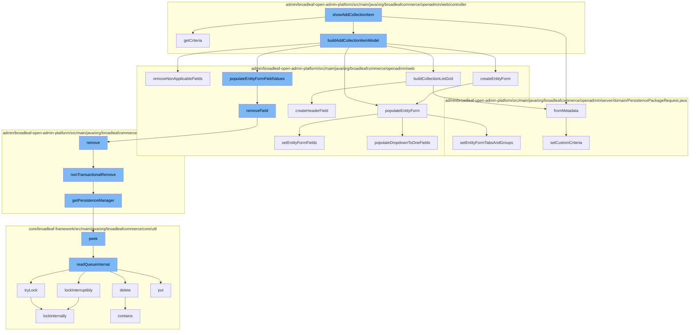

This document will cover the process of adding a new collection item in the Broadleaf Commerce framework. The process involves the following steps:

1. Invoking the `showAddCollectionItem` function
2. Building the collection item model
3. Populating the entity form field values
4. Removing the field
5. Removing the entity
6. Reading the queue internal
7. Locking internally
8. Building the collection list grid
9. Populating the entity form



<SwmSnippet path="/admin/broadleaf-open-admin-platform/src/main/java/org/broadleafcommerce/openadmin/web/controller/entity/AdminBasicEntityController.java" line="1">

---

# Invoking the `showAddCollectionItem` function

The `showAddCollectionItem` function is the entry point for adding a new collection item. It calls the `getCriteria` function to get the filter and sort criteria based on the request parameters.

```java
/*-
 * #%L
 * BroadleafCommerce Open Admin Platform
 * %%
 * Copyright (C) 2009 - 2024 Broadleaf Commerce
 * %%
 * Licensed under the Broadleaf Fair Use License Agreement, Version 1.0
 * (the "Fair Use License" located  at http://license.broadleafcommerce.org/fair_use_license-1.0.txt)
 * unless the restrictions on use therein are violated and require payment to Broadleaf in which case
 * the Broadleaf End User License Agreement (EULA), Version 1.1
```

---

</SwmSnippet>

<SwmSnippet path="/admin/broadleaf-open-admin-platform/src/main/java/org/broadleafcommerce/openadmin/web/controller/entity/AdminBasicEntityController.java" line="11">

---

# Building the collection item model

The `buildAddCollectionItemModel` function is responsible for constructing the model for the new collection item. It calls several functions including `removeNonApplicableFields` to remove fields that are not applicable to the current entity type.

```java
 * (the "Commercial License" located at http://license.broadleafcommerce.org/commercial_license-1.1.txt)
 * shall apply.
 * 
 * Alternatively, the Commercial License may be replaced with a mutually agreed upon license (the "Custom License")
 * between you and Broadleaf Commerce. You may not use this file except in compliance with the applicable license.
 * #L%
 */
package org.broadleafcommerce.openadmin.web.controller.entity;

import org.apache.commons.collections.CollectionUtils;
```

---

</SwmSnippet>

<SwmSnippet path="/admin/broadleaf-open-admin-platform/src/main/java/org/broadleafcommerce/openadmin/web/service/FormBuilderServiceImpl.java" line="21">

---

# Populating the entity form field values

The `populateEntityFormFieldValues` function is used to populate the form fields with the values of the entity. If a field is not applicable, it is removed by calling the `removeField` function.

```java
import org.apache.commons.collections.Predicate;
import org.apache.commons.lang.ArrayUtils;
import org.apache.commons.lang.BooleanUtils;
import org.apache.commons.lang3.StringUtils;
import org.apache.commons.logging.Log;
import org.apache.commons.logging.LogFactory;
import org.broadleafcommerce.common.admin.domain.AdminMainEntity;
import org.broadleafcommerce.common.exception.ExceptionHelper;
import org.broadleafcommerce.common.exception.SecurityServiceException;
import org.broadleafcommerce.common.exception.ServiceException;
```

---

</SwmSnippet>

<SwmSnippet path="/admin/broadleaf-open-admin-platform/src/main/java/org/broadleafcommerce/openadmin/web/form/entity/FieldGroup.java" line="31">

---

# Removing the field

The `removeField` function is used to remove a field from the field group. It calls the `remove` function to remove the entity from the dynamic entity remote service.

```java
import java.util.List;
import java.util.Map;
import java.util.Set;

public class FieldGroup {

    protected String title;
    protected String key;
    protected Integer order;
    protected Set<FieldGroupItem> alternateOrderedGroupItems = new HashSet<>();
```

---

</SwmSnippet>

<SwmSnippet path="/admin/broadleaf-open-admin-platform/src/main/java/org/broadleafcommerce/openadmin/server/service/DynamicEntityRemoteService.java" line="41">

---

# Removing the entity

The `remove` function is used to remove the entity from the persistence layer. It calls the `nonTransactionalRemove` function to perform the removal operation without a transaction.

```java
import org.broadleafcommerce.openadmin.server.service.persistence.PersistenceManagerFactory;
import org.broadleafcommerce.openadmin.server.service.persistence.PersistenceResponse;
import org.broadleafcommerce.openadmin.server.service.persistence.PersistenceThreadManager;
import org.springframework.beans.factory.annotation.Value;
import org.springframework.stereotype.Service;
import org.springframework.transaction.PlatformTransactionManager;
import org.springframework.transaction.TransactionDefinition;

import java.lang.reflect.Constructor;
import java.util.Collections;
```

---

</SwmSnippet>

<SwmSnippet path="/core/broadleaf-framework/src/main/java/org/broadleafcommerce/core/util/queue/ZookeeperDistributedQueue.java" line="51">

---

# Reading the queue internal

The `readQueueInternal` function is used to read the queue internally. It calls the `tryLock` function to try to acquire a lock.

```java
import java.util.Map;
import java.util.Queue;
import java.util.concurrent.TimeUnit;

/**
 * Represents a {@link Queue} that is distributed (used by multiple JVMs or nodes) and managed by Zookeeper.  This queue uses distributed locks, also backed by Zookeeper.
 * 
 * Please note that while this works quite well in certain circumstances, it is not recommended for high volume or high capacity queues, 
 * nor for large queue messages.  It's a relatively slow queue.  Zookeeper allows you to create queues that can be used in a distributed way, but large queues can cause performance problems 
 * in Zookeeper, and Zookeeper has a 1MB transport limit, so messages have to be smaller than that.  Incidentally, initial performance tests showed queue operations (put / take) taking 
```

---

</SwmSnippet>

<SwmSnippet path="/core/broadleaf-framework/src/main/java/org/broadleafcommerce/core/util/lock/ReentrantDistributedZookeeperLock.java" line="61">

---

# Locking internally

The `lockInternally` function is used to acquire a lock internally. It is used to ensure that the operations are performed in a thread-safe manner.

```java
 * <p>
 * <code>
 * Lock lock = new ReentrantDistributedZookeeperLock(zk, "/solr-update/locks", "solrUpdate_commandLock");
 * if (lock.tryLock()) {
 *     try {
 *         //Do something in a globally locked state
 *     } finally {
 *         lock.unlock();
 *     }
 * }
```

---

</SwmSnippet>

<SwmSnippet path="/admin/broadleaf-open-admin-platform/src/main/java/org/broadleafcommerce/openadmin/web/service/FormBuilderServiceImpl.java" line="71">

---

# Building the collection list grid

The `buildCollectionListGrid` function is used to build the list grid for the collection. It calls the `createHeaderField` function to create the header field for the grid.

```java
import org.broadleafcommerce.openadmin.server.security.service.EntityFormModifier;
import org.broadleafcommerce.openadmin.server.security.service.EntityFormModifierConfiguration;
import org.broadleafcommerce.openadmin.server.security.service.EntityFormModifierData;
import org.broadleafcommerce.openadmin.server.security.service.EntityFormModifierDataPoint;
import org.broadleafcommerce.openadmin.server.security.service.EntityFormModifierRequest;
import org.broadleafcommerce.openadmin.server.security.service.ExceptionAwareRowLevelSecurityProvider;
import org.broadleafcommerce.openadmin.server.security.service.RowLevelSecurityService;
import org.broadleafcommerce.openadmin.server.security.service.navigation.AdminNavigationService;
import org.broadleafcommerce.openadmin.server.service.AdminEntityService;
import org.broadleafcommerce.openadmin.server.service.persistence.PersistenceManager;
```

---

</SwmSnippet>

<SwmSnippet path="/admin/broadleaf-open-admin-platform/src/main/java/org/broadleafcommerce/openadmin/web/service/FormBuilderServiceImpl.java" line="81">

---

# Populating the entity form

The `populateEntityForm` function is used to populate the entity form with the values of the entity. It calls the `setEntityFormFields` function to set the fields of the form.

```java
import org.broadleafcommerce.openadmin.server.service.persistence.PersistenceManagerFactory;
import org.broadleafcommerce.openadmin.server.service.persistence.module.BasicPersistenceModule;
import org.broadleafcommerce.openadmin.server.service.persistence.module.FieldManager;
import org.broadleafcommerce.openadmin.web.form.component.DefaultListGridActions;
import org.broadleafcommerce.openadmin.web.form.component.ListGrid;
import org.broadleafcommerce.openadmin.web.form.component.ListGridAction;
import org.broadleafcommerce.openadmin.web.form.component.ListGridActionGroup;
import org.broadleafcommerce.openadmin.web.form.component.ListGridRecord;
import org.broadleafcommerce.openadmin.web.form.component.MediaField;
import org.broadleafcommerce.openadmin.web.form.component.RuleBuilderField;
```

---

</SwmSnippet>

&nbsp;

*This is an auto-generated document by Swimm AI 🌊 and has not yet been verified by a human*

<SwmMeta version="3.0.0" repo-id="Z2l0aHViJTNBJTNBQnJvYWRsZWFmQ29tbWVyY2UtZGVtbyUzQSUzQWdpbGFkbmF2b3Q=" repo-name="BroadleafCommerce-demo" doc-type="flows"><sup>Powered by [Swimm](/)</sup></SwmMeta>
