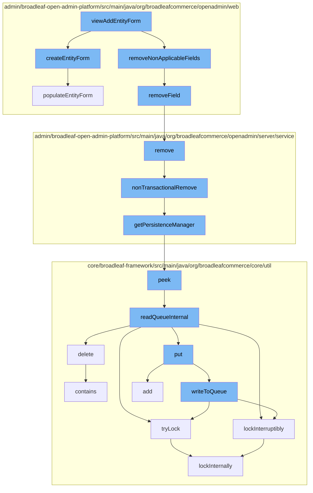

This document will cover the process of adding a new entity in the BroadleafCommerce-demo project. The process includes the following steps:

 1. Viewing the add entity form
 2. Creating the entity form
 3. Removing non-applicable fields
 4. Removing the entity
 5. Non-transactional removal of the entity
 6. Getting the persistence manager
 7. Peeking into the queue
 8. Reading the queue internally
 9. Writing to the queue
10. Locking internally
11. Populating the entity form.



<SwmSnippet path="/admin/broadleaf-open-admin-platform/src/main/java/org/broadleafcommerce/openadmin/web/controller/entity/AdminBasicEntityController.java" line="1">

---

# Viewing the add entity form

The `viewAddEntityForm` function is the entry point for adding a new entity. It calls the `createEntityForm` and `removeNonApplicableFields` functions to prepare the form for the new entity.

```java
/*-
 * #%L
 * BroadleafCommerce Open Admin Platform
 * %%
 * Copyright (C) 2009 - 2024 Broadleaf Commerce
 * %%
 * Licensed under the Broadleaf Fair Use License Agreement, Version 1.0
 * (the "Fair Use License" located  at http://license.broadleafcommerce.org/fair_use_license-1.0.txt)
 * unless the restrictions on use therein are violated and require payment to Broadleaf in which case
 * the Broadleaf End User License Agreement (EULA), Version 1.1
 * (the "Commercial License" located at http://license.broadleafcommerce.org/commercial_license-1.1.txt)
 * shall apply.
 * 
 * Alternatively, the Commercial License may be replaced with a mutually agreed upon license (the "Custom License")
 * between you and Broadleaf Commerce. You may not use this file except in compliance with the applicable license.
 * #L%
 */
package org.broadleafcommerce.openadmin.web.controller.entity;

import org.apache.commons.collections.CollectionUtils;
import org.apache.commons.collections.MapUtils;
```

---

</SwmSnippet>

<SwmSnippet path="/admin/broadleaf-open-admin-platform/src/main/java/org/broadleafcommerce/openadmin/web/service/FormBuilderServiceImpl.java" line="1401">

---

# Creating the entity form

The `createEntityForm` function creates a new entity form and populates it with the necessary data.

```java
    @Override
    public EntityForm createEntityForm(ClassMetadata cmd, List<SectionCrumb> sectionCrumbs)
            throws ServiceException {
        EntityForm ef = createStandardEntityForm();
        populateEntityForm(cmd, ef, sectionCrumbs);
        return ef;
    }
```

---

</SwmSnippet>

<SwmSnippet path="/admin/broadleaf-open-admin-platform/src/main/java/org/broadleafcommerce/openadmin/web/service/FormBuilderServiceImpl.java" line="1">

---

# Removing non-applicable fields

The `removeNonApplicableFields` function is called to remove any fields from the form that are not applicable to the entity being added.

```java
/*-
 * #%L
 * BroadleafCommerce Open Admin Platform
 * %%
 * Copyright (C) 2009 - 2024 Broadleaf Commerce
 * %%
 * Licensed under the Broadleaf Fair Use License Agreement, Version 1.0
 * (the "Fair Use License" located  at http://license.broadleafcommerce.org/fair_use_license-1.0.txt)
 * unless the restrictions on use therein are violated and require payment to Broadleaf in which case
 * the Broadleaf End User License Agreement (EULA), Version 1.1
 * (the "Commercial License" located at http://license.broadleafcommerce.org/commercial_license-1.1.txt)
 * shall apply.
 * 
 * Alternatively, the Commercial License may be replaced with a mutually agreed upon license (the "Custom License")
 * between you and Broadleaf Commerce. You may not use this file except in compliance with the applicable license.
 * #L%
 */
package org.broadleafcommerce.openadmin.web.service;

import org.apache.commons.collections.CollectionUtils;
import org.apache.commons.collections.Predicate;
```

---

</SwmSnippet>

<SwmSnippet path="/admin/broadleaf-open-admin-platform/src/main/java/org/broadleafcommerce/openadmin/server/service/DynamicEntityRemoteService.java" line="249">

---

# Removing the entity

The `remove` function is called to remove the entity from the persistence layer.

```java
    @Override
    public PersistenceResponse remove(final PersistencePackage persistencePackage) throws ServiceException {
        final PersistenceResponse[] response = new PersistenceResponse[1];
        try {
            PlatformTransactionManager transactionManager = identifyTransactionManager(persistencePackage);
            transUtil.runTransactionalOperation(new StreamCapableTransactionalOperationAdapter() {
                @Override
                public void execute() throws Throwable {
                    response[0] = nonTransactionalRemove(persistencePackage);
                }

                @Override
                public boolean shouldRetryOnTransactionLockAcquisitionFailure() {
                    return super.shouldRetryOnTransactionLockAcquisitionFailure();
                }
            }, RuntimeException.class, transactionManager);
        } catch (RuntimeException e) {
            if (e.getCause() instanceof ServiceException) {
                throw (ServiceException) e.getCause();
            }
            throw e;
```

---

</SwmSnippet>

<SwmSnippet path="/admin/broadleaf-open-admin-platform/src/main/java/org/broadleafcommerce/openadmin/server/service/DynamicEntityRemoteService.java" line="329">

---

# Non-transactional removal of the entity

The `nonTransactionalRemove` function is called to remove the entity without involving a transaction.

```java
    @Override
    public PersistenceResponse nonTransactionalRemove(final PersistencePackage persistencePackage) throws ServiceException {
        return persistenceThreadManager.operation(TargetModeType.SANDBOX, persistencePackage, new Persistable <PersistenceResponse, ServiceException>() {
            @Override
            public PersistenceResponse execute() throws ServiceException {
                try {
                    PersistenceManager persistenceManager = PersistenceManagerFactory.getPersistenceManager();
                    return persistenceManager.remove(persistencePackage);
                } catch (ServiceException e) {
                    //immediately throw validation exceptions without printing a stack trace
                    if (e instanceof ValidationException) {
                        throw e;
                    } else if (e.getCause() instanceof ValidationException) {
                        throw (ValidationException) e.getCause();
                    }
                    LOG.error("Problem removing " + persistencePackage.getCeilingEntityFullyQualifiedClassname(), e);
                    String message = exploitProtectionService.cleanString(e.getMessage());
                    throw recreateSpecificServiceException(e, message, e.getCause());
                }
            }
        });
```

---

</SwmSnippet>

<SwmSnippet path="/admin/broadleaf-open-admin-platform/src/main/java/org/broadleafcommerce/openadmin/server/service/persistence/PersistenceManagerContext.java" line="49">

---

# Getting the persistence manager

The `getPersistenceManager` function is called to get the persistence manager which is responsible for managing the persistence of entities.

```java
    public PersistenceManager getPersistenceManager() {
        return !persistenceManager.empty()?persistenceManager.peek():null;
    }
```

---

</SwmSnippet>

<SwmSnippet path="/core/broadleaf-framework/src/main/java/org/broadleafcommerce/core/util/queue/ZookeeperDistributedQueue.java" line="222">

---

# Peeking into the queue

The `peek` function is called to peek into the queue and get the next entity to be processed.

```java
    @Override
    public T peek() {
        try {
            Map<String, T> elements = readQueueInternal(1, false, 0L);
            Iterator<Map.Entry<String, T>> entries = elements.entrySet().iterator();
            if (entries.hasNext()) {
                return entries.next().getValue();
            }
            
            return null;
        } catch (InterruptedException e) {
            Thread.currentThread().interrupt();
            return null;
        }
    }
```

---

</SwmSnippet>

<SwmSnippet path="/core/broadleaf-framework/src/main/java/org/broadleafcommerce/core/util/queue/ZookeeperDistributedQueue.java" line="591">

---

# Reading the queue internally

The `readQueueInternal` function is called to read the queue internally and get the next entity to be processed.

```java
    protected Map<String, T> readQueueInternal(final int qty, final boolean remove, final long timeout) throws InterruptedException {
        final Map<String, T> out = new LinkedHashMap<>();
        long waitTime = timeout;
        synchronized (QUEUE_MONITOR) {
            while (true) {
                boolean locked;
                DistributedLock lock = getQueueAccessLock();
                if (timeout < 0L) {
                    lock.lockInterruptibly();
                    locked = true;
                } else if (timeout > 0L && waitTime > 0L) {
                    long start = System.currentTimeMillis();
                    locked = lock.tryLock(waitTime, TimeUnit.MILLISECONDS);
                    long end = System.currentTimeMillis();
                    waitTime -= (end - start);
                } else {
```

---

</SwmSnippet>

<SwmSnippet path="/core/broadleaf-framework/src/main/java/org/broadleafcommerce/core/util/queue/ZookeeperDistributedQueue.java" line="503">

---

# Writing to the queue

The `writeToQueue` function is called to write the new entity to the queue for processing.

```java
    protected int writeToQueue(List<? extends T> entries, final long timeout) throws InterruptedException {
        if (entries == null || entries.isEmpty()) {
            return 0;
        }
        
        int entryCount = 0;
        long waitTime = timeout;
        synchronized (QUEUE_MONITOR) {
            while (true) {
                boolean locked = false;
                DistributedLock lock = getQueueAccessLock();
                if (timeout < 0L) {
                    lock.lockInterruptibly();
                    locked = true;
                } else if (timeout > 0L && waitTime > 0L) {
                    long start = System.currentTimeMillis();
                    locked = lock.tryLock(waitTime, TimeUnit.MILLISECONDS);
                    long end = System.currentTimeMillis();
                    waitTime -= (end - start);
                } else {
                    locked = lock.tryLock();
```

---

</SwmSnippet>

<SwmSnippet path="/core/broadleaf-framework/src/main/java/org/broadleafcommerce/core/util/lock/ReentrantDistributedZookeeperLock.java" line="380">

---

# Locking internally

The `lockInternally` function is called to lock the process internally to ensure that the entity is processed correctly.

```java
    protected boolean lockInternally(final long waitTime) throws InterruptedException {
        if (!canParticipate()) {
            //No lock will be provided in this case, but we want to simulate the normal lock semantics.
            if (waitTime < 0L) {
                //Simulate normal lock semantics,where the lock is unavailable, but we've been asked to wait interruptably for it indefinitely.
                synchronized (NON_PARTICIPANT_LOCK_MONITOR) {
                    //This basically will cause this thread to block forever until the thread is interrupted, which is what we want.
                    NON_PARTICIPANT_LOCK_MONITOR.wait(); 
                }
            } else if (waitTime > 0L) {
                //Simulate normal lock semantics, where the lock is unavailable, but we've been asked to wait interruptably for it for a period of time.
                synchronized (NON_PARTICIPANT_LOCK_MONITOR) {
                    NON_PARTICIPANT_LOCK_MONITOR.wait(waitTime);
                }
            }
            
            return false;
        }
        
        //See if this thread already has a lock permit.  If so, just increment the count and return it.
        //No need to interact with Zookeeper.
```

---

</SwmSnippet>

<SwmSnippet path="/admin/broadleaf-open-admin-platform/src/main/java/org/broadleafcommerce/openadmin/web/service/FormBuilderServiceImpl.java" line="1417">

---

# Populating the entity form

The `populateEntityForm` function is called to populate the entity form with the necessary data.

```java
    @Override
    public void populateEntityForm(ClassMetadata cmd, EntityForm ef, List<SectionCrumb> sectionCrumbs)
            throws ServiceException {
        ef.setCeilingEntityClassname(cmd.getCeilingType());
        
        String sectionIdentifier = extractSectionIdentifierFromCrumb(sectionCrumbs);

        AdminSection section = navigationService.findAdminSectionByClassAndSectionId(cmd.getCeilingType(),
                sectionIdentifier);
        if (section != null) {
            ef.setSectionKey(section.getUrl());
        } else {
            ef.setSectionKey(cmd.getCeilingType());
        }
        ef.setSectionCrumbsImpl(sectionCrumbs);

        setEntityFormTabsAndGroups(ef, cmd.getTabAndGroupMetadata());

        setEntityFormFields(cmd, ef, Arrays.asList(cmd.getProperties()));
        
        populateDropdownToOneFields(ef, cmd);
```

---

</SwmSnippet>

&nbsp;

*This is an auto-generated document by Swimm AI 🌊 and has not yet been verified by a human*

<SwmMeta version="3.0.0" repo-id="Z2l0aHViJTNBJTNBQnJvYWRsZWFmQ29tbWVyY2UtZGVtbyUzQSUzQWdpbGFkbmF2b3Q=" repo-name="BroadleafCommerce-demo" doc-type="flows"><sup>Powered by [Swimm](/)</sup></SwmMeta>
