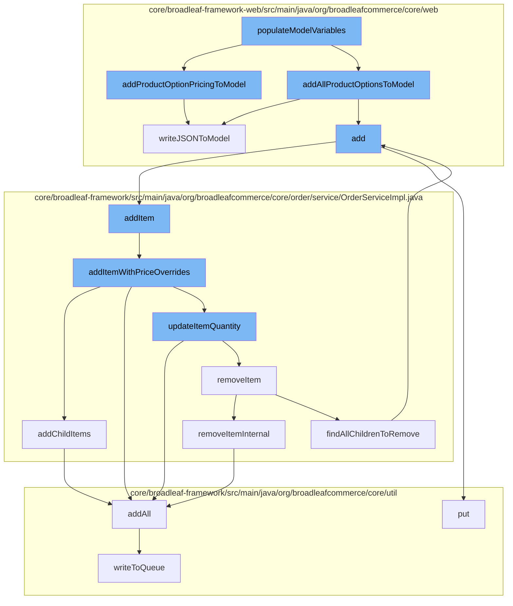

This document will cover the process of adding a product to the cart in the BroadleafCommerce-demo project. The steps include:

1. Populating model variables
2. Adding product options to the model
3. Adding the product to the wishlist
4. Adding the item to the order
5. Updating the item quantity
6. Removing the item if necessary
7. Adding child items to the order
8. Writing the final state to the queue.



<SwmSnippet path="/core/broadleaf-framework-web/src/main/java/org/broadleafcommerce/core/web/processor/ProductOptionsProcessor.java" line="100">

---

# Populating model variables

The `populateModelVariables` function starts the process by calling `addProductOptionPricingToModel` and `addAllProductOptionsToModel`. This function is responsible for preparing the product data for further processing.

```java
    protected void addProductOptionPricingToModel(Map<String, Object> newModelVars, Product product, BroadleafTemplateContext context, Map<String, String> tagAttributes) {
        List<Sku> skus = product.getSkus();
        List<ProductOptionPricingDTO> skuPricing = new ArrayList<>();
        for (Sku sku : skus) {
            
            List<Long> productOptionValueIds = new ArrayList<Long>();
            
            Set<SkuProductOptionValueXref> productOptionValueXrefs = SetUtils.emptyIfNull(sku.getProductOptionValueXrefs());
            for (SkuProductOptionValueXref skuProductOptionValueXref : productOptionValueXrefs) {
                ProductOptionValue productOptionValue = skuProductOptionValueXref.getProductOptionValue();
                productOptionValueIds.add(productOptionValue.getId());
            }
            ProductOptionPricingDTO pricingDto = createPricingDto(sku, productOptionValueIds, tagAttributes, context);
            skuPricing.add(pricingDto);
        }
        writeJSONToModel(newModelVars, "skuPricing", skuPricing);
    }
```

---

</SwmSnippet>

<SwmSnippet path="/core/broadleaf-framework-web/src/main/java/org/broadleafcommerce/core/web/processor/ProductOptionsProcessor.java" line="100">

---

# Adding product options to the model

`addProductOptionPricingToModel` is called to add pricing details for the product options to the model. It also calls `writeJSONToModel` to write the pricing details to the model in JSON format.

```java
    protected void addProductOptionPricingToModel(Map<String, Object> newModelVars, Product product, BroadleafTemplateContext context, Map<String, String> tagAttributes) {
        List<Sku> skus = product.getSkus();
        List<ProductOptionPricingDTO> skuPricing = new ArrayList<>();
        for (Sku sku : skus) {
            
            List<Long> productOptionValueIds = new ArrayList<Long>();
            
            Set<SkuProductOptionValueXref> productOptionValueXrefs = SetUtils.emptyIfNull(sku.getProductOptionValueXrefs());
            for (SkuProductOptionValueXref skuProductOptionValueXref : productOptionValueXrefs) {
                ProductOptionValue productOptionValue = skuProductOptionValueXref.getProductOptionValue();
                productOptionValueIds.add(productOptionValue.getId());
            }
            ProductOptionPricingDTO pricingDto = createPricingDto(sku, productOptionValueIds, tagAttributes, context);
            skuPricing.add(pricingDto);
        }
        writeJSONToModel(newModelVars, "skuPricing", skuPricing);
    }
```

---

</SwmSnippet>

<SwmSnippet path="/core/broadleaf-framework-web/src/main/java/org/broadleafcommerce/core/web/controller/account/BroadleafManageWishlistController.java" line="655">

---

# Adding the product to the wishlist

`add` function is called to add the product to the wishlist. This function calls `addItem` to add the product to the order.

```java

```

---

</SwmSnippet>

<SwmSnippet path="/core/broadleaf-framework/src/main/java/org/broadleafcommerce/core/order/service/OrderServiceImpl.java" line="664">

---

# Adding the item to the order

`addItem` function is called to add the product to the order. This function calls `addItemWithPriceOverrides` to add the item to the order with any price overrides.

```java
    @Override
    @Transactional(value = "blTransactionManager", rollbackFor = { AddToCartException.class })
    public Order addItemWithPriceOverrides(Long orderId, OrderItemRequestDTO orderItemRequestDTO, boolean priceOrder) throws AddToCartException {
        Order order = findOrderById(orderId);
        preValidateCartOperation(order);
        if (getAutomaticallyMergeLikeItems()) {
            OrderItem item = findMatchingItem(order, orderItemRequestDTO);
            if (item != null && item.getParentOrderItem() == null) {
                orderItemRequestDTO.setQuantity(item.getQuantity() + orderItemRequestDTO.getQuantity());
                orderItemRequestDTO.setOrderItemId(item.getId());
                try {
                    return updateItemQuantity(orderId, orderItemRequestDTO, priceOrder);
                } catch (RemoveFromCartException e) {
                    throw new AddToCartException("Unexpected error - system tried to remove item while adding to cart", e);
                } catch (UpdateCartException e) {
                    throw new AddToCartException("Could not update quantity for matched item", e);
                }
            }
        }
        try {
            // We only want to price on the last addition for performance reasons and only if the user asked for it.
```

---

</SwmSnippet>

<SwmSnippet path="/core/broadleaf-framework/src/main/java/org/broadleafcommerce/core/order/service/OrderServiceImpl.java" line="664">

---

# Updating the item quantity

`updateItemQuantity` function is called to update the quantity of the item in the order. If the quantity is zero, the item is removed from the order.

```java
    @Override
    @Transactional(value = "blTransactionManager", rollbackFor = { AddToCartException.class })
    public Order addItemWithPriceOverrides(Long orderId, OrderItemRequestDTO orderItemRequestDTO, boolean priceOrder) throws AddToCartException {
        Order order = findOrderById(orderId);
        preValidateCartOperation(order);
        if (getAutomaticallyMergeLikeItems()) {
            OrderItem item = findMatchingItem(order, orderItemRequestDTO);
            if (item != null && item.getParentOrderItem() == null) {
                orderItemRequestDTO.setQuantity(item.getQuantity() + orderItemRequestDTO.getQuantity());
                orderItemRequestDTO.setOrderItemId(item.getId());
                try {
                    return updateItemQuantity(orderId, orderItemRequestDTO, priceOrder);
                } catch (RemoveFromCartException e) {
                    throw new AddToCartException("Unexpected error - system tried to remove item while adding to cart", e);
                } catch (UpdateCartException e) {
                    throw new AddToCartException("Could not update quantity for matched item", e);
                }
            }
        }
        try {
            // We only want to price on the last addition for performance reasons and only if the user asked for it.
```

---

</SwmSnippet>

<SwmSnippet path="/core/broadleaf-framework/src/main/java/org/broadleafcommerce/core/order/service/OrderServiceImpl.java" line="851">

---

# Removing the item if necessary

`removeItem` function is called to remove the item from the order if necessary. This function calls `removeItemInternal` to perform the actual removal.

```java
    protected Order removeItemInternal(Long orderId, Long orderItemId, boolean priceOrder) throws WorkflowException {
        OrderItemRequestDTO orderItemRequestDTO = new OrderItemRequestDTO();
        orderItemRequestDTO.setOrderItemId(orderItemId);
        CartOperationRequest cartOpRequest = new CartOperationRequest(findOrderById(orderId), orderItemRequestDTO, priceOrder);
        Session session = em.unwrap(Session.class);
        FlushMode current = session.getHibernateFlushMode();
        if (!autoFlushRemoveFromCart) {
            //Performance measure. Hibernate will sometimes perform an autoflush when performing query operations and this can
            //be expensive. It is possible to avoid the autoflush if there's no concern about queries in the flow returning
            //incorrect results because something has not been flushed to the database yet.
            session.setHibernateFlushMode(FlushMode.MANUAL);
        }
        ProcessContext<CartOperationRequest> context;
        try {
            context = (ProcessContext<CartOperationRequest>) removeItemWorkflow.doActivities(cartOpRequest);
        } finally {
            if (!autoFlushRemoveFromCart) {
                session.setHibernateFlushMode(current);
            }
        }
        context.getSeedData().getOrder().getOrderMessages().addAll(((ActivityMessages) context).getActivityMessages());
```

---

</SwmSnippet>

<SwmSnippet path="/core/broadleaf-framework/src/main/java/org/broadleafcommerce/core/order/service/OrderServiceImpl.java" line="732">

---

# Adding child items to the order

`addChildItems` function is called to add any child items to the order. This function calls `addAll` to add all the child items to the order.

```java
    @Override
    public void addChildItems(OrderItemRequestDTO orderItemRequestDTO, int numAdditionRequests, int currentAddition, ProcessContext<CartOperationRequest> context, List<ActivityMessageDTO> orderMessages) throws WorkflowException {
        if (CollectionUtils.isNotEmpty(orderItemRequestDTO.getChildOrderItems())) {
            Long parentOrderItemId = context.getSeedData().getOrderItem().getId();
            for (OrderItemRequestDTO childRequest : orderItemRequestDTO.getChildOrderItems()) {
                childRequest.setParentOrderItemId(parentOrderItemId);
                currentAddition++;

                if (childRequest.getQuantity() > 0) {
                    CartOperationRequest childCartOpRequest = new CartOperationRequest(context.getSeedData().getOrder(), childRequest, currentAddition == numAdditionRequests);
                    Session session = em.unwrap(Session.class);
                    FlushMode current = session.getHibernateFlushMode();
                    if (!autoFlushAddToCart) {
                        //Performance measure. Hibernate will sometimes perform an autoflush when performing query operations and this can
                        //be expensive. It is possible to avoid the autoflush if there's no concern about queries in the flow returning
                        //incorrect results because something has not been flushed to the database yet.
                        session.setHibernateFlushMode(FlushMode.MANUAL);
                    }
                    ProcessContext<CartOperationRequest> childContext;
                    try {
                        childContext = (ProcessContext<CartOperationRequest>) addItemWorkflow.doActivities(childCartOpRequest);
```

---

</SwmSnippet>

<SwmSnippet path="/core/broadleaf-framework/src/main/java/org/broadleafcommerce/core/util/queue/ZookeeperDistributedQueue.java" line="503">

---

# Writing the final state to the queue

Finally, `writeToQueue` function is called to write the final state of the order to the queue for further processing.

```java
    protected int writeToQueue(List<? extends T> entries, final long timeout) throws InterruptedException {
        if (entries == null || entries.isEmpty()) {
            return 0;
        }
        
        int entryCount = 0;
        long waitTime = timeout;
        synchronized (QUEUE_MONITOR) {
            while (true) {
                boolean locked = false;
                DistributedLock lock = getQueueAccessLock();
                if (timeout < 0L) {
                    lock.lockInterruptibly();
                    locked = true;
                } else if (timeout > 0L && waitTime > 0L) {
                    long start = System.currentTimeMillis();
                    locked = lock.tryLock(waitTime, TimeUnit.MILLISECONDS);
                    long end = System.currentTimeMillis();
                    waitTime -= (end - start);
                } else {
                    locked = lock.tryLock();
```

---

</SwmSnippet>

&nbsp;

*This is an auto-generated document by Swimm AI 🌊 and has not yet been verified by a human*

<SwmMeta version="3.0.0" repo-id="Z2l0aHViJTNBJTNBQnJvYWRsZWFmQ29tbWVyY2UtZGVtbyUzQSUzQWdpbGFkbmF2b3Q=" repo-name="BroadleafCommerce-demo" doc-type="flows"><sup>Powered by [Swimm](/)</sup></SwmMeta>
