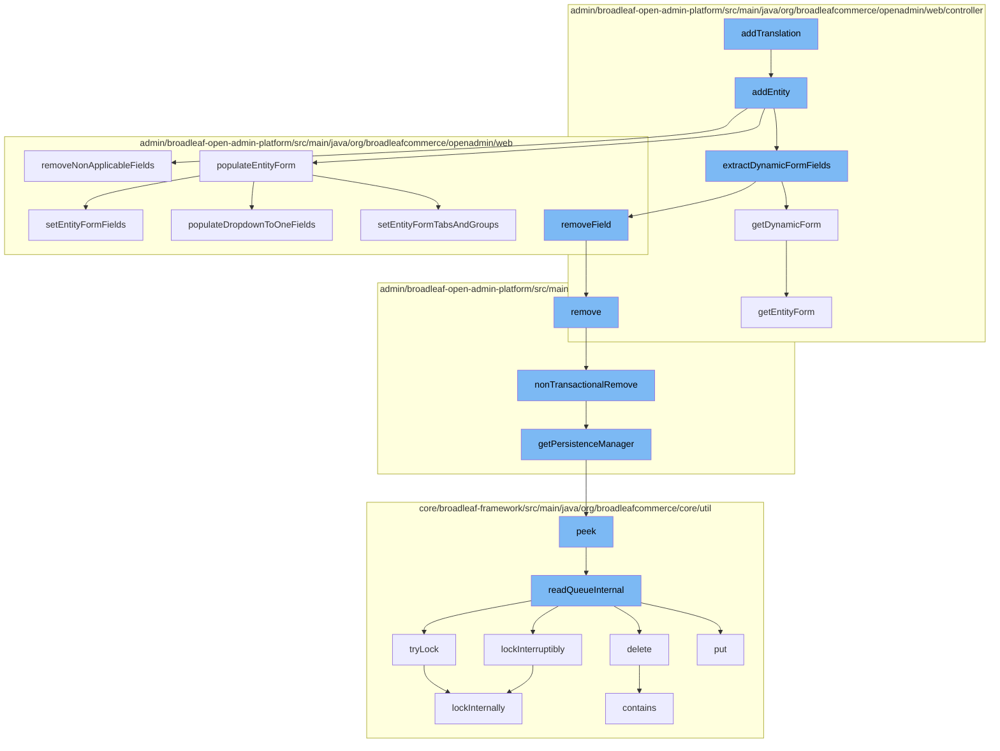

This document will cover the process of adding a translation in the BroadleafCommerce-demo project. The process involves the following steps:

1. Invoking the `addTranslation` function
2. Calling the `addEntity` function
3. Invoking the `removeNonApplicableFields`, `populateEntityForm`, and `extractDynamicFormFields` functions
4. Executing the `remove` function
5. Calling the `nonTransactionalRemove` function
6. Invoking the `getPersistenceManager` function
7. Calling the `peek` function
8. Executing the `readQueueInternal` function.



<SwmSnippet path="/admin/broadleaf-open-admin-platform/src/main/java/org/broadleafcommerce/openadmin/web/controller/AdminTranslationController.java" line="1">

---

# Invoking the `addTranslation` function

The `addTranslation` function is the entry point for adding a new translation. It calls the `addEntity` function to add the translation entity to the system.

```java
/*-
 * #%L
 * BroadleafCommerce Open Admin Platform
 * %%
 * Copyright (C) 2009 - 2024 Broadleaf Commerce
 * %%
 * Licensed under the Broadleaf Fair Use License Agreement, Version 1.0
 * (the "Fair Use License" located  at http://license.broadleafcommerce.org/fair_use_license-1.0.txt)
 * unless the restrictions on use therein are violated and require payment to Broadleaf in which case
 * the Broadleaf End User License Agreement (EULA), Version 1.1
```

---

</SwmSnippet>

<SwmSnippet path="/admin/broadleaf-open-admin-platform/src/main/java/org/broadleafcommerce/openadmin/web/controller/entity/AdminBasicEntityController.java" line="374">

---

# Calling the `addEntity` function

The `addEntity` function processes the request to add a new entity. It calls `removeNonApplicableFields`, `populateEntityForm`, and `extractDynamicFormFields` functions to prepare the entity form.

```java
    /**
     * Processes the request to add a new entity. If successful, returns a redirect to the newly created entity.
     *
     * @param request
     * @param response
     * @param model
     * @param pathVars
     * @param entityForm
     * @param result
     * @return the return view path
     * @throws Exception
     */
    @RequestMapping(value = "/add", method = RequestMethod.POST)
    public String addEntity(HttpServletRequest request, HttpServletResponse response, Model model,
            @PathVariable  Map<String, String> pathVars,
            @ModelAttribute(value="entityForm") EntityForm entityForm, BindingResult result) throws Exception {
        String sectionKey = getSectionKey(pathVars);
        String sectionClassName = getClassNameForSection(sectionKey);
        List<SectionCrumb> sectionCrumbs = getSectionCrumbs(request, null, null);
        ClassMetadata cmd = service.getClassMetadata(getSectionPersistencePackageRequest(sectionClassName, sectionCrumbs, pathVars)).getDynamicResultSet().getClassMetaData();

```

---

</SwmSnippet>

<SwmSnippet path="/admin/broadleaf-open-admin-platform/src/main/java/org/broadleafcommerce/openadmin/web/service/FormBuilderServiceImpl.java" line="1392">

---

# Invoking the `removeNonApplicableFields`, `populateEntityForm`, and `extractDynamicFormFields` functions

The `removeNonApplicableFields` function removes fields that are not applicable to the entity type from the entity form. The `populateEntityForm` function populates the entity form with fields. The `extractDynamicFormFields` function extracts dynamic form fields from the entity form.

```java
    @Override
    public void removeNonApplicableFields(ClassMetadata cmd, EntityForm entityForm, String entityType) {
        for (Property p : cmd.getProperties()) {
            if (!ArrayUtils.contains(p.getMetadata().getAvailableToTypes(), entityType)) {
                entityForm.removeField(p.getName());
            }
        }
    }
```

---

</SwmSnippet>

<SwmSnippet path="/admin/broadleaf-open-admin-platform/src/main/java/org/broadleafcommerce/openadmin/server/service/DynamicEntityRemoteService.java" line="249">

---

# Executing the `remove` function

The `remove` function removes the entity from the system. It calls the `nonTransactionalRemove` function to perform the removal operation.

```java
    @Override
    public PersistenceResponse remove(final PersistencePackage persistencePackage) throws ServiceException {
        final PersistenceResponse[] response = new PersistenceResponse[1];
        try {
            PlatformTransactionManager transactionManager = identifyTransactionManager(persistencePackage);
            transUtil.runTransactionalOperation(new StreamCapableTransactionalOperationAdapter() {
                @Override
                public void execute() throws Throwable {
                    response[0] = nonTransactionalRemove(persistencePackage);
                }

                @Override
                public boolean shouldRetryOnTransactionLockAcquisitionFailure() {
                    return super.shouldRetryOnTransactionLockAcquisitionFailure();
                }
            }, RuntimeException.class, transactionManager);
        } catch (RuntimeException e) {
            if (e.getCause() instanceof ServiceException) {
                throw (ServiceException) e.getCause();
            }
            throw e;
```

---

</SwmSnippet>

<SwmSnippet path="/admin/broadleaf-open-admin-platform/src/main/java/org/broadleafcommerce/openadmin/server/service/DynamicEntityRemoteService.java" line="329">

---

# Calling the `nonTransactionalRemove` function

The `nonTransactionalRemove` function performs the removal operation. It calls the `getPersistenceManager` function to get the persistence manager.

```java
    @Override
    public PersistenceResponse nonTransactionalRemove(final PersistencePackage persistencePackage) throws ServiceException {
        return persistenceThreadManager.operation(TargetModeType.SANDBOX, persistencePackage, new Persistable <PersistenceResponse, ServiceException>() {
            @Override
            public PersistenceResponse execute() throws ServiceException {
                try {
                    PersistenceManager persistenceManager = PersistenceManagerFactory.getPersistenceManager();
                    return persistenceManager.remove(persistencePackage);
                } catch (ServiceException e) {
                    //immediately throw validation exceptions without printing a stack trace
                    if (e instanceof ValidationException) {
                        throw e;
                    } else if (e.getCause() instanceof ValidationException) {
                        throw (ValidationException) e.getCause();
                    }
                    LOG.error("Problem removing " + persistencePackage.getCeilingEntityFullyQualifiedClassname(), e);
                    String message = exploitProtectionService.cleanString(e.getMessage());
                    throw recreateSpecificServiceException(e, message, e.getCause());
                }
            }
        });
```

---

</SwmSnippet>

<SwmSnippet path="/admin/broadleaf-open-admin-platform/src/main/java/org/broadleafcommerce/openadmin/server/service/persistence/PersistenceManagerContext.java" line="49">

---

# Invoking the `getPersistenceManager` function

The `getPersistenceManager` function gets the persistence manager. It calls the `peek` function to peek at the top of the persistence manager stack.

```java
    public PersistenceManager getPersistenceManager() {
        return !persistenceManager.empty()?persistenceManager.peek():null;
    }
```

---

</SwmSnippet>

<SwmSnippet path="/core/broadleaf-framework/src/main/java/org/broadleafcommerce/core/util/queue/ZookeeperDistributedQueue.java" line="222">

---

# Calling the `peek` function

The `peek` function peeks at the top of the queue. It calls the `readQueueInternal` function to read the queue internally.

```java
    @Override
    public T peek() {
        try {
            Map<String, T> elements = readQueueInternal(1, false, 0L);
            Iterator<Map.Entry<String, T>> entries = elements.entrySet().iterator();
            if (entries.hasNext()) {
                return entries.next().getValue();
            }
            
            return null;
        } catch (InterruptedException e) {
            Thread.currentThread().interrupt();
            return null;
        }
    }
```

---

</SwmSnippet>

<SwmSnippet path="/core/broadleaf-framework/src/main/java/org/broadleafcommerce/core/util/queue/ZookeeperDistributedQueue.java" line="591">

---

# Executing the `readQueueInternal` function

The `readQueueInternal` function reads the queue internally. It calls the `tryLock` function to try to acquire a lock.

```java
    protected Map<String, T> readQueueInternal(final int qty, final boolean remove, final long timeout) throws InterruptedException {
        final Map<String, T> out = new LinkedHashMap<>();
        long waitTime = timeout;
        synchronized (QUEUE_MONITOR) {
            while (true) {
                boolean locked;
                DistributedLock lock = getQueueAccessLock();
                if (timeout < 0L) {
                    lock.lockInterruptibly();
                    locked = true;
                } else if (timeout > 0L && waitTime > 0L) {
                    long start = System.currentTimeMillis();
                    locked = lock.tryLock(waitTime, TimeUnit.MILLISECONDS);
                    long end = System.currentTimeMillis();
                    waitTime -= (end - start);
                } else {
                    locked = lock.tryLock();
                    if (!locked) {
                        return out;
                    }
                }
```

---

</SwmSnippet>

&nbsp;

*This is an auto-generated document by Swimm AI 🌊 and has not yet been verified by a human*

<SwmMeta version="3.0.0" repo-id="Z2l0aHViJTNBJTNBQnJvYWRsZWFmQ29tbWVyY2UtZGVtbyUzQSUzQWdpbGFkbmF2b3Q=" repo-name="BroadleafCommerce-demo" doc-type="flows"><sup>Powered by [Swimm](/)</sup></SwmMeta>
