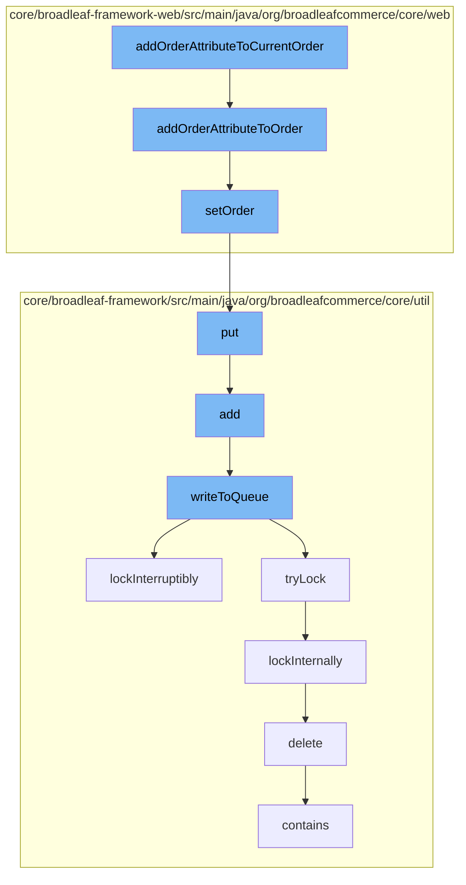

This document will cover the process of adding an attribute to the current order in the BroadleafCommerce-demo repository. The process includes the following steps:

1. Adding the attribute to the order
2. Setting the order
3. Putting the order in the queue
4. Adding the order to the queue
5. Writing the order to the queue
6. Locking the queue
7. Deleting the order from the queue



<SwmSnippet path="/core/broadleaf-framework-web/src/main/java/org/broadleafcommerce/core/web/payment/service/DefaultCurrentOrderPaymentRequestService.java" line="62">

---

# Adding the attribute to the order

The function `addOrderAttributeToOrder` is used to add an attribute to a specific order. If the order ID provided does not match the current cart's ID, a warning is logged and the order is fetched by its ID. If the order attribute does not exist, a new one is created. The attribute's name and value are set, and it is added to the order. The order is then saved.

```java
    @Override
    public void addOrderAttributeToOrder(Long orderId, String orderAttributeKey, String orderAttributeValue) throws PaymentException {
        Order currentCart = CartState.getCart();
        Long currentCartId = currentCart.getId();
        
        if (orderId != null && !currentCartId.equals(orderId)) {
            logWarningIfCartMismatch(currentCartId, orderId);
            currentCart = orderService.findOrderById(orderId);
        }

        OrderAttribute orderAttribute = currentCart.getOrderAttributes().get(orderAttributeKey);

        if (orderAttribute == null) {
            orderAttribute = new OrderAttributeImpl();
        }
        orderAttribute.setName(orderAttributeKey);
        orderAttribute.setValue(orderAttributeValue);
        orderAttribute.setOrder(currentCart);
        currentCart.getOrderAttributes().put(orderAttributeKey, orderAttribute);

        try {
```

---

</SwmSnippet>

<SwmSnippet path="/core/broadleaf-framework-web/src/main/java/org/broadleafcommerce/core/web/order/OrderState.java" line="53">

---

# Setting the order

The function `setOrder` is used to associate an order with a customer. The order ID is stored in a map against the customer ID.

```java
    public Order setOrder(Customer customer, Order order) {
        if (customer != null && order != null) {
            orders.put(customer.getId(), order.getId());
        }
        return order;
    }
```

---

</SwmSnippet>

<SwmSnippet path="/core/broadleaf-framework/src/main/java/org/broadleafcommerce/core/util/queue/ZookeeperDistributedQueue.java" line="393">

---

# Putting the order in the queue

The function `put` is used to add the order to the queue. It calls the `writeToQueue` function to write the order to the queue.

```java
    @Override
    public void put(T e) throws InterruptedException {
        final ArrayList<T> elementsToAdd = new ArrayList<>();
        elementsToAdd.add(e);
        writeToQueue(elementsToAdd, -1L);
    }
```

---

</SwmSnippet>

<SwmSnippet path="/core/broadleaf-framework/src/main/java/org/broadleafcommerce/core/util/queue/ZookeeperDistributedQueue.java" line="359">

---

# Adding the order to the queue

The function `add` is used to add the order to the queue. It calls the `writeToQueue` function to write the order to the queue. If the queue is full, an exception is thrown.

```java
    @Override
    public boolean add(T e) {
        try {
            final ArrayList<T> lst = new ArrayList<>();
            lst.add(e);
            int count = writeToQueue(lst, 0L);
            if (count != 1) {
                throw new IllegalStateException("The Zookeeper queue was full.");
            } else {
                return true;
            }
        } catch (InterruptedException ex) {
            Thread.currentThread().interrupt();
            return false;
        }
    }
```

---

</SwmSnippet>

<SwmSnippet path="/core/broadleaf-framework/src/main/java/org/broadleafcommerce/core/util/queue/ZookeeperDistributedQueue.java" line="503">

---

# Writing the order to the queue

The function `writeToQueue` is used to write the order to the queue. It locks the queue, checks the remaining capacity, and adds the order to the queue. If the queue is full, it waits until there is space available.

```java
    protected int writeToQueue(List<? extends T> entries, final long timeout) throws InterruptedException {
        if (entries == null || entries.isEmpty()) {
            return 0;
        }
        
        int entryCount = 0;
        long waitTime = timeout;
        synchronized (QUEUE_MONITOR) {
            while (true) {
                boolean locked = false;
                DistributedLock lock = getQueueAccessLock();
                if (timeout < 0L) {
                    lock.lockInterruptibly();
                    locked = true;
                } else if (timeout > 0L && waitTime > 0L) {
                    long start = System.currentTimeMillis();
                    locked = lock.tryLock(waitTime, TimeUnit.MILLISECONDS);
                    long end = System.currentTimeMillis();
                    waitTime -= (end - start);
                } else {
                    locked = lock.tryLock();
```

---

</SwmSnippet>

<SwmSnippet path="/core/broadleaf-framework/src/main/java/org/broadleafcommerce/core/util/lock/ReentrantDistributedZookeeperLock.java" line="335">

---

# Locking the queue

The function `lockInterruptibly` is used to lock the queue. It calls the `lockInternally` function to perform the actual locking.

```java
    @Override
    public void lockInterruptibly() throws InterruptedException {
        if (Thread.interrupted()) {
            throw new InterruptedException("Thread was interrupted prior to trying to acquire the lock.");
        }
        
        lockInternally(-1L);
    }
```

---

</SwmSnippet>

<SwmSnippet path="/core/broadleaf-framework/src/main/java/org/broadleafcommerce/core/util/dao/CodeTypeDaoImpl.java" line="51">

---

# Deleting the order from the queue

The function `delete` is used to remove the order from the queue. If the order is not in the queue, it is fetched by its ID and then removed.

```java
    public void delete(CodeType codeType) {
        if (!em.contains(codeType)) {
            codeType = (CodeType) em.find(CodeTypeImpl.class, codeType.getId());
        }
        em.remove(codeType);
    }
```

---

</SwmSnippet>

&nbsp;

*This is an auto-generated document by Swimm AI 🌊 and has not yet been verified by a human*

<SwmMeta version="3.0.0" repo-id="Z2l0aHViJTNBJTNBQnJvYWRsZWFmQ29tbWVyY2UtZGVtbyUzQSUzQWdpbGFkbmF2b3Q=" repo-name="BroadleafCommerce-demo" doc-type="flows"><sup>Powered by [Swimm](/)</sup></SwmMeta>
