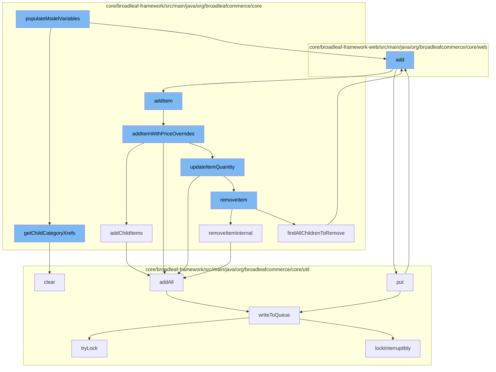

This document will cover the process of adding an item to a wishlist, which includes:

1. Populating model variables
2. Adding the item to the wishlist
3. Updating the item quantity
4. Removing the item if necessary
5. Adding the item to a distributed queue.



<SwmSnippet path="/core/broadleaf-framework-web/src/main/java/org/broadleafcommerce/core/web/processor/CategoriesProcessor.java" line="725">

---

# Populating model variables

The function `populateModelVariables` starts the process by calling `getChildCategoryXrefs` which clears the `childCategoryXrefs` list and populates it with active subcategories.

```java

```

---

</SwmSnippet>

<SwmSnippet path="/core/broadleaf-framework-web/src/main/java/org/broadleafcommerce/core/web/controller/account/BroadleafManageWishlistController.java" line="655">

---

# Adding the item to the wishlist

The `add` function is called next, which in turn calls `addItem` function. This function adds an item to the order with the given `orderId` and `orderItemRequestDTO`.

```java

```

---

</SwmSnippet>

<SwmSnippet path="/core/broadleaf-framework/src/main/java/org/broadleafcommerce/core/order/service/OrderServiceImpl.java" line="664">

---

# Updating the item quantity

The `addItemWithPriceOverrides` function is called, which updates the quantity of the item in the order. If the item already exists in the order, its quantity is increased by the quantity in the `orderItemRequestDTO`.

```java
    @Override
    @Transactional(value = "blTransactionManager", rollbackFor = { AddToCartException.class })
    public Order addItemWithPriceOverrides(Long orderId, OrderItemRequestDTO orderItemRequestDTO, boolean priceOrder) throws AddToCartException {
        Order order = findOrderById(orderId);
        preValidateCartOperation(order);
        if (getAutomaticallyMergeLikeItems()) {
            OrderItem item = findMatchingItem(order, orderItemRequestDTO);
            if (item != null && item.getParentOrderItem() == null) {
                orderItemRequestDTO.setQuantity(item.getQuantity() + orderItemRequestDTO.getQuantity());
                orderItemRequestDTO.setOrderItemId(item.getId());
                try {
                    return updateItemQuantity(orderId, orderItemRequestDTO, priceOrder);
                } catch (RemoveFromCartException e) {
                    throw new AddToCartException("Unexpected error - system tried to remove item while adding to cart", e);
                } catch (UpdateCartException e) {
                    throw new AddToCartException("Could not update quantity for matched item", e);
                }
            }
        }
        try {
            // We only want to price on the last addition for performance reasons and only if the user asked for it.
```

---

</SwmSnippet>

<SwmSnippet path="/core/broadleaf-framework/src/main/java/org/broadleafcommerce/core/order/service/OrderServiceImpl.java" line="851">

---

# Removing the item if necessary

The `removeItemInternal` function is called if the item needs to be removed from the order. This function removes the item from the order and updates the order messages.

```java
    protected Order removeItemInternal(Long orderId, Long orderItemId, boolean priceOrder) throws WorkflowException {
        OrderItemRequestDTO orderItemRequestDTO = new OrderItemRequestDTO();
        orderItemRequestDTO.setOrderItemId(orderItemId);
        CartOperationRequest cartOpRequest = new CartOperationRequest(findOrderById(orderId), orderItemRequestDTO, priceOrder);
        Session session = em.unwrap(Session.class);
        FlushMode current = session.getHibernateFlushMode();
        if (!autoFlushRemoveFromCart) {
            //Performance measure. Hibernate will sometimes perform an autoflush when performing query operations and this can
            //be expensive. It is possible to avoid the autoflush if there's no concern about queries in the flow returning
            //incorrect results because something has not been flushed to the database yet.
            session.setHibernateFlushMode(FlushMode.MANUAL);
        }
        ProcessContext<CartOperationRequest> context;
        try {
            context = (ProcessContext<CartOperationRequest>) removeItemWorkflow.doActivities(cartOpRequest);
        } finally {
            if (!autoFlushRemoveFromCart) {
                session.setHibernateFlushMode(current);
            }
        }
        context.getSeedData().getOrder().getOrderMessages().addAll(((ActivityMessages) context).getActivityMessages());
```

---

</SwmSnippet>

<SwmSnippet path="/core/broadleaf-framework/src/main/java/org/broadleafcommerce/core/util/queue/ZookeeperDistributedQueue.java" line="503">

---

# Adding the item to a distributed queue

The `writeToQueue` function is called to add the item to a distributed queue. This function writes the item to the queue and returns the number of items written to the queue.

```java
    protected int writeToQueue(List<? extends T> entries, final long timeout) throws InterruptedException {
        if (entries == null || entries.isEmpty()) {
            return 0;
        }
        
        int entryCount = 0;
        long waitTime = timeout;
        synchronized (QUEUE_MONITOR) {
            while (true) {
                boolean locked = false;
                DistributedLock lock = getQueueAccessLock();
                if (timeout < 0L) {
                    lock.lockInterruptibly();
                    locked = true;
                } else if (timeout > 0L && waitTime > 0L) {
                    long start = System.currentTimeMillis();
                    locked = lock.tryLock(waitTime, TimeUnit.MILLISECONDS);
                    long end = System.currentTimeMillis();
                    waitTime -= (end - start);
                } else {
                    locked = lock.tryLock();
```

---

</SwmSnippet>

&nbsp;

*This is an auto-generated document by Swimm AI 🌊 and has not yet been verified by a human*

<SwmMeta version="3.0.0" repo-id="Z2l0aHViJTNBJTNBQnJvYWRsZWFmQ29tbWVyY2UtZGVtbyUzQSUzQWdpbGFkbmF2b3Q=" repo-name="BroadleafCommerce-demo" doc-type="flows"><sup>Powered by [Swimm](/)</sup></SwmMeta>
