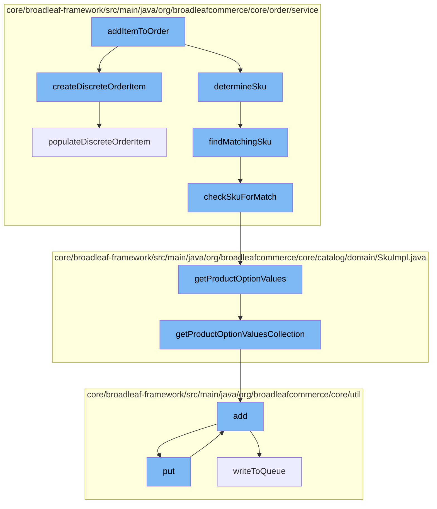

This document will cover the process of adding an item to an order in the BroadleafCommerce-demo repository. The process involves the following steps:

1. Invoking the addItemToOrder function
2. Creating a DiscreteOrderItem
3. Determining the SKU of the item
4. Finding a matching SKU
5. Checking SKU for a match
6. Getting product option values
7. Adding the item to the queue



<SwmSnippet path="/core/broadleaf-framework/src/main/java/org/broadleafcommerce/core/order/service/legacy/LegacyOrderServiceImpl.java" line="1">

---

# Invoking the addItemToOrder function

The process begins with the invocation of the `addItemToOrder` function. This function is responsible for initiating the process of adding an item to an order.

```java
/*-
 * #%L
 * BroadleafCommerce Framework
 * %%
 * Copyright (C) 2009 - 2024 Broadleaf Commerce
 * %%
 * Licensed under the Broadleaf Fair Use License Agreement, Version 1.0
 * (the "Fair Use License" located  at http://license.broadleafcommerce.org/fair_use_license-1.0.txt)
 * unless the restrictions on use therein are violated and require payment to Broadleaf in which case
 * the Broadleaf End User License Agreement (EULA), Version 1.1
```

---

</SwmSnippet>

<SwmSnippet path="/core/broadleaf-framework/src/main/java/org/broadleafcommerce/core/order/service/OrderItemServiceImpl.java" line="215">

---

# Creating a DiscreteOrderItem

The `createDiscreteOrderItem` function is called next. This function creates a new `DiscreteOrderItem` object, which represents an individual item in an order.

```java
    @Override
    public DiscreteOrderItem createDiscreteOrderItem(final DiscreteOrderItemRequest itemRequest) {
        final DiscreteOrderItem item = (DiscreteOrderItem) orderItemDao.create(OrderItemType.DISCRETE);
        populateDiscreteOrderItem(item, itemRequest);

        item.setBundleOrderItem(itemRequest.getBundleOrderItem());
        if (itemRequest.getSalePriceOverride() != null) {
            item.setBaseSalePrice(itemRequest.getSalePriceOverride());
        }
        item.setDiscreteOrderItemFeePrices(itemRequest.getDiscreteOrderItemFeePrices());

        if (itemRequest.getSalePriceOverride() != null) {
            item.setSalePriceOverride(Boolean.TRUE);
            item.setSalePrice(itemRequest.getSalePriceOverride());
            item.setBaseSalePrice(itemRequest.getSalePriceOverride());
        }

        if (itemRequest.getRetailPriceOverride() != null) {
            item.setRetailPriceOverride(Boolean.TRUE);
            item.setRetailPrice(itemRequest.getRetailPriceOverride());
            item.setBaseRetailPrice(itemRequest.getRetailPriceOverride());
```

---

</SwmSnippet>

<SwmSnippet path="/core/broadleaf-framework/src/main/java/org/broadleafcommerce/core/order/service/legacy/LegacyOrderServiceImpl.java" line="794">

---

# Determining the SKU of the item

The `findMatchingSku` function is invoked to determine the SKU (Stock Keeping Unit) of the item. This function checks the product and its attributes to find a matching SKU.

```java
    /**
     * Checks to make sure the correct SKU is still attached to the order.
     * For example, if you have the SKU for a Large, Red T-shirt in the
     * cart and your UI allows the user to change the one of the attributes
     * (e.g. red to black), then it is possible that the SKU needs to
     * be adjusted as well.
     */
    protected Sku findMatchingSku(Product product, Map<String,String> attributeValues) {
        Map<String, String> attributeValuesForSku = new HashMap<String,String>();
        // Verify that required product-option values were set.

        if (product != null && product.getProductOptions() != null && product.getProductOptions().size() > 0) {
            for (ProductOption productOption : product.getProductOptions()) {
                if (productOption.getRequired()) {
                    if (attributeValues.get(productOption.getAttributeName()) == null) {
                        throw new RequiredAttributeNotProvidedException("Unable to add to cart. Required attribute was not provided: " + productOption.getAttributeName());
                    } else {
                        attributeValuesForSku.put(productOption.getAttributeName(), attributeValues.get(productOption.getAttributeName()));
                    }
                }
            }
```

---

</SwmSnippet>

<SwmSnippet path="/core/broadleaf-framework/src/main/java/org/broadleafcommerce/core/order/service/legacy/LegacyOrderServiceImpl.java" line="828">

---

# Checking SKU for a match

The `checkSkuForMatch` function is called to verify if the SKU matches the product and its attributes. If a match is found, the SKU is considered valid for the item.

```java
    protected boolean checkSkuForMatch(Sku sku, Map<String,String> attributeValues) {
        if (attributeValues == null || attributeValues.size() == 0) {
            return false;
        }

        for (String attributeName : attributeValues.keySet()) {
            boolean optionValueMatchFound = false;
            for (ProductOptionValue productOptionValue : sku.getProductOptionValues()) {
                if (productOptionValue.getProductOption().getAttributeName().equals(attributeName)) {
                    if (productOptionValue.getAttributeValue().equals(attributeValues.get(attributeName))) {
                        optionValueMatchFound = true;
                        break;
                    } else {
                        return false;
                    }
                }
            }

            if (optionValueMatchFound) {
                continue;
            } else {
```

---

</SwmSnippet>

<SwmSnippet path="/core/broadleaf-framework/src/main/java/org/broadleafcommerce/core/catalog/domain/SkuImpl.java" line="1047">

---

# Getting product option values

The `getProductOptionValues` function is invoked to retrieve the product option values for the SKU. These values represent the specific options chosen for the product, such as size or color.

```java
    @Override
    @Deprecated
    public List<ProductOptionValue> getProductOptionValues() {
        return new ArrayList<>(getProductOptionValuesCollection());
    }
```

---

</SwmSnippet>

<SwmSnippet path="/core/broadleaf-framework/src/main/java/org/broadleafcommerce/core/util/queue/ZookeeperDistributedQueue.java" line="359">

---

# Adding the item to the queue

Finally, the `add` function is called to add the item to the queue. This function writes the item to the queue, which is managed by Zookeeper.

```java
    @Override
    public boolean add(T e) {
        try {
            final ArrayList<T> lst = new ArrayList<>();
            lst.add(e);
            int count = writeToQueue(lst, 0L);
            if (count != 1) {
                throw new IllegalStateException("The Zookeeper queue was full.");
            } else {
                return true;
            }
        } catch (InterruptedException ex) {
            Thread.currentThread().interrupt();
            return false;
        }
    }
```

---

</SwmSnippet>

&nbsp;

*This is an auto-generated document by Swimm AI 🌊 and has not yet been verified by a human*

<SwmMeta version="3.0.0" repo-id="Z2l0aHViJTNBJTNBQnJvYWRsZWFmQ29tbWVyY2UtZGVtbyUzQSUzQWdpbGFkbmF2b3Q=" repo-name="BroadleafCommerce-demo" doc-type="flows"><sup>Powered by [Swimm](/)</sup></SwmMeta>
