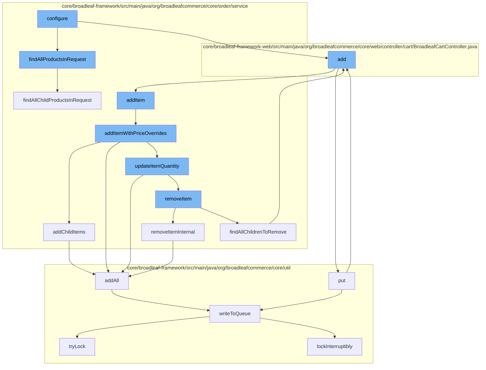

This document will cover the process of adding an item to the cart in the BroadleafCommerce-demo project. The steps include:

1. Finding all products in the request
2. Adding the item to the order
3. Adding item with price overrides
4. Adding child items to the order
5. Updating item quantity
6. Removing an item from the order
7. Adding the removed item to the resource purge service
8. Writing the changes to the distributed queue.



<SwmSnippet path="/core/broadleaf-framework/src/main/java/org/broadleafcommerce/core/order/service/OrderItemServiceImpl.java" line="592">

---

# Finding all products in the request

The function `findAllProductsInRequest` is used to get all the products in the request. It calls `findAllChildProductsInRequest` to get all child products and adds them to the `allProductsSet`.

```java
    @Override
    public Set<Product> findAllProductsInRequest(ConfigurableOrderItemRequest itemRequest) {
        Set<Product> allProductsSet = findAllChildProductsInRequest(itemRequest.getChildOrderItems());
        allProductsSet.add(itemRequest.getProduct());
        return allProductsSet;
    }
```

---

</SwmSnippet>

<SwmSnippet path="/core/broadleaf-framework/src/main/java/org/broadleafcommerce/core/order/service/OrderServiceImpl.java" line="655">

---

# Adding the item to the order

The function `addItem` is used to add an item to the order. It calls `addItemWithPriceOverrides` to add the item with any price overrides.

```java
    @Override
    @Transactional(value = "blTransactionManager", rollbackFor = {AddToCartException.class})
    public Order addItem(Long orderId, OrderItemRequestDTO orderItemRequestDTO, boolean priceOrder) throws AddToCartException {
        // Don't allow overrides from this method.
        orderItemRequestDTO.setOverrideRetailPrice(null);
        orderItemRequestDTO.setOverrideSalePrice(null);
        return addItemWithPriceOverrides(orderId, orderItemRequestDTO, priceOrder);
    }
```

---

</SwmSnippet>

<SwmSnippet path="/core/broadleaf-framework/src/main/java/org/broadleafcommerce/core/order/service/OrderServiceImpl.java" line="664">

---

# Adding item with price overrides

The function `addItemWithPriceOverrides` is used to add an item with price overrides. It calls `updateItemQuantity` to update the quantity of the item and `addChildItems` to add any child items to the order.

```java
    @Override
    @Transactional(value = "blTransactionManager", rollbackFor = { AddToCartException.class })
    public Order addItemWithPriceOverrides(Long orderId, OrderItemRequestDTO orderItemRequestDTO, boolean priceOrder) throws AddToCartException {
        Order order = findOrderById(orderId);
        preValidateCartOperation(order);
        if (getAutomaticallyMergeLikeItems()) {
            OrderItem item = findMatchingItem(order, orderItemRequestDTO);
            if (item != null && item.getParentOrderItem() == null) {
                orderItemRequestDTO.setQuantity(item.getQuantity() + orderItemRequestDTO.getQuantity());
                orderItemRequestDTO.setOrderItemId(item.getId());
                try {
                    return updateItemQuantity(orderId, orderItemRequestDTO, priceOrder);
                } catch (RemoveFromCartException e) {
                    throw new AddToCartException("Unexpected error - system tried to remove item while adding to cart", e);
                } catch (UpdateCartException e) {
                    throw new AddToCartException("Could not update quantity for matched item", e);
                }
            }
        }
        try {
            // We only want to price on the last addition for performance reasons and only if the user asked for it.
```

---

</SwmSnippet>

<SwmSnippet path="/core/broadleaf-framework/src/main/java/org/broadleafcommerce/core/order/service/OrderServiceImpl.java" line="732">

---

# Adding child items to the order

The function `addChildItems` is used to add child items to the order. It calls `addItemWorkflow.doActivities` to perform the addition of child items.

```java
    @Override
    public void addChildItems(OrderItemRequestDTO orderItemRequestDTO, int numAdditionRequests, int currentAddition, ProcessContext<CartOperationRequest> context, List<ActivityMessageDTO> orderMessages) throws WorkflowException {
        if (CollectionUtils.isNotEmpty(orderItemRequestDTO.getChildOrderItems())) {
            Long parentOrderItemId = context.getSeedData().getOrderItem().getId();
            for (OrderItemRequestDTO childRequest : orderItemRequestDTO.getChildOrderItems()) {
                childRequest.setParentOrderItemId(parentOrderItemId);
                currentAddition++;

                if (childRequest.getQuantity() > 0) {
                    CartOperationRequest childCartOpRequest = new CartOperationRequest(context.getSeedData().getOrder(), childRequest, currentAddition == numAdditionRequests);
                    Session session = em.unwrap(Session.class);
                    FlushMode current = session.getHibernateFlushMode();
                    if (!autoFlushAddToCart) {
                        //Performance measure. Hibernate will sometimes perform an autoflush when performing query operations and this can
                        //be expensive. It is possible to avoid the autoflush if there's no concern about queries in the flow returning
                        //incorrect results because something has not been flushed to the database yet.
                        session.setHibernateFlushMode(FlushMode.MANUAL);
                    }
                    ProcessContext<CartOperationRequest> childContext;
                    try {
                        childContext = (ProcessContext<CartOperationRequest>) addItemWorkflow.doActivities(childCartOpRequest);
```

---

</SwmSnippet>

<SwmSnippet path="/core/broadleaf-framework/src/main/java/org/broadleafcommerce/core/order/service/OrderServiceImpl.java" line="851">

---

# Updating item quantity

The function `removeItemInternal` is used to remove an item from the order. It calls `removeItemWorkflow.doActivities` to perform the removal of the item.

```java
    protected Order removeItemInternal(Long orderId, Long orderItemId, boolean priceOrder) throws WorkflowException {
        OrderItemRequestDTO orderItemRequestDTO = new OrderItemRequestDTO();
        orderItemRequestDTO.setOrderItemId(orderItemId);
        CartOperationRequest cartOpRequest = new CartOperationRequest(findOrderById(orderId), orderItemRequestDTO, priceOrder);
        Session session = em.unwrap(Session.class);
        FlushMode current = session.getHibernateFlushMode();
        if (!autoFlushRemoveFromCart) {
            //Performance measure. Hibernate will sometimes perform an autoflush when performing query operations and this can
            //be expensive. It is possible to avoid the autoflush if there's no concern about queries in the flow returning
            //incorrect results because something has not been flushed to the database yet.
            session.setHibernateFlushMode(FlushMode.MANUAL);
        }
        ProcessContext<CartOperationRequest> context;
        try {
            context = (ProcessContext<CartOperationRequest>) removeItemWorkflow.doActivities(cartOpRequest);
        } finally {
            if (!autoFlushRemoveFromCart) {
                session.setHibernateFlushMode(current);
            }
        }
        context.getSeedData().getOrder().getOrderMessages().addAll(((ActivityMessages) context).getActivityMessages());
```

---

</SwmSnippet>

<SwmSnippet path="/core/broadleaf-framework/src/main/java/org/broadleafcommerce/core/order/service/OrderServiceImpl.java" line="851">

---

# Removing an item from the order

The function `removeItemInternal` is used to remove an item from the order. It calls `removeItemWorkflow.doActivities` to perform the removal of the item.

```java
    protected Order removeItemInternal(Long orderId, Long orderItemId, boolean priceOrder) throws WorkflowException {
        OrderItemRequestDTO orderItemRequestDTO = new OrderItemRequestDTO();
        orderItemRequestDTO.setOrderItemId(orderItemId);
        CartOperationRequest cartOpRequest = new CartOperationRequest(findOrderById(orderId), orderItemRequestDTO, priceOrder);
        Session session = em.unwrap(Session.class);
        FlushMode current = session.getHibernateFlushMode();
        if (!autoFlushRemoveFromCart) {
            //Performance measure. Hibernate will sometimes perform an autoflush when performing query operations and this can
            //be expensive. It is possible to avoid the autoflush if there's no concern about queries in the flow returning
            //incorrect results because something has not been flushed to the database yet.
            session.setHibernateFlushMode(FlushMode.MANUAL);
        }
        ProcessContext<CartOperationRequest> context;
        try {
            context = (ProcessContext<CartOperationRequest>) removeItemWorkflow.doActivities(cartOpRequest);
        } finally {
            if (!autoFlushRemoveFromCart) {
                session.setHibernateFlushMode(current);
            }
        }
        context.getSeedData().getOrder().getOrderMessages().addAll(((ActivityMessages) context).getActivityMessages());
```

---

</SwmSnippet>

<SwmSnippet path="/core/broadleaf-framework/src/main/java/org/broadleafcommerce/core/util/service/ResourcePurgeServiceImpl.java" line="593">

---

# Adding the removed item to the resource purge service

The function `add` in `ResourcePurgeServiceImpl` is used to add the removed item to the resource purge service. It checks if the item is already in the cache, if not, it adds the item to the cache.

```java
        public Long add(Long entry) {
            if (! cache.containsKey(entry)) {
                return cache.put(entry, new Long(System.currentTimeMillis()));
            }
            return null;
        }
```

---

</SwmSnippet>

<SwmSnippet path="/core/broadleaf-framework/src/main/java/org/broadleafcommerce/core/util/queue/ZookeeperDistributedQueue.java" line="503">

---

# Writing the changes to the distributed queue

The function `writeToQueue` in `ZookeeperDistributedQueue` is used to write the changes to the distributed queue. It locks the queue, writes the changes, and then unlocks the queue.

```java
    protected int writeToQueue(List<? extends T> entries, final long timeout) throws InterruptedException {
        if (entries == null || entries.isEmpty()) {
            return 0;
        }
        
        int entryCount = 0;
        long waitTime = timeout;
        synchronized (QUEUE_MONITOR) {
            while (true) {
                boolean locked = false;
                DistributedLock lock = getQueueAccessLock();
                if (timeout < 0L) {
                    lock.lockInterruptibly();
                    locked = true;
                } else if (timeout > 0L && waitTime > 0L) {
                    long start = System.currentTimeMillis();
                    locked = lock.tryLock(waitTime, TimeUnit.MILLISECONDS);
                    long end = System.currentTimeMillis();
                    waitTime -= (end - start);
                } else {
                    locked = lock.tryLock();
```

---

</SwmSnippet>

&nbsp;

*This is an auto-generated document by Swimm AI 🌊 and has not yet been verified by a human*

<SwmMeta version="3.0.0" repo-id="Z2l0aHViJTNBJTNBQnJvYWRsZWFmQ29tbWVyY2UtZGVtbyUzQSUzQWdpbGFkbmF2b3Q=" repo-name="BroadleafCommerce-demo" doc-type="flows"><sup>Powered by [Swimm](/)</sup></SwmMeta>
