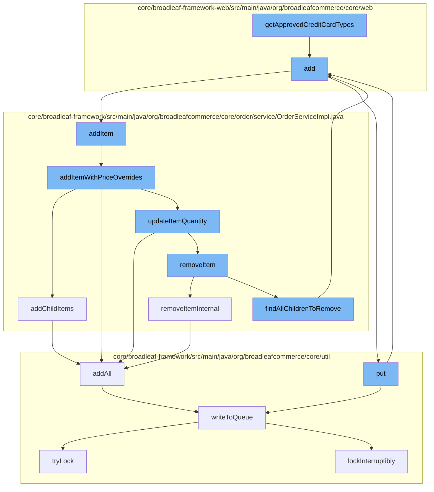

This document will cover the process of adding an item to the wishlist, which includes:

1. Getting approved credit card types
2. Adding an item to the wishlist
3. Adding the item to the order
4. Updating the item quantity
5. Removing the item if necessary
6. Writing the changes to the queue.



<SwmSnippet path="/core/broadleaf-framework-web/src/main/java/org/broadleafcommerce/core/web/checkout/model/CheckoutForm.java" line="1">

---

# Getting approved credit card types

The function `getApprovedCreditCardTypes` is the starting point of the flow. It is responsible for fetching the list of approved credit card types for the checkout process.

```java
/*-
 * #%L
 * BroadleafCommerce Framework Web
 * %%
 * Copyright (C) 2009 - 2024 Broadleaf Commerce
 * %%
 * Licensed under the Broadleaf Fair Use License Agreement, Version 1.0
 * (the "Fair Use License" located  at http://license.broadleafcommerce.org/fair_use_license-1.0.txt)
 * unless the restrictions on use therein are violated and require payment to Broadleaf in which case
 * the Broadleaf End User License Agreement (EULA), Version 1.1
```

---

</SwmSnippet>

<SwmSnippet path="/core/broadleaf-framework-web/src/main/java/org/broadleafcommerce/core/web/controller/account/BroadleafManageWishlistController.java" line="62">

---

# Adding an item to the wishlist

The `add` function is called next, which handles the process of adding an item to the user's wishlist. It fetches the wishlist for the current customer and adds the requested item to it.

```java
    public String add(HttpServletRequest request, HttpServletResponse response, Model model,
                      OrderItemRequestDTO itemRequest, String wishlistName) throws IOException, AddToCartException, PricingException  {
        Order wishlist = orderService.findNamedOrderForCustomer(wishlistName, CustomerState.getCustomer(request));

        if (wishlist == null) {
            wishlist = orderService.createNamedOrderForCustomer(wishlistName, CustomerState.getCustomer(request));
        }
        
        wishlist = orderService.addItem(wishlist.getId(), itemRequest, false);
        wishlist = orderService.save(wishlist, true);

        return getAccountWishlistRedirect();
    }
```

---

</SwmSnippet>

<SwmSnippet path="/core/broadleaf-framework/src/main/java/org/broadleafcommerce/core/order/service/OrderServiceImpl.java" line="655">

---

# Adding the item to the order

The `addItem` function is then called to add the item to the order. It ensures that the item is not already in the order before adding it.

```java
    @Override
    @Transactional(value = "blTransactionManager", rollbackFor = {AddToCartException.class})
    public Order addItem(Long orderId, OrderItemRequestDTO orderItemRequestDTO, boolean priceOrder) throws AddToCartException {
        // Don't allow overrides from this method.
        orderItemRequestDTO.setOverrideRetailPrice(null);
        orderItemRequestDTO.setOverrideSalePrice(null);
        return addItemWithPriceOverrides(orderId, orderItemRequestDTO, priceOrder);
    }
```

---

</SwmSnippet>

<SwmSnippet path="/core/broadleaf-framework/src/main/java/org/broadleafcommerce/core/order/service/OrderServiceImpl.java" line="664">

---

# Updating the item quantity

The `addItemWithPriceOverrides` function is called next, which handles the process of updating the quantity of the item in the order. If the item already exists in the order, its quantity is updated; otherwise, a new item is added.

```java
    @Override
    @Transactional(value = "blTransactionManager", rollbackFor = { AddToCartException.class })
    public Order addItemWithPriceOverrides(Long orderId, OrderItemRequestDTO orderItemRequestDTO, boolean priceOrder) throws AddToCartException {
        Order order = findOrderById(orderId);
        preValidateCartOperation(order);
        if (getAutomaticallyMergeLikeItems()) {
            OrderItem item = findMatchingItem(order, orderItemRequestDTO);
            if (item != null && item.getParentOrderItem() == null) {
                orderItemRequestDTO.setQuantity(item.getQuantity() + orderItemRequestDTO.getQuantity());
                orderItemRequestDTO.setOrderItemId(item.getId());
                try {
                    return updateItemQuantity(orderId, orderItemRequestDTO, priceOrder);
                } catch (RemoveFromCartException e) {
                    throw new AddToCartException("Unexpected error - system tried to remove item while adding to cart", e);
                } catch (UpdateCartException e) {
                    throw new AddToCartException("Could not update quantity for matched item", e);
                }
            }
        }
        try {
            // We only want to price on the last addition for performance reasons and only if the user asked for it.
```

---

</SwmSnippet>

<SwmSnippet path="/core/broadleaf-framework/src/main/java/org/broadleafcommerce/core/order/service/OrderServiceImpl.java" line="851">

---

# Removing the item if necessary

The `removeItemInternal` function is called if the item needs to be removed from the order. This could be due to various reasons such as the item being out of stock or the customer removing it from their wishlist.

```java
    protected Order removeItemInternal(Long orderId, Long orderItemId, boolean priceOrder) throws WorkflowException {
        OrderItemRequestDTO orderItemRequestDTO = new OrderItemRequestDTO();
        orderItemRequestDTO.setOrderItemId(orderItemId);
        CartOperationRequest cartOpRequest = new CartOperationRequest(findOrderById(orderId), orderItemRequestDTO, priceOrder);
        Session session = em.unwrap(Session.class);
        FlushMode current = session.getHibernateFlushMode();
        if (!autoFlushRemoveFromCart) {
            //Performance measure. Hibernate will sometimes perform an autoflush when performing query operations and this can
            //be expensive. It is possible to avoid the autoflush if there's no concern about queries in the flow returning
            //incorrect results because something has not been flushed to the database yet.
            session.setHibernateFlushMode(FlushMode.MANUAL);
        }
        ProcessContext<CartOperationRequest> context;
        try {
            context = (ProcessContext<CartOperationRequest>) removeItemWorkflow.doActivities(cartOpRequest);
        } finally {
            if (!autoFlushRemoveFromCart) {
                session.setHibernateFlushMode(current);
            }
        }
        context.getSeedData().getOrder().getOrderMessages().addAll(((ActivityMessages) context).getActivityMessages());
```

---

</SwmSnippet>

<SwmSnippet path="/core/broadleaf-framework/src/main/java/org/broadleafcommerce/core/util/queue/ZookeeperDistributedQueue.java" line="503">

---

# Writing the changes to the queue

Finally, the `writeToQueue` function is called to write the changes to the queue. This ensures that the changes are persisted and can be processed later.

```java
    protected int writeToQueue(List<? extends T> entries, final long timeout) throws InterruptedException {
        if (entries == null || entries.isEmpty()) {
            return 0;
        }
        
        int entryCount = 0;
        long waitTime = timeout;
        synchronized (QUEUE_MONITOR) {
            while (true) {
                boolean locked = false;
                DistributedLock lock = getQueueAccessLock();
                if (timeout < 0L) {
                    lock.lockInterruptibly();
                    locked = true;
                } else if (timeout > 0L && waitTime > 0L) {
                    long start = System.currentTimeMillis();
                    locked = lock.tryLock(waitTime, TimeUnit.MILLISECONDS);
                    long end = System.currentTimeMillis();
                    waitTime -= (end - start);
                } else {
                    locked = lock.tryLock();
```

---

</SwmSnippet>

&nbsp;

*This is an auto-generated document by Swimm AI 🌊 and has not yet been verified by a human*

<SwmMeta version="3.0.0" repo-id="Z2l0aHViJTNBJTNBQnJvYWRsZWFmQ29tbWVyY2UtZGVtbyUzQSUzQWdpbGFkbmF2b3Q=" repo-name="BroadleafCommerce-demo" doc-type="flows"><sup>Powered by [Swimm](/)</sup></SwmMeta>
