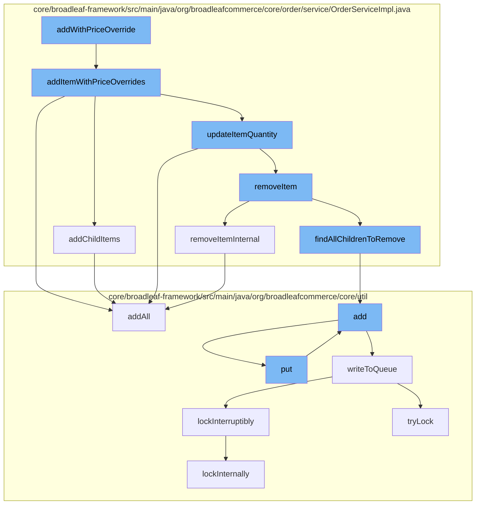

This document will cover the process of adding an item with a price override to the cart in the BroadleafCommerce-demo project. The process includes the following steps:

1. Initiating the addition of an item with a price override
2. Adding child items to the order
3. Updating the item quantity
4. Removing an item from the order
5. Adding resources to the purge service
6. Adding items to the distributed queue
7. Writing to the queue
8. Locking the queue



<SwmSnippet path="/core/broadleaf-framework-web/src/main/java/org/broadleafcommerce/core/web/controller/cart/BroadleafCartController.java" line="664">

---

# Initiating the addition of an item with a price override

The `addWithPriceOverride` function in the `BroadleafCartController` class initiates the process of adding an item with a price override to the cart. It calls the `addItemWithPriceOverrides` function in the `OrderServiceImpl` class.

```java

```

---

</SwmSnippet>

<SwmSnippet path="/core/broadleaf-framework/src/main/java/org/broadleafcommerce/core/order/service/OrderServiceImpl.java" line="732">

---

# Adding child items to the order

The `addChildItems` function in the `OrderServiceImpl` class is responsible for adding child items to the order. It is called by the `addItemWithPriceOverrides` function.

```java
    @Override
    public void addChildItems(OrderItemRequestDTO orderItemRequestDTO, int numAdditionRequests, int currentAddition, ProcessContext<CartOperationRequest> context, List<ActivityMessageDTO> orderMessages) throws WorkflowException {
        if (CollectionUtils.isNotEmpty(orderItemRequestDTO.getChildOrderItems())) {
            Long parentOrderItemId = context.getSeedData().getOrderItem().getId();
            for (OrderItemRequestDTO childRequest : orderItemRequestDTO.getChildOrderItems()) {
                childRequest.setParentOrderItemId(parentOrderItemId);
                currentAddition++;

                if (childRequest.getQuantity() > 0) {
                    CartOperationRequest childCartOpRequest = new CartOperationRequest(context.getSeedData().getOrder(), childRequest, currentAddition == numAdditionRequests);
                    Session session = em.unwrap(Session.class);
                    FlushMode current = session.getHibernateFlushMode();
                    if (!autoFlushAddToCart) {
                        //Performance measure. Hibernate will sometimes perform an autoflush when performing query operations and this can
                        //be expensive. It is possible to avoid the autoflush if there's no concern about queries in the flow returning
                        //incorrect results because something has not been flushed to the database yet.
                        session.setHibernateFlushMode(FlushMode.MANUAL);
                    }
                    ProcessContext<CartOperationRequest> childContext;
                    try {
                        childContext = (ProcessContext<CartOperationRequest>) addItemWorkflow.doActivities(childCartOpRequest);
```

---

</SwmSnippet>

<SwmSnippet path="/core/broadleaf-framework/src/main/java/org/broadleafcommerce/core/order/service/OrderServiceImpl.java" line="675">

---

# Updating the item quantity

The `updateItemQuantity` function in the `OrderServiceImpl` class is used to update the quantity of an item in the order. It is called by the `addItemWithPriceOverrides` function.

```java
                    return updateItemQuantity(orderId, orderItemRequestDTO, priceOrder);
                } catch (RemoveFromCartException e) {
                    throw new AddToCartException("Unexpected error - system tried to remove item while adding to cart", e);
                } catch (UpdateCartException e) {
                    throw new AddToCartException("Could not update quantity for matched item", e);
                }
```

---

</SwmSnippet>

<SwmSnippet path="/core/broadleaf-framework/src/main/java/org/broadleafcommerce/core/order/service/OrderServiceImpl.java" line="851">

---

# Removing an item from the order

The `removeItemInternal` function in the `OrderServiceImpl` class is used to remove an item from the order. It is called by the `updateItemQuantity` function.

```java
    protected Order removeItemInternal(Long orderId, Long orderItemId, boolean priceOrder) throws WorkflowException {
        OrderItemRequestDTO orderItemRequestDTO = new OrderItemRequestDTO();
        orderItemRequestDTO.setOrderItemId(orderItemId);
        CartOperationRequest cartOpRequest = new CartOperationRequest(findOrderById(orderId), orderItemRequestDTO, priceOrder);
        Session session = em.unwrap(Session.class);
        FlushMode current = session.getHibernateFlushMode();
        if (!autoFlushRemoveFromCart) {
            //Performance measure. Hibernate will sometimes perform an autoflush when performing query operations and this can
            //be expensive. It is possible to avoid the autoflush if there's no concern about queries in the flow returning
            //incorrect results because something has not been flushed to the database yet.
            session.setHibernateFlushMode(FlushMode.MANUAL);
        }
        ProcessContext<CartOperationRequest> context;
        try {
            context = (ProcessContext<CartOperationRequest>) removeItemWorkflow.doActivities(cartOpRequest);
        } finally {
            if (!autoFlushRemoveFromCart) {
                session.setHibernateFlushMode(current);
            }
        }
        context.getSeedData().getOrder().getOrderMessages().addAll(((ActivityMessages) context).getActivityMessages());
```

---

</SwmSnippet>

<SwmSnippet path="/core/broadleaf-framework/src/main/java/org/broadleafcommerce/core/util/service/ResourcePurgeServiceImpl.java" line="593">

---

# Adding resources to the purge service

The `add` function in the `ResourcePurgeServiceImpl` class is used to add resources to the purge service. It is called by the `findAllChildrenToRemove` function.

```java
        public Long add(Long entry) {
            if (! cache.containsKey(entry)) {
                return cache.put(entry, new Long(System.currentTimeMillis()));
            }
            return null;
        }
```

---

</SwmSnippet>

<SwmSnippet path="/core/broadleaf-framework/src/main/java/org/broadleafcommerce/core/util/queue/ZookeeperDistributedQueue.java" line="359">

---

# Adding items to the distributed queue

The `add` function in the `ZookeeperDistributedQueue` class is used to add items to the distributed queue. It is called by the `put` function.

```java
    @Override
    public boolean add(T e) {
        try {
            final ArrayList<T> lst = new ArrayList<>();
            lst.add(e);
            int count = writeToQueue(lst, 0L);
            if (count != 1) {
                throw new IllegalStateException("The Zookeeper queue was full.");
            } else {
                return true;
            }
        } catch (InterruptedException ex) {
            Thread.currentThread().interrupt();
            return false;
        }
    }
```

---

</SwmSnippet>

<SwmSnippet path="/core/broadleaf-framework/src/main/java/org/broadleafcommerce/core/util/queue/ZookeeperDistributedQueue.java" line="503">

---

# Writing to the queue

The `writeToQueue` function in the `ZookeeperDistributedQueue` class is used to write items to the queue. It is called by the `addAll` function.

```java
    protected int writeToQueue(List<? extends T> entries, final long timeout) throws InterruptedException {
        if (entries == null || entries.isEmpty()) {
            return 0;
        }
        
        int entryCount = 0;
        long waitTime = timeout;
        synchronized (QUEUE_MONITOR) {
            while (true) {
                boolean locked = false;
                DistributedLock lock = getQueueAccessLock();
                if (timeout < 0L) {
                    lock.lockInterruptibly();
                    locked = true;
                } else if (timeout > 0L && waitTime > 0L) {
                    long start = System.currentTimeMillis();
                    locked = lock.tryLock(waitTime, TimeUnit.MILLISECONDS);
                    long end = System.currentTimeMillis();
                    waitTime -= (end - start);
                } else {
                    locked = lock.tryLock();
```

---

</SwmSnippet>

<SwmSnippet path="/core/broadleaf-framework/src/main/java/org/broadleafcommerce/core/util/lock/ReentrantDistributedZookeeperLock.java" line="335">

---

# Locking the queue

The `lockInterruptibly` function in the `ReentrantDistributedZookeeperLock` class is used to lock the queue. It is called by the `writeToQueue` function.

```java
    @Override
    public void lockInterruptibly() throws InterruptedException {
        if (Thread.interrupted()) {
            throw new InterruptedException("Thread was interrupted prior to trying to acquire the lock.");
        }
        
        lockInternally(-1L);
    }
```

---

</SwmSnippet>

&nbsp;

*This is an auto-generated document by Swimm AI 🌊 and has not yet been verified by a human*

<SwmMeta version="3.0.0" repo-id="Z2l0aHViJTNBJTNBQnJvYWRsZWFmQ29tbWVyY2UtZGVtbyUzQSUzQWdpbGFkbmF2b3Q=" repo-name="BroadleafCommerce-demo" doc-type="flows"><sup>Powered by [Swimm](/)</sup></SwmMeta>
