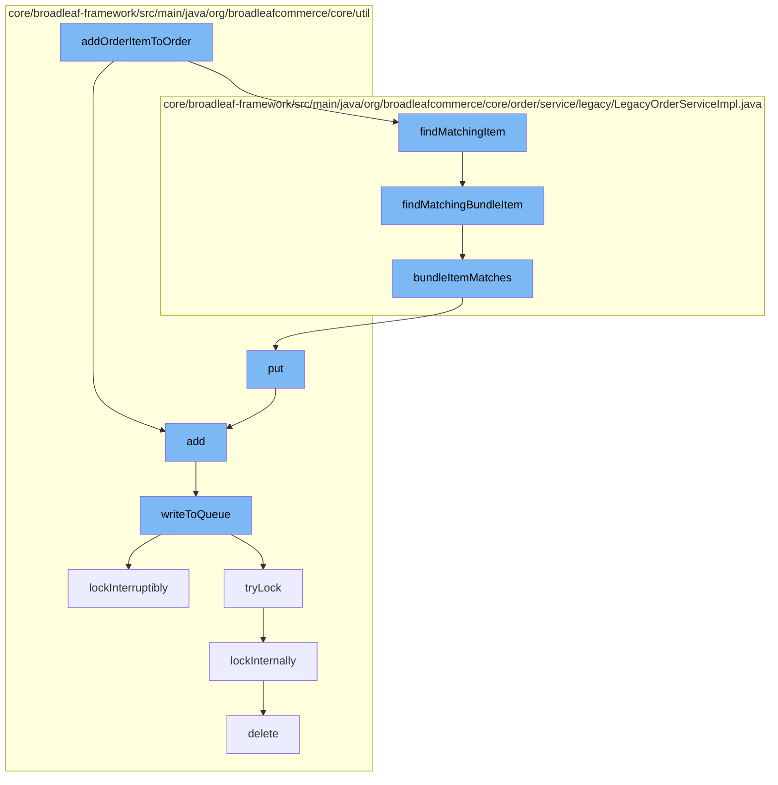

This document will cover the process of adding an order item to an order in the BroadleafCommerce-demo repository. The process includes the following steps:

1. Adding the order item to the cache
2. Finding a matching bundle item in the order
3. Checking if the bundle item matches
4. Adding the item to the distributed queue
5. Writing the item to the queue
6. Locking the queue
7. Deleting the item from the queue.



<SwmSnippet path="/core/broadleaf-framework/src/main/java/org/broadleafcommerce/core/util/service/ResourcePurgeServiceImpl.java" line="593">

---

# Adding the order item to the cache

The `add` function is used to add the order item to the cache. If the cache does not already contain the item, it is added with the current time as its value.

```java
        public Long add(Long entry) {
            if (! cache.containsKey(entry)) {
                return cache.put(entry, new Long(System.currentTimeMillis()));
            }
            return null;
        }
```

---

</SwmSnippet>

<SwmSnippet path="/core/broadleaf-framework/src/main/java/org/broadleafcommerce/core/order/service/legacy/LegacyOrderServiceImpl.java" line="473">

---

# Finding a matching bundle item in the order

The `findMatchingBundleItem` function is used to find a bundle item in the order that matches the item to be added. It iterates over the order items in reverse order and returns the first matching bundle item it finds.

```java
    protected OrderItem findMatchingBundleItem(Order order, BundleOrderItem itemToFind) {
        for (int i=(order.getOrderItems().size()-1); i >= 0; i--) {
            OrderItem currentItem = (order.getOrderItems().get(i));
            if (currentItem instanceof BundleOrderItem) {
                if (bundleItemMatches((BundleOrderItem) currentItem, itemToFind)) {
                    return currentItem;
                }
            }
        }
        return null;
    }
```

---

</SwmSnippet>

<SwmSnippet path="/core/broadleaf-framework/src/main/java/org/broadleafcommerce/core/order/service/legacy/LegacyOrderServiceImpl.java" line="437">

---

# Checking if the bundle item matches

The `bundleItemMatches` function checks if two bundle items match. It first checks if the SKUs of the items match. If not, it checks if the quantities of the SKUs in the items match.

```java
    protected boolean bundleItemMatches(BundleOrderItem item1, BundleOrderItem item2) {
        if (item1.getSku() != null && item2.getSku() != null) {
            return item1.getSku().getId().equals(item2.getSku().getId());
        }

        // Otherwise, scan the items.
        HashMap<Long, Integer> skuMap = new HashMap<Long, Integer>();
        for(DiscreteOrderItem item : item1.getDiscreteOrderItems()) {
            if (skuMap.get(item.getSku().getId()) == null) {
                skuMap.put(item.getSku().getId(), Integer.valueOf(item.getQuantity()));
            } else {
                Integer qty = skuMap.get(item.getSku().getId());
                skuMap.put(item.getSku().getId(), Integer.valueOf(qty + item.getQuantity()));
            }
        }

        // Now consume the quantities in the map
        for(DiscreteOrderItem item : item2.getDiscreteOrderItems()) {
            if (skuMap.containsKey(item.getSku().getId())) {
                Integer qty = skuMap.get(item.getSku().getId());
                Integer newQty = Integer.valueOf(qty - item.getQuantity());
```

---

</SwmSnippet>

<SwmSnippet path="/core/broadleaf-framework/src/main/java/org/broadleafcommerce/core/util/queue/ZookeeperDistributedQueue.java" line="393">

---

# Adding the item to the distributed queue

The `put` function is used to add the item to the distributed queue. It creates a list with the item and writes it to the queue.

```java
    @Override
    public void put(T e) throws InterruptedException {
        final ArrayList<T> elementsToAdd = new ArrayList<>();
        elementsToAdd.add(e);
        writeToQueue(elementsToAdd, -1L);
    }
```

---

</SwmSnippet>

<SwmSnippet path="/core/broadleaf-framework/src/main/java/org/broadleafcommerce/core/util/queue/ZookeeperDistributedQueue.java" line="503">

---

# Writing the item to the queue

The `writeToQueue` function writes the item to the queue. It first checks if the queue has remaining capacity. If it does, it adds the item to the queue. If not, it waits until there is capacity and then adds the item.

```java
    protected int writeToQueue(List<? extends T> entries, final long timeout) throws InterruptedException {
        if (entries == null || entries.isEmpty()) {
            return 0;
        }
        
        int entryCount = 0;
        long waitTime = timeout;
        synchronized (QUEUE_MONITOR) {
            while (true) {
                boolean locked = false;
                DistributedLock lock = getQueueAccessLock();
                if (timeout < 0L) {
                    lock.lockInterruptibly();
                    locked = true;
                } else if (timeout > 0L && waitTime > 0L) {
                    long start = System.currentTimeMillis();
                    locked = lock.tryLock(waitTime, TimeUnit.MILLISECONDS);
                    long end = System.currentTimeMillis();
                    waitTime -= (end - start);
                } else {
                    locked = lock.tryLock();
```

---

</SwmSnippet>

<SwmSnippet path="/core/broadleaf-framework/src/main/java/org/broadleafcommerce/core/util/lock/ReentrantDistributedZookeeperLock.java" line="335">

---

# Locking the queue

The `lockInterruptibly` function is used to lock the queue. It throws an exception if the thread was interrupted before trying to acquire the lock.

```java
    @Override
    public void lockInterruptibly() throws InterruptedException {
        if (Thread.interrupted()) {
            throw new InterruptedException("Thread was interrupted prior to trying to acquire the lock.");
        }
        
        lockInternally(-1L);
    }
```

---

</SwmSnippet>

<SwmSnippet path="/core/broadleaf-framework/src/main/java/org/broadleafcommerce/core/util/dao/CodeTypeDaoImpl.java" line="51">

---

# Deleting the item from the queue

The `delete` function is used to remove the item from the queue. It first finds the item in the queue and then removes it.

```java
    public void delete(CodeType codeType) {
        if (!em.contains(codeType)) {
            codeType = (CodeType) em.find(CodeTypeImpl.class, codeType.getId());
        }
        em.remove(codeType);
    }
```

---

</SwmSnippet>

&nbsp;

*This is an auto-generated document by Swimm AI 🌊 and has not yet been verified by a human*

<SwmMeta version="3.0.0" repo-id="Z2l0aHViJTNBJTNBQnJvYWRsZWFmQ29tbWVyY2UtZGVtbyUzQSUzQWdpbGFkbmF2b3Q=" repo-name="BroadleafCommerce-demo" doc-type="flows"><sup>Powered by [Swimm](/)</sup></SwmMeta>
