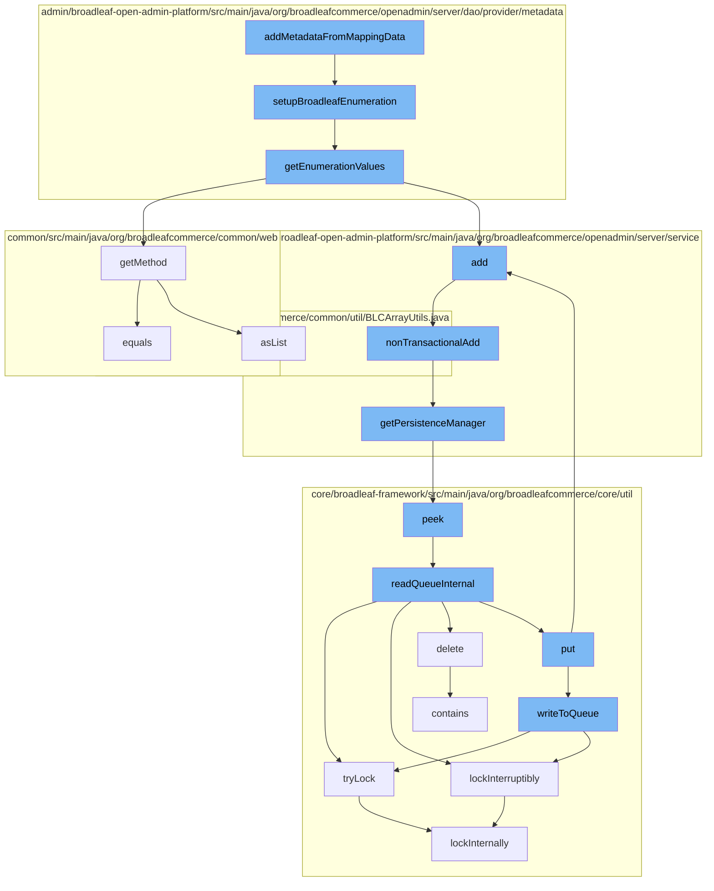

This document will cover the process of adding metadata from mapping data in the BroadleafCommerce-demo repository. The process includes the following steps:

1. Setting up Broadleaf Enumeration
2. Getting Enumeration Values
3. Adding Dynamic Entities
4. Managing Persistence
5. Managing Distributed Queue in Zookeeper
6. Managing Distributed Locks in Zookeeper



<SwmSnippet path="/admin/broadleaf-open-admin-platform/src/main/java/org/broadleafcommerce/openadmin/server/dao/provider/metadata/AbstractFieldMetadataProvider.java" line="169">

---

# Setting up Broadleaf Enumeration

The `setupBroadleafEnumeration` function is used to set up the enumeration values for a given Broadleaf enumeration class. It retrieves the enumeration values and sets them in the field metadata.

```java
    protected void setupBroadleafEnumeration(String broadleafEnumerationClass, BasicFieldMetadata fieldMetadata, DynamicEntityDao dynamicEntityDao) {
        try {
            List<Tuple<String, String>> enumVals = enumerationUtility.getEnumerationValues(broadleafEnumerationClass, dynamicEntityDao);
            
            String[][] enumerationValues = new String[enumVals.size()][2];
            int j = 0;
            for (Tuple<String, String> t : enumVals) {
                enumerationValues[j][0] = t.getFirst();
                enumerationValues[j][1] = t.getSecond();
                j++;
            }
            
            fieldMetadata.setEnumerationValues(enumerationValues);
            fieldMetadata.setEnumerationClass(broadleafEnumerationClass);
        } catch (Exception e) {
            throw new RuntimeException(e);
        }
    }
```

---

</SwmSnippet>

<SwmSnippet path="/admin/broadleaf-open-admin-platform/src/main/java/org/broadleafcommerce/openadmin/server/dao/provider/metadata/BroadleafEnumerationUtility.java" line="37">

---

# Getting Enumeration Values

The `getEnumerationValues` function retrieves the enumeration values for a given Broadleaf enumeration class. It uses reflection to access the enumeration values and returns them as a list of tuples.

```java
    @SuppressWarnings("rawtypes")
    public List<Tuple<String, String>> getEnumerationValues(String broadleafEnumerationClass, DynamicEntityDao dynamicEntityDao) {
        try {
            Map<String, String> enumVals;
            Class<?> broadleafEnumeration = Class.forName(broadleafEnumerationClass);  
    
            Method typeMethod = broadleafEnumeration.getMethod("getType");
            Method friendlyTypeMethod = broadleafEnumeration.getMethod("getFriendlyType");
            Field types = dynamicEntityDao.getFieldManager().getField(broadleafEnumeration, "TYPES");
            
            if (Comparable.class.isAssignableFrom(broadleafEnumeration)) {
                enumVals = new LinkedHashMap<String, String>();
                if (types != null) {
                    Map<Object, ?> typesMap = getTypesMap(types, broadleafEnumeration);
                    for (final Object value : getSortedEnumValues(typesMap)) {
                        enumVals.put((String) friendlyTypeMethod.invoke(value), (String) typeMethod.invoke(value));
                    }
                }
            } else {
                enumVals = new TreeMap<String, String>();
                if (types != null) {
```

---

</SwmSnippet>

<SwmSnippet path="/admin/broadleaf-open-admin-platform/src/main/java/org/broadleafcommerce/openadmin/server/service/DynamicEntityRemoteService.java" line="274">

---

# Adding Dynamic Entities

The `nonTransactionalAdd` function is used to add a dynamic entity to the persistence context. It cleans the entity before adding it and handles any exceptions that may occur during the process.

```java
    @Override
    public PersistenceResponse nonTransactionalAdd(final PersistencePackage persistencePackage) throws ServiceException {
        return persistenceThreadManager.operation(TargetModeType.SANDBOX, persistencePackage, new Persistable <PersistenceResponse, ServiceException>() {
            @Override
            public PersistenceResponse execute() throws ServiceException {
                boolean shouldClean = isShouldClean();
                if (shouldClean && (CollectionUtils.isEmpty(entitiesIgnoreList) ||
                        !entitiesIgnoreList.contains(persistencePackage.getCeilingEntityFullyQualifiedClassname()))) {
                    cleanEntity(persistencePackage.getEntity());
                }
                try {
                    PersistenceManager persistenceManager = PersistenceManagerFactory.getPersistenceManager();
                    return persistenceManager.add(persistencePackage);
                } catch (ServiceException e) {
                    //immediately throw validation exceptions without printing a stack trace
                    if (e instanceof ValidationException) {
                        throw e;
                    } else if (e.getCause() instanceof ValidationException) {
                        throw (ValidationException) e.getCause();
                    }
                    String message = exploitProtectionService.cleanString(e.getMessage());
```

---

</SwmSnippet>

<SwmSnippet path="/admin/broadleaf-open-admin-platform/src/main/java/org/broadleafcommerce/openadmin/server/service/persistence/PersistenceManagerContext.java" line="49">

---

# Managing Persistence

The `getPersistenceManager` function retrieves the current persistence manager from the context. This is used to manage the persistence of entities in the application.

```java
    public PersistenceManager getPersistenceManager() {
        return !persistenceManager.empty()?persistenceManager.peek():null;
    }
```

---

</SwmSnippet>

<SwmSnippet path="/core/broadleaf-framework/src/main/java/org/broadleafcommerce/core/util/queue/ZookeeperDistributedQueue.java" line="222">

---

# Managing Distributed Queue in Zookeeper

The `peek` function retrieves the next element in the queue without removing it. This is used to manage the distributed queue in Zookeeper.

```java
    @Override
    public T peek() {
        try {
            Map<String, T> elements = readQueueInternal(1, false, 0L);
            Iterator<Map.Entry<String, T>> entries = elements.entrySet().iterator();
            if (entries.hasNext()) {
                return entries.next().getValue();
            }
            
            return null;
        } catch (InterruptedException e) {
            Thread.currentThread().interrupt();
            return null;
        }
    }
```

---

</SwmSnippet>

<SwmSnippet path="/core/broadleaf-framework/src/main/java/org/broadleafcommerce/core/util/lock/ReentrantDistributedZookeeperLock.java" line="344">

---

# Managing Distributed Locks in Zookeeper

The `tryLock` function attempts to acquire a lock. If the lock is not available, it returns false. This is used to manage distributed locks in Zookeeper.

```java
    @Override
    public boolean tryLock() {
        try {
            return lockInternally(0L);
        } catch (InterruptedException e) {
            Thread.currentThread().interrupt();
            return false;
        }
    }
```

---

</SwmSnippet>

&nbsp;

*This is an auto-generated document by Swimm AI 🌊 and has not yet been verified by a human*

<SwmMeta version="3.0.0" repo-id="Z2l0aHViJTNBJTNBQnJvYWRsZWFmQ29tbWVyY2UtZGVtbyUzQSUzQWdpbGFkbmF2b3Q=" repo-name="BroadleafCommerce-demo" doc-type="flows"><sup>Powered by [Swimm](/)</sup></SwmMeta>
