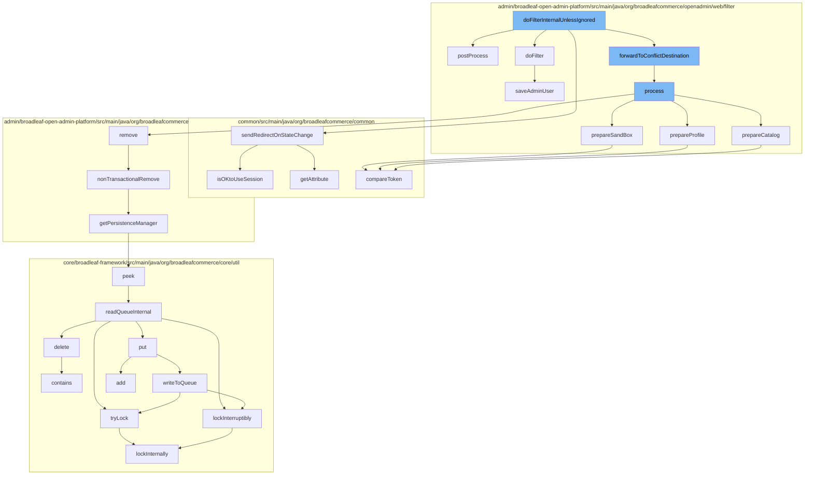

This document will cover the process of handling admin requests in the BroadleafCommerce-demo project. The process includes:

1. Filtering admin requests
2. Processing admin requests
3. Preparing the sandbox, profile, and catalog
4. Removing dynamic entities
5. Managing persistence
6. Handling distributed queue operations
7. Managing distributed locks
8. Comparing state protection tokens
9. Saving admin user details.



<SwmSnippet path="/admin/broadleaf-open-admin-platform/src/main/java/org/broadleafcommerce/openadmin/web/filter/BroadleafAdminRequestFilter.java" line="1">

---

# Filtering Admin Requests

The `doFilterInternalUnlessIgnored` function is the entry point for handling admin requests. It calls several other functions to process the request, handle state changes, filter external login states, and forward to conflict destinations if necessary.

```java
/*-
 * #%L
 * BroadleafCommerce Open Admin Platform
 * %%
 * Copyright (C) 2009 - 2024 Broadleaf Commerce
 * %%
 * Licensed under the Broadleaf Fair Use License Agreement, Version 1.0
 * (the "Fair Use License" located  at http://license.broadleafcommerce.org/fair_use_license-1.0.txt)
 * unless the restrictions on use therein are violated and require payment to Broadleaf in which case
 * the Broadleaf End User License Agreement (EULA), Version 1.1
 * (the "Commercial License" located at http://license.broadleafcommerce.org/commercial_license-1.1.txt)
 * shall apply.
 * 
 * Alternatively, the Commercial License may be replaced with a mutually agreed upon license (the "Custom License")
 * between you and Broadleaf Commerce. You may not use this file except in compliance with the applicable license.
 * #L%
 */
package org.broadleafcommerce.openadmin.web.filter;

import org.apache.commons.collections4.iterators.IteratorEnumeration;
import org.apache.commons.lang3.ArrayUtils;
```

---

</SwmSnippet>

<SwmSnippet path="/admin/broadleaf-open-admin-platform/src/main/java/org/broadleafcommerce/openadmin/web/filter/BroadleafAdminRequestProcessor.java" line="130">

---

# Processing Admin Requests

The `process` function is responsible for setting up the request context, validating production changes, resolving locale, timezone, and currency, and preparing the sandbox, profile, and catalog. It also handles security exceptions.

```java
    @Override
    public void process(WebRequest request) throws SiteNotFoundException {
        BroadleafRequestContext brc = BroadleafRequestContext.getBroadleafRequestContext();
        if (brc == null) {
            brc = new BroadleafRequestContext();
            BroadleafRequestContext.setBroadleafRequestContext(brc);
        }

        brc.getAdditionalProperties().putAll(entityExtensionManagers);

        if (brc.getSite() == null) {
            Site site = siteResolver.resolveSite(request);
            brc.setSite(site);
        }
        brc.setWebRequest(request);
        brc.setIgnoreSite(brc.getSite() == null);
        brc.setAdmin(true);

        if (adminStrictValidateProductionChanges) {
            brc.setValidateProductionChangesState(ValidateProductionChangesState.ADMIN);
        } else {
```

---

</SwmSnippet>

<SwmSnippet path="/admin/broadleaf-open-admin-platform/src/main/java/org/broadleafcommerce/openadmin/web/filter/BroadleafAdminRequestProcessor.java" line="336">

---

# Preparing the Sandbox, Profile, and Catalog

The `prepareSandBox`, `prepareProfile`, and `prepareCatalog` functions are responsible for setting up the sandbox, profile, and catalog respectively. They also handle security exceptions and stale page exceptions.

```java
    protected void prepareSandBox(WebRequest request, BroadleafRequestContext brc) {
        AdminUser adminUser = adminRemoteSecurityService.getPersistentAdminUser();
        if (adminUser == null) {
            //clear any sandbox
            if (BLCRequestUtils.isOKtoUseSession(request)) {
                request.removeAttribute(BroadleafSandBoxResolver.SANDBOX_ID_VAR, WebRequest.SCOPE_SESSION);
            }
        } else {
            SandBox sandBox = null;
            if (StringUtils.isNotBlank(request.getParameter(SANDBOX_REQ_PARAM))) {
                Long sandBoxId = Long.parseLong(request.getParameter(SANDBOX_REQ_PARAM));
                sandBox = sandBoxService.retrieveUserSandBoxForParent(adminUser.getId(), sandBoxId);
                if (sandBox == null) {
                    SandBox approvalOrUserSandBox = sandBoxService.retrieveSandBoxManagementById(sandBoxId);
                    if (approvalOrUserSandBox != null) {
                        if (approvalOrUserSandBox.getSandBoxType().equals(SandBoxType.USER)) {
                            sandBox = approvalOrUserSandBox;
                        } else {
                            sandBox = sandBoxService.createUserSandBox(adminUser.getId(), approvalOrUserSandBox);
                        }
                    }
```

---

</SwmSnippet>

<SwmSnippet path="/admin/broadleaf-open-admin-platform/src/main/java/org/broadleafcommerce/openadmin/server/service/DynamicEntityRemoteService.java" line="329">

---

# Removing Dynamic Entities

The `nonTransactionalRemove` function is used to remove dynamic entities from the persistence layer. It handles service exceptions and validation exceptions.

```java
    @Override
    public PersistenceResponse nonTransactionalRemove(final PersistencePackage persistencePackage) throws ServiceException {
        return persistenceThreadManager.operation(TargetModeType.SANDBOX, persistencePackage, new Persistable <PersistenceResponse, ServiceException>() {
            @Override
            public PersistenceResponse execute() throws ServiceException {
                try {
                    PersistenceManager persistenceManager = PersistenceManagerFactory.getPersistenceManager();
                    return persistenceManager.remove(persistencePackage);
                } catch (ServiceException e) {
                    //immediately throw validation exceptions without printing a stack trace
                    if (e instanceof ValidationException) {
                        throw e;
                    } else if (e.getCause() instanceof ValidationException) {
                        throw (ValidationException) e.getCause();
                    }
                    LOG.error("Problem removing " + persistencePackage.getCeilingEntityFullyQualifiedClassname(), e);
                    String message = exploitProtectionService.cleanString(e.getMessage());
                    throw recreateSpecificServiceException(e, message, e.getCause());
                }
            }
        });
```

---

</SwmSnippet>

<SwmSnippet path="/admin/broadleaf-open-admin-platform/src/main/java/org/broadleafcommerce/openadmin/server/service/persistence/PersistenceManagerContext.java" line="49">

---

# Managing Persistence

The `getPersistenceManager` function is used to retrieve the current persistence manager from the thread-local context.

```java
    public PersistenceManager getPersistenceManager() {
        return !persistenceManager.empty()?persistenceManager.peek():null;
    }
```

---

</SwmSnippet>

<SwmSnippet path="/core/broadleaf-framework/src/main/java/org/broadleafcommerce/core/util/queue/ZookeeperDistributedQueue.java" line="222">

---

# Handling Distributed Queue Operations

The `peek` and `readQueueInternal` functions are used to read from the distributed queue. They handle interruptions and execute operations in a distributed manner.

```java
    @Override
    public T peek() {
        try {
            Map<String, T> elements = readQueueInternal(1, false, 0L);
            Iterator<Map.Entry<String, T>> entries = elements.entrySet().iterator();
            if (entries.hasNext()) {
                return entries.next().getValue();
            }
            
            return null;
        } catch (InterruptedException e) {
            Thread.currentThread().interrupt();
            return null;
        }
    }
```

---

</SwmSnippet>

<SwmSnippet path="/core/broadleaf-framework/src/main/java/org/broadleafcommerce/core/util/lock/ReentrantDistributedZookeeperLock.java" line="344">

---

# Managing Distributed Locks

The `tryLock` and `lockInternally` functions are used to manage distributed locks. They handle interruptions and execute operations in a distributed manner.

```java
    @Override
    public boolean tryLock() {
        try {
            return lockInternally(0L);
        } catch (InterruptedException e) {
            Thread.currentThread().interrupt();
            return false;
        }
    }
```

---

</SwmSnippet>

<SwmSnippet path="/common/src/main/java/org/broadleafcommerce/common/security/service/StaleStateProtectionServiceImpl.java" line="57">

---

# Comparing State Protection Tokens

The `compareToken` function is used to compare state protection tokens to prevent stale page exceptions.

```java
    @Override
    public void compareToken(String passedToken) {
        if (staleStateProtectionEnabled) {
            HttpServletRequest request = ((ServletRequestAttributes) RequestContextHolder.getRequestAttributes()).getRequest();
            if (!getStateVersionToken().equals(passedToken) && request.getAttribute(getStateVersionTokenParameter()) == null) {
                throw new StaleStateServiceException("Page version token mismatch (" + passedToken + "). The request likely came from a stale page.");
            } else {
                request.setAttribute(getStateVersionTokenParameter(), "passed");
                if (LOG.isDebugEnabled()) {
                    LOG.debug("Validated page version token");
                }
            }
        }
    }
```

---

</SwmSnippet>

<SwmSnippet path="/admin/broadleaf-open-admin-platform/src/main/java/org/broadleafcommerce/openadmin/web/filter/AdminExternalLoginStateFilter.java" line="101">

---

# Saving Admin User Details

The `saveAdminUser` function is used to save admin user details. It handles the assignment of roles and saves the user data.

```java
    protected void saveAdminUser(BroadleafExternalAuthenticationUserDetails broadleafUser, AdminUser user) {
        //Name, login, password, email are required.
        user.setLogin(broadleafUser.getUsername());
        user.setUnencodedPassword(broadleafUser.getPassword());

        if (user.getUnencodedPassword() == null) {
            //If Spring is configured to erase credentials, then this will always be null
            //Set the username as a default password here.
            user.setUnencodedPassword(user.getLogin());
        }

        StringBuffer name = new StringBuffer();
        if (broadleafUser.getFirstName() != null && broadleafUser.getFirstName().trim().length() > 0) {
            name.append(broadleafUser.getFirstName().trim());
            name.append(" ");
        }

        if (broadleafUser.getLastName() != null && broadleafUser.getLastName().trim().length() > 0) {
            name.append(broadleafUser.getLastName().trim());
        }

```

---

</SwmSnippet>

&nbsp;

*This is an auto-generated document by Swimm AI 🌊 and has not yet been verified by a human*

<SwmMeta version="3.0.0" repo-id="Z2l0aHViJTNBJTNBQnJvYWRsZWFmQ29tbWVyY2UtZGVtbyUzQSUzQWdpbGFkbmF2b3Q=" repo-name="BroadleafCommerce-demo" doc-type="flows"><sup>Powered by [Swimm](/)</sup></SwmMeta>
