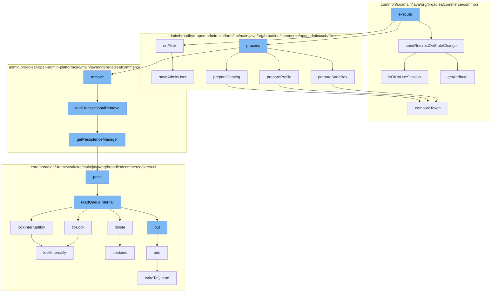

This document will cover the process of handling admin requests in the BroadleafCommerce-demo project. We'll cover:

1. The initial execution of the request
2. Processing the request
3. Removing dynamic entities
4. Managing persistence
5. Handling distributed queues
6. Locking mechanisms
7. State protection



<SwmSnippet path="/admin/broadleaf-open-admin-platform/src/main/java/org/broadleafcommerce/openadmin/web/filter/BroadleafAdminRequestFilter.java" line="1">

---

# Initial Execution of the Request

The `execute` function in `BroadleafAdminRequestFilter.java` is the entry point for handling an admin request. It calls `sendRedirectOnStateChange`, `doFilter`, and `process` functions to manage the request.

```java
/*-
 * #%L
 * BroadleafCommerce Open Admin Platform
 * %%
 * Copyright (C) 2009 - 2024 Broadleaf Commerce
 * %%
 * Licensed under the Broadleaf Fair Use License Agreement, Version 1.0
 * (the "Fair Use License" located  at http://license.broadleafcommerce.org/fair_use_license-1.0.txt)
 * unless the restrictions on use therein are violated and require payment to Broadleaf in which case
 * the Broadleaf End User License Agreement (EULA), Version 1.1
 * (the "Commercial License" located at http://license.broadleafcommerce.org/commercial_license-1.1.txt)
 * shall apply.
 * 
 * Alternatively, the Commercial License may be replaced with a mutually agreed upon license (the "Custom License")
 * between you and Broadleaf Commerce. You may not use this file except in compliance with the applicable license.
 * #L%
 */
package org.broadleafcommerce.openadmin.web.filter;

import org.apache.commons.collections4.iterators.IteratorEnumeration;
```

---

</SwmSnippet>

<SwmSnippet path="/admin/broadleaf-open-admin-platform/src/main/java/org/broadleafcommerce/openadmin/web/filter/BroadleafAdminRequestProcessor.java" line="336">

---

# Processing the Request

The `process` function in `BroadleafAdminRequestProcessor.java` prepares the sandbox, profile, and catalog for the request. It also calls the `remove` function to remove any dynamic entities.

```java
    protected void prepareSandBox(WebRequest request, BroadleafRequestContext brc) {
        AdminUser adminUser = adminRemoteSecurityService.getPersistentAdminUser();
        if (adminUser == null) {
            //clear any sandbox
            if (BLCRequestUtils.isOKtoUseSession(request)) {
                request.removeAttribute(BroadleafSandBoxResolver.SANDBOX_ID_VAR, WebRequest.SCOPE_SESSION);
            }
        } else {
            SandBox sandBox = null;
            if (StringUtils.isNotBlank(request.getParameter(SANDBOX_REQ_PARAM))) {
                Long sandBoxId = Long.parseLong(request.getParameter(SANDBOX_REQ_PARAM));
                sandBox = sandBoxService.retrieveUserSandBoxForParent(adminUser.getId(), sandBoxId);
                if (sandBox == null) {
                    SandBox approvalOrUserSandBox = sandBoxService.retrieveSandBoxManagementById(sandBoxId);
                    if (approvalOrUserSandBox != null) {
                        if (approvalOrUserSandBox.getSandBoxType().equals(SandBoxType.USER)) {
                            sandBox = approvalOrUserSandBox;
                        } else {
                            sandBox = sandBoxService.createUserSandBox(adminUser.getId(), approvalOrUserSandBox);
                        }
                    }
```

---

</SwmSnippet>

<SwmSnippet path="/admin/broadleaf-open-admin-platform/src/main/java/org/broadleafcommerce/openadmin/server/service/DynamicEntityRemoteService.java" line="329">

---

# Removing Dynamic Entities

The `remove` function in `DynamicEntityRemoteService.java` removes dynamic entities in a non-transactional manner. It calls the `getPersistenceManager` function to manage persistence.

```java
    @Override
    public PersistenceResponse nonTransactionalRemove(final PersistencePackage persistencePackage) throws ServiceException {
        return persistenceThreadManager.operation(TargetModeType.SANDBOX, persistencePackage, new Persistable <PersistenceResponse, ServiceException>() {
            @Override
            public PersistenceResponse execute() throws ServiceException {
                try {
                    PersistenceManager persistenceManager = PersistenceManagerFactory.getPersistenceManager();
                    return persistenceManager.remove(persistencePackage);
                } catch (ServiceException e) {
                    //immediately throw validation exceptions without printing a stack trace
                    if (e instanceof ValidationException) {
                        throw e;
                    } else if (e.getCause() instanceof ValidationException) {
                        throw (ValidationException) e.getCause();
                    }
                    LOG.error("Problem removing " + persistencePackage.getCeilingEntityFullyQualifiedClassname(), e);
                    String message = exploitProtectionService.cleanString(e.getMessage());
                    throw recreateSpecificServiceException(e, message, e.getCause());
                }
            }
        });
```

---

</SwmSnippet>

<SwmSnippet path="/admin/broadleaf-open-admin-platform/src/main/java/org/broadleafcommerce/openadmin/server/service/persistence/PersistenceManagerContext.java" line="49">

---

# Managing Persistence

The `getPersistenceManager` function in `PersistenceManagerContext.java` retrieves the current persistence manager. It calls the `peek` function to read the queue.

```java
    public PersistenceManager getPersistenceManager() {
        return !persistenceManager.empty()?persistenceManager.peek():null;
    }
```

---

</SwmSnippet>

<SwmSnippet path="/core/broadleaf-framework/src/main/java/org/broadleafcommerce/core/util/queue/ZookeeperDistributedQueue.java" line="222">

---

# Handling Distributed Queues

The `peek` function in `ZookeeperDistributedQueue.java` reads the queue and calls `readQueueInternal` to read the queue internally. It also manages the locking mechanism.

```java
    @Override
    public T peek() {
        try {
            Map<String, T> elements = readQueueInternal(1, false, 0L);
            Iterator<Map.Entry<String, T>> entries = elements.entrySet().iterator();
            if (entries.hasNext()) {
                return entries.next().getValue();
            }
            
            return null;
        } catch (InterruptedException e) {
            Thread.currentThread().interrupt();
            return null;
        }
    }
```

---

</SwmSnippet>

<SwmSnippet path="/core/broadleaf-framework/src/main/java/org/broadleafcommerce/core/util/lock/ReentrantDistributedZookeeperLock.java" line="344">

---

# Locking Mechanisms

The `tryLock` function in `ReentrantDistributedZookeeperLock.java` attempts to acquire the lock. If it's successful, it calls `lockInternally` to lock internally.

```java
    @Override
    public boolean tryLock() {
        try {
            return lockInternally(0L);
        } catch (InterruptedException e) {
            Thread.currentThread().interrupt();
            return false;
        }
    }
```

---

</SwmSnippet>

<SwmSnippet path="/common/src/main/java/org/broadleafcommerce/common/security/service/StaleStateProtectionServiceImpl.java" line="57">

---

# State Protection

The `compareToken` function in `StaleStateProtectionServiceImpl.java` compares the passed token with the state version token to ensure the request doesn't come from a stale page.

```java
    @Override
    public void compareToken(String passedToken) {
        if (staleStateProtectionEnabled) {
            HttpServletRequest request = ((ServletRequestAttributes) RequestContextHolder.getRequestAttributes()).getRequest();
            if (!getStateVersionToken().equals(passedToken) && request.getAttribute(getStateVersionTokenParameter()) == null) {
                throw new StaleStateServiceException("Page version token mismatch (" + passedToken + "). The request likely came from a stale page.");
            } else {
                request.setAttribute(getStateVersionTokenParameter(), "passed");
                if (LOG.isDebugEnabled()) {
                    LOG.debug("Validated page version token");
                }
            }
        }
    }
```

---

</SwmSnippet>

&nbsp;

*This is an auto-generated document by Swimm AI 🌊 and has not yet been verified by a human*

<SwmMeta version="3.0.0" repo-id="Z2l0aHViJTNBJTNBQnJvYWRsZWFmQ29tbWVyY2UtZGVtbyUzQSUzQWdpbGFkbmF2b3Q=" repo-name="BroadleafCommerce-demo" doc-type="flows"><sup>Powered by [Swimm](/)</sup></SwmMeta>
