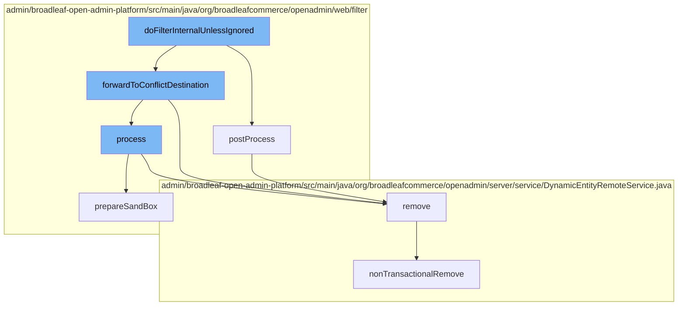

This document will cover the process of handling admin requests in the BroadleafCommerce-demo project. We'll cover:

1. Filtering admin requests
2. Processing admin requests
3. Removing persistence packages
4. Handling transactional operations.



<SwmSnippet path="/admin/broadleaf-open-admin-platform/src/main/java/org/broadleafcommerce/openadmin/web/filter/BroadleafAdminRequestFilter.java" line="1">

---

# Filtering admin requests

The `doFilterInternalUnlessIgnored` function in `BroadleafAdminRequestFilter.java` is the entry point for filtering admin requests. It decides whether to process the request or forward it to a conflict destination.

```java
/*-
 * #%L
 * BroadleafCommerce Open Admin Platform
 * %%
 * Copyright (C) 2009 - 2024 Broadleaf Commerce
 * %%
 * Licensed under the Broadleaf Fair Use License Agreement, Version 1.0
 * (the "Fair Use License" located  at http://license.broadleafcommerce.org/fair_use_license-1.0.txt)
 * unless the restrictions on use therein are violated and require payment to Broadleaf in which case
 * the Broadleaf End User License Agreement (EULA), Version 1.1
 * (the "Commercial License" located at http://license.broadleafcommerce.org/commercial_license-1.1.txt)
 * shall apply.
 * 
 * Alternatively, the Commercial License may be replaced with a mutually agreed upon license (the "Custom License")
 * between you and Broadleaf Commerce. You may not use this file except in compliance with the applicable license.
 * #L%
 */
package org.broadleafcommerce.openadmin.web.filter;

import org.apache.commons.collections4.iterators.IteratorEnumeration;
import org.apache.commons.lang3.ArrayUtils;
```

---

</SwmSnippet>

<SwmSnippet path="/admin/broadleaf-open-admin-platform/src/main/java/org/broadleafcommerce/openadmin/web/filter/BroadleafAdminRequestProcessor.java" line="419">

---

# Processing admin requests

The `postProcess` function in `BroadleafAdminRequestProcessor.java` is called to process the request. It removes any thread-local variables after the request has been processed.

```java
    @Override
    public void postProcess(WebRequest request) {
        ThreadLocalManager.remove();
    }
```

---

</SwmSnippet>

<SwmSnippet path="/admin/broadleaf-open-admin-platform/src/main/java/org/broadleafcommerce/openadmin/server/service/DynamicEntityRemoteService.java" line="249">

---

# Removing persistence packages

The `remove` function in `DynamicEntityRemoteService.java` is called to remove a persistence package. It performs this operation in a transactional context.

```java
    @Override
    public PersistenceResponse remove(final PersistencePackage persistencePackage) throws ServiceException {
        final PersistenceResponse[] response = new PersistenceResponse[1];
        try {
            PlatformTransactionManager transactionManager = identifyTransactionManager(persistencePackage);
            transUtil.runTransactionalOperation(new StreamCapableTransactionalOperationAdapter() {
                @Override
                public void execute() throws Throwable {
                    response[0] = nonTransactionalRemove(persistencePackage);
                }

                @Override
                public boolean shouldRetryOnTransactionLockAcquisitionFailure() {
                    return super.shouldRetryOnTransactionLockAcquisitionFailure();
                }
            }, RuntimeException.class, transactionManager);
        } catch (RuntimeException e) {
            if (e.getCause() instanceof ServiceException) {
                throw (ServiceException) e.getCause();
            }
            throw e;
```

---

</SwmSnippet>

<SwmSnippet path="/admin/broadleaf-open-admin-platform/src/main/java/org/broadleafcommerce/openadmin/server/service/DynamicEntityRemoteService.java" line="329">

---

# Handling transactional operations

The `nonTransactionalRemove` function in `DynamicEntityRemoteService.java` is called to remove a persistence package without a transaction. It is used when the transactional removal fails.

```java
    @Override
    public PersistenceResponse nonTransactionalRemove(final PersistencePackage persistencePackage) throws ServiceException {
        return persistenceThreadManager.operation(TargetModeType.SANDBOX, persistencePackage, new Persistable <PersistenceResponse, ServiceException>() {
            @Override
            public PersistenceResponse execute() throws ServiceException {
                try {
                    PersistenceManager persistenceManager = PersistenceManagerFactory.getPersistenceManager();
                    return persistenceManager.remove(persistencePackage);
                } catch (ServiceException e) {
                    //immediately throw validation exceptions without printing a stack trace
                    if (e instanceof ValidationException) {
                        throw e;
                    } else if (e.getCause() instanceof ValidationException) {
                        throw (ValidationException) e.getCause();
                    }
                    LOG.error("Problem removing " + persistencePackage.getCeilingEntityFullyQualifiedClassname(), e);
                    String message = exploitProtectionService.cleanString(e.getMessage());
                    throw recreateSpecificServiceException(e, message, e.getCause());
                }
            }
        });
```

---

</SwmSnippet>

&nbsp;

*This is an auto-generated document by Swimm AI 🌊 and has not yet been verified by a human*

<SwmMeta version="3.0.0" repo-id="Z2l0aHViJTNBJTNBQnJvYWRsZWFmQ29tbWVyY2UtZGVtbyUzQSUzQWdpbGFkbmF2b3Q=" repo-name="BroadleafCommerce-demo" doc-type="flows"><sup>Powered by [Swimm](/)</sup></SwmMeta>
