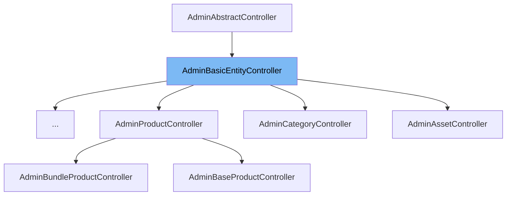

This document will cover the following aspects of the `AdminBasicEntityController` class:

1. What is `AdminBasicEntityController`.
2. Variables and functions of `AdminBasicEntityController`.
3. Usage example of `AdminBasicEntityController`.



# What is AdminBasicEntityController

The `AdminBasicEntityController` is a controller class in the BroadleafCommerce-demo repository. It is responsible for rendering the admin for every entity that is not explicitly customized by its own controller. It provides a robust data model, services, and specialized tooling for managing entities in the admin platform. The class is part of the Broadleaf Commerce Community Edition, an e-commerce framework written in Java and leveraging the Spring framework.

<SwmSnippet path="/admin/broadleaf-open-admin-platform/src/main/java/org/broadleafcommerce/openadmin/web/controller/entity/AdminBasicEntityController.java" line="123">

---

# Variables and functions

The `LOG` variable is a logger instance used for logging purposes.

```java

```

---

</SwmSnippet>

<SwmSnippet path="/admin/broadleaf-open-admin-platform/src/main/java/org/broadleafcommerce/openadmin/web/controller/entity/AdminBasicEntityController.java" line="126">

---

The `ALTERNATE_ID_PROPERTY` variable is a constant string used to identify the alternate ID property of an entity.

```java
    public static final String ALTERNATE_ID_PROPERTY = "ALTERNATE_ID";
```

---

</SwmSnippet>

<SwmSnippet path="/admin/broadleaf-open-admin-platform/src/main/java/org/broadleafcommerce/openadmin/web/controller/entity/AdminBasicEntityController.java" line="127">

---

The `CUSTOM_CRITERIA` variable is a constant string used to identify the custom criteria property of an entity.

```java
    public static final String CUSTOM_CRITERIA = "criteria";
```

---

</SwmSnippet>

<SwmSnippet path="/admin/broadleaf-open-admin-platform/src/main/java/org/broadleafcommerce/openadmin/web/controller/entity/AdminBasicEntityController.java" line="128">

---

The `IS_SELECTIZE_REQUEST` variable is a constant string used to identify if the request is a selectize request.

```java
    public static final String IS_SELECTIZE_REQUEST = "isSelectizeRequest";
```

---

</SwmSnippet>

<SwmSnippet path="/admin/broadleaf-open-admin-platform/src/main/java/org/broadleafcommerce/openadmin/web/controller/entity/AdminBasicEntityController.java" line="129">

---

The `CURRENT_FOLDER_ID` variable is a constant string used to identify the current folder ID of an entity.

```java
    protected static final String CURRENT_FOLDER_ID = "currentFolderId";
```

---

</SwmSnippet>

<SwmSnippet path="/admin/broadleaf-open-admin-platform/src/main/java/org/broadleafcommerce/openadmin/web/controller/entity/AdminBasicEntityController.java" line="131">

---

The `sandBoxHelper` variable is an instance of `SandBoxHelper` which provides helper methods for sandbox operations.

```java
    @Resource(name="blSandBoxHelper")
```

---

</SwmSnippet>

<SwmSnippet path="/admin/broadleaf-open-admin-platform/src/main/java/org/broadleafcommerce/openadmin/web/controller/entity/AdminBasicEntityController.java" line="134">

---

The `adminUserDao` variable is an instance of `AdminUserDao` which provides data access operations for admin users.

```java
    @Resource(name = "blAdminUserDao")
```

---

</SwmSnippet>

<SwmSnippet path="/admin/broadleaf-open-admin-platform/src/main/java/org/broadleafcommerce/openadmin/web/controller/entity/AdminBasicEntityController.java" line="137">

---

The `dynamicEntityDao` variable is an instance of `DynamicEntityDao` which provides data access operations for dynamic entities.

```java
    @Resource(name="blDynamicEntityDao")
```

---

</SwmSnippet>

<SwmSnippet path="/admin/broadleaf-open-admin-platform/src/main/java/org/broadleafcommerce/openadmin/web/controller/entity/AdminBasicEntityController.java" line="140">

---

The `adornedTargetAutoPopulateExtensionManager` variable is an instance of `AdornedTargetAutoPopulateExtensionManager` which provides extension points for auto-populating adorned target fields.

```java
    @Resource(name = "blAdornedTargetAutoPopulateExtensionManager")
```

---

</SwmSnippet>

<SwmSnippet path="/admin/broadleaf-open-admin-platform/src/main/java/org/broadleafcommerce/openadmin/web/controller/entity/AdminBasicEntityController.java" line="143">

---

The `rowLevelSecurityService` variable is an instance of `RowLevelSecurityService` which provides row-level security services.

```java
    @Resource(name = "blRowLevelSecurityService")
```

---

</SwmSnippet>

<SwmSnippet path="/admin/broadleaf-open-admin-platform/src/main/java/org/broadleafcommerce/openadmin/web/controller/entity/AdminBasicEntityController.java" line="146">

---

The `duplicator` variable is an instance of `EntityDuplicator` which provides entity duplication services.

```java
    @Resource(name = "blEntityDuplicator")
```

---

</SwmSnippet>

<SwmSnippet path="/admin/broadleaf-open-admin-platform/src/main/java/org/broadleafcommerce/openadmin/web/controller/entity/AdminBasicEntityController.java" line="149">

---

The `genericEntityService` variable is an instance of `GenericEntityService` which provides generic entity services.

```java
    @Resource(name = "blGenericEntityService")
```

---

</SwmSnippet>

<SwmSnippet path="/admin/broadleaf-open-admin-platform/src/main/java/org/broadleafcommerce/openadmin/web/controller/entity/AdminBasicEntityController.java" line="152">

---

The `multipleCatalogExtensionManager` variable is an instance of `MultipleCatalogExtensionManager` which provides extension points for multiple catalog operations.

```java
    @Resource(name = "blMultipleCatalogExtensionManager")
```

---

</SwmSnippet>

<SwmSnippet path="/admin/broadleaf-open-admin-platform/src/main/java/org/broadleafcommerce/openadmin/web/controller/entity/AdminBasicEntityController.java" line="171">

---

# Functions

The `viewEntityList` function is used to render the main entity listing for the specified class. It takes in the HTTP request, response, model, path variables, and request parameters as arguments.

```java
    @RequestMapping(value = "", method = RequestMethod.GET)
    public String viewEntityList(HttpServletRequest request, HttpServletResponse response, Model model,
            @PathVariable Map<String, String> pathVars,
            @RequestParam MultiValueMap<String, String> requestParams) throws Exception {
        String sectionKey = getSectionKey(pathVars);
        String sectionClassName = getClassNameForSection(sectionKey);
        List<SectionCrumb> crumbs = getSectionCrumbs(request, null, null);
        PersistencePackageRequest ppr = getSectionPersistencePackageRequest(sectionClassName, requestParams, crumbs, pathVars);
        ClassMetadata cmd = service.getClassMetadata(ppr).getDynamicResultSet().getClassMetaData();
        DynamicResultSet drs =  service.getRecords(ppr).getDynamicResultSet();

        ListGrid listGrid = formService.buildMainListGrid(drs, cmd, sectionKey, crumbs);
        listGrid.setSelectType(ListGrid.SelectType.NONE);

        Set<Field> headerFields = listGrid.getHeaderFields();
        if (CollectionUtils.isNotEmpty(headerFields)) {
            Field firstField = headerFields.iterator().next();
            if (requestParams.containsKey(firstField.getName())) {
                model.addAttribute("mainSearchTerm", requestParams.get(firstField.getName()).get(0));
            }
        }
```

---

</SwmSnippet>

<SwmSnippet path="/admin/broadleaf-open-admin-platform/src/main/java/org/broadleafcommerce/openadmin/web/controller/entity/AdminBasicEntityController.java" line="201">

---

The `setupViewEntityListBasicModel` function is used to setup the basic model for viewing the entity list. It takes in the HTTP request, class metadata, section key, section class name, model, and request parameters as arguments.

```java
    protected void setupViewEntityListBasicModel(HttpServletRequest request, ClassMetadata cmd, String sectionKey,
            String sectionClassName, Model model, MultiValueMap<String, String> requestParams) {
        List<EntityFormAction> mainActions = new ArrayList<>();
        addAddActionIfAllowed(sectionClassName, cmd, mainActions);
        extensionManager.getProxy().addAdditionalMainActions(sectionClassName, mainActions);
        extensionManager.getProxy().modifyMainActions(cmd, mainActions);

        // If this came from a delete save, we'll have a headerFlash request parameter to take care of
        if (requestParams.containsKey("headerFlash")) {
            model.addAttribute("headerFlash", requestParams.get("headerFlash").get(0));
        }

        List<ClassTree> entityTypes = getAddEntityTypes(cmd.getPolymorphicEntities());
        String requestUri = request.getRequestURI();
        if (!request.getContextPath().equals("/") && requestUri.startsWith(request.getContextPath())) {
            requestUri = requestUri.substring(request.getContextPath().length() + 1, requestUri.length());
        }

        model.addAttribute("isFilter", (requestParams.size() > 0));
        model.addAttribute("currentUri", requestUri);
        model.addAttribute("entityTypes", entityTypes);
```

---

</SwmSnippet>

<SwmSnippet path="/admin/broadleaf-open-admin-platform/src/main/java/org/broadleafcommerce/openadmin/web/controller/entity/AdminBasicEntityController.java" line="229">

---

The `viewEntityListSelectize` function is used to render the entity list for selectize. It takes in the HTTP request, response, model, path variables, and request parameters as arguments.

```java
    @RequestMapping(value = "/selectize", method = RequestMethod.GET)
    public @ResponseBody Map<String, Object> viewEntityListSelectize(HttpServletRequest request,
             HttpServletResponse response, Model model,
             @PathVariable Map<String, String> pathVars,
             @RequestParam MultiValueMap<String, String> requestParams) throws Exception {
        String sectionKey = getSectionKey(pathVars);
        String sectionClassName = getClassNameForSection(sectionKey);
        List<SectionCrumb> crumbs = getSectionCrumbs(request, null, null);
        PersistencePackageRequest ppr = getSectionPersistencePackageRequest(sectionClassName, requestParams, crumbs, pathVars)
                .withCustomCriteria(getCustomCriteria(requestParams));

        ppr.addCustomCriteria(buildSelectizeCustomCriteria());

        ClassMetadata cmd = service.getClassMetadata(ppr).getDynamicResultSet().getClassMetaData();
        DynamicResultSet drs =  service.getRecords(ppr).getDynamicResultSet();

        return formService.constructSelectizeOptionMap(drs, cmd);
    }
```

---

</SwmSnippet>

<SwmSnippet path="/admin/broadleaf-open-admin-platform/src/main/java/org/broadleafcommerce/openadmin/web/controller/entity/AdminBasicEntityController.java" line="248">

---

The `getCustomCriteria` function is used to obtain the requested criteria parameter. It takes in the request parameters as an argument.

```java
    /**
     * Obtains the requested criteria parameter
     *
     * @param requestParams
     * @return
     */
    protected String[] getCustomCriteria(Map<String, List<String>> requestParams) {
        if (requestParams == null || requestParams.isEmpty()) {
            return null;
        }

        List<String> criteria = requestParams.get(CUSTOM_CRITERIA);
        String response = CollectionUtils.isEmpty(criteria) ? null : criteria.get(0);
        return new String[] {response};
    }
```

---

</SwmSnippet>

<SwmSnippet path="/admin/broadleaf-open-admin-platform/src/main/java/org/broadleafcommerce/openadmin/web/controller/entity/AdminBasicEntityController.java" line="264">

---

The `addAddActionIfAllowed` function is used to add the 'Add' button to the main entity form if the current user has permissions to create new instances of the entity and all of the fields in the entity aren't marked as read only. It takes in the section class name, class metadata, and main actions as arguments.

```java
    /**
     * Adds the "Add" button to the main entity form if the current user has permissions to create new instances
     * of the entity and all of the fields in the entity aren't marked as read only.
     *
     * @param sectionClassName
     * @param cmd
     * @param mainActions
     */
    protected void addAddActionIfAllowed(String sectionClassName, ClassMetadata cmd, List<EntityFormAction> mainActions) {
        if (isAddActionAllowed(sectionClassName, cmd)) {
            mainActions.add(DefaultMainActions.ADD);
        }
    }
```

---

</SwmSnippet>

<SwmSnippet path="/admin/broadleaf-open-admin-platform/src/main/java/org/broadleafcommerce/openadmin/web/controller/entity/AdminBasicEntityController.java" line="278">

---

The `isAddActionAllowed` function is used to check if the 'Add' action is allowed. It takes in the section class name and class metadata as arguments.

```java
    protected boolean isAddActionAllowed(final String sectionClassName, final ClassMetadata cmd) {
        // If the user does not have create permissions, we will not add the "Add New" button
        try {
            adminRemoteSecurityService.securityCheck(sectionClassName, EntityOperationType.ADD);
        } catch (ServiceException e) {
            if (e instanceof SecurityServiceException) {
                return false;
            }
        }

        final boolean canAdd = rowLevelSecurityService
                .canAdd(adminRemoteSecurityService.getPersistentAdminUser(), sectionClassName, cmd);
        return isNotReadOnly(cmd) && canAdd;
    }
```

---

</SwmSnippet>

<SwmSnippet path="/admin/broadleaf-open-admin-platform/src/main/java/org/broadleafcommerce/openadmin/web/controller/entity/AdminBasicEntityController.java" line="293">

---

The `isNotReadOnly` function is used to check if the class metadata is not read only. It takes in the class metadata as an argument.

```java
    protected boolean isNotReadOnly(final ClassMetadata cmd) {
        //check if all the metadata is read only
        for (Property property : cmd.getProperties()) {
            if (property.getMetadata() instanceof BasicFieldMetadata) {
                if (((BasicFieldMetadata) property.getMetadata()).getReadOnly() == null ||
                        !((BasicFieldMetadata) property.getMetadata()).getReadOnly()) {
                    return true;
                }
            }
        }
        
        return false;
    }
```

---

</SwmSnippet>

<SwmSnippet path="/admin/broadleaf-open-admin-platform/src/main/java/org/broadleafcommerce/openadmin/web/controller/entity/AdminBasicEntityController.java" line="307">

---

The `viewAddEntityForm` function is used to render the modal form that is used to add a new parent level entity. It takes in the HTTP request, response, model, path variables, and entity type as arguments.

```java
    /**
     * Renders the modal form that is used to add a new parent level entity. Note that this form cannot render any
     * subcollections as operations on those collections require the parent level entity to first be saved and have
     * and id. Once the entity is initially saved, we will redirect the user to the normal manage entity screen where
     * they can then perform operations on sub collections.
     *
     * @param request
     * @param response
     * @param model
     * @param pathVars
     * @param entityType
     * @return the return view path
     * @throws Exception
     */
    @RequestMapping(value = "/add", method = RequestMethod.GET)
    public String viewAddEntityForm(HttpServletRequest request, HttpServletResponse response, Model model,
            @PathVariable  Map<String, String> pathVars,
            @RequestParam(defaultValue = "") String entityType) throws Exception {
        String sectionKey = getSectionKey(pathVars);
        String sectionClassName = getClassNameForSection(sectionKey);
        List<SectionCrumb> sectionCrumbs = getSectionCrumbs(request, null, null);
```

---

</SwmSnippet>

&nbsp;

*This is an auto-generated document by Swimm AI 🌊 and has not yet been verified by a human*

<SwmMeta version="3.0.0" repo-id="Z2l0aHViJTNBJTNBQnJvYWRsZWFmQ29tbWVyY2UtZGVtbyUzQSUzQWdpbGFkbmF2b3Q=" repo-name="BroadleafCommerce-demo" doc-type="class"><sup>Powered by [Swimm](/)</sup></SwmMeta>
