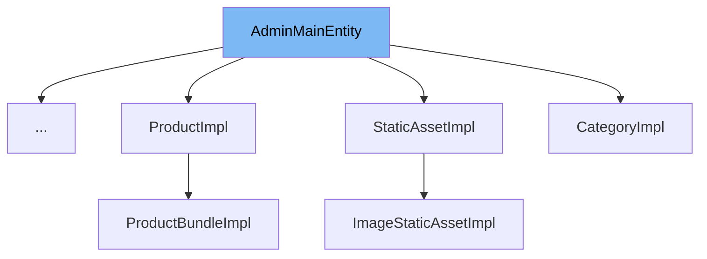

This document will cover the following aspects of the `AdminMainEntity` interface:

1. What is `AdminMainEntity`.
2. Variables and functions in `AdminMainEntity`.
3. An example of how `AdminMainEntity` is used in `SandBoxImpl`.



# What is AdminMainEntity

`AdminMainEntity` is an interface in the Broadleaf Commerce framework. It is designed to provide a method for determining the display name of an entity in the admin screen. Entities that implement this interface will have their `getMainEntityName()` method invoked to determine their title when they are viewed in the admin interface.

<SwmSnippet path="/common/src/main/java/org/broadleafcommerce/common/admin/domain/AdminMainEntity.java" line="28">

---

# Variables and functions

The `MAIN_ENTITY_NAME_PROPERTY` is a constant string that is used as a property key to store the main entity name.

```java
    public static final String MAIN_ENTITY_NAME_PROPERTY = "__adminMainEntity";
```

---

</SwmSnippet>

<SwmSnippet path="/common/src/main/java/org/broadleafcommerce/common/admin/domain/AdminMainEntity.java" line="33">

---

The `getMainEntityName()` function is a method that should be implemented by classes that implement the `AdminMainEntity` interface. It is used to return the display name of the entity for the admin screen.

```java
    public String getMainEntityName();
```

---

</SwmSnippet>

<SwmSnippet path="/common/src/main/java/org/broadleafcommerce/common/sandbox/domain/SandBoxImpl.java" line="65">

---

# Usage example

`SandBoxImpl` is an example of a class that implements the `AdminMainEntity` interface. This means that it provides an implementation for the `getMainEntityName()` method, which is used to determine its display name in the admin interface.

```java
public class SandBoxImpl implements SandBox, AdminMainEntity {
```

---

</SwmSnippet>

&nbsp;

*This is an auto-generated document by Swimm AI 🌊 and has not yet been verified by a human*

<SwmMeta version="3.0.0" repo-id="Z2l0aHViJTNBJTNBQnJvYWRsZWFmQ29tbWVyY2UtZGVtbyUzQSUzQWdpbGFkbmF2b3Q=" repo-name="BroadleafCommerce-demo" doc-type="class"><sup>Powered by [Swimm](/)</sup></SwmMeta>
