This document will cover the process of updating an adorned target list in the BroadleafCommerce-demo repository. The process includes the following steps:

1. Removing an existing adorned target list
2. Retrieving field values
3. Invoking an update
4. Adding a new adorned target list

```mermaid
graph TD;
subgraph admin/broadleaf-open-admin-platform/src/main/java/org/broadleafcommerce/openadmin/server/service/persistence/module
  update:::mainFlowStyle --> remove
end
subgraph admin/broadleaf-open-admin-platform/src/main/java/org/broadleafcommerce/openadmin/server/service/persistence/module
  update:::mainFlowStyle --> getFieldValue
end
subgraph admin/broadleaf-open-admin-platform/src/main/java/org/broadleafcommerce/openadmin/server/service/persistence/module
  update:::mainFlowStyle --> invokeForUpdate
end
subgraph admin/broadleaf-open-admin-platform/src/main/java/org/broadleafcommerce/openadmin/server/service/persistence/module
  getFieldValue --> handleMapFieldExtraction
end
subgraph admin/broadleaf-open-admin-platform/src/main/java/org/broadleafcommerce/openadmin/server/service/persistence/module
  getFieldValue --> getModifiedReadValue
end
subgraph admin/broadleaf-open-admin-platform/src/main/java/org/broadleafcommerce/openadmin/server/service/persistence/module
  invokeForUpdate:::mainFlowStyle --> getFieldValue
end
subgraph admin/broadleaf-open-admin-platform/src/main/java/org/broadleafcommerce/openadmin/server/service/persistence/module
  invokeForUpdate:::mainFlowStyle --> invokeInternal
end
subgraph admin/broadleaf-open-admin-platform/src/main/java/org/broadleafcommerce/openadmin/server/service/persistence/module
  invokeInternal:::mainFlowStyle --> getAdornedTargetFilterMappings
end
subgraph admin/broadleaf-open-admin-platform/src/main/java/org/broadleafcommerce/openadmin/server/service/persistence/module
  getAdornedTargetFilterMappings:::mainFlowStyle --> add
end
subgraph admin/broadleaf-open-admin-platform/src/main/java/org/broadleafcommerce/openadmin/server/service/persistence/module
  add:::mainFlowStyle --> getFieldValue
end
subgraph admin/broadleaf-open-admin-platform/src/main/java/org/broadleafcommerce/openadmin/server/service/persistence/module
  add:::mainFlowStyle --> createPopulatedAdornedTargetInstance
end
subgraph admin/broadleaf-open-admin-platform/src/main/java/org/broadleafcommerce/openadmin/server/service/persistence/module
  createPopulatedAdornedTargetInstance --> getFieldValue
end
subgraph admin/broadleaf-open-admin-platform/src/main/java/org/broadleafcommerce/openadmin/server/service/persistence/module
  createPopulatedAdornedTargetInstance --> setFieldValue
end
subgraph admin/broadleaf-open-admin-platform/src/main/java/org/broadleafcommerce/openadmin/server/service/persistence/module
  setFieldValue --> getModifiedWriteValue
end
subgraph admin/broadleaf-open-admin-platform/src/main/java/org/broadleafcommerce/openadmin/server/service/persistence/module
  setFieldValue --> handleMapFieldPopulation
end
subgraph admin/broadleaf-open-admin-platform/src/main/java/org/broadleafcommerce/openadmin/server/service/persistence/module
  getModifiedWriteValue --> canHandle
end

classDef mainFlowStyle color:#000000,fill:#7CB9F4
classDef rootsStyle color:#000000,fill:#00FFF4
classDef Style1 color:#000000,fill:#00FFAA
classDef Style2 color:#000000,fill:#FFFF00
classDef Style3 color:#000000,fill:#AA7CB9
```



<SwmSnippet path="/admin/broadleaf-open-admin-platform/src/main/java/org/broadleafcommerce/openadmin/server/service/persistence/module/AdornedTargetListPersistenceModule.java" line="391">

---

# Removing an existing adorned target list

The `remove` function is used to remove an existing adorned target list. It checks if the list is mutable and if so, it retrieves the list and removes it.

```java
    @Override
    public void remove(PersistencePackage persistencePackage) throws ServiceException {
        String[] customCriteria = persistencePackage.getCustomCriteria();
        if (customCriteria != null && customCriteria.length > 0) {
            LOG.warn("custom persistence handlers and custom criteria not supported for remove types other than BASIC");
        }
        PersistencePerspective persistencePerspective = persistencePackage.getPersistencePerspective();
        Entity entity = persistencePackage.getEntity();
        try {
            AdornedTargetList adornedTargetList = (AdornedTargetList) persistencePerspective.getPersistencePerspectiveItems().get(PersistencePerspectiveItemType.ADORNEDTARGETLIST);
            if (!adornedTargetList.getMutable()) {
                throw new SecurityServiceException("Field is not mutable");
            }
            Class<?>[] entities = persistenceManager.getPolymorphicEntities(adornedTargetList.getAdornedTargetEntityClassname());
            Map<String, FieldMetadata> mergedProperties = persistenceManager.getDynamicEntityDao().getMergedProperties(
                    adornedTargetList.getAdornedTargetEntityClassname(),
                    entities,
                    null,
                    new String[]{},
                    new ForeignKey[]{},
                    MergedPropertyType.ADORNEDTARGETLIST,
```

---

</SwmSnippet>

<SwmSnippet path="/admin/broadleaf-open-admin-platform/src/main/java/org/broadleafcommerce/openadmin/server/service/persistence/module/FieldManager.java" line="79">

---

# Retrieving field values

The `getFieldValue` function is used to retrieve the value of a field from a given bean. It handles map field extraction and modifies the read value if necessary.

```java
    public Object getFieldValue(Object bean, String fieldName) throws IllegalAccessException, FieldNotAvailableException {
        StringTokenizer tokens = new StringTokenizer(fieldName, ".");
        Class<?> componentClass = bean.getClass();
        Field field = null;
        Object value = HibernateUtils.deproxy(bean);

        while (tokens.hasMoreTokens()) {
            String fieldNamePart = tokens.nextToken();
            String mapKey = null;
            if (fieldNamePart.contains(FieldManager.MAPFIELDSEPARATOR)) {
                mapKey = fieldNamePart.substring(fieldNamePart.indexOf(FieldManager.MAPFIELDSEPARATOR) + FieldManager.MAPFIELDSEPARATOR.length(), fieldNamePart.length());
                fieldNamePart = fieldNamePart.substring(0, fieldNamePart.indexOf(FieldManager.MAPFIELDSEPARATOR));
            }
            field = getSingleField(componentClass, fieldNamePart);

            if (field != null) {
                field.setAccessible(true);
                value = field.get(value);
                value = HibernateUtils.deproxy(value);

                if (mapKey != null) {
```

---

</SwmSnippet>

<SwmSnippet path="/admin/broadleaf-open-admin-platform/src/main/java/org/broadleafcommerce/openadmin/server/service/persistence/module/AdornedTargetListPersistenceModule.java" line="81">

---

# Invoking an update

The `getAdornedTargetFilterMappings` function is used to get the filter mappings for an adorned target list. It uses the `getFilterMappings` function to retrieve the filter mappings.

```java
    public List<FilterMapping> getAdornedTargetFilterMappings(PersistencePerspective persistencePerspective,
                    CriteriaTransferObject cto, Map<String, FieldMetadata> mergedProperties,
                    AdornedTargetList adornedTargetList) throws ClassNotFoundException {
        List<FilterMapping> filterMappings = getFilterMappings(persistencePerspective, cto, adornedTargetList.
                getAdornedTargetEntityClassname(), mergedProperties);
        FilterMapping filterMapping = new FilterMapping()
            .withFieldPath(new FieldPath()
                    .withTargetProperty(adornedTargetList.getLinkedObjectPath() + "." + adornedTargetList.getLinkedIdProperty()))
            .withFilterValues(cto.get(adornedTargetList.getCollectionFieldName()).getFilterValues())
            .withRestriction(new Restriction()
                .withPredicateProvider(new PredicateProvider<Serializable, String>() {
                    @Override
                    public Predicate buildPredicate(CriteriaBuilder builder, FieldPathBuilder fieldPathBuilder, From root,
                                                    String ceilingEntity, String fullPropertyName, Path<Serializable> explicitPath,
                                                    List<String> directValues) {
                        if (String.class.isAssignableFrom(explicitPath.getJavaType())) {
                            return builder.equal(explicitPath, directValues.get(0));
                        } else {
                            return builder.equal(explicitPath, Long.parseLong(directValues.get(0)));
                        }
                    }
```

---

</SwmSnippet>

<SwmSnippet path="/admin/broadleaf-open-admin-platform/src/main/java/org/broadleafcommerce/openadmin/server/service/persistence/module/AdornedTargetListPersistenceModule.java" line="197">

---

# Adding a new adorned target list

The `add` function is used to add a new adorned target list. It checks if the list is mutable and if so, it creates a new instance of the adorned target and merges it with the existing list.

```java
    @Override
    public Entity add(PersistencePackage persistencePackage) throws ServiceException {
        String[] customCriteria = persistencePackage.getCustomCriteria();
        if (customCriteria != null && customCriteria.length > 0) {
            LOG.warn("custom persistence handlers and custom criteria not supported for add types other than BASIC");
        }
        PersistencePerspective persistencePerspective = persistencePackage.getPersistencePerspective();
        String ceilingEntityFullyQualifiedClassname = persistencePackage.getCeilingEntityFullyQualifiedClassname();
        Entity entity = persistencePackage.getEntity();
        AdornedTargetList adornedTargetList = (AdornedTargetList) persistencePerspective.getPersistencePerspectiveItems().get(PersistencePerspectiveItemType.ADORNEDTARGETLIST);
        if (!adornedTargetList.getMutable()) {
            throw new SecurityServiceException("Field is not mutable");
        }
        Entity payload;
        try {
            Class<?>[] entities = persistenceManager.getPolymorphicEntities(ceilingEntityFullyQualifiedClassname);
            Map<String, FieldMetadata> mergedPropertiesTarget = persistenceManager.getDynamicEntityDao().getMergedProperties(
                    ceilingEntityFullyQualifiedClassname,
                    entities,
                    null,
                    persistencePerspective.getAdditionalNonPersistentProperties(),
```

---

</SwmSnippet>

&nbsp;

*This is an auto-generated document by Swimm AI 🌊 and has not yet been verified by a human*

<SwmMeta version="3.0.0" repo-id="Z2l0aHViJTNBJTNBQnJvYWRsZWFmQ29tbWVyY2UtZGVtbyUzQSUzQWdpbGFkbmF2b3Q=" repo-name="BroadleafCommerce-demo" doc-type="flows"><sup>Powered by [Swimm](/)</sup></SwmMeta>
