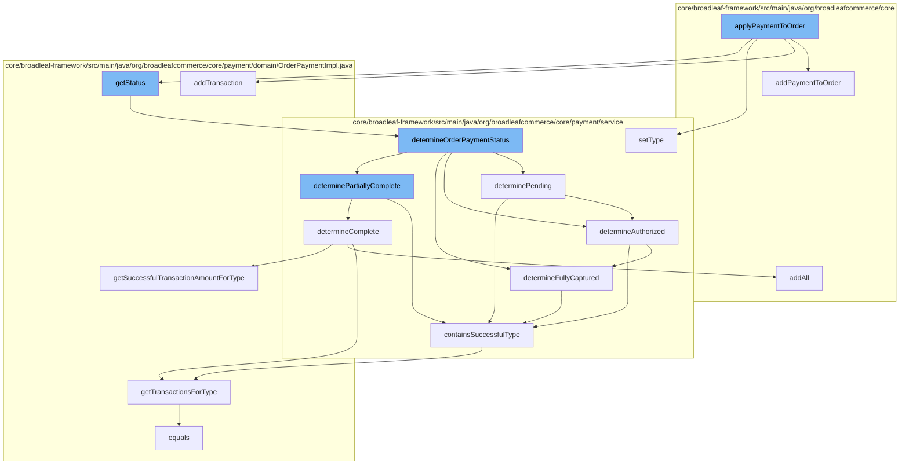

This document will cover the process of applying a payment to an order in the BroadleafCommerce-demo repository. We'll cover the following steps:

1. Adding the payment to the order
2. Determining the status of the order payment
3. Checking if the payment is pending
4. Checking if the payment is authorized
5. Checking if the payment is fully captured



<SwmSnippet path="/core/broadleaf-framework/src/main/java/org/broadleafcommerce/core/order/service/OrderServiceImpl.java" line="310">

---

# Adding the payment to the order

The function `addPaymentToOrder` is used to add a payment to an order. It sets the order for the payment, adds the payment to the order's payments, and persists the order. If there is secure payment information, it is saved using the `securePaymentInfoService`.

```java
    @Override
    @Transactional("blTransactionManager")
    public OrderPayment addPaymentToOrder(Order order, OrderPayment payment, Referenced securePaymentInfo) {
        payment.setOrder(order);
        order.getPayments().add(payment);
        order = persist(order);
        int paymentIndex = order.getPayments().size() - 1;

        if (securePaymentInfo != null) {
            securePaymentInfoService.save(securePaymentInfo);
        }

        return order.getPayments().get(paymentIndex);
    }
```

---

</SwmSnippet>

<SwmSnippet path="/core/broadleaf-framework/src/main/java/org/broadleafcommerce/core/payment/service/OrderPaymentStatusServiceImpl.java" line="32">

---

# Determining the status of the order payment

The function `determineOrderPaymentStatus` is used to determine the status of the order payment. It checks if the order payment is complete, fully captured, partially complete, authorized, pending, or unconfirmed, and returns the corresponding status.

```java
    @Override
    public OrderPaymentStatus determineOrderPaymentStatus(OrderPayment orderPayment) {

        if (determineComplete(orderPayment)) {
            return OrderPaymentStatus.COMPLETE;
        }else if (determineFullyCaptured(orderPayment)) {
            return OrderPaymentStatus.FULLY_CAPTURED;
        } else if (determinePartiallyComplete(orderPayment)) {
            return OrderPaymentStatus.PARTIALLY_COMPLETE;
        } else if (determineAuthorized(orderPayment)) {
            return OrderPaymentStatus.AUTHORIZED;
        } else if (determinePending(orderPayment)) {
            return OrderPaymentStatus.PENDING;
        } else if (determineUnconfirmed(orderPayment)) {
            return OrderPaymentStatus.UNCONFIRMED;
        }

        return OrderPaymentStatus.UNDETERMINED;
    }
```

---

</SwmSnippet>

<SwmSnippet path="/core/broadleaf-framework/src/main/java/org/broadleafcommerce/core/payment/service/OrderPaymentStatusServiceImpl.java" line="108">

---

# Checking if the payment is pending

The function `determinePending` checks if the payment is pending. It returns true if the payment is not authorized and contains a successful transaction of type PENDING.

```java
    protected boolean determinePending(OrderPayment payment) {
        return !determineAuthorized(payment) &&
                !containsSuccessfulType(payment, PaymentTransactionType.AUTHORIZE_AND_CAPTURE) &&
                containsSuccessfulType(payment, PaymentTransactionType.PENDING);
    }
```

---

</SwmSnippet>

<SwmSnippet path="/core/broadleaf-framework/src/main/java/org/broadleafcommerce/core/payment/service/OrderPaymentStatusServiceImpl.java" line="104">

---

# Checking if the payment is authorized

The function `determineAuthorized` checks if the payment is authorized. It returns true if the payment is not fully captured and contains a successful transaction of type AUTHORIZE.

```java
    protected boolean determineAuthorized(OrderPayment payment) {
        return !determineFullyCaptured(payment) && containsSuccessfulType(payment, PaymentTransactionType.AUTHORIZE);
    }
```

---

</SwmSnippet>

<SwmSnippet path="/core/broadleaf-framework/src/main/java/org/broadleafcommerce/core/payment/service/OrderPaymentStatusServiceImpl.java" line="96">

---

# Checking if the payment is fully captured

The function `determineFullyCaptured` checks if the payment is fully captured. It returns true if the payment contains a successful transaction of type AUTHORIZE_AND_CAPTURE or if the full authorization amount is greater than zero and equals the full capture amount.

```java
    protected boolean determineFullyCaptured(OrderPayment payment) {
        Money fullAuthAmount = payment.getSuccessfulTransactionAmountForType(PaymentTransactionType.AUTHORIZE);
        Money fullCaptureAmount = payment.getSuccessfulTransactionAmountForType(PaymentTransactionType.CAPTURE);

        return containsSuccessfulType(payment, PaymentTransactionType.AUTHORIZE_AND_CAPTURE) ||
                (fullAuthAmount.greaterThan(Money.ZERO) && fullAuthAmount.equals(fullCaptureAmount));
    }
```

---

</SwmSnippet>

&nbsp;

*This is an auto-generated document by Swimm AI 🌊 and has not yet been verified by a human*

<SwmMeta version="3.0.0" repo-id="Z2l0aHViJTNBJTNBQnJvYWRsZWFmQ29tbWVyY2UtZGVtbyUzQSUzQWdpbGFkbmF2b3Q=" repo-name="BroadleafCommerce-demo" doc-type="flows"><sup>Powered by [Swimm](/)</sup></SwmMeta>
