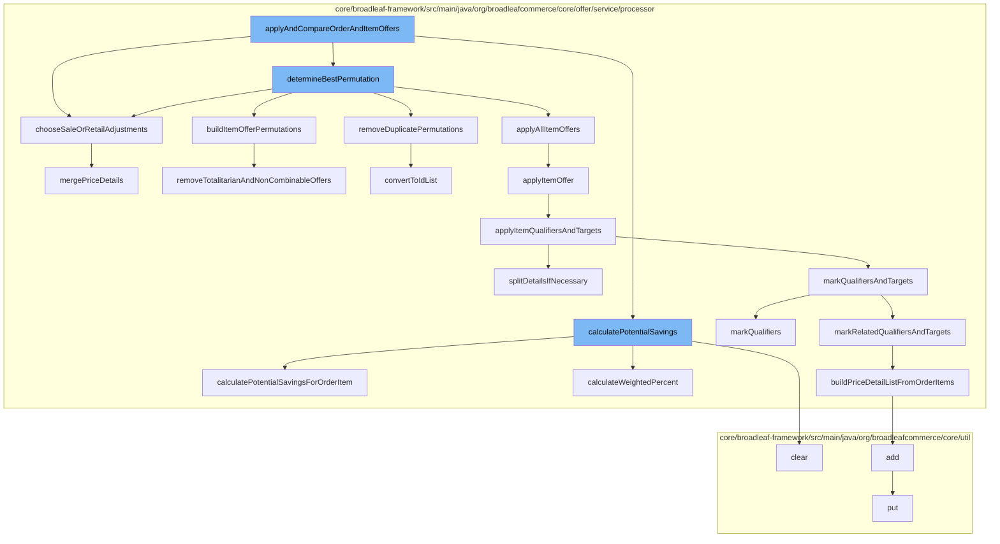

This document will cover the process of applying and comparing order and item offers in the BroadleafCommerce-demo project. We'll cover:

 1. The initiation of the process with the function `applyAndCompareOrderAndItemOffers`
 2. The calculation of potential savings
 3. The determination of the best permutation of offers
 4. The application of all item offers
 5. The application of individual item offers
 6. The marking of qualifiers and targets for the offers
 7. The building of price detail list from order items
 8. The addition of price details to the cache
 9. The removal of duplicate permutations
10. The removal of totalitarian and non-combinable offers
11. The merging of price details
12. The calculation of potential savings for order items.



<SwmSnippet path="/core/broadleaf-framework/src/main/java/org/broadleafcommerce/core/offer/service/processor/ItemOfferProcessorImpl.java" line="452">

---

# Initiation of the process

The process begins with the function `applyAndCompareOrderAndItemOffers`. This function is responsible for initiating the process of applying and comparing order and item offers. It calls several other functions to perform specific tasks.

```java
    /**
     * This method determines the potential savings for each item offer as if it was the only item offer being applied.
     * @param itemOffers
     * @param order
     */
    protected void calculatePotentialSavings(List<PromotableCandidateItemOffer> itemOffers, PromotableOrder order) {
        if (itemOffers.size() > 1) {
            for (PromotableCandidateItemOffer itemOffer : itemOffers) {
                Money potentialSavings = new Money(order.getOrderCurrency());
                Offer offer = itemOffer.getOffer();
                BigDecimal calculatedWeightedPercent = new BigDecimal(0);
                markQualifiersAndTargets(order, itemOffer);
                for (PromotableOrderItemPriceDetail detail : order.getAllPromotableOrderItemPriceDetails()) {
                    PromotableOrderItem item = detail.getPromotableOrderItem();
                    for (PromotionDiscount discount : detail.getPromotionDiscounts()) {
                        Money itemSavings = calculatePotentialSavingsForOrderItem(itemOffer, item, discount.getQuantity());
                        potentialSavings = potentialSavings.add(itemSavings);
                        if (useCalculatePercent(offer)) {
                            BigDecimal discountPercent = calculatePercent(item.calculateTotalWithoutAdjustments(), itemSavings);
                            calculatedWeightedPercent = calculatedWeightedPercent.add(discountPercent);
                        } else if (hasQualifierAndQualifierRestricted(offer)) {
```

---

</SwmSnippet>

<SwmSnippet path="/core/broadleaf-framework/src/main/java/org/broadleafcommerce/core/offer/service/processor/ItemOfferProcessorImpl.java" line="457">

---

# Calculation of potential savings

The function `calculatePotentialSavings` is called to determine the potential savings for each item offer as if it was the only item offer being applied.

```java
    protected void calculatePotentialSavings(List<PromotableCandidateItemOffer> itemOffers, PromotableOrder order) {
        if (itemOffers.size() > 1) {
            for (PromotableCandidateItemOffer itemOffer : itemOffers) {
                Money potentialSavings = new Money(order.getOrderCurrency());
                Offer offer = itemOffer.getOffer();
                BigDecimal calculatedWeightedPercent = new BigDecimal(0);
                markQualifiersAndTargets(order, itemOffer);
                for (PromotableOrderItemPriceDetail detail : order.getAllPromotableOrderItemPriceDetails()) {
                    PromotableOrderItem item = detail.getPromotableOrderItem();
                    for (PromotionDiscount discount : detail.getPromotionDiscounts()) {
                        Money itemSavings = calculatePotentialSavingsForOrderItem(itemOffer, item, discount.getQuantity());
                        potentialSavings = potentialSavings.add(itemSavings);
                        if (useCalculatePercent(offer)) {
                            BigDecimal discountPercent = calculatePercent(item.calculateTotalWithoutAdjustments(), itemSavings);
                            calculatedWeightedPercent = calculatedWeightedPercent.add(discountPercent);
                        } else if (hasQualifierAndQualifierRestricted(offer)) {
                            BigDecimal discountPercent = calculateWeightedPercent(discount, item, itemSavings);
                            calculatedWeightedPercent = calculatedWeightedPercent.add(discountPercent);
                        }
                    }
                    // Reset state back for next offer
```

---

</SwmSnippet>

<SwmSnippet path="/core/broadleaf-framework/src/main/java/org/broadleafcommerce/core/offer/service/processor/ItemOfferProcessorImpl.java" line="570">

---

# Determination of the best permutation of offers

The function `determineBestPermutation` is called to determine the best permutation of offers. It calls several other functions to build item offer permutations, remove duplicate permutations, and apply all item offers.

```java
    /**
     * This method could be overridden to potentially run all permutations of offers.
     * A reasonable alternative is to have a permutation with nonCombinable offers
     * and another with combinable offers. 
     *
     * @param offers
     * @return
     */
    protected List<List<PromotableCandidateItemOffer>> buildItemOfferPermutations(
            List<PromotableCandidateItemOffer> offers) {
        List<List<PromotableCandidateItemOffer>> listOfOfferLists = new ArrayList<List<PromotableCandidateItemOffer>>();
        // add the default list
        listOfOfferLists.add(offers);
        
        if (offers.size() > 1) {
            listOfOfferLists.add(getPermutationByComparator(offers, ItemOfferQtyOneComparator.INSTANCE));
            listOfOfferLists.add(getPermutationByComparator(offers, ItemOfferWeightedPercentComparator.INSTANCE));
        }

        if (offerListStartsWithNonCombinable(offers)) {
            removeTotalitarianAndNonCombinableOffers(offers, listOfOfferLists);
```

---

</SwmSnippet>

<SwmSnippet path="/core/broadleaf-framework/src/main/java/org/broadleafcommerce/core/offer/service/processor/ItemOfferProcessorImpl.java" line="230">

---

# Application of all item offers

The function `applyAllItemOffers` is called to apply all item offers. It calls the function `applyItemOffer` to apply individual item offers.

```java
    protected void applyItemOffer(PromotableOrder order, PromotableCandidateItemOffer itemOffer) {
        if (applyItemOfferExtension(order, itemOffer)) {
            if (offerServiceUtilities.itemOfferCanBeApplied(itemOffer, order.getAllPromotableOrderItemPriceDetails())) {
                applyItemQualifiersAndTargets(itemOffer, order);
                applyAdjustments(order, itemOffer);
            }
        }
    }
```

---

</SwmSnippet>

<SwmSnippet path="/core/broadleaf-framework/src/main/java/org/broadleafcommerce/core/offer/service/processor/ItemOfferProcessorImpl.java" line="230">

---

# Application of individual item offers

The function `applyItemOffer` is called to apply individual item offers. It calls the function `applyItemQualifiersAndTargets` to apply item qualifiers and targets.

```java
    protected void applyItemOffer(PromotableOrder order, PromotableCandidateItemOffer itemOffer) {
        if (applyItemOfferExtension(order, itemOffer)) {
            if (offerServiceUtilities.itemOfferCanBeApplied(itemOffer, order.getAllPromotableOrderItemPriceDetails())) {
                applyItemQualifiersAndTargets(itemOffer, order);
                applyAdjustments(order, itemOffer);
            }
        }
    }
```

---

</SwmSnippet>

<SwmSnippet path="/core/broadleaf-framework/src/main/java/org/broadleafcommerce/core/offer/service/processor/ItemOfferProcessorImpl.java" line="269">

---

# Marking of qualifiers and targets for the offers

The function `markQualifiersAndTargets` is called to mark qualifiers and targets for the offers. It calls the function `splitDetailsIfNecessary` to split price details if necessary.

```java
    protected void applyItemQualifiersAndTargets(PromotableCandidateItemOffer itemOffer, PromotableOrder order) {
        markQualifiersAndTargets(order, itemOffer);
        splitDetailsIfNecessary(order.getAllPromotableOrderItemPriceDetails());
    }
```

---

</SwmSnippet>

<SwmSnippet path="/core/broadleaf-framework/src/main/java/org/broadleafcommerce/core/offer/service/processor/ItemOfferProcessorImpl.java" line="274">

---

# Building of price detail list from order items

The function `buildPriceDetailListFromOrderItems` is called to build a list of price details from order items. It calls the function `add` to add price details to the cache.

```java
    protected List<PromotableOrderItemPriceDetail> buildPriceDetailListFromOrderItems(List<PromotableOrderItem> items) {
        List<PromotableOrderItemPriceDetail> itemPriceDetails = new ArrayList<PromotableOrderItemPriceDetail>();
        for (PromotableOrderItem item : items) {
            for (PromotableOrderItemPriceDetail detail : item.getPromotableOrderItemPriceDetails()) {
                itemPriceDetails.add(detail);
            }
        }
        return itemPriceDetails;
    }
```

---

</SwmSnippet>

<SwmSnippet path="/core/broadleaf-framework/src/main/java/org/broadleafcommerce/core/util/service/ResourcePurgeServiceImpl.java" line="593">

---

# Addition of price details to the cache

The function `add` is called to add price details to the cache. It calls the function `put` to put the price details in the cache.

```java
        public Long add(Long entry) {
            if (! cache.containsKey(entry)) {
                return cache.put(entry, new Long(System.currentTimeMillis()));
            }
            return null;
        }
```

---

</SwmSnippet>

<SwmSnippet path="/core/broadleaf-framework/src/main/java/org/broadleafcommerce/core/offer/service/processor/ItemOfferProcessorImpl.java" line="679">

---

# Removal of duplicate permutations

The function `removeDuplicatePermutations` is called to remove duplicate permutations of offers. It calls the function `convertToIdList` to convert the offer list to a list of IDs.

```java
    protected List<Long> convertToIdList(List<PromotableCandidateItemOffer> offerList) {
        List<Long> idList = new ArrayList<>();
        for (PromotableCandidateItemOffer offer : offerList) {
            idList.add(offer.getOffer().getId());
        }

        return idList;
    }
```

---

</SwmSnippet>

<SwmSnippet path="/core/broadleaf-framework/src/main/java/org/broadleafcommerce/core/offer/service/processor/ItemOfferProcessorImpl.java" line="596">

---

# Removal of totalitarian and non-combinable offers

The function `removeTotalitarianAndNonCombinableOffers` is called to remove totalitarian and non-combinable offers from the list of offers.

```java
    protected void removeTotalitarianAndNonCombinableOffers(List<PromotableCandidateItemOffer> offers, List<List<PromotableCandidateItemOffer>> listOfOfferLists) {
        List<PromotableCandidateItemOffer> listWithoutTotalitarianOrNonCombinables =
                new ArrayList<PromotableCandidateItemOffer>(offers);

        Iterator<PromotableCandidateItemOffer> offerIterator = listWithoutTotalitarianOrNonCombinables.iterator();
        while (offerIterator.hasNext()) {
            PromotableCandidateItemOffer offer = offerIterator.next();
            if (offer.getOffer().isTotalitarianOffer() || !offer.getOffer().isCombinableWithOtherOffers()) {
                offerIterator.remove();
            }
        }

        if (listWithoutTotalitarianOrNonCombinables.size() > 0) {
            listOfOfferLists.add(listWithoutTotalitarianOrNonCombinables);
        }
    }
```

---

</SwmSnippet>

<SwmSnippet path="/core/broadleaf-framework/src/main/java/org/broadleafcommerce/core/offer/service/processor/ItemOfferProcessorImpl.java" line="255">

---

# Merging of price details

The function `mergePriceDetails` is called to merge price details. It checks if any price details need to be combined and if so, combines them.

```java
    /**
     * Checks to see if any priceDetails need to be combined and if so, combines them.
     * 
     * @param order
     * @return
     */
    protected void mergePriceDetails(PromotableOrder order) {
        List<PromotableOrderItem> items = order.getAllOrderItems();
        for (PromotableOrderItem item : items) {
            item.mergeLikeDetails();
        }
    }
```

---

</SwmSnippet>

<SwmSnippet path="/core/broadleaf-framework/src/main/java/org/broadleafcommerce/core/offer/service/processor/ItemOfferProcessorImpl.java" line="418">

---

# Calculation of potential savings for order items

The function `calculatePotentialSavingsForOrderItem` is called to calculate the potential savings for order items. It provides an opportunity for modules to override the potential savings calculation.

```java
    /**
     * Provide an opportunity to for modules to override the potentialSavingsCalculation 
     * @param itemOffer
     * @param item
     * @param quantity
     * @return
     */
    protected Money calculatePotentialSavingsForOrderItem(PromotableCandidateItemOffer itemOffer,
            PromotableOrderItem item, int quantity) {
        if (extensionManager != null) {
            Map<String,Object> contextMap = new HashMap<String,Object>();
            extensionManager.calculatePotentialSavings(itemOffer, item, quantity, contextMap);

            // If the extensionHandler added a savings element to the map, then return it 
            Object o = contextMap.get("savings");
            if (o != null && o instanceof Money) {
                return (Money) o;
            }
            
            // If the extensionHandler added a quantity element to the map, then return it 
            o = contextMap.get("quantity");
```

---

</SwmSnippet>

&nbsp;

*This is an auto-generated document by Swimm AI 🌊 and has not yet been verified by a human*

<SwmMeta version="3.0.0" repo-id="Z2l0aHViJTNBJTNBQnJvYWRsZWFmQ29tbWVyY2UtZGVtbyUzQSUzQWdpbGFkbmF2b3Q=" repo-name="BroadleafCommerce-demo" doc-type="flows"><sup>Powered by [Swimm](/)</sup></SwmMeta>
