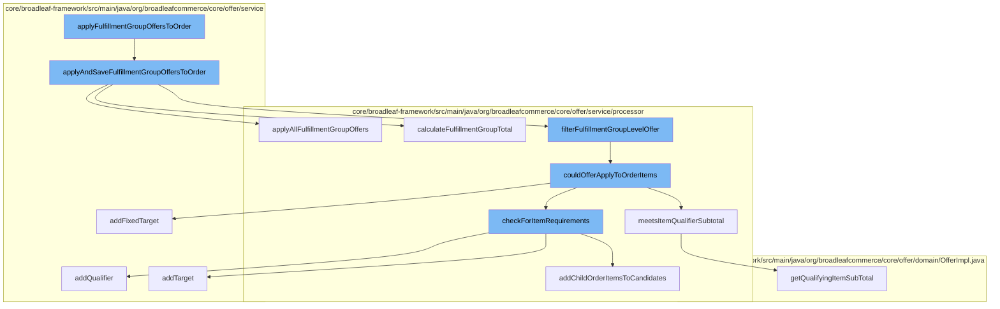

This document will cover the process of applying and saving fulfillment group offers to an order in the BroadleafCommerce-demo repository. The process includes the following steps:

1. Invoking the `applyFulfillmentGroupOffersToOrder` function.
2. Calling the `applyAndSaveFulfillmentGroupOffersToOrder` function.
3. Executing the `applyAllFulfillmentGroupOffers` function.
4. Filtering fulfillment group level offers.
5. Checking if an offer could apply to order items.
6. Checking for item requirements.
7. Calculating the qualifying item subtotal.



<SwmSnippet path="/core/broadleaf-framework/src/main/java/org/broadleafcommerce/core/offer/service/OfferServiceImpl.java" line="488">

---

# Invoking the `applyFulfillmentGroupOffersToOrder` function

The `applyFulfillmentGroupOffersToOrder` function is the entry point for the process. It is responsible for initiating the application of fulfillment group offers to an order.

```java
    @Override
    @Transactional("blTransactionManager")
    public Order applyAndSaveFulfillmentGroupOffersToOrder(List<Offer> offers, Order order) throws PricingException {
        OfferContext offerContext = OfferContext.getOfferContext();
        if (offerContext == null || offerContext.executePromotionCalculation) {
            PromotableOrder promotableOrder =
                    promotableItemFactory.createPromotableOrder(order, true);
            List<Offer> possibleFGOffers = new ArrayList<Offer>();
            for (Offer offer : offers) {
                if (offer.getType().getType().equals(OfferType.FULFILLMENT_GROUP.getType())) {
                    possibleFGOffers.add(offer);
                }
            }
            List<Offer> filteredOffers = orderOfferProcessor.filterOffers(possibleFGOffers, order.getCustomer());
            List<PromotableCandidateFulfillmentGroupOffer> qualifiedFGOffers = new ArrayList<PromotableCandidateFulfillmentGroupOffer>();
            for (Offer offer : filteredOffers) {
                fulfillmentGroupOfferProcessor.filterFulfillmentGroupLevelOffer(promotableOrder, qualifiedFGOffers, offer);
            }
            if (!qualifiedFGOffers.isEmpty()) {
                fulfillmentGroupOfferProcessor.applyAllFulfillmentGroupOffers(qualifiedFGOffers, promotableOrder);
                fulfillmentGroupOfferProcessor.calculateFulfillmentGroupTotal(promotableOrder);
```

---

</SwmSnippet>

<SwmSnippet path="/core/broadleaf-framework/src/main/java/org/broadleafcommerce/core/offer/service/OfferServiceImpl.java" line="490">

---

# Calling the `applyAndSaveFulfillmentGroupOffersToOrder` function

The `applyAndSaveFulfillmentGroupOffersToOrder` function is called next. It applies the offers to the order and saves the changes.

```java
    public Order applyAndSaveFulfillmentGroupOffersToOrder(List<Offer> offers, Order order) throws PricingException {
        OfferContext offerContext = OfferContext.getOfferContext();
        if (offerContext == null || offerContext.executePromotionCalculation) {
            PromotableOrder promotableOrder =
                    promotableItemFactory.createPromotableOrder(order, true);
            List<Offer> possibleFGOffers = new ArrayList<Offer>();
            for (Offer offer : offers) {
                if (offer.getType().getType().equals(OfferType.FULFILLMENT_GROUP.getType())) {
                    possibleFGOffers.add(offer);
                }
            }
            List<Offer> filteredOffers = orderOfferProcessor.filterOffers(possibleFGOffers, order.getCustomer());
            List<PromotableCandidateFulfillmentGroupOffer> qualifiedFGOffers = new ArrayList<PromotableCandidateFulfillmentGroupOffer>();
            for (Offer offer : filteredOffers) {
                fulfillmentGroupOfferProcessor.filterFulfillmentGroupLevelOffer(promotableOrder, qualifiedFGOffers, offer);
            }
            if (!qualifiedFGOffers.isEmpty()) {
                fulfillmentGroupOfferProcessor.applyAllFulfillmentGroupOffers(qualifiedFGOffers, promotableOrder);
                fulfillmentGroupOfferProcessor.calculateFulfillmentGroupTotal(promotableOrder);
                orderOfferProcessor.synchronizeAdjustmentsAndPrices(promotableOrder);
                order.setSubTotal(order.calculateSubTotal());
```

---

</SwmSnippet>

<SwmSnippet path="/core/broadleaf-framework/src/main/java/org/broadleafcommerce/core/offer/service/processor/FulfillmentGroupOfferProcessorImpl.java" line="165">

---

# Executing the `applyAllFulfillmentGroupOffers` function

The `applyAllFulfillmentGroupOffers` function is then executed. It applies all the fulfillment group offers to the order.

```java
    @Override
    @SuppressWarnings("unchecked")
    public boolean applyAllFulfillmentGroupOffers(List<PromotableCandidateFulfillmentGroupOffer> qualifiedFGOffers, PromotableOrder order) {
        Map<FulfillmentGroupOfferPotential, List<PromotableCandidateFulfillmentGroupOffer>> offerMap = new HashMap<FulfillmentGroupOfferPotential, List<PromotableCandidateFulfillmentGroupOffer>>();
        for (PromotableCandidateFulfillmentGroupOffer candidate : qualifiedFGOffers) {
            FulfillmentGroupOfferPotential potential = new FulfillmentGroupOfferPotential();
            potential.setOffer(candidate.getOffer());
            if (offerMap.get(potential) == null) {
                offerMap.put(potential, new ArrayList<PromotableCandidateFulfillmentGroupOffer>());
            }
            offerMap.get(potential).add(candidate);
        }
        List<FulfillmentGroupOfferPotential> potentials = new ArrayList<FulfillmentGroupOfferPotential>();
        for (FulfillmentGroupOfferPotential potential : offerMap.keySet()) {
            List<PromotableCandidateFulfillmentGroupOffer> fgOffers = offerMap.get(potential);
            Collections.sort(fgOffers, new ReverseComparator(new BeanComparator("discountedAmount", new NullComparator())));
            Collections.sort(fgOffers, new BeanComparator("priority", new NullComparator()));

            if (potential.getOffer().isLimitedUsePerOrder() && fgOffers.size() > potential.getOffer().getMaxUsesPerOrder()) {
                for (int j = potential.getOffer().getMaxUsesPerOrder(); j < fgOffers.size(); j++) {
                    fgOffers.remove(j);
```

---

</SwmSnippet>

<SwmSnippet path="/core/broadleaf-framework/src/main/java/org/broadleafcommerce/core/offer/service/processor/FulfillmentGroupOfferProcessorImpl.java" line="503">

---

# Filtering fulfillment group level offers

The `filterFulfillmentGroupLevelOffer` function is called to filter the offers at the fulfillment group level.

```java

```

---

</SwmSnippet>

<SwmSnippet path="/core/broadleaf-framework/src/main/java/org/broadleafcommerce/core/offer/service/processor/AbstractBaseProcessor.java" line="86">

---

# Checking if an offer could apply to order items

The `couldOfferApplyToOrderItems` function checks if an offer could apply to the items in the order.

```java
    protected CandidatePromotionItems couldOfferApplyToOrderItems(Offer offer, List<PromotableOrderItem> promotableOrderItems) {
        CandidatePromotionItems candidates = new CandidatePromotionItems();
        if (offer.getQualifyingItemCriteriaXref() == null || offer.getQualifyingItemCriteriaXref().size() == 0) {
            candidates.setMatchedQualifier(true);
        } else {
            for (OfferQualifyingCriteriaXref criteriaXref : offer.getQualifyingItemCriteriaXref()) {
                if (criteriaXref.getOfferItemCriteria() != null) {
                    checkForItemRequirements(offer, candidates, criteriaXref.getOfferItemCriteria(), promotableOrderItems, true);
                    if (!candidates.isMatchedQualifier()) {
                        break;
                    }
                }
            }           
        }

        if (offer.getType().equals(OfferType.ORDER_ITEM) && BooleanUtils.isTrue(offer.getUseListForDiscounts())) {
            for (OfferPriceData offerPriceData : offer.getOfferPriceData()) {
                PromotableOrderItem qualifyingOrderItem = findQualifyingItemForPriceData(offerPriceData, promotableOrderItems);
                if (qualifyingOrderItem != null) {
                    candidates.addFixedTarget(offerPriceData, qualifyingOrderItem);
                    candidates.setMatchedTarget(true);
```

---

</SwmSnippet>

<SwmSnippet path="/core/broadleaf-framework/src/main/java/org/broadleafcommerce/core/offer/service/processor/AbstractBaseProcessor.java" line="210">

---

# Checking for item requirements

The `checkForItemRequirements` function checks if the items in the order meet the requirements for the offer.

```java
    protected void checkForItemRequirements(Offer offer, CandidatePromotionItems candidates, OfferItemCriteria criteria, List<PromotableOrderItem> promotableOrderItems, boolean isQualifier) {
        boolean matchFound = false;
        int criteriaQuantity = criteria.getQuantity();
        int matchedQuantity = 0;

        if (criteriaQuantity > 0) {
            // If matches are found, add the candidate items to a list and store it with the itemCriteria
            // for this promotion.
            for (PromotableOrderItem item : promotableOrderItems) {
                if (couldOrderItemMeetOfferRequirement(criteria, item)) {
                    if (isQualifier) {
                        candidates.addQualifier(criteria, item);
                    } else {
                        candidates.addTarget(criteria, item);
                        addChildOrderItemsToCandidates(offer, candidates, criteria, promotableOrderItems, item);
                    }
                    matchedQuantity += item.getQuantity();
                }
            }
            matchFound = (matchedQuantity >= criteriaQuantity);
        }
```

---

</SwmSnippet>

<SwmSnippet path="/core/broadleaf-framework/src/main/java/org/broadleafcommerce/core/offer/domain/OfferImpl.java" line="756">

---

# Calculating the qualifying item subtotal

The `getQualifyingItemSubTotal` function calculates the subtotal for the qualifying items in the order.

```java
    @Override
    public Money getQualifyingItemSubTotal() {
        return qualifyingItemSubTotal == null ? null : BroadleafCurrencyUtils.getMoney(qualifyingItemSubTotal, null);
    }
```

---

</SwmSnippet>

&nbsp;

*This is an auto-generated document by Swimm AI 🌊 and has not yet been verified by a human*

<SwmMeta version="3.0.0" repo-id="Z2l0aHViJTNBJTNBQnJvYWRsZWFmQ29tbWVyY2UtZGVtbyUzQSUzQWdpbGFkbmF2b3Q=" repo-name="BroadleafCommerce-demo" doc-type="flows"><sup>Powered by [Swimm](/)</sup></SwmMeta>
