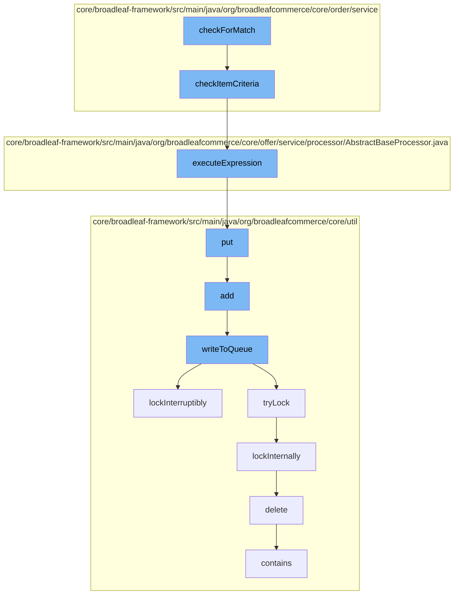

This document will cover the process of applying cart rules in the BroadleafCommerce-demo project. We'll cover:

1. Checking for a match in cart rules
2. Checking item criteria
3. Executing the rule expression
4. Adding the result to a distributed queue
5. Locking the queue for thread-safe operations
6. Deleting the lock once operations are done.



<SwmSnippet path="/core/broadleaf-framework/src/main/java/org/broadleafcommerce/core/order/service/PageCartRuleProcessor.java" line="1">

---

# Checking for a match in cart rules

The `checkForMatch` function in `PageCartRuleProcessor.java` is the entry point for the cart rule application process. It checks if the current cart matches any of the defined cart rules.

```java
/*-
 * #%L
 * BroadleafCommerce Framework
 * %%
 * Copyright (C) 2009 - 2024 Broadleaf Commerce
 * %%
 * Licensed under the Broadleaf Fair Use License Agreement, Version 1.0
 * (the "Fair Use License" located  at http://license.broadleafcommerce.org/fair_use_license-1.0.txt)
 * unless the restrictions on use therein are violated and require payment to Broadleaf in which case
 * the Broadleaf End User License Agreement (EULA), Version 1.1
 * (the "Commercial License" located at http://license.broadleafcommerce.org/commercial_license-1.1.txt)
 * shall apply.
 * 
 * Alternatively, the Commercial License may be replaced with a mutually agreed upon license (the "Custom License")
 * between you and Broadleaf Commerce. You may not use this file except in compliance with the applicable license.
 * #L%
 */
package org.broadleafcommerce.core.order.service;

import java.util.List;
import java.util.Map;
```

---

</SwmSnippet>

<SwmSnippet path="/core/broadleaf-framework/src/main/java/org/broadleafcommerce/core/order/service/AbstractCartRuleProcessor.java" line="46">

---

# Checking item criteria

The `checkItemCriteria` function is called by `checkForMatch`. It checks if the items in the cart meet the criteria defined in the cart rule.

```java
    protected boolean checkItemCriteria(ItemCriteriaDTO itemCriteria, List<OrderItem> orderItems) {
        Map<String,Object> vars = new HashMap<String, Object>();
        int foundCount = 0;
        Iterator<OrderItem> items = orderItems.iterator();
        while (foundCount < itemCriteria.getQty() && items.hasNext()) {
            OrderItem currentItem = items.next();
            vars.put("discreteOrderItem", currentItem);
            vars.put("orderItem", currentItem);
            boolean match = executeExpression(itemCriteria.getMatchRule(), vars);

            if (match) {
                foundCount = foundCount + currentItem.getQuantity();
            }
        }
        return (foundCount >= itemCriteria.getQty().intValue());
    }
```

---

</SwmSnippet>

<SwmSnippet path="/core/broadleaf-framework/src/main/java/org/broadleafcommerce/core/offer/service/processor/AbstractBaseProcessor.java" line="283">

---

# Executing the rule expression

The `executeExpression` function is called by `checkItemCriteria`. It evaluates the rule expression to determine if the cart rule can be applied.

```java
    /**
     * Private method used by couldOfferApplyToOrder to execute the MVEL expression in the
     * appliesToOrderRules to determine if this offer can be applied.
     *
     * @param expression
     * @param vars
     * @return a Boolean object containing the result of executing the MVEL expression
     */
    public Boolean executeExpression(String expression, Map<String, Object> vars) {
        Map<String, Class<?>> contextImports = new HashMap<>();

        expression = usePriceBeforeAdjustments(expression);
        contextImports.put("OfferType", OfferType.class);
        contextImports.put("FulfillmentType", FulfillmentType.class);
        return MvelHelper.evaluateRule(expression, vars, EXPRESSION_CACHE, contextImports);

    }
```

---

</SwmSnippet>

<SwmSnippet path="/core/broadleaf-framework/src/main/java/org/broadleafcommerce/core/util/queue/ZookeeperDistributedQueue.java" line="393">

---

# Adding the result to a distributed queue

The `put` function is called by `executeExpression`. It adds the result of the rule evaluation to a distributed queue for further processing.

```java
    @Override
    public void put(T e) throws InterruptedException {
        final ArrayList<T> elementsToAdd = new ArrayList<>();
        elementsToAdd.add(e);
        writeToQueue(elementsToAdd, -1L);
    }
```

---

</SwmSnippet>

<SwmSnippet path="/core/broadleaf-framework/src/main/java/org/broadleafcommerce/core/util/lock/ReentrantDistributedZookeeperLock.java" line="335">

---

# Locking the queue for thread-safe operations

The `lockInterruptibly` function is called by `writeToQueue`. It locks the queue to ensure thread-safe operations.

```java
    @Override
    public void lockInterruptibly() throws InterruptedException {
        if (Thread.interrupted()) {
            throw new InterruptedException("Thread was interrupted prior to trying to acquire the lock.");
        }
        
        lockInternally(-1L);
    }
```

---

</SwmSnippet>

<SwmSnippet path="/core/broadleaf-framework/src/main/java/org/broadleafcommerce/core/util/dao/CodeTypeDaoImpl.java" line="51">

---

# Deleting the lock once operations are done

The `delete` function is called by `lockInternally`. It deletes the lock once the operations on the queue are done.

```java
    public void delete(CodeType codeType) {
        if (!em.contains(codeType)) {
            codeType = (CodeType) em.find(CodeTypeImpl.class, codeType.getId());
        }
        em.remove(codeType);
    }
```

---

</SwmSnippet>

&nbsp;

*This is an auto-generated document by Swimm AI 🌊 and has not yet been verified by a human*

<SwmMeta version="3.0.0" repo-id="Z2l0aHViJTNBJTNBQnJvYWRsZWFmQ29tbWVyY2UtZGVtbyUzQSUzQWdpbGFkbmF2b3Q=" repo-name="BroadleafCommerce-demo" doc-type="flows"><sup>Powered by [Swimm](/)</sup></SwmMeta>
