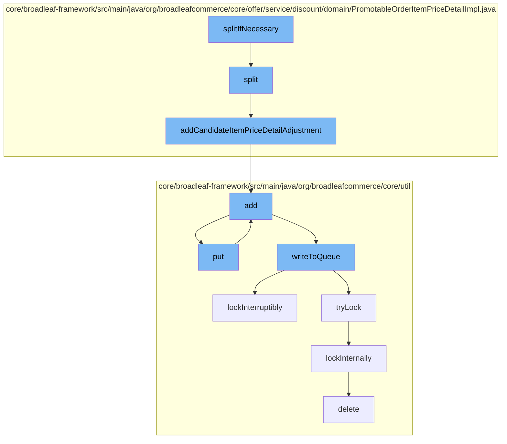

This document will cover the process of applying discounts to order items in the BroadleafCommerce-demo repository. The process includes the following steps:

1. Splitting the order item if necessary
2. Adding the item price detail adjustment
3. Adding the adjustment to the cache
4. Writing the adjustment to the queue
5. Locking the queue for writing
6. Deleting the lock once the writing is done.



<SwmSnippet path="/core/broadleaf-framework/src/main/java/org/broadleafcommerce/core/offer/service/discount/domain/PromotableOrderItemPriceDetailImpl.java" line="548">

---

# Splitting the order item if necessary

The `split` method is used to split the order item if the quantity of the item is more than the discount quantity. It creates a new detail for the split item and copies the discounts and qualifiers from the original item to the new one.

```java
    protected PromotableOrderItemPriceDetail split(int discountQty, Long offerId, boolean hasQualifiers) {
        int originalQty = quantity;
        quantity = discountQty;

        int splitItemQty = originalQty - discountQty;

        // Create the new item with the correct quantity
        PromotableOrderItemPriceDetail newDetail = promotableOrderItem.createNewDetail(splitItemQty);

        // copy discounts
        for (PromotionDiscount existingDiscount : promotionDiscounts) {
            PromotionDiscount newDiscount = existingDiscount.split(discountQty);
            if (newDiscount != null) {
                newDetail.getPromotionDiscounts().add(newDiscount);
            }
        }

        if (hasQualifiers) {
            Iterator<PromotionQualifier> qualifiers = promotionQualifiers.iterator();
            while (qualifiers.hasNext()) {
                PromotionQualifier currentQualifier = qualifiers.next();
```

---

</SwmSnippet>

<SwmSnippet path="/core/broadleaf-framework/src/main/java/org/broadleafcommerce/core/offer/service/discount/domain/PromotableOrderItemPriceDetailImpl.java" line="61">

---

# Adding the item price detail adjustment

The `addCandidateItemPriceDetailAdjustment` method is used to add the item price detail adjustment to the list of adjustments for the order item.

```java
    @Override
    public void addCandidateItemPriceDetailAdjustment(PromotableOrderItemPriceDetailAdjustment itemAdjustment) {
        promotableOrderItemPriceDetailAdjustments.add(itemAdjustment);
    }
```

---

</SwmSnippet>

<SwmSnippet path="/core/broadleaf-framework/src/main/java/org/broadleafcommerce/core/util/service/ResourcePurgeServiceImpl.java" line="593">

---

# Adding the adjustment to the cache

The `add` method in `ResourcePurgeServiceImpl` is used to add the adjustment to the cache. If the adjustment is not already in the cache, it is added with the current time as the value.

```java
        public Long add(Long entry) {
            if (! cache.containsKey(entry)) {
                return cache.put(entry, new Long(System.currentTimeMillis()));
            }
            return null;
        }
```

---

</SwmSnippet>

<SwmSnippet path="/core/broadleaf-framework/src/main/java/org/broadleafcommerce/core/util/queue/ZookeeperDistributedQueue.java" line="503">

---

# Writing the adjustment to the queue

The `writeToQueue` method in `ZookeeperDistributedQueue` is used to write the adjustment to the queue. It locks the queue for writing, writes the adjustment, and then unlocks the queue.

```java
    protected int writeToQueue(List<? extends T> entries, final long timeout) throws InterruptedException {
        if (entries == null || entries.isEmpty()) {
            return 0;
        }
        
        int entryCount = 0;
        long waitTime = timeout;
        synchronized (QUEUE_MONITOR) {
            while (true) {
                boolean locked = false;
                DistributedLock lock = getQueueAccessLock();
                if (timeout < 0L) {
                    lock.lockInterruptibly();
                    locked = true;
                } else if (timeout > 0L && waitTime > 0L) {
                    long start = System.currentTimeMillis();
                    locked = lock.tryLock(waitTime, TimeUnit.MILLISECONDS);
                    long end = System.currentTimeMillis();
                    waitTime -= (end - start);
                } else {
                    locked = lock.tryLock();
```

---

</SwmSnippet>

<SwmSnippet path="/core/broadleaf-framework/src/main/java/org/broadleafcommerce/core/util/lock/ReentrantDistributedZookeeperLock.java" line="335">

---

# Locking the queue for writing

The `lockInterruptibly` method in `ReentrantDistributedZookeeperLock` is used to lock the queue for writing. If the thread is interrupted before trying to acquire the lock, an `InterruptedException` is thrown.

```java
    @Override
    public void lockInterruptibly() throws InterruptedException {
        if (Thread.interrupted()) {
            throw new InterruptedException("Thread was interrupted prior to trying to acquire the lock.");
        }
        
        lockInternally(-1L);
    }
```

---

</SwmSnippet>

<SwmSnippet path="/core/broadleaf-framework/src/main/java/org/broadleafcommerce/core/util/dao/CodeTypeDaoImpl.java" line="51">

---

# Deleting the lock once the writing is done

The `delete` method in `CodeTypeDaoImpl` is used to delete the lock once the writing to the queue is done.

```java
    public void delete(CodeType codeType) {
        if (!em.contains(codeType)) {
            codeType = (CodeType) em.find(CodeTypeImpl.class, codeType.getId());
        }
        em.remove(codeType);
    }
```

---

</SwmSnippet>

&nbsp;

*This is an auto-generated document by Swimm AI 🌊 and has not yet been verified by a human*

<SwmMeta version="3.0.0" repo-id="Z2l0aHViJTNBJTNBQnJvYWRsZWFmQ29tbWVyY2UtZGVtbyUzQSUzQWdpbGFkbmF2b3Q=" repo-name="BroadleafCommerce-demo" doc-type="flows"><sup>Powered by [Swimm](/)</sup></SwmMeta>
