This document will cover the process of applying fulfillment group offers to an order in the BroadleafCommerce-demo repository. The process includes the following steps:

1. Applying and saving fulfillment group offers to the order
2. Filtering fulfillment group level offers
3. Checking for item requirements
4. Adding child order items to candidates
5. Adding targets
6. Writing to the queue
7. Executing expressions

```mermaid
graph TD;
subgraph core/broadleaf-framework/src/main/java/org/broadleafcommerce/core/offer/service
  applyFulfillmentGroupOffersToOrder:::mainFlowStyle --> applyAndSaveFulfillmentGroupOffersToOrder
end
subgraph core/broadleaf-framework/src/main/java/org/broadleafcommerce/core/offer/service/processor
  applyAndSaveFulfillmentGroupOffersToOrder:::mainFlowStyle --> applyAllFulfillmentGroupOffers
end
subgraph core/broadleaf-framework/src/main/java/org/broadleafcommerce/core/offer/service/processor
  applyAndSaveFulfillmentGroupOffersToOrder:::mainFlowStyle --> calculateFulfillmentGroupTotal
end
subgraph core/broadleaf-framework/src/main/java/org/broadleafcommerce/core/offer/service/processor
  applyAndSaveFulfillmentGroupOffersToOrder:::mainFlowStyle --> filterFulfillmentGroupLevelOffer
end
subgraph core/broadleaf-framework/src/main/java/org/broadleafcommerce/core/offer/service/processor
  applyAllFulfillmentGroupOffers:::mainFlowStyle --> compareAndAdjustFulfillmentGroupOffers
end
subgraph core/broadleaf-framework/src/main/java/org/broadleafcommerce/core/offer/service/processor
  applyAllFulfillmentGroupOffers:::mainFlowStyle --> chooseSaleOrRetailAdjustments
end
subgraph core/broadleaf-framework/src/main/java/org/broadleafcommerce/core/offer/service/processor
  applyAllFulfillmentGroupOffers:::mainFlowStyle --> removeTrailingNotCombinableFulfillmentGroupOffers
end
subgraph core/broadleaf-framework/src/main/java/org/broadleafcommerce/core/offer/service/processor
  filterFulfillmentGroupLevelOffer:::mainFlowStyle --> couldOfferApplyToFulfillmentGroup
end
subgraph core/broadleaf-framework/src/main/java/org/broadleafcommerce/core/offer/service/processor
  filterFulfillmentGroupLevelOffer:::mainFlowStyle --> createCandidateFulfillmentGroupOffer
end
subgraph core/broadleaf-framework/src/main/java/org/broadleafcommerce/core/offer/service/processor
  filterFulfillmentGroupLevelOffer:::mainFlowStyle --> couldOfferApplyToOrderItems
end
subgraph core/broadleaf-framework/src/main/java/org/broadleafcommerce/core/offer/service/processor
  couldOfferApplyToFulfillmentGroup --> executeExpression
end
subgraph core/broadleaf-framework/src/main/java/org/broadleafcommerce/core/offer/service
  couldOfferApplyToOrderItems:::mainFlowStyle --> addFixedTarget
end
subgraph core/broadleaf-framework/src/main/java/org/broadleafcommerce/core/offer/service/processor
  couldOfferApplyToOrderItems:::mainFlowStyle --> meetsItemQualifierSubtotal
end
subgraph core/broadleaf-framework/src/main/java/org/broadleafcommerce/core/offer/domain/OfferImpl.java
  couldOfferApplyToOrderItems:::mainFlowStyle --> getTargetItemCriteriaXref
end
subgraph core/broadleaf-framework/src/main/java/org/broadleafcommerce/core/offer/service/processor
  couldOfferApplyToOrderItems:::mainFlowStyle --> checkForItemRequirements
end
subgraph core/broadleaf-framework/src/main/java/org/broadleafcommerce/core/offer/service
  meetsItemQualifierSubtotal --> getAllCandidateTargets
end
subgraph core/broadleaf-framework/src/main/java/org/broadleafcommerce/core/util
  meetsItemQualifierSubtotal --> contains
end
subgraph core/broadleaf-framework/src/main/java/org/broadleafcommerce/core/offer/domain/OfferImpl.java
  getTargetItemCriteriaXref --> equals
end
subgraph core/broadleaf-framework/src/main/java/org/broadleafcommerce/core/offer/service
  checkForItemRequirements:::mainFlowStyle --> addQualifier
end
subgraph core/broadleaf-framework/src/main/java/org/broadleafcommerce/core/offer/service/processor
  checkForItemRequirements:::mainFlowStyle --> couldOrderItemMeetOfferRequirement
end
subgraph core/broadleaf-framework/src/main/java/org/broadleafcommerce/core/offer/service/processor
  checkForItemRequirements:::mainFlowStyle --> addChildOrderItemsToCandidates
end
subgraph core/broadleaf-framework/src/main/java/org/broadleafcommerce/core/offer/service/processor
  couldOrderItemMeetOfferRequirement --> executeExpression
end
subgraph core/broadleaf-framework/src/main/java/org/broadleafcommerce/core/util
  addChildOrderItemsToCandidates --> addAll
end
subgraph core/broadleaf-framework/src/main/java/org/broadleafcommerce/core/util
  addChildOrderItemsToCandidates --> contains
end
subgraph core/broadleaf-framework/src/main/java/org/broadleafcommerce/core/offer/service
  addChildOrderItemsToCandidates --> addTarget
end
subgraph core/broadleaf-framework/src/main/java/org/broadleafcommerce/core/util
  addAll --> writeToQueue
end
subgraph core/broadleaf-framework/src/main/java/org/broadleafcommerce/core/util
  contains --> containsAll
end
subgraph core/broadleaf-framework/src/main/java/org/broadleafcommerce/core/util
  addTarget --> add
end

classDef mainFlowStyle color:#000000,fill:#7CB9F4
classDef rootsStyle color:#000000,fill:#00FFF4
classDef Style1 color:#000000,fill:#00FFAA
classDef Style2 color:#000000,fill:#FFFF00
classDef Style3 color:#000000,fill:#AA7CB9
```



<SwmSnippet path="/core/broadleaf-framework/src/main/java/org/broadleafcommerce/core/offer/service/OfferServiceImpl.java" line="488">

---

# Applying and saving fulfillment group offers to the order

The `applyAndSaveFulfillmentGroupOffersToOrder` function is the entry point for applying fulfillment group offers to an order. It creates a promotable order and filters the offers that can be applied to the order. If there are qualified offers, they are applied to the order and the order is saved.

```java
    @Override
    @Transactional("blTransactionManager")
    public Order applyAndSaveFulfillmentGroupOffersToOrder(List<Offer> offers, Order order) throws PricingException {
        OfferContext offerContext = OfferContext.getOfferContext();
        if (offerContext == null || offerContext.executePromotionCalculation) {
            PromotableOrder promotableOrder =
                    promotableItemFactory.createPromotableOrder(order, true);
            List<Offer> possibleFGOffers = new ArrayList<Offer>();
            for (Offer offer : offers) {
                if (offer.getType().getType().equals(OfferType.FULFILLMENT_GROUP.getType())) {
                    possibleFGOffers.add(offer);
                }
            }
            List<Offer> filteredOffers = orderOfferProcessor.filterOffers(possibleFGOffers, order.getCustomer());
            List<PromotableCandidateFulfillmentGroupOffer> qualifiedFGOffers = new ArrayList<PromotableCandidateFulfillmentGroupOffer>();
            for (Offer offer : filteredOffers) {
                fulfillmentGroupOfferProcessor.filterFulfillmentGroupLevelOffer(promotableOrder, qualifiedFGOffers, offer);
            }
            if (!qualifiedFGOffers.isEmpty()) {
                fulfillmentGroupOfferProcessor.applyAllFulfillmentGroupOffers(qualifiedFGOffers, promotableOrder);
                fulfillmentGroupOfferProcessor.calculateFulfillmentGroupTotal(promotableOrder);
```

---

</SwmSnippet>

<SwmSnippet path="/core/broadleaf-framework/src/main/java/org/broadleafcommerce/core/offer/service/processor/FulfillmentGroupOfferProcessorImpl.java" line="134">

---

# Filtering fulfillment group level offers

The `filterFulfillmentGroupLevelOffer` function is used to filter the offers that can be applied to the fulfillment group of the order. It checks if the offer can be applied to the fulfillment group and if the offer meets the item qualifier subtotal.

```java
    protected boolean couldOfferApplyToFulfillmentGroup(Offer offer, PromotableFulfillmentGroup fulfillmentGroup) {
        boolean appliesToItem = false;

        OfferRule rule = null;
        OfferOfferRuleXref ruleXref = offer.getOfferMatchRulesXref().get(OfferRuleType.FULFILLMENT_GROUP.getType());
        if (ruleXref != null && ruleXref.getOfferRule() != null) {
            rule = ruleXref.getOfferRule();
        }

        if (rule != null && rule.getMatchRule() != null) {
            HashMap<String, Object> vars = new HashMap<String, Object>();
            fulfillmentGroup.updateRuleVariables(vars);
            Boolean expressionOutcome = executeExpression(rule.getMatchRule(), vars);
            if (expressionOutcome != null && expressionOutcome) {
                appliesToItem = true;
            }
        } else {
            appliesToItem = true;
        }

        return appliesToItem;
```

---

</SwmSnippet>

<SwmSnippet path="/core/broadleaf-framework/src/main/java/org/broadleafcommerce/core/offer/service/processor/AbstractBaseProcessor.java" line="283">

---

# Checking for item requirements

The `checkForItemRequirements` function checks if the order item meets the offer requirement. It adds the order item to the qualifiers if it meets the requirement.

```java
    /**
     * Private method used by couldOfferApplyToOrder to execute the MVEL expression in the
     * appliesToOrderRules to determine if this offer can be applied.
     *
     * @param expression
     * @param vars
     * @return a Boolean object containing the result of executing the MVEL expression
     */
    public Boolean executeExpression(String expression, Map<String, Object> vars) {
        Map<String, Class<?>> contextImports = new HashMap<>();

        expression = usePriceBeforeAdjustments(expression);
        contextImports.put("OfferType", OfferType.class);
        contextImports.put("FulfillmentType", FulfillmentType.class);
        return MvelHelper.evaluateRule(expression, vars, EXPRESSION_CACHE, contextImports);

    }
```

---

</SwmSnippet>

<SwmSnippet path="/core/broadleaf-framework/src/main/java/org/broadleafcommerce/core/offer/service/processor/AbstractBaseProcessor.java" line="307">

---

# Adding child order items to candidates

The `addChildOrderItemsToCandidates` function adds all child order items to the candidates. It checks if the candidate items contain the child order items and if not, adds them to the candidates.

```java
     * marked as qualifiers or targets.  This method removes those items from being used as targets or
     * qualifiers so they are eligible for other promotions.
     * @param priceDetails
     */
    protected void clearAllNonFinalizedQuantities(List<PromotableOrderItemPriceDetail> priceDetails) {
        for (PromotableOrderItemPriceDetail priceDetail : priceDetails) {
            priceDetail.clearAllNonFinalizedQuantities();
        }
    }
    
    /**
     * Updates the finalQuanties for the PromotionDiscounts and PromotionQualifiers. 
     * Called after we have confirmed enough qualifiers and targets for the promotion.
```

---

</SwmSnippet>

<SwmSnippet path="/core/broadleaf-framework/src/main/java/org/broadleafcommerce/core/offer/service/discount/CandidatePromotionItems.java" line="60">

---

# Adding targets

The `addTarget` function adds the order item to the target items for the offer.

```java
    public void addFixedTarget(OfferPriceData offerPriceData, PromotableOrderItem item) {
        List<PromotableOrderItem> itemList = candidateFixedTargetsMap.get(offerPriceData);
        if (itemList == null) {
            itemList = new ArrayList<PromotableOrderItem>();
            candidateFixedTargetsMap.put(offerPriceData, itemList);
        }
        itemList.add(item);
    }
```

---

</SwmSnippet>

<SwmSnippet path="/core/broadleaf-framework/src/main/java/org/broadleafcommerce/core/util/queue/ZookeeperDistributedQueue.java" line="503">

---

# Writing to the queue

The `writeToQueue` function writes the entries to the queue. It locks the queue, writes the entries, and then unlocks the queue.

```java
    protected int writeToQueue(List<? extends T> entries, final long timeout) throws InterruptedException {
        if (entries == null || entries.isEmpty()) {
            return 0;
        }
        
        int entryCount = 0;
        long waitTime = timeout;
        synchronized (QUEUE_MONITOR) {
            while (true) {
                boolean locked = false;
                DistributedLock lock = getQueueAccessLock();
                if (timeout < 0L) {
                    lock.lockInterruptibly();
                    locked = true;
                } else if (timeout > 0L && waitTime > 0L) {
                    long start = System.currentTimeMillis();
                    locked = lock.tryLock(waitTime, TimeUnit.MILLISECONDS);
                    long end = System.currentTimeMillis();
                    waitTime -= (end - start);
                } else {
                    locked = lock.tryLock();
```

---

</SwmSnippet>

<SwmSnippet path="/core/broadleaf-framework/src/main/java/org/broadleafcommerce/core/offer/service/processor/AbstractBaseProcessor.java" line="283">

---

# Executing expressions

The `executeExpression` function is used to evaluate the MVEL expression to determine if the offer can be applied to the order.

```java
    /**
     * Private method used by couldOfferApplyToOrder to execute the MVEL expression in the
     * appliesToOrderRules to determine if this offer can be applied.
     *
     * @param expression
     * @param vars
     * @return a Boolean object containing the result of executing the MVEL expression
     */
    public Boolean executeExpression(String expression, Map<String, Object> vars) {
        Map<String, Class<?>> contextImports = new HashMap<>();

        expression = usePriceBeforeAdjustments(expression);
        contextImports.put("OfferType", OfferType.class);
        contextImports.put("FulfillmentType", FulfillmentType.class);
        return MvelHelper.evaluateRule(expression, vars, EXPRESSION_CACHE, contextImports);

    }
```

---

</SwmSnippet>

&nbsp;

*This is an auto-generated document by Swimm AI 🌊 and has not yet been verified by a human*

<SwmMeta version="3.0.0" repo-id="Z2l0aHViJTNBJTNBQnJvYWRsZWFmQ29tbWVyY2UtZGVtbyUzQSUzQWdpbGFkbmF2b3Q=" repo-name="BroadleafCommerce-demo" doc-type="flows"><sup>Powered by [Swimm](/)</sup></SwmMeta>
