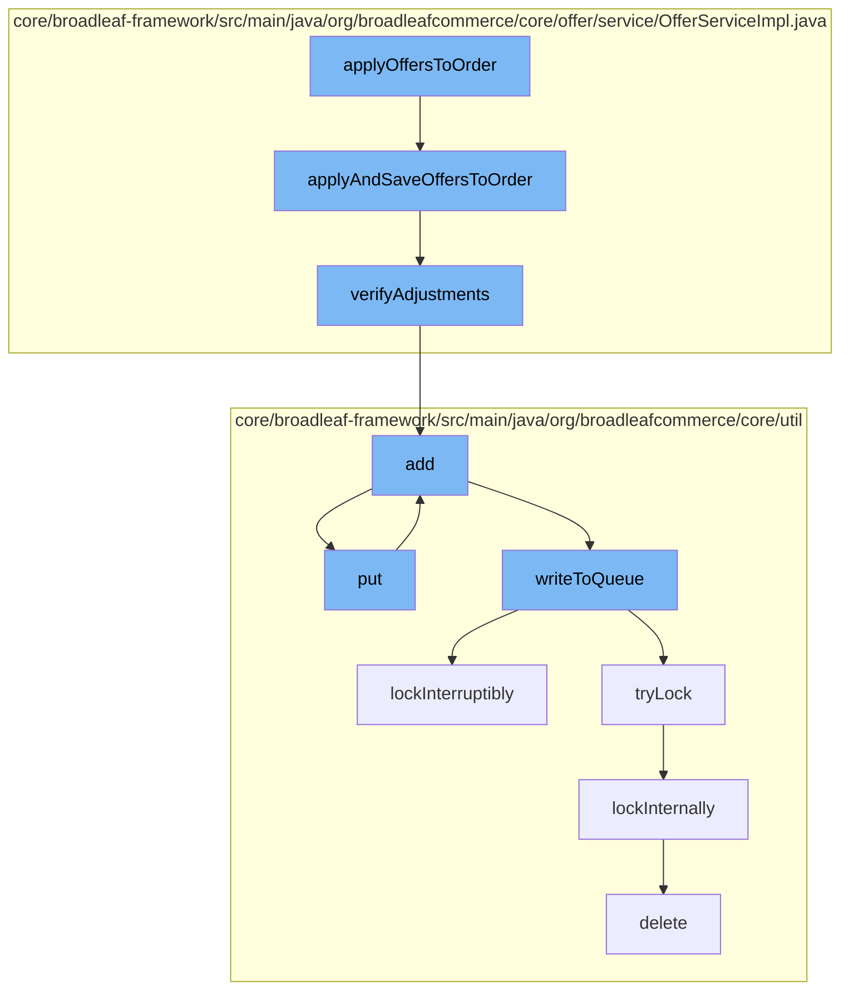

This document will cover the process of applying offers to an order in the BroadleafCommerce-demo repository. The process includes the following steps:

1. Applying and saving offers to an order
2. Verifying adjustments
3. Adding entries to a cache
4. Putting entries into a distributed queue
5. Locking the queue for writing
6. Deleting a code type



<SwmSnippet path="/core/broadleaf-framework/src/main/java/org/broadleafcommerce/core/offer/service/OfferServiceImpl.java" line="349">

---

# Applying and saving offers to an order

The `applyAndSaveOffersToOrder` function is the entry point for applying offers to an order. It removes all existing offers from the order, checks and removes out-of-date or irrelevant offers, and then applies the remaining offers to the order. The function also sorts the offers by priority and discount, and finalizes the prices.

```java
    /*
     *
     * Offers Logic:
     * 1) Remove all existing offers in the Order (order, item, and fulfillment)
     * 2) Check and remove offers
     *    a) Remove out of date offers
     *    b) Remove offers that do not apply to this customer
     * 3) Loop through offers
     *    a) Verifies type of offer (order, order item, fulfillment)
     *    b) Verifies if offer can be applies
     *    c) Assign offer to type (order, order item, or fulfillment)
     * 4) Sorts the order and item offers list by priority and then discount
     * 5) Identify the best offers to apply to order item and create adjustments for each item offer
     * 6) Compare order item adjustment price to sales price, and remove adjustments if sale price is better
     * 7) Identify the best offers to apply to the order and create adjustments for each order offer
     * 8) If item contains non-combinable offers remove either the item or order adjustments based on discount value
     * 9) Set final order item prices and reapply order offers
     *
     * Assumptions:
     * 1) % off all items will be created as an item offer with no expression
     * 2) $ off order will be created as an order offer
```

---

</SwmSnippet>

<SwmSnippet path="/core/broadleaf-framework/src/main/java/org/broadleafcommerce/core/offer/service/OfferServiceImpl.java" line="428">

---

# Verifying adjustments

The `verifyAdjustments` function checks the adjustments made to the order and removes any duplicate adjustments. This ensures that each offer is only applied once to the order.

```java
    protected boolean verifyAdjustments(Order order, boolean beforeSave) {
        boolean madeChange = false;
        
        if (order.getOrderItems() == null) {
            return madeChange;
        }

        for (OrderItem oi : order.getOrderItems()) {
            if (oi.getOrderItemPriceDetails() == null) {
                continue;
            }

            for (OrderItemPriceDetail pd : oi.getOrderItemPriceDetails()) {
                if (pd.getOrderItemPriceDetailAdjustments() == null) {
                    continue;
                }

                Map<Long, OrderItemPriceDetailAdjustment> adjs = new HashMap<Long, OrderItemPriceDetailAdjustment>();
                List<OrderItemPriceDetailAdjustment> adjustmentsToRemove = new ArrayList<OrderItemPriceDetailAdjustment>();
                for (OrderItemPriceDetailAdjustment adj : pd.getOrderItemPriceDetailAdjustments()) {
                    if (adjs.containsKey(adj.getOffer().getId())) {
```

---

</SwmSnippet>

<SwmSnippet path="/core/broadleaf-framework/src/main/java/org/broadleafcommerce/core/util/service/ResourcePurgeServiceImpl.java" line="593">

---

# Adding entries to a cache

The `add` function adds an entry to a cache. If the entry already exists in the cache, it is not added again. This prevents duplicate entries in the cache.

```java
        public Long add(Long entry) {
            if (! cache.containsKey(entry)) {
                return cache.put(entry, new Long(System.currentTimeMillis()));
            }
            return null;
        }
```

---

</SwmSnippet>

<SwmSnippet path="/core/broadleaf-framework/src/main/java/org/broadleafcommerce/core/util/queue/ZookeeperDistributedQueue.java" line="393">

---

# Putting entries into a distributed queue

The `put` function adds an entry to a distributed queue. This is part of the process of distributing the task of applying offers to orders across multiple nodes.

```java
    @Override
    public void put(T e) throws InterruptedException {
        final ArrayList<T> elementsToAdd = new ArrayList<>();
        elementsToAdd.add(e);
        writeToQueue(elementsToAdd, -1L);
    }
```

---

</SwmSnippet>

<SwmSnippet path="/core/broadleaf-framework/src/main/java/org/broadleafcommerce/core/util/lock/ReentrantDistributedZookeeperLock.java" line="335">

---

# Locking the queue for writing

The `lockInterruptibly` function locks the queue for writing. This ensures that only one node can write to the queue at a time, preventing data corruption.

```java
    @Override
    public void lockInterruptibly() throws InterruptedException {
        if (Thread.interrupted()) {
            throw new InterruptedException("Thread was interrupted prior to trying to acquire the lock.");
        }
        
        lockInternally(-1L);
    }
```

---

</SwmSnippet>

<SwmSnippet path="/core/broadleaf-framework/src/main/java/org/broadleafcommerce/core/util/dao/CodeTypeDaoImpl.java" line="51">

---

# Deleting a code type

The `delete` function removes a code type from the database. This is part of the cleanup process after the offers have been applied to the order.

```java
    public void delete(CodeType codeType) {
        if (!em.contains(codeType)) {
            codeType = (CodeType) em.find(CodeTypeImpl.class, codeType.getId());
        }
        em.remove(codeType);
    }
```

---

</SwmSnippet>

&nbsp;

*This is an auto-generated document by Swimm AI 🌊 and has not yet been verified by a human*

<SwmMeta version="3.0.0" repo-id="Z2l0aHViJTNBJTNBQnJvYWRsZWFmQ29tbWVyY2UtZGVtbyUzQSUzQWdpbGFkbmF2b3Q=" repo-name="BroadleafCommerce-demo" doc-type="flows"><sup>Powered by [Swimm](/)</sup></SwmMeta>
