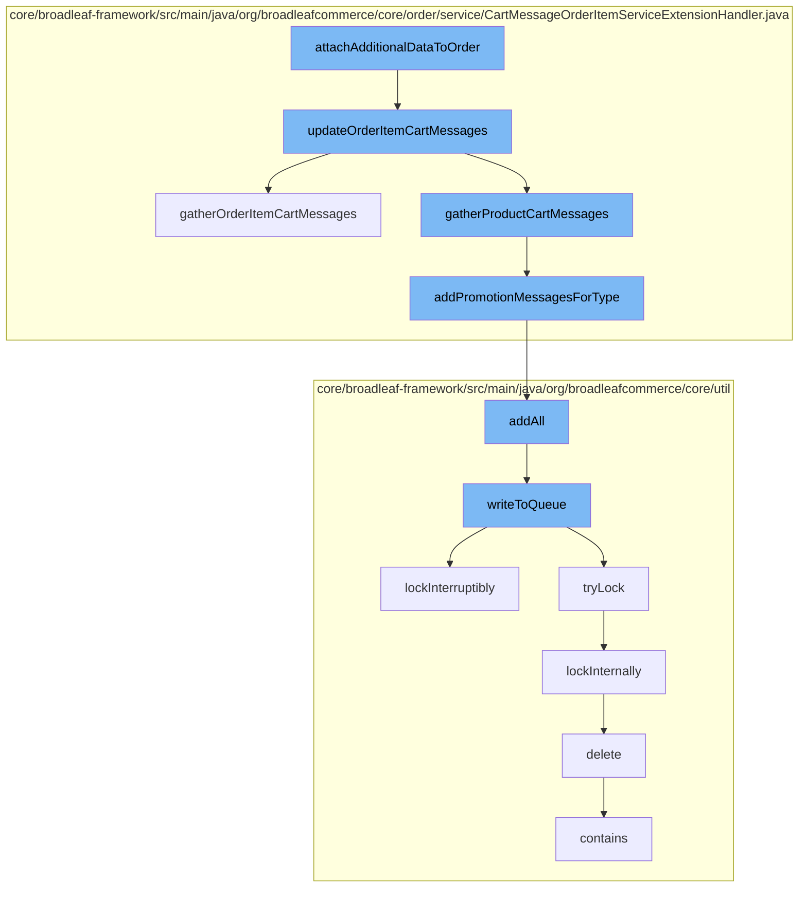

This document will cover the process of attaching additional data to an order in the BroadleafCommerce-demo repository. The process includes the following steps:

1. Updating order item cart messages
2. Gathering order item cart messages
3. Gathering product cart messages
4. Adding promotion messages for a type
5. Adding all messages to a distributed queue
6. Writing to the queue
7. Locking the queue
8. Deleting a code type
9. Checking if the queue contains a specific object.



<SwmSnippet path="/core/broadleaf-framework/src/main/java/org/broadleafcommerce/core/order/service/CartMessageOrderItemServiceExtensionHandler.java" line="70">

---

# Updating order item cart messages

The `updateOrderItemCartMessages` function is the first step in the process. It gathers cart messages for an order item and if none are found, it gathers product cart messages. The cart messages are then set on the order item and the order item is saved.

```java
    protected void updateOrderItemCartMessages(OrderItem orderItem) {
        List<String> cartMessages = gatherOrderItemCartMessages(orderItem);

        if (CollectionUtils.isEmpty(cartMessages)) {
            cartMessages = gatherProductCartMessages(orderItem);
        }

        orderItem.setCartMessages(cartMessages);
        orderItemService.saveOrderItem(orderItem);
    }
```

---

</SwmSnippet>

<SwmSnippet path="/core/broadleaf-framework/src/main/java/org/broadleafcommerce/core/order/service/CartMessageOrderItemServiceExtensionHandler.java" line="81">

---

# Gathering order item cart messages

The `gatherOrderItemCartMessages` function is used to gather cart messages for an order item. It iterates over a list of `PromotionMessageGenerator` objects and adds the generated promotion messages to the cart messages.

```java
    protected List<String> gatherOrderItemCartMessages(OrderItem orderItem) {
        List<String> cartMessages = new ArrayList<>();
        for (PromotionMessageGenerator generator : generators) {
            cartMessages.addAll(generator.generatePromotionMessages(orderItem));
        }

        return cartMessages;
    }
```

---

</SwmSnippet>

<SwmSnippet path="/core/broadleaf-framework/src/main/java/org/broadleafcommerce/core/order/service/CartMessageOrderItemServiceExtensionHandler.java" line="112">

---

# Gathering product cart messages

The `addPromotionMessagesForType` function is used to add promotion messages for a specific type to a list of `PromotionMessageDTO` objects. If the list of messages is not empty, it adds all the messages to the `messageDTOs` list.

```java
    protected void addPromotionMessagesForType(List<PromotionMessageDTO> messageDTOs, List<PromotionMessageDTO> messages) {
        if (CollectionUtils.isNotEmpty(messages)) {
            messageDTOs.addAll(messages);
        }
    }
```

---

</SwmSnippet>

<SwmSnippet path="/core/broadleaf-framework/src/main/java/org/broadleafcommerce/core/util/queue/ZookeeperDistributedQueue.java" line="307">

---

# Adding all messages to a distributed queue

The `addAll` function is used to add all messages to a distributed queue. If the collection of messages is not null or empty, it writes the messages to the queue.

```java
    @Override
    public boolean addAll(Collection<? extends T> c) {
        if (c == null || c.isEmpty()) {
            return false;
        }
        try {
            int count = writeToQueue(new ArrayList<>(c), -1L);
            return count == c.size();
        } catch (InterruptedException e) {
            return false;
        }
        
    }
```

---

</SwmSnippet>

<SwmSnippet path="/core/broadleaf-framework/src/main/java/org/broadleafcommerce/core/util/queue/ZookeeperDistributedQueue.java" line="503">

---

# Writing to the queue

The `writeToQueue` function is used to write a list of entries to the queue. If the list of entries is not null or empty, it locks the queue and writes the entries to the queue.

```java
    protected int writeToQueue(List<? extends T> entries, final long timeout) throws InterruptedException {
        if (entries == null || entries.isEmpty()) {
            return 0;
        }
        
        int entryCount = 0;
        long waitTime = timeout;
        synchronized (QUEUE_MONITOR) {
            while (true) {
                boolean locked = false;
                DistributedLock lock = getQueueAccessLock();
                if (timeout < 0L) {
                    lock.lockInterruptibly();
                    locked = true;
                } else if (timeout > 0L && waitTime > 0L) {
                    long start = System.currentTimeMillis();
                    locked = lock.tryLock(waitTime, TimeUnit.MILLISECONDS);
                    long end = System.currentTimeMillis();
                    waitTime -= (end - start);
                } else {
                    locked = lock.tryLock();
```

---

</SwmSnippet>

<SwmSnippet path="/core/broadleaf-framework/src/main/java/org/broadleafcommerce/core/util/lock/ReentrantDistributedZookeeperLock.java" line="335">

---

# Locking the queue

The `lockInterruptibly` function is used to lock the queue. If the thread is interrupted before trying to acquire the lock, it throws an `InterruptedException`.

```java
    @Override
    public void lockInterruptibly() throws InterruptedException {
        if (Thread.interrupted()) {
            throw new InterruptedException("Thread was interrupted prior to trying to acquire the lock.");
        }
        
        lockInternally(-1L);
    }
```

---

</SwmSnippet>

<SwmSnippet path="/core/broadleaf-framework/src/main/java/org/broadleafcommerce/core/util/dao/CodeTypeDaoImpl.java" line="51">

---

# Deleting a code type

The `delete` function is used to delete a `CodeType` object. If the `CodeType` object is not contained in the entity manager, it finds the `CodeType` object and removes it.

```java
    public void delete(CodeType codeType) {
        if (!em.contains(codeType)) {
            codeType = (CodeType) em.find(CodeTypeImpl.class, codeType.getId());
        }
        em.remove(codeType);
    }
```

---

</SwmSnippet>

<SwmSnippet path="/core/broadleaf-framework/src/main/java/org/broadleafcommerce/core/util/queue/ZookeeperDistributedQueue.java" line="474">

---

# Checking if the queue contains a specific object

The `contains` function is used to check if the queue contains a specific object. It checks if the queue contains all objects in a singleton list.

```java
    @Override
    public boolean contains(Object o) {
        return containsAll(Collections.singletonList(o));
    }
```

---

</SwmSnippet>

&nbsp;

*This is an auto-generated document by Swimm AI 🌊 and has not yet been verified by a human*

<SwmMeta version="3.0.0" repo-id="Z2l0aHViJTNBJTNBQnJvYWRsZWFmQ29tbWVyY2UtZGVtbyUzQSUzQWdpbGFkbmF2b3Q=" repo-name="BroadleafCommerce-demo" doc-type="flows"><sup>Powered by [Swimm](/)</sup></SwmMeta>
