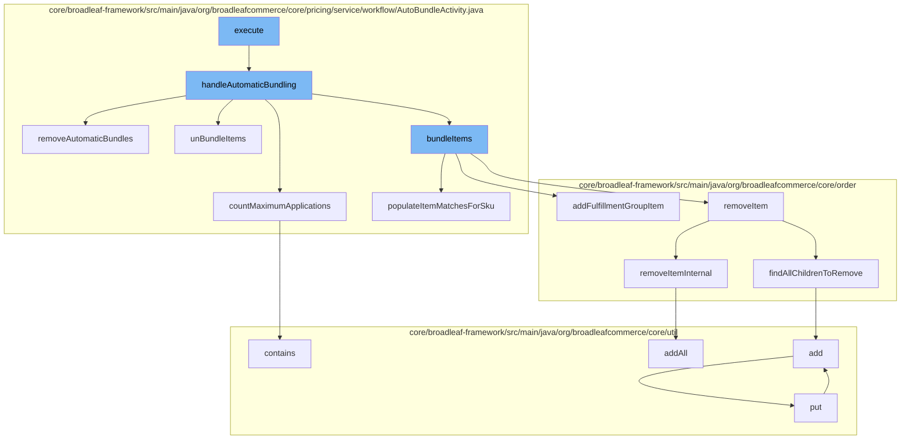

This document will cover the process of automatic bundling in the BroadleafCommerce-demo project. We'll cover:

1. The initiation of the automatic bundling process
2. Handling automatic bundling
3. Removing automatic bundles
4. Bundling items
5. Removing items from the order
6. Adding items to the distributed queue



<SwmSnippet path="/core/broadleaf-framework/src/main/java/org/broadleafcommerce/core/pricing/service/workflow/AutoBundleActivity.java" line="78">

---

# Initiation of the Automatic Bundling Process

The `execute` function initiates the automatic bundling process. It calls the `handleAutomaticBundling` function which is responsible for the entire automatic bundling process.

```java
    public Order handleAutomaticBundling(Order order) throws PricingException, RemoveFromCartException {
        boolean itemsHaveBeenUnbundled = false;
        List<DiscreteOrderItem> unbundledItems = null;

        List<ProductBundle> productBundles = catalogService.findAutomaticProductBundles();
        Set<Long> processedBundleIds = new HashSet<Long>();
        for (ProductBundle productBundle : productBundles) {
            int existingUses = countExistingUsesOfBundle(order, productBundle);
            Integer maxApplications = null;
            for (SkuBundleItem skuBundleItem : productBundle.getSkuBundleItems()) {
                int maxSkuApplications = countMaximumApplications(order, skuBundleItem, processedBundleIds);
                if (maxApplications == null || maxApplications > maxSkuApplications) {
                    maxApplications = maxSkuApplications;
                }
            }
            processedBundleIds.add(productBundle.getId());

            if (maxApplications != existingUses) {
                if (! itemsHaveBeenUnbundled) {
                    // Store the discrete items that were part of automatic bundles
                    unbundledItems = unBundleItems(order);
```

---

</SwmSnippet>

<SwmSnippet path="/core/broadleaf-framework/src/main/java/org/broadleafcommerce/core/pricing/service/workflow/AutoBundleActivity.java" line="78">

---

# Handling Automatic Bundling

The `handleAutomaticBundling` function handles the automatic bundling process. It iterates over the product bundles and for each bundle, it counts the existing uses and the maximum applications. If the maximum applications do not equal the existing uses, it unbundles the items, removes the automatic bundles, and creates a new bundle.

```java
    public Order handleAutomaticBundling(Order order) throws PricingException, RemoveFromCartException {
        boolean itemsHaveBeenUnbundled = false;
        List<DiscreteOrderItem> unbundledItems = null;

        List<ProductBundle> productBundles = catalogService.findAutomaticProductBundles();
        Set<Long> processedBundleIds = new HashSet<Long>();
        for (ProductBundle productBundle : productBundles) {
            int existingUses = countExistingUsesOfBundle(order, productBundle);
            Integer maxApplications = null;
            for (SkuBundleItem skuBundleItem : productBundle.getSkuBundleItems()) {
                int maxSkuApplications = countMaximumApplications(order, skuBundleItem, processedBundleIds);
                if (maxApplications == null || maxApplications > maxSkuApplications) {
                    maxApplications = maxSkuApplications;
                }
            }
            processedBundleIds.add(productBundle.getId());

            if (maxApplications != existingUses) {
                if (! itemsHaveBeenUnbundled) {
                    // Store the discrete items that were part of automatic bundles
                    unbundledItems = unBundleItems(order);
```

---

</SwmSnippet>

<SwmSnippet path="/core/broadleaf-framework/src/main/java/org/broadleafcommerce/core/pricing/service/workflow/AutoBundleActivity.java" line="110">

---

# Removing Automatic Bundles

The `removeAutomaticBundles` function removes all automatic bundles from the order. It iterates over the order items and if the item is an automatic bundle, it removes it from the order.

```java
    /**
     * Removes all automatic bundles from the order and replaces with DiscreteOrderItems.
     *
     * @param order
     * @throws PricingException 
     */
    private Order removeAutomaticBundles(Order order) throws PricingException {
        List<BundleOrderItem> bundlesToRemove = new ArrayList<BundleOrderItem>();

        for (OrderItem orderItem : order.getOrderItems()) {
            if (orderItem instanceof BundleOrderItem) {
                BundleOrderItem bundleOrderItem = (BundleOrderItem) orderItem;
                if (bundleOrderItem.getProductBundle() != null && bundleOrderItem.getProductBundle().getAutoBundle()) {
                    bundlesToRemove.add(bundleOrderItem);
                }
            }
        }

        for (BundleOrderItem bundleOrderItem : bundlesToRemove) {
            try {
                order = orderService.removeItem(order.getId(), bundleOrderItem.getId(), false);
```

---

</SwmSnippet>

<SwmSnippet path="/core/broadleaf-framework/src/main/java/org/broadleafcommerce/core/pricing/service/workflow/AutoBundleActivity.java" line="316">

---

# Bundling Items

The `bundleItems` function creates a new bundle with maxApplication occurrences. It populates the item matches for each SKU and adds the matching items to the order.

```java
    protected int populateItemMatchesForSku(List<DiscreteOrderItem> matchingItems, Order order, List<DiscreteOrderItem> unbundledItems, Long skuId) {
        int skuMatches = 0;
        for (OrderItem orderItem : order.getOrderItems()) {
            if (orderItem instanceof DiscreteOrderItem) {
                DiscreteOrderItem item = (DiscreteOrderItem) orderItem;
                if (skuId.equals(item.getSku().getId())) {
                    matchingItems.add(item);
                    skuMatches = skuMatches + item.getQuantity();
                }
            }
        }

        if (unbundledItems != null) {
            for (DiscreteOrderItem discreteOrderItem : unbundledItems) {
                if (skuId.equals(discreteOrderItem.getSku().getId())) {
                    skuMatches = skuMatches + discreteOrderItem.getQuantity();
                }
            }
        }
        return skuMatches;
    }
```

---

</SwmSnippet>

<SwmSnippet path="/core/broadleaf-framework/src/main/java/org/broadleafcommerce/core/order/service/OrderServiceImpl.java" line="851">

---

# Removing Items from the Order

The `removeItemInternal` function removes an item from the order. It finds all children to remove and adds them to the distributed queue.

```java
    protected Order removeItemInternal(Long orderId, Long orderItemId, boolean priceOrder) throws WorkflowException {
        OrderItemRequestDTO orderItemRequestDTO = new OrderItemRequestDTO();
        orderItemRequestDTO.setOrderItemId(orderItemId);
        CartOperationRequest cartOpRequest = new CartOperationRequest(findOrderById(orderId), orderItemRequestDTO, priceOrder);
        Session session = em.unwrap(Session.class);
        FlushMode current = session.getHibernateFlushMode();
        if (!autoFlushRemoveFromCart) {
            //Performance measure. Hibernate will sometimes perform an autoflush when performing query operations and this can
            //be expensive. It is possible to avoid the autoflush if there's no concern about queries in the flow returning
            //incorrect results because something has not been flushed to the database yet.
            session.setHibernateFlushMode(FlushMode.MANUAL);
        }
        ProcessContext<CartOperationRequest> context;
        try {
            context = (ProcessContext<CartOperationRequest>) removeItemWorkflow.doActivities(cartOpRequest);
        } finally {
            if (!autoFlushRemoveFromCart) {
                session.setHibernateFlushMode(current);
            }
        }
        context.getSeedData().getOrder().getOrderMessages().addAll(((ActivityMessages) context).getActivityMessages());
```

---

</SwmSnippet>

<SwmSnippet path="/core/broadleaf-framework/src/main/java/org/broadleafcommerce/core/util/service/ResourcePurgeServiceImpl.java" line="593">

---

# Adding Items to the Distributed Queue

The `add` function adds an entry to the cache if it does not already exist. The cache is used to store items that are removed from the order.

```java
        public Long add(Long entry) {
            if (! cache.containsKey(entry)) {
                return cache.put(entry, new Long(System.currentTimeMillis()));
            }
            return null;
        }
```

---

</SwmSnippet>

&nbsp;

*This is an auto-generated document by Swimm AI 🌊 and has not yet been verified by a human*

<SwmMeta version="3.0.0" repo-id="Z2l0aHViJTNBJTNBQnJvYWRsZWFmQ29tbWVyY2UtZGVtbyUzQSUzQWdpbGFkbmF2b3Q=" repo-name="BroadleafCommerce-demo" doc-type="flows"><sup>Powered by [Swimm](/)</sup></SwmMeta>
