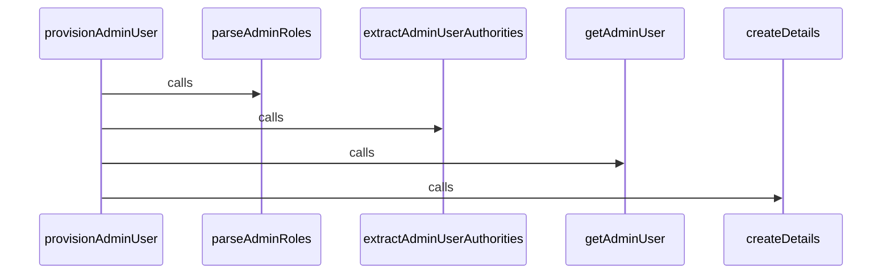

User Provisioning in BroadleafCommerce-demo refers to the process of creating, updating, and maintaining user accounts and their roles in the system. This is primarily handled by the `AdminUserProvisioningService` interface and its implementation `AdminUserProvisioningServiceImpl`. The `provisionAdminUser` method is responsible for adding or updating an `AdminUser` object in the database, along with appropriate roles and permissions, after a user has been authenticated. This method uses the details argument, which is an instance of `BroadleafExternalAuthenticationUserDetails`, to perform these operations.

<SwmSnippet path="/admin/broadleaf-open-admin-platform/src/main/java/org/broadleafcommerce/openadmin/server/security/service/user/AdminUserProvisioningService.java" line="28">

---

## AdminUserProvisioningService Interface

The `AdminUserProvisioningService` interface defines the `provisionAdminUser` method, which is used to add or update an `AdminUser` object in the database, along with appropriate roles and permissions.

```java
public interface AdminUserProvisioningService {

    /**
     * This method uses the details argument to add or update an AdminUser object in the database, 
     * along with appropriate roles and permissions.  The result of the call to this should be an instance of 
     * AdminUserDetails.
     * 
     * NOTE: IT IS GENERALLY EXPECTED THAT THIS METHOD WILL BE CALLED AFTER A USER HAS BEEN AUTHENTICATED.
     * 
     * @param details
     * @return
     */
    public AdminUserDetails provisionAdminUser(BroadleafExternalAuthenticationUserDetails details);

}
```

---

</SwmSnippet>

<SwmSnippet path="/admin/broadleaf-open-admin-platform/src/main/java/org/broadleafcommerce/openadmin/server/security/service/user/AdminUserProvisioningServiceImpl.java" line="47">

---

## AdminUserProvisioningServiceImpl Class

The `AdminUserProvisioningServiceImpl` class is the implementation of the `AdminUserProvisioningService` interface. It uses the `AdminSecurityService` to read and update `AdminUser` objects and their roles and permissions in the database.

```java
@Service("blAdminUserProvisioningService")
public class AdminUserProvisioningServiceImpl implements AdminUserProvisioningService {

    @Resource(name = "blAdminSecurityService")
    protected AdminSecurityService securityService;

    @Resource(name = "blAdminExternalLoginExtensionManager")
    protected AdminExternalLoginUserExtensionManager adminExternalLoginExtensionManager;

    @Resource(name="blAdminSecurityHelper")
    protected AdminSecurityHelper adminSecurityHelper;

    protected Map<String, String[]> roleNameSubstitutions;

    @Override
    public AdminUserDetails provisionAdminUser(
            final BroadleafExternalAuthenticationUserDetails details) {
        final HashSet<AdminRole> parsedRoles = parseAdminRoles(details);
        final Set<SimpleGrantedAuthority> adminUserAuthorities = 
                extractAdminUserAuthorities(parsedRoles);
        final AdminUser adminUser = getAdminUser(details, parsedRoles);
```

---

</SwmSnippet>

<SwmSnippet path="/admin/broadleaf-open-admin-platform/src/main/java/org/broadleafcommerce/openadmin/server/security/service/user/AdminUserProvisioningServiceImpl.java" line="61">

---

## Provisioning Admin User

The `provisionAdminUser` method is used to provision an admin user. It first parses the roles from the user details, then extracts the authorities from these roles, and finally retrieves or creates the `AdminUser` object. The method returns an `AdminUserDetails` object which represents the provisioned user.

```java
    @Override
    public AdminUserDetails provisionAdminUser(
            final BroadleafExternalAuthenticationUserDetails details) {
        final HashSet<AdminRole> parsedRoles = parseAdminRoles(details);
        final Set<SimpleGrantedAuthority> adminUserAuthorities = 
                extractAdminUserAuthorities(parsedRoles);
        final AdminUser adminUser = getAdminUser(details, parsedRoles);

        return createDetails(adminUser, details, adminUserAuthorities);
    }
```

---

</SwmSnippet>

# User Provisioning Functions

This section provides an overview of the main functions related to User Provisioning in the BroadleafCommerce-demo repository.

<SwmSnippet path="/admin/broadleaf-open-admin-platform/src/main/java/org/broadleafcommerce/openadmin/server/security/service/user/AdminUserProvisioningServiceImpl.java" line="61">

---

## provisionAdminUser

The `provisionAdminUser` function is the main entry point for user provisioning. It takes BroadleafExternalAuthenticationUserDetails as input, which contains details about the user authenticated from an external system. The function parses the roles, extracts authorities, gets the admin user, and creates the user details.

```java
    @Override
    public AdminUserDetails provisionAdminUser(
            final BroadleafExternalAuthenticationUserDetails details) {
        final HashSet<AdminRole> parsedRoles = parseAdminRoles(details);
        final Set<SimpleGrantedAuthority> adminUserAuthorities = 
                extractAdminUserAuthorities(parsedRoles);
        final AdminUser adminUser = getAdminUser(details, parsedRoles);

        return createDetails(adminUser, details, adminUserAuthorities);
    }
```

---

</SwmSnippet>

<SwmSnippet path="/admin/broadleaf-open-admin-platform/src/main/java/org/broadleafcommerce/openadmin/server/security/service/user/AdminUserProvisioningServiceImpl.java" line="72">

---

## parseAdminRoles

The `parseAdminRoles` function is used to parse the roles from the user details. It reads all admin roles and checks if the parsed role names contain the role name. If it does, the role is added to the parsed roles.

```java
    protected HashSet<AdminRole> parseAdminRoles(
            final BroadleafExternalAuthenticationUserDetails details) {
        final HashSet<String> parsedRoleNames = parseRolesFromUserDetails(details);
        final HashSet<AdminRole> parsedRoles = new HashSet<>();
        final List<AdminRole> adminRoles = securityService.readAllAdminRoles();

        if (adminRoles != null) {
            for (AdminRole role : adminRoles) {
                if (parsedRoleNames.contains(role.getName())) {
                    parsedRoles.add(role);
                }
            }
        }
        
        return parsedRoles;
    } 
```

---

</SwmSnippet>

<SwmSnippet path="/admin/broadleaf-open-admin-platform/src/main/java/org/broadleafcommerce/openadmin/server/security/service/user/AdminUserProvisioningServiceImpl.java" line="89">

---

## extractAdminUserAuthorities

The `extractAdminUserAuthorities` function is used to extract the authorities from the parsed roles. It adds permissions to the authorities and converts the permission prefix to a role.

```java
    /**
     * Extracts the {@code SimpleGrantedAuthority}s for the given List of {@code AdminRole}s. In addition, this will handle
     * populating the default roles. This method returns a Set in order to avoid the duplication between the permissions of different roles.
     *
     * @param parsedRoles a List of AdminRole
     * @return a Set of unique authorities for the given roles
     */
    protected Set<SimpleGrantedAuthority> extractAdminUserAuthorities(HashSet<AdminRole> parsedRoles) {
        List<SimpleGrantedAuthority> adminUserAuthorities = new ArrayList<>();
        addPermissions(parsedRoles, adminUserAuthorities);
        convertPermissionPrefixToRole(adminUserAuthorities);

        return new HashSet<>(adminUserAuthorities);
    }
```

---

</SwmSnippet>

<SwmSnippet path="/admin/broadleaf-open-admin-platform/src/main/java/org/broadleafcommerce/openadmin/server/security/service/user/AdminUserProvisioningServiceImpl.java" line="140">

---

## getAdminUser

The `getAdminUser` function is used to get the admin user from the user details. If the user does not exist, a new user is created. The function sets the login, email, and name of the user.

```java
    protected AdminUser getAdminUser(final BroadleafExternalAuthenticationUserDetails details,
            final HashSet<AdminRole> parsedRoles) {
        AdminUser adminUser = securityService.readAdminUserByUserName(details.getUsername());
        if (adminUser == null) {
            adminUser = new AdminUserImpl();
            adminUser.setLogin(details.getUsername());
        }

        if (StringUtils.isNotBlank(details.getEmail())) {
            adminUser.setEmail(details.getEmail());
        }

        StringBuilder name = new StringBuilder();
        if (StringUtils.isNotBlank(details.getFirstName())) {
            name.append(details.getFirstName()).append(" ");
        }
        if (StringUtils.isNotBlank(details.getLastName())) {
            name.append(details.getLastName());
        }

        String fullName = name.toString();
```

---

</SwmSnippet>

<SwmSnippet path="/admin/broadleaf-open-admin-platform/src/main/java/org/broadleafcommerce/openadmin/server/security/service/user/AdminUserProvisioningServiceImpl.java" line="178">

---

## createDetails

The `createDetails` function is used to create the user details from the admin user, user details, and authorities. It returns an instance of AdminUserDetails.

```java
    protected AdminUserDetails createDetails(final AdminUser adminUser, 
            final BroadleafExternalAuthenticationUserDetails details,
            final Set<SimpleGrantedAuthority> adminUserAuthorities) {
        return new AdminUserDetails(adminUser.getId(), details.getUsername(), "", true, true, true,
                true, adminUserAuthorities);
    } 
```

---

</SwmSnippet>



&nbsp;

*This is an auto-generated document by Swimm AI 🌊 and has not yet been verified by a human*

<SwmMeta version="3.0.0" repo-id="Z2l0aHViJTNBJTNBQnJvYWRsZWFmQ29tbWVyY2UtZGVtbyUzQSUzQWdpbGFkbmF2b3Q=" repo-name="BroadleafCommerce-demo" doc-type="overview"><sup>Powered by [Swimm](/)</sup></SwmMeta>
