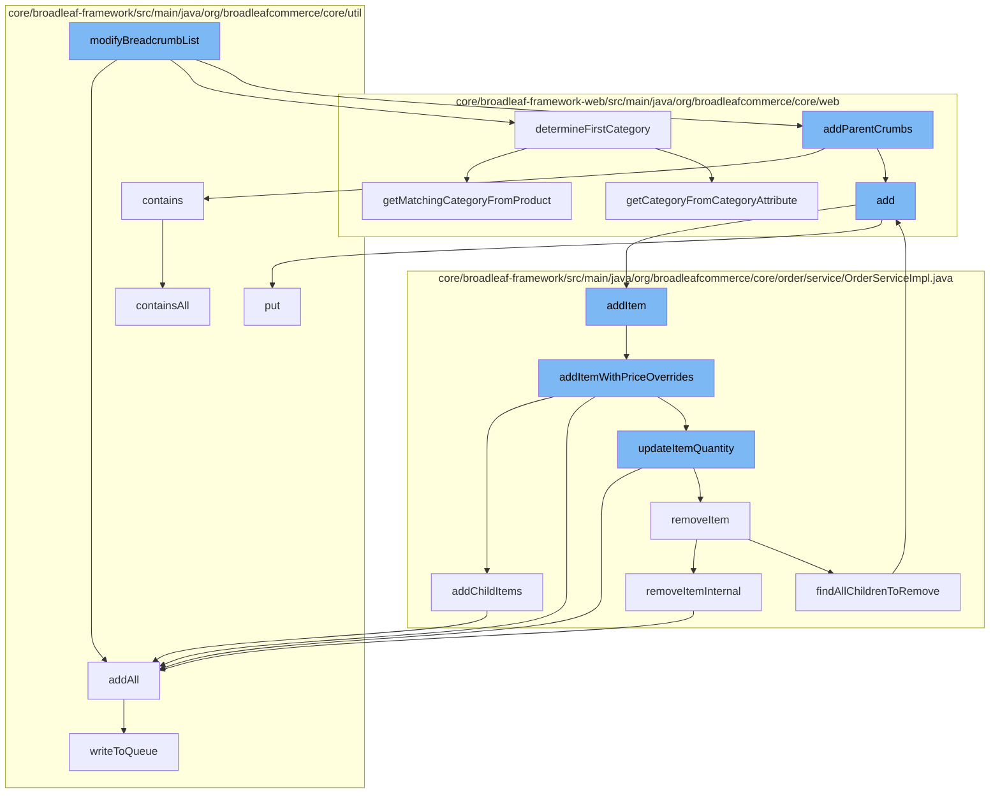

This document will cover the process of breadcrumb modification and wishlist management in the BroadleafCommerce-demo repository. The main steps include:

1. Modifying the breadcrumb list
2. Adding parent crumbs
3. Adding items to the wishlist
4. Updating item quantity
5. Removing items from the wishlist.



<SwmSnippet path="/core/broadleaf-framework-web/src/main/java/org/broadleafcommerce/core/web/breadcrumbs/CategoryBreadcrumbServiceExtensionHandler.java" line="1">

---

# Modifying the breadcrumb list

The function `modifyBreadcrumbList` is the starting point of the flow. It modifies the breadcrumb list by calling `addAll`, `determineFirstCategory`, and `addParentCrumbs` functions.

```java
/*-
 * #%L
 * BroadleafCommerce Framework Web
 * %%
 * Copyright (C) 2009 - 2024 Broadleaf Commerce
 * %%
 * Licensed under the Broadleaf Fair Use License Agreement, Version 1.0
 * (the "Fair Use License" located  at http://license.broadleafcommerce.org/fair_use_license-1.0.txt)
 * unless the restrictions on use therein are violated and require payment to Broadleaf in which case
 * the Broadleaf End User License Agreement (EULA), Version 1.1
 * (the "Commercial License" located at http://license.broadleafcommerce.org/commercial_license-1.1.txt)
 * shall apply.
 * 
 * Alternatively, the Commercial License may be replaced with a mutually agreed upon license (the "Custom License")
 * between you and Broadleaf Commerce. You may not use this file except in compliance with the applicable license.
 * #L%
 */

package org.broadleafcommerce.core.web.breadcrumbs;

import org.apache.commons.lang3.StringUtils;
```

---

</SwmSnippet>

<SwmSnippet path="/core/broadleaf-framework-web/src/main/java/org/broadleafcommerce/core/web/breadcrumbs/CategoryBreadcrumbServiceExtensionHandler.java" line="51">

---

# Adding parent crumbs

The function `addParentCrumbs` is called by `modifyBreadcrumbList`. It adds parent crumbs to the breadcrumb list by calling `contains` and `add` functions.

```java
    @Resource(name = "blBreadcrumbServiceExtensionManager")
    protected BreadcrumbServiceExtensionManager extensionManager;

    @PostConstruct
    public void init() {
        if (isEnabled()) {
            extensionManager.registerHandler(this);
        }
    }

    public ExtensionResultStatusType modifyBreadcrumbList(String url, Map<String, String[]> params,
            ExtensionResultHolder<List<BreadcrumbDTO>> holder) {

        // ProductBreadcrumb Handler strips off the productId and last fragment  
        String testUrl = (String) holder.getContextMap().get(BreadcrumbServiceExtensionManager.CONTEXT_PARAM_STRIPPED_URL);
        if (StringUtils.isEmpty(testUrl)) {
            testUrl = url;
        }

        Category category = determineFirstCategory(testUrl, params, holder);

```

---

</SwmSnippet>

<SwmSnippet path="/core/broadleaf-framework-web/src/main/java/org/broadleafcommerce/core/web/controller/account/BroadleafManageWishlistController.java" line="101">

---

# Adding items to the wishlist

The function `add` is called by `addParentCrumbs`. It adds items to the wishlist by calling the `addItem` function.

```java
        return getAccountWishlistRedirect();
    }

    public String moveItemToCart(HttpServletRequest request, HttpServletResponse response, Model model, 
            String wishlistName, Long orderItemId) throws RemoveFromCartException, AddToCartException, PricingException {
        Order wishlist = orderService.findNamedOrderForCustomer(wishlistName, CustomerState.getCustomer());
        if(!isWishlistValid(wishlist)) {
            model.addAttribute("wishlist", wishlist);
            model.addAttribute("invalidWishlist", true);
            return getAccountWishlistView();
        }
        List<OrderItem> orderItems = wishlist.getOrderItems();

        OrderItem orderItem = null;
        for (OrderItem item : orderItems) {
            if (orderItemId.equals(item.getId())) {
                orderItem = item;
                break;
            }
        }

```

---

</SwmSnippet>

<SwmSnippet path="/core/broadleaf-framework/src/main/java/org/broadleafcommerce/core/order/service/OrderServiceImpl.java" line="151">

---

# Updating item quantity

The function `updateItemQuantity` is called by `addItemWithPriceOverrides`. It updates the quantity of an item in the wishlist by calling `addAll` and `removeItem` functions.

```java
    private Processor updateProductOptionsForItemWorkflow;

    @Resource(name = "blUpdateItemWorkflow")
    protected Processor updateItemWorkflow;
    
    @Resource(name = "blRemoveItemWorkflow")
    protected Processor removeItemWorkflow;

    @Resource(name = "blTransactionManager")
    protected PlatformTransactionManager transactionManager;

    @Value("${pricing.retry.count.for.lock.failure}")
    protected int pricingRetryCountForLockFailure = 3;

    @Value("${pricing.retry.wait.interval.for.lock.failure}")
    protected long pricingRetryWaitIntervalForLockFailure = 500L;

    /**
     * Advanced setting. Should Hibernate auto flush before queries during an
     * add-to-cart workflow. This should generally be able to be left false. This is a performance measure and
     * add-to-cart operations will be more efficient when this is false.
```

---

</SwmSnippet>

<SwmSnippet path="/core/broadleaf-framework/src/main/java/org/broadleafcommerce/core/order/service/OrderServiceImpl.java" line="201">

---

# Removing items from the wishlist

The function `removeItem` is called by `updateItemQuantity`. It removes items from the wishlist by calling `removeItemInternal` and `findAllChildrenToRemove` functions.

```java
    protected EntityManager em;

    /* Fields */
    protected boolean moveNamedOrderItems = true;
    protected boolean deleteEmptyNamedOrders = true;

    protected Boolean automaticallyMergeLikeItems;

    @Resource(name = "blOrderMultishipOptionService")
    protected OrderMultishipOptionService orderMultishipOptionService;

    @Resource(name = "blOfferServiceExtensionManager")
    protected OfferServiceExtensionManager offerServiceExtensionManager;


    @Override
    @Transactional("blTransactionManager")
    public Order createNewCartForCustomer(Customer customer) {
        customer = customerService.saveCustomer(customer);
        final Object lock = Objects.isNull(customer.getId()) ? customer : customer.getId();
        synchronized (lock) {
```

---

</SwmSnippet>

&nbsp;

*This is an auto-generated document by Swimm AI 🌊 and has not yet been verified by a human*

<SwmMeta version="3.0.0" repo-id="Z2l0aHViJTNBJTNBQnJvYWRsZWFmQ29tbWVyY2UtZGVtbyUzQSUzQWdpbGFkbmF2b3Q=" repo-name="BroadleafCommerce-demo" doc-type="flows"><sup>Powered by [Swimm](/)</sup></SwmMeta>
