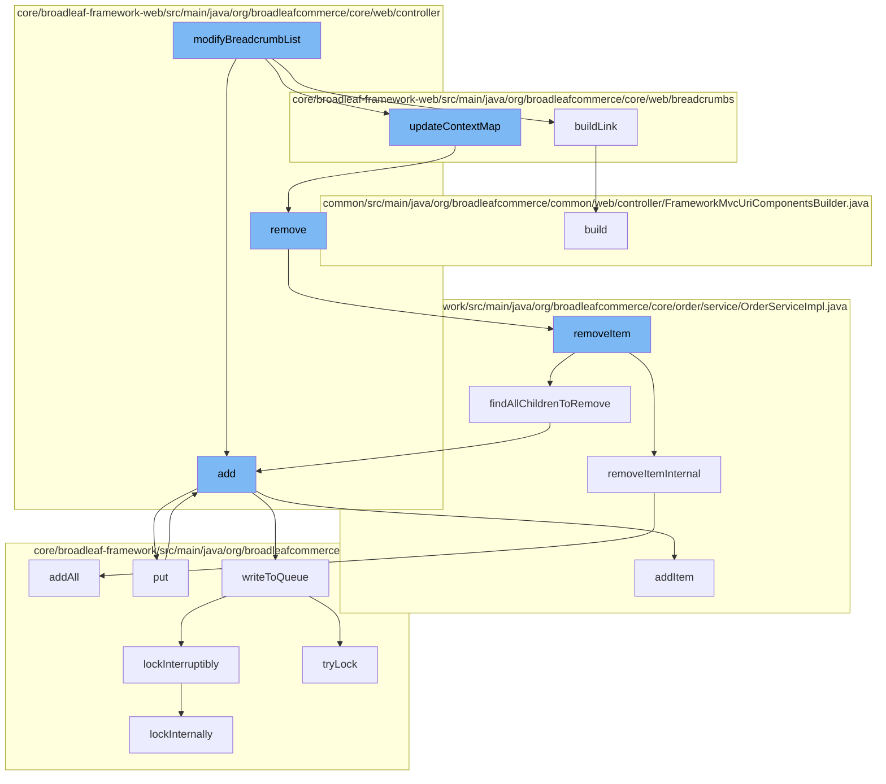

This document will cover the process of modifying the breadcrumb list in the BroadleafCommerce-demo project. We'll cover:

1. Adding an item to the wishlist
2. Removing an item from the cart
3. Updating the breadcrumb list
4. Handling the distributed queue



<SwmSnippet path="/core/broadleaf-framework-web/src/main/java/org/broadleafcommerce/core/web/controller/account/BroadleafManageWishlistController.java" line="62">

---

# Adding an item to the wishlist

The `add` method in `BroadleafManageWishlistController` is responsible for adding an item to the user's wishlist. It first checks if the wishlist exists for the current customer, if not, it creates one. Then it adds the item to the wishlist and saves the updated wishlist.

```java
    public String add(HttpServletRequest request, HttpServletResponse response, Model model,
                      OrderItemRequestDTO itemRequest, String wishlistName) throws IOException, AddToCartException, PricingException  {
        Order wishlist = orderService.findNamedOrderForCustomer(wishlistName, CustomerState.getCustomer(request));

        if (wishlist == null) {
            wishlist = orderService.createNamedOrderForCustomer(wishlistName, CustomerState.getCustomer(request));
        }
        
        wishlist = orderService.addItem(wishlist.getId(), itemRequest, false);
        wishlist = orderService.save(wishlist, true);

        return getAccountWishlistRedirect();
    }
```

---

</SwmSnippet>

<SwmSnippet path="/core/broadleaf-framework-web/src/main/java/org/broadleafcommerce/core/web/controller/cart/BroadleafCartController.java" line="318">

---

# Removing an item from the cart

The `remove` method in `BroadleafCartController` is responsible for removing an item from the user's cart. It retrieves the current cart, removes the item, and saves the updated cart. If the request is an AJAX request, it returns the cart view with additional data; otherwise, it redirects to the cart page.

```java
    /**
     * Takes in an item request, updates the quantity of that item in the cart, and returns
     * 
     * If the method was invoked via an AJAX call, it will render the "ajax/cart" template.
     * Otherwise, it will perform a 302 redirect to "/cart"
     * 
     * @param request
     * @param response
     * @param model
     * @param itemRequest
     * @throws IOException
     * @throws PricingException
     * @throws RemoveFromCartException 
     */
    public String remove(HttpServletRequest request, HttpServletResponse response, Model model,
            OrderItemRequestDTO itemRequest) throws IOException, PricingException, RemoveFromCartException {
        Order cart = CartState.getCart();
        
        cart = orderService.removeItem(cart.getId(), itemRequest.getOrderItemId(), false);
        cart = orderService.save(cart, true);
        
```

---

</SwmSnippet>

<SwmSnippet path="/core/broadleaf-framework-web/src/main/java/org/broadleafcommerce/core/web/breadcrumbs/ProductBreadcrumbServiceExtensionHandler.java" line="1">

---

# Updating the breadcrumb list

The `modifyBreadcrumbList` method in `ProductBreadcrumbServiceExtensionHandler` is responsible for updating the breadcrumb list. It calls the `add` method to add a new breadcrumb, the `buildLink` method to construct the breadcrumb link, and the `updateContextMap` method to update the context map with the new breadcrumb.

```java
/*-
 * #%L
 * BroadleafCommerce Framework Web
 * %%
 * Copyright (C) 2009 - 2024 Broadleaf Commerce
 * %%
 * Licensed under the Broadleaf Fair Use License Agreement, Version 1.0
 * (the "Fair Use License" located  at http://license.broadleafcommerce.org/fair_use_license-1.0.txt)
 * unless the restrictions on use therein are violated and require payment to Broadleaf in which case
 * the Broadleaf End User License Agreement (EULA), Version 1.1
 * (the "Commercial License" located at http://license.broadleafcommerce.org/commercial_license-1.1.txt)
 * shall apply.
 * 
 * Alternatively, the Commercial License may be replaced with a mutually agreed upon license (the "Custom License")
 * between you and Broadleaf Commerce. You may not use this file except in compliance with the applicable license.
 * #L%
 */
package org.broadleafcommerce.core.web.breadcrumbs;

import org.broadleafcommerce.common.breadcrumbs.dto.BreadcrumbDTO;
import org.broadleafcommerce.common.breadcrumbs.dto.BreadcrumbDTOType;
```

---

</SwmSnippet>

<SwmSnippet path="/core/broadleaf-framework/src/main/java/org/broadleafcommerce/core/util/queue/ZookeeperDistributedQueue.java" line="307">

---

# Handling the distributed queue

The `addAll` method in `ZookeeperDistributedQueue` is responsible for adding all items to the distributed queue. It calls the `writeToQueue` method to write the items to the queue.

```java
    @Override
    public boolean addAll(Collection<? extends T> c) {
        if (c == null || c.isEmpty()) {
            return false;
        }
        try {
            int count = writeToQueue(new ArrayList<>(c), -1L);
            return count == c.size();
        } catch (InterruptedException e) {
            return false;
        }
        
    }
```

---

</SwmSnippet>

&nbsp;

*This is an auto-generated document by Swimm AI 🌊 and has not yet been verified by a human*

<SwmMeta version="3.0.0" repo-id="Z2l0aHViJTNBJTNBQnJvYWRsZWFmQ29tbWVyY2UtZGVtbyUzQSUzQWdpbGFkbmF2b3Q=" repo-name="BroadleafCommerce-demo" doc-type="flows"><sup>Powered by [Swimm](/)</sup></SwmMeta>
