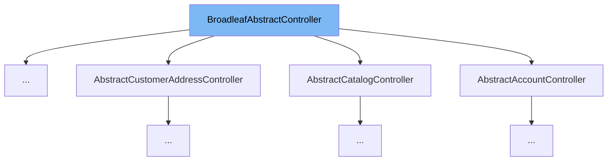

This document will cover the BroadleafAbstractController class. We'll cover:

1. What is BroadleafAbstractController
2. Variables and functions in BroadleafAbstractController
3. Usage example of BroadleafAbstractController



# What is BroadleafAbstractController

BroadleafAbstractController is an abstract class that provides convenience methods and resource declarations for its children. It contains operations that are shared between all controllers. If developers want to use composition rather than extension, they can utilize BroadleafControllerUtility.

<SwmSnippet path="/common/src/main/java/org/broadleafcommerce/common/web/controller/BroadleafAbstractController.java" line="57">

---

# Variables and functions

The function `isAjaxRequest` is a helper method that checks whether the given request was invoked via an AJAX call. It takes a HttpServletRequest as a parameter and returns a boolean value indicating whether it was an AJAX request or not.

```java
    protected boolean isAjaxRequest(HttpServletRequest request) {
        return BroadleafControllerUtility.isAjaxRequest(request);       
    }
```

---

</SwmSnippet>

<SwmSnippet path="/common/src/main/java/org/broadleafcommerce/common/web/controller/BroadleafAbstractController.java" line="69">

---

The function `getContextPath` returns the current servlet context path. If the application is deployed as root, it will return a "/". If it's not deployed as root, it will return the context path with both a leading slash but without a trailing slash. It takes a HttpServletRequest as a parameter and returns the context path as a string.

```java
    protected String getContextPath(HttpServletRequest request) {
        String ctxPath = request.getContextPath();
        if (StringUtils.isBlank(ctxPath)) {
            return "/";
        } else {
            if (ctxPath.charAt(0) != '/') {
                ctxPath = '/' + ctxPath;
            }
            if (ctxPath.charAt(ctxPath.length() - 1) != '/') {
                ctxPath = ctxPath + '/';
            }
            
            return ctxPath;
        }
```

---

</SwmSnippet>

<SwmSnippet path="/common/src/main/java/org/broadleafcommerce/common/web/controller/BroadleafAbstractController.java" line="86">

---

The function `addDeepLink` adds a deep link to the model. It takes a ModelAndView, a DeepLinkService, and an item as parameters. If the service is not null and the current sandbox is not null, it gets the links from the service and adds them to the model.

```java
    protected <T> void addDeepLink(ModelAndView model, DeepLinkService<T> service, T item) {
        if (service == null) {
            return;
        }

        BroadleafRequestContext brc = BroadleafRequestContext.getBroadleafRequestContext();
        if (brc.getSandBox() != null) {
            List<DeepLink> links = service.getLinks(item);
            if (links.size() == 1) {
                model.addObject("adminDeepLink", links.get(0));
            } else {
                model.addObject("adminDeepLink", links);
            }
        }
    }
```

---

</SwmSnippet>

<SwmSnippet path="/common/src/main/java/org/broadleafcommerce/common/web/controller/BroadleafAbstractController.java" line="115">

---

The function `jsonResponse` is used to return a JSON response instead of a fully rendered template. It sets the appropriate headers and serializes the given map. It takes a HttpServletResponse and a Map as parameters and throws JsonGenerationException, JsonMappingException, and IOException.

```java
    protected String jsonResponse(HttpServletResponse response, Map<?, ?> responseMap) 
            throws JsonGenerationException, JsonMappingException, IOException {
        response.setHeader("Content-Type", "application/json");
        new ObjectMapper().writeValue(response.getWriter(), responseMap);
        return null;
    }
```

---

</SwmSnippet>

<SwmSnippet path="/admin/broadleaf-contentmanagement-module/src/main/java/org/broadleafcommerce/cms/web/controller/BroadleafPageController.java" line="46">

---

# Usage example

BroadleafPageController is an example of how to use BroadleafAbstractController. It extends BroadleafAbstractController, meaning it inherits all the methods and properties of BroadleafAbstractController.

```java
public class BroadleafPageController extends BroadleafAbstractController implements Controller, TemplateTypeAware {
```

---

</SwmSnippet>

&nbsp;

*This is an auto-generated document by Swimm AI 🌊 and has not yet been verified by a human*

<SwmMeta version="3.0.0" repo-id="Z2l0aHViJTNBJTNBQnJvYWRsZWFmQ29tbWVyY2UtZGVtbyUzQSUzQWdpbGFkbmF2b3Q=" repo-name="BroadleafCommerce-demo" doc-type="class"><sup>Powered by [Swimm](/)</sup></SwmMeta>
