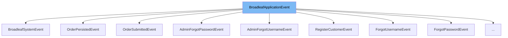

This document will cover the BroadleafApplicationEvent class. We'll cover:

1. What BroadleafApplicationEvent is and its purpose.
2. The variables and functions within BroadleafApplicationEvent.
3. An example of how to use BroadleafApplicationEvent.



# What is BroadleafApplicationEvent

BroadleafApplicationEvent is an abstract class that extends the ApplicationEvent class from the Spring framework. It serves as a base class for events within the Broadleaf Commerce framework, providing a marker for Broadleaf events and a default context map. This context map allows generic objects or properties to be passed around on events.

<SwmSnippet path="/common/src/main/java/org/broadleafcommerce/common/event/BroadleafApplicationEvent.java" line="50">

---

# Variables and functions

The `context` variable is a synchronized map that stores context information for the event.

```java
	protected transient final Map<String, Object> context = Collections.synchronizedMap(new HashMap<String, Object>());
```

---

</SwmSnippet>

<SwmSnippet path="/common/src/main/java/org/broadleafcommerce/common/event/BroadleafApplicationEvent.java" line="87">

---

The `getContext` function returns the context map that allows generic objects or properties to be passed around on events.

```java
	public Map<String, Object> getContext() {
		return context;
	}
```

---

</SwmSnippet>

<SwmSnippet path="/common/src/main/java/org/broadleafcommerce/common/event/BroadleafApplicationEvent.java" line="91">

---

The `getSiteId` function retrieves the site ID from the context map.

```java
	public Long getSiteId() {
		return (Long) context.get(ContextVars.SITE_ID);
	}
```

---

</SwmSnippet>

<SwmSnippet path="/common/src/main/java/org/broadleafcommerce/common/event/BroadleafApplicationEvent.java" line="95">

---

The `getCatalogId` function retrieves the catalog ID from the context map.

```java
	public Long getCatalogId() {
		return (Long) context.get(ContextVars.CATALOG_ID);
	}
```

---

</SwmSnippet>

<SwmSnippet path="/common/src/main/java/org/broadleafcommerce/common/event/BroadleafApplicationEvent.java" line="99">

---

The `getProfileId` function retrieves the profile ID from the context map.

```java
	public Long getProfileId() {
		return (Long) context.get(ContextVars.PROFILE_ID);
	}
```

---

</SwmSnippet>

<SwmSnippet path="/common/src/main/java/org/broadleafcommerce/common/event/BroadleafApplicationEvent.java" line="103">

---

The `getLocaleCode` function retrieves the locale code from the context map.

```java
	public String getLocaleCode() {
		return (String) context.get(ContextVars.LOCALE_CODE);
	}
```

---

</SwmSnippet>

<SwmSnippet path="/common/src/main/java/org/broadleafcommerce/common/event/BroadleafApplicationEvent.java" line="107">

---

The `getCurrencyCode` function retrieves the currency code from the context map.

```java
	public String getCurrencyCode() {
		return (String) context.get(ContextVars.CURRENCY_CODE);
	}
```

---

</SwmSnippet>

<SwmSnippet path="/common/src/main/java/org/broadleafcommerce/common/event/BroadleafApplicationEvent.java" line="111">

---

The `getTimeZoneId` function retrieves the timezone ID from the context map.

```java
	public String getTimeZoneId() {
		return (String) context.get(ContextVars.TIMEZONE_ID);
	}
```

---

</SwmSnippet>

<SwmSnippet path="/common/src/main/java/org/broadleafcommerce/common/event/BroadleafApplicationEvent.java" line="52">

---

The `BroadleafApplicationEvent` constructor initializes the context map with various context information such as site ID, catalog ID, profile ID, locale code, currency code, and timezone ID.

```java
	public BroadleafApplicationEvent(Object source) {
		super(source);

		BroadleafRequestContext ctx = BroadleafRequestContext.getBroadleafRequestContext();
		if (ctx != null) {
			if (ctx.getNonPersistentSite() != null) {
				context.put(BroadleafApplicationEvent.ContextVars.SITE_ID, ctx.getNonPersistentSite().getId());
			}

			if (ctx.getCurrentCatalog() != null) {
				context.put(BroadleafApplicationEvent.ContextVars.CATALOG_ID, ctx.getCurrentCatalog().getId());
			}

			if (ctx.getCurrentProfile() != null) {
				context.put(BroadleafApplicationEvent.ContextVars.PROFILE_ID, ctx.getCurrentProfile().getId());
			}

			if (ctx.getLocale() != null) {
				context.put(BroadleafApplicationEvent.ContextVars.LOCALE_CODE, ctx.getLocale().getLocaleCode());
			}

```

---

</SwmSnippet>

<SwmSnippet path="/common/src/main/java/org/broadleafcommerce/common/event/OrderSubmittedEvent.java" line="27">

---

# Usage example

The `OrderSubmittedEvent` class is an example of a class that extends `BroadleafApplicationEvent`. It inherits all the variables and functions from `BroadleafApplicationEvent`.

```java
public class OrderSubmittedEvent extends BroadleafApplicationEvent {
```

---

</SwmSnippet>

&nbsp;

*This is an auto-generated document by Swimm AI 🌊 and has not yet been verified by a human*

<SwmMeta version="3.0.0" repo-id="Z2l0aHViJTNBJTNBQnJvYWRsZWFmQ29tbWVyY2UtZGVtbyUzQSUzQWdpbGFkbmF2b3Q=" repo-name="BroadleafCommerce-demo" doc-type="class"><sup>Powered by [Swimm](/)</sup></SwmMeta>
