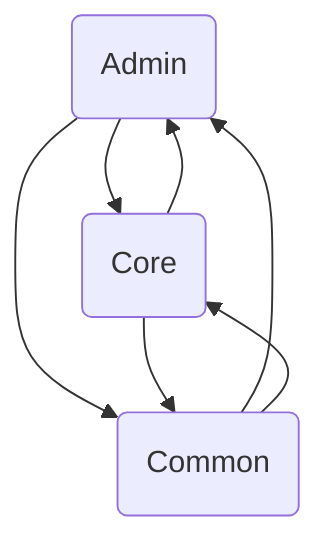

The BroadleafCommerce-demo repository is an e-commerce framework written in Java and leveraging the Spring framework. It's designed to facilitate the development of enterprise-class, commerce-driven sites by providing a robust data model, services, and specialized tooling. The repository provides three editions of Broadleaf: Community Edition (CE), Enterprise Edition (EE), and Microservices Edition. Each edition has its own licensing terms and features.

## Modules

### Core

The 'core' directory is the heart of the Broadleaf Commerce framework. It contains several subdirectories, each housing different components of the framework. For instance, the 'broadleaf-profile' directory contains code related to user profiles, while the 'broadleaf-framework' directory contains the main framework code.&nbsp;

One of the key classes in the 'core' directory is the <SwmToken path="/core/broadleaf-framework/src/main/java/org/broadleafcommerce/core/search/service/solr/SolrConfiguration.java" pos="52:4:4" line-data="public class SolrConfiguration implements InitializingBean {">`SolrConfiguration`</SwmToken> class, which holds the Solr server configuration. This class is used across multiple other classes, indicating its importance in the framework. Another key component is the <SwmToken path="/core/broadleaf-framework/src/main/java/org/broadleafcommerce/core/search/service/solr/SolrHelperService.java" pos="48:4:4" line-data="public interface SolrHelperService {">`SolrHelperService`</SwmToken> interface, which provides methods for handling Solr cores and converting index fields. Overall, the 'core' directory is essential for the operation and functionality of the Broadleaf Commerce framework.

- <SwmLink doc-title="Overview of Core in BroadleafCommerce-demo">[Overview of Core in BroadleafCommerce-demo](/.swm/overview-of-core-in-broadleafcommerce-demo.kndjxtj8.sw.md)</SwmLink>
- <SwmLink doc-title="Maven Configuration in BroadleafCommerce Framework Web">[Maven Configuration in BroadleafCommerce Framework Web](/.swm/maven-configuration-in-broadleafcommerce-framework-web.11xzsdpn.sw.md)</SwmLink>
- <SwmLink doc-title="Offer Filtering and Application">[Offer Filtering and Application](/.swm/offer-filtering-and-application.sucqoiqa.sw.md)</SwmLink>
- <SwmLink doc-title="Applying a Payment to an Order">[Applying a Payment to an Order](/.swm/applying-a-payment-to-an-order.5koj77le.sw.md)</SwmLink>
- <SwmLink doc-title="Retrieving and Processing a Robots File">[Retrieving and Processing a Robots File](/.swm/retrieving-and-processing-a-robots-file.o9f85im9.sw.md)</SwmLink>
- <SwmLink doc-title="Page Request Handling">[Page Request Handling](/.swm/page-request-handling.dz1xbzj9.sw.md)</SwmLink>
- <SwmLink doc-title="Applying Fulfillment Group Offers to an Order">[Applying Fulfillment Group Offers to an Order](/.swm/applying-fulfillment-group-offers-to-an-order.n2k77nuy.sw.md)</SwmLink>
- <SwmLink doc-title="SKU Margin Calculation">[SKU Margin Calculation](/.swm/sku-margin-calculation.txncm6ya.sw.md)</SwmLink>
- <SwmLink doc-title="Applying and Comparing Order and Item Offers">[Applying and Comparing Order and Item Offers](/.swm/applying-and-comparing-order-and-item-offers.9gxwi395.sw.md)</SwmLink>
- <SwmLink doc-title="Process of Finding Related Products">[Process of Finding Related Products](/.swm/process-of-finding-related-products.l3r0deq1.sw.md)</SwmLink>
- <SwmLink doc-title="Populating Model Variables Process">[Populating Model Variables Process](/.swm/populating-model-variables-process.xcjjxgfb.sw.md)</SwmLink>
- <SwmLink doc-title="Product Search and Management Process">[Product Search and Management Process](/.swm/product-search-and-management-process.siogbfty.sw.md)</SwmLink>
- <SwmLink doc-title="Passthrough Checkout Process">[Passthrough Checkout Process](/.swm/passthrough-checkout-process.aylksnyn.sw.md)</SwmLink>
- <SwmLink doc-title="Automatic Bundling Process">[Automatic Bundling Process](/.swm/automatic-bundling-process.swfcuh0l.sw.md)</SwmLink>
- <SwmLink doc-title="Adding a Product to the Cart Process">[Adding a Product to the Cart Process](/.swm/adding-a-product-to-the-cart-process.ynvtol0a.sw.md)</SwmLink>
- <SwmLink doc-title="Breadcrumb Modification Process">[Breadcrumb Modification Process](/.swm/breadcrumb-modification-process.q83ncaz0.sw.md)</SwmLink>
- <SwmLink doc-title="Shopping Cart Management and Product Attribute Modification">[Shopping Cart Management and Product Attribute Modification](/.swm/shopping-cart-management-and-product-attribute-modification.81yl3vss.sw.md)</SwmLink>
- <SwmLink doc-title="Shopping Cart Management">[Shopping Cart Management](/.swm/shopping-cart-management.8z4brrvb.sw.md)</SwmLink>
- <SwmLink doc-title="Product Linked Data Generation Process">[Product Linked Data Generation Process](/.swm/product-linked-data-generation-process.pew8ykwz.sw.md)</SwmLink>
- <SwmLink doc-title="Rule Validation and Management">[Rule Validation and Management](/.swm/rule-validation-and-management.7hywnvr7.sw.md)</SwmLink>
- <SwmLink doc-title="Order Tax Calculation Process">[Order Tax Calculation Process](/.swm/order-tax-calculation-process.0m3s9t83.sw.md)</SwmLink>
- <SwmLink doc-title="Generating and Storing Homepage Linked Data">[Generating and Storing Homepage Linked Data](/.swm/generating-and-storing-homepage-linked-data.y6v5q4px.sw.md)</SwmLink>
- <SwmLink doc-title="Dynamic Fields Management">[Dynamic Fields Management](/.swm/dynamic-fields-management.9q1zp8oe.sw.md)</SwmLink>
- <SwmLink doc-title="Field Group Setting in Page Templates">[Field Group Setting in Page Templates](/.swm/field-group-setting-in-page-templates.ixvhg5cm.sw.md)</SwmLink>
- <SwmLink doc-title="Overview of the SkuAttribute Class">[Overview of the SkuAttribute Class](/.swm/overview-of-the-skuattribute-class.fr8j0.sw.md)</SwmLink>
- <SwmLink doc-title="Introduction to Store">[Introduction to Store](/.swm/introduction-to-store.5gwkjxza.sw.md)</SwmLink>
- <SwmLink doc-title="Introduction to Inventory">[Introduction to Inventory](/.swm/introduction-to-inventory.266nrv1t.sw.md)</SwmLink>

- **Pricing**

  - <SwmLink doc-title="Understanding Pricing in BroadleafCommerce-demo">[Understanding Pricing in BroadleafCommerce-demo](/.swm/understanding-pricing-in-broadleafcommerce-demo.3zt8swag.sw.md)</SwmLink>
  - <SwmLink doc-title="Overview of Workflow">[Overview of Workflow](/.swm/overview-of-workflow.j43yc9ny.sw.md)</SwmLink>
  - <SwmLink doc-title="SKU Pricing Process">[SKU Pricing Process](/.swm/sku-pricing-process.zzbzr5q3.sw.md)</SwmLink>
  - <SwmLink doc-title="Fulfillment Item Pricing Process">[Fulfillment Item Pricing Process](/.swm/fulfillment-item-pricing-process.o7je8jze.sw.md)</SwmLink>

- **Search**

  - <SwmLink doc-title="Exploring Search Facet">[Exploring Search Facet](/.swm/exploring-search-facet.lq0kw1ld.sw.md)</SwmLink>
  - <SwmLink doc-title="Overview of SearchResult">[Overview of SearchResult](/.swm/overview-of-searchresult.hnl9tjtg.sw.md)</SwmLink>
  - <SwmLink doc-title="Basic Concepts of SearchConfig">[Basic Concepts of SearchConfig](/.swm/basic-concepts-of-searchconfig.h6zbw803.sw.md)</SwmLink>
  - <SwmLink doc-title="Basic Concepts of Search">[Basic Concepts of Search](/.swm/basic-concepts-of-search.eqzokr2n.sw.md)</SwmLink>
  - **Search Criteria**
    - <SwmLink doc-title="Implementing SearchCriteria Across Broadleaf Commerce">[Implementing SearchCriteria Across Broadleaf Commerce](/.swm/implementing-searchcriteria-across-broadleaf-commerce.0uakdaq5.sw.md)</SwmLink>
    - <SwmLink doc-title="Best Practices for Using SearchCriteria in Broadleaf Commerce">[Best Practices for Using SearchCriteria in Broadleaf Commerce](/.swm/best-practices-for-using-searchcriteria-in-broadleaf-commerce.83za6lem.sw.md)</SwmLink>
    - <SwmLink doc-title="Integrating SearchCriteria With Broader Search Functionality">[Integrating SearchCriteria With Broader Search Functionality](/.swm/integrating-searchcriteria-with-broader-search-functionality.w8be8lke.sw.md)</SwmLink>
    - <SwmLink doc-title="Introduction to Search Criteria">[Introduction to Search Criteria](/.swm/introduction-to-search-criteria.w41mhexx.sw.md)</SwmLink>
    - <SwmLink doc-title="Working Mechanism of Field, FieldEntity and IndexField in Field Index Management">[Working Mechanism of Field, FieldEntity and IndexField in Field Index Management](/.swm/working-mechanism-of-field-fieldentity-and-indexfield-in-field-index-management.jecgsil0.sw.md)</SwmLink>\
      <SwmLink doc-title="Understanding Responsibility Segmentation Among SearchIntercept, SearchFacet, and SearchSynonym">[Understanding Responsibility Segmentation Among SearchIntercept, SearchFacet, and SearchSynonym](/.swm/understanding-responsibility-segmentation-among-searchintercept-searchfacet-and-searchsynonym.ul4b77zr.sw.md)</SwmLink>
    - <SwmLink doc-title="Understanding Search Intercept">[Understanding Search Intercept](/.swm/understanding-search-intercept.9ww8pe77.sw.md)</SwmLink>
    - <SwmLink doc-title="Basic Concepts of Field">[Basic Concepts of Field](/.swm/basic-concepts-of-field.obax192p.sw.md)</SwmLink>
    - <SwmLink doc-title="Understanding Search Synonym">[Understanding Search Synonym](/.swm/understanding-search-synonym.jq1f0fml.sw.md)</SwmLink>
    - <SwmLink doc-title="Introduction to Search Config">[Introduction to Search Config](/.swm/introduction-to-search-config.fpzyv001.sw.md)</SwmLink>
  - **Search Facet**
    - <SwmLink doc-title="Exploring Search Facet">[Exploring Search Facet](/.swm/exploring-search-facet.1ln7in0h.sw.md)</SwmLink>
    - <SwmLink doc-title="Integration of SearchFacet Interface in the Broadleaf Commerce Framework">[Integration of SearchFacet Interface in the Broadleaf Commerce Framework](/.swm/integration-of-searchfacet-interface-in-the-broadleaf-commerce-framework.hxoqb3ra.sw.md)</SwmLink>
  - **Index Field**
    - <SwmLink doc-title="Exploring the Index Field">[Exploring the Index Field](/.swm/exploring-the-index-field.9ze89f1a.sw.md)</SwmLink>
    - <SwmLink doc-title="Examining the Role of IndexField in Interfacing with Solr">[Examining the Role of IndexField in Interfacing with Solr](/.swm/examining-the-role-of-indexfield-in-interfacing-with-solr.lgp5pq11.sw.md)</SwmLink>
  - **Search Indexing**
    - <SwmLink doc-title="Understanding Search Indexing in BroadleafCommerce-demo">[Understanding Search Indexing in BroadleafCommerce-demo](/.swm/understanding-search-indexing-in-broadleafcommerce-demo.syibdp1g.sw.md)</SwmLink>
    - <SwmLink doc-title="Understanding Solr Indexing">[Understanding Solr Indexing](/.swm/understanding-solr-indexing.vyng08k3.sw.md)</SwmLink>
    - <SwmLink doc-title="Overview of Solr Index Update">[Overview of Solr Index Update](/.swm/overview-of-solr-index-update.zg1rf4t5.sw.md)</SwmLink>
    - <SwmLink doc-title="Overview of Solr Index Status">[Overview of Solr Index Status](/.swm/overview-of-solr-index-status.j83pykiz.sw.md)</SwmLink>

- **Search Redirection**

  - <SwmLink doc-title="Introduction to Search Redirection">[Introduction to Search Redirection](/.swm/introduction-to-search-redirection.pbh08coi.sw.md)</SwmLink>
  - <SwmLink doc-title="Basic Concepts of Search Redirect Domain">[Basic Concepts of Search Redirect Domain](/.swm/basic-concepts-of-search-redirect-domain.n75051uu.sw.md)</SwmLink>
  - <SwmLink doc-title="Overview of Search Redirect Service">[Overview of Search Redirect Service](/.swm/overview-of-search-redirect-service.swxjavje.sw.md)</SwmLink>
  - <SwmLink doc-title="Introduction to Search Redirect DAO">[Introduction to Search Redirect DAO](/.swm/introduction-to-search-redirect-dao.rn8uebok.sw.md)</SwmLink>

- **Checkout**

  - <SwmLink doc-title="Understanding the Checkout Process">[Understanding the Checkout Process](/.swm/understanding-the-checkout-process.pjrnq7ce.sw.md)</SwmLink>
  - <SwmLink doc-title="Getting Started with Workflow">[Getting Started with Workflow](/.swm/getting-started-with-workflow.y9uakdnb.sw.md)</SwmLink>

- **Payment**

  - <SwmLink doc-title="Introduction to Payment">[Introduction to Payment](/.swm/introduction-to-payment.o2xg1vaf.sw.md)</SwmLink>
  - <SwmLink doc-title="Basic Concepts of Domain">[Basic Concepts of Domain](/.swm/basic-concepts-of-domain.9v2g1erl.sw.md)</SwmLink>
  - <SwmLink doc-title="Payment Validation and Confirmation Process">[Payment Validation and Confirmation Process](/.swm/payment-validation-and-confirmation-process.1iuc3hsq.sw.md)</SwmLink>

- **Order Domain**

  - <SwmLink doc-title="Overview of Order Domain">[Overview of Order Domain](/.swm/overview-of-order-domain.r1ay55u5.sw.md)</SwmLink>
  - <SwmLink doc-title="Basic Concepts of Order Item">[Basic Concepts of Order Item](/.swm/basic-concepts-of-order-item.xlxvkoln.sw.md)</SwmLink>
  - <SwmLink doc-title="Introduction to Order Attribute">[Introduction to Order Attribute](/.swm/introduction-to-order-attribute.erexw5vj.sw.md)</SwmLink>
  - <SwmLink doc-title="Getting Started with Order Lock">[Getting Started with Order Lock](/.swm/getting-started-with-order-lock.f238ko14.sw.md)</SwmLink>
  - <SwmLink doc-title="Exploring Fulfillment Group">[Exploring Fulfillment Group](/.swm/exploring-fulfillment-group.rtn9xy1j.sw.md)</SwmLink>
  - <SwmLink doc-title="Exploring Fulfillment Option">[Exploring Fulfillment Option](/.swm/exploring-fulfillment-option.icq60cty.sw.md)</SwmLink>
  - <SwmLink doc-title="Understanding Fulfillment Group Fee">[Understanding Fulfillment Group Fee](/.swm/understanding-fulfillment-group-fee.yutdn6q5.sw.md)</SwmLink>
  - <SwmLink doc-title="Exploring Tax Detail in Broadleaf Commerce">[Exploring Tax Detail in Broadleaf Commerce](/.swm/exploring-tax-detail-in-broadleaf-commerce.r5lxly03.sw.md)</SwmLink>
  - <SwmLink doc-title="Overview of Tax Type">[Overview of Tax Type](/.swm/overview-of-tax-type.vhzfoom1.sw.md)</SwmLink>
  - <SwmLink doc-title="Basic Concepts of Gift Wrap Order Item">[Basic Concepts of Gift Wrap Order Item](/.swm/basic-concepts-of-gift-wrap-order-item.8bk3drlg.sw.md)</SwmLink>
  - <SwmLink doc-title="Basic Concepts of Bundle Order Item">[Basic Concepts of Bundle Order Item](/.swm/basic-concepts-of-bundle-order-item.k6obu2wa.sw.md)</SwmLink>
  - <SwmLink doc-title="Introduction to Bundle Order Item Fee Price">[Introduction to Bundle Order Item Fee Price](/.swm/introduction-to-bundle-order-item-fee-price.jkmeq0ps.sw.md)</SwmLink>
  - <SwmLink doc-title="Overview of Dynamic Price Discrete Order Item">[Overview of Dynamic Price Discrete Order Item](/.swm/overview-of-dynamic-price-discrete-order-item.7eihctnt.sw.md)</SwmLink>
  - **Order Multiship Option**
    - <SwmLink doc-title="Overview of Order Multiship Option">[Overview of Order Multiship Option](/.swm/overview-of-order-multiship-option.28w9oj5h.sw.md)</SwmLink>
    - <SwmLink doc-title="Usage of OrderMultishipOption in the Multiship Context">[Usage of OrderMultishipOption in the Multiship Context](/.swm/usage-of-ordermultishipoption-in-the-multiship-context.gmzhjt1i.sw.md)</SwmLink>

- **Order Service**

  - <SwmLink doc-title="Understanding the Order Service">[Understanding the Order Service](/.swm/understanding-the-order-service.9vdtb9mj.sw.md)</SwmLink>
  - <SwmLink doc-title="Exploring Cart Operations">[Exploring Cart Operations](/.swm/exploring-cart-operations.pg0vyx16.sw.md)</SwmLink>
  - <SwmLink doc-title="Understanding Fulfillment">[Understanding Fulfillment](/.swm/understanding-fulfillment.4ole3oxd.sw.md)</SwmLink>
  - <SwmLink doc-title="Understanding Product Options">[Understanding Product Options](/.swm/understanding-product-options.u0tabbdg.sw.md)</SwmLink>
  - <SwmLink doc-title="Introduction to Legacy Services">[Introduction to Legacy Services](/.swm/introduction-to-legacy-services.xs7evm8e.sw.md)</SwmLink>
  - <SwmLink doc-title="Understanding Workflow in BroadleafCommerce-demo">[Understanding Workflow in BroadleafCommerce-demo](/.swm/understanding-workflow-in-broadleafcommerce-demo.1e3m2mnn.sw.md)</SwmLink>
  - **Order Management**
    - <SwmLink doc-title="Understanding Order Management">[Understanding Order Management](/.swm/understanding-order-management.7zgkidh9.sw.md)</SwmLink>
  - **Exceptions**
    - <SwmLink doc-title="Exploring Exceptions">[Exploring Exceptions](/.swm/exploring-exceptions.3s46wsuj.sw.md)</SwmLink>
    - <SwmLink doc-title="Exception Handling in Broadleaf Commerce">[Exception Handling in Broadleaf Commerce](/.swm/exception-handling-in-broadleaf-commerce.0dizla9l.sw.md)</SwmLink>
    - <SwmLink doc-title="Guidelines for Creating New Exception Classes in Broadleaf Commerce">[Guidelines for Creating New Exception Classes in Broadleaf Commerce](/.swm/guidelines-for-creating-new-exception-classes-in-broadleaf-commerce.banxwsl9.sw.md)</SwmLink>

- **Order DAO**

  - <SwmLink doc-title="Understanding Order DAO">[Understanding Order DAO](/.swm/understanding-order-dao.77jebmbp.sw.md)</SwmLink>
  - <SwmLink doc-title="Introduction to Fulfillment Group">[Introduction to Fulfillment Group](/.swm/introduction-to-fulfillment-group.1bseyb7j.sw.md)</SwmLink>
  - <SwmLink doc-title="Introduction to Fulfillment Option">[Introduction to Fulfillment Option](/.swm/introduction-to-fulfillment-option.klpf82cs.sw.md)</SwmLink>
  - <SwmLink doc-title="Overview of Multiship Option">[Overview of Multiship Option](/.swm/overview-of-multiship-option.keupetg5.sw.md)</SwmLink>

### Admin

The 'Admin' is a crucial part of the Broadleaf Commerce framework. It provides the necessary tools for managing the e-commerce platform, including user management, role assignment, permission handling, and navigation of the admin panel. The 'Admin' is implemented through various classes and interfaces, such as <SwmToken path="/admin/broadleaf-open-admin-platform/src/main/java/org/broadleafcommerce/openadmin/server/security/domain/AdminMenu.java" pos="27:4:4" line-data="public class AdminMenu {">`AdminMenu`</SwmToken>, <SwmToken path="/admin/broadleaf-open-admin-platform/src/main/java/org/broadleafcommerce/openadmin/server/security/remote/AdminUser.java" pos="29:4:4" line-data="public class AdminUser implements Serializable {">`AdminUser`</SwmToken>, and <SwmToken path="/admin/broadleaf-open-admin-platform/src/main/java/org/broadleafcommerce/openadmin/server/security/service/navigation/AdminNavigationService.java" pos="29:4:4" line-data="public interface AdminNavigationService {">`AdminNavigationService`</SwmToken>. These components work together to provide a robust and flexible admin panel for the Broadleaf Commerce platform.

- <SwmLink doc-title="Understanding Admin">[Understanding Admin](/.swm/understanding-admin.vdkn1ygo.sw.md)</SwmLink>
- <SwmLink doc-title="Maven Usage in the Admin Module">[Maven Usage in the Admin Module](/.swm/maven-usage-in-the-admin-module.zcoc0kqn.sw.md)</SwmLink>
- **Broadleaf contentmanagement module**
  - <SwmLink doc-title="Basic Concepts of the Broadleaf Content Management Module">[Basic Concepts of the Broadleaf Content Management Module](/.swm/basic-concepts-of-the-broadleaf-content-management-module.4tuciztk.sw.md)</SwmLink>
  - <SwmLink doc-title="Maven Configuration in the Content Management Module">[Maven Configuration in the Content Management Module](/.swm/maven-configuration-in-the-content-management-module.bgbkw4ak.sw.md)</SwmLink>
  - **Structured Content**
    - <SwmLink doc-title="Understanding Structured Content">[Understanding Structured Content](/.swm/understanding-structured-content.6z8y6ez0.sw.md)</SwmLink>
    - <SwmLink doc-title="BroadleafCommerces handling and management of structured content">[BroadleafCommerces handling and management of structured content](/.swm/broadleafcommerces-handling-and-management-of-structured-content.s8vwqc8c.sw.md)</SwmLink>
    - <SwmLink doc-title="Exploring Structured Content">[Exploring Structured Content](/.swm/exploring-structured-content.nk89gnp9.sw.md)</SwmLink>
    - <SwmLink doc-title="Introduction to Structured Content Field">[Introduction to Structured Content Field](/.swm/introduction-to-structured-content-field.zrtmlw5w.sw.md)</SwmLink>
    - <SwmLink doc-title="Understanding Structured Content Type">[Understanding Structured Content Type](/.swm/understanding-structured-content-type.k63n2xws.sw.md)</SwmLink>
    - <SwmLink doc-title="Understanding Structured Content Rule">[Understanding Structured Content Rule](/.swm/understanding-structured-content-rule.wozr8s5m.sw.md)</SwmLink>
    - <SwmLink doc-title="Understanding Structured Content Item Criteria">[Understanding Structured Content Item Criteria](/.swm/understanding-structured-content-item-criteria.hyazfgfa.sw.md)</SwmLink>
    - <SwmLink doc-title="Understanding the Structured Content Service">[Understanding the Structured Content Service](/.swm/understanding-the-structured-content-service.4q2g37wk.sw.md)</SwmLink>
    - <SwmLink doc-title="Understanding the Structured Content Service Extension">[Understanding the Structured Content Service Extension](/.swm/understanding-the-structured-content-service-extension.peinswme.sw.md)</SwmLink>
    - **Structured Content Data Access**
      - <SwmLink doc-title="Getting Started with Structured Content Data Access">[Getting Started with Structured Content Data Access](/.swm/getting-started-with-structured-content-data-access.sdnff3q2.sw.md)</SwmLink>
      - <SwmLink doc-title="Relationship between StructuredContent and StructuredContentType">[Relationship between StructuredContent and StructuredContentType](/.swm/relationship-between-structuredcontent-and-structuredcontenttype.vgj0112r.sw.md)</SwmLink>
      - <SwmLink doc-title="Usage of StructuredContentDao in Broadleaf Commerce">[Usage of StructuredContentDao in Broadleaf Commerce](/.swm/usage-of-structuredcontentdao-in-broadleaf-commerce.riqsownq.sw.md)</SwmLink>
    - **Structured Content Message Handling**
      - <SwmLink doc-title="Getting Started with Structured Content Message Handling">[Getting Started with Structured Content Message Handling](/.swm/getting-started-with-structured-content-message-handling.gs0obvug.sw.md)</SwmLink>
      - <SwmLink doc-title="Employment of Java Message Service for Asynchronous Messaging in Broadleaf Commerce">[Employment of Java Message Service for Asynchronous Messaging in Broadleaf Commerce](/.swm/employment-of-java-message-service-for-asynchronous-messaging-in-broadleaf-commerce.ynwtc5am.sw.md)</SwmLink>
  - **Field Definition**
    - <SwmLink doc-title="Exploring Field Definition">[Exploring Field Definition](/.swm/exploring-field-definition.fp067pgr.sw.md)</SwmLink>
    - <SwmLink doc-title="Understanding Field Group Implementation">[Understanding Field Group Implementation](/.swm/understanding-field-group-implementation.hgekkqht.sw.md)</SwmLink>
    - <SwmLink doc-title="Exploring Field Enumeration Items">[Exploring Field Enumeration Items](/.swm/exploring-field-enumeration-items.hb50wnhy.sw.md)</SwmLink>
  - **URL Handler**
    - <SwmLink doc-title="Introduction to URL Handler Domain">[Introduction to URL Handler Domain](/.swm/introduction-to-url-handler-domain.wqynpb85.sw.md)</SwmLink>
    - <SwmLink doc-title="Exploring URL Handler Service">[Exploring URL Handler Service](/.swm/exploring-url-handler-service.iuzf7mnk.sw.md)</SwmLink>
    - **URL Handler DAO**
      - <SwmLink doc-title="Getting Started with URL Handler DAO">[Getting Started with URL Handler DAO](/.swm/getting-started-with-url-handler-dao.hqdb08vu.sw.md)</SwmLink>
      - <SwmLink doc-title="Role of URLHandlerDao in the BroadleafCommerce Project Architecture">[Role of URLHandlerDao in the BroadleafCommerce Project Architecture](/.swm/role-of-urlhandlerdao-in-the-broadleafcommerce-project-architecture.r982l2h9.sw.md)</SwmLink>
      - <SwmLink doc-title="Implementations of findAllURLHandlers Method in the Service Layers">[Implementations of findAllURLHandlers Method in the Service Layers](/.swm/implementations-of-findallurlhandlers-method-in-the-service-layers.q9fv9izi.sw.md)</SwmLink>
  - **URL Processor**
    - <SwmLink doc-title="Overview of URL Processor">[Overview of URL Processor](/.swm/overview-of-url-processor.1a1kdaak.sw.md)</SwmLink>
    - <SwmLink doc-title="Potential Performance Enhancements through Alternative Implementations">[Potential Performance Enhancements through Alternative Implementations](/.swm/potential-performance-enhancements-through-alternative-implementations.keo5mtf8.sw.md)</SwmLink>
    - <SwmLink doc-title="Overview of Content Processing">[Overview of Content Processing](/.swm/overview-of-content-processing.ym1sij6e.sw.md)</SwmLink>
    - <SwmLink doc-title="Exploring Content Extension in Broadleaf Commerce">[Exploring Content Extension in Broadleaf Commerce](/.swm/exploring-content-extension-in-broadleaf-commerce.oyizh8wr.sw.md)</SwmLink>
    - <SwmLink doc-title="Understanding URL Rewriting">[Understanding URL Rewriting](/.swm/understanding-url-rewriting.6hjobuez.sw.md)</SwmLink>
    - <SwmLink doc-title="Introduction to Href Processing">[Introduction to Href Processing](/.swm/introduction-to-href-processing.fc5lvls7.sw.md)</SwmLink>
  - **Static Asset**
    - <SwmLink doc-title="Getting Started with Static Asset">[Getting Started with Static Asset](/.swm/getting-started-with-static-asset.4npepw0b.sw.md)</SwmLink>
    - <SwmLink doc-title="Introduction to Static Asset Storage">[Introduction to Static Asset Storage](/.swm/introduction-to-static-asset-storage.ppntsl70.sw.md)</SwmLink>
    - <SwmLink doc-title="Introduction to Image Static Asset">[Introduction to Image Static Asset](/.swm/introduction-to-image-static-asset.6lklk2kg.sw.md)</SwmLink>
    - <SwmLink doc-title="Getting Started with Static Asset Description">[Getting Started with Static Asset Description](/.swm/getting-started-with-static-asset-description.inot6z63.sw.md)</SwmLink>
  - **Static Asset Storage**
    - <SwmLink doc-title="Getting Started with Static Asset Storage">[Getting Started with Static Asset Storage](/.swm/getting-started-with-static-asset-storage.3tsonxxx.sw.md)</SwmLink>
    - <SwmLink doc-title="Introduction to Asset Storage">[Introduction to Asset Storage](/.swm/introduction-to-asset-storage.2nmu9fdg.sw.md)</SwmLink>
    - <SwmLink doc-title="Understanding Operation Management">[Understanding Operation Management](/.swm/understanding-operation-management.qsuiu413.sw.md)</SwmLink>
    - **Asset Management**
      - <SwmLink doc-title="Introduction to Asset Management">[Introduction to Asset Management](/.swm/introduction-to-asset-management.5y9odkem.sw.md)</SwmLink>
      - <SwmLink doc-title="Extending Default Behavior with StaticAssetServiceExtensionHandler and Manager">[Extending Default Behavior with StaticAssetServiceExtensionHandler and Manager](/.swm/extending-default-behavior-with-staticassetserviceextensionhandler-and-manager.nqd1uuhg.sw.md)</SwmLink>
  - **Page Management**
    - <SwmLink doc-title="Understanding Page Management">[Understanding Page Management](/.swm/understanding-page-management.vfpzabga.sw.md)</SwmLink>
    - <SwmLink doc-title="Understanding Page Domain">[Understanding Page Domain](/.swm/understanding-page-domain.fgu199z2.sw.md)</SwmLink>
    - <SwmLink doc-title="Overview of Page Service">[Overview of Page Service](/.swm/overview-of-page-service.raya8z53.sw.md)</SwmLink>
    - <SwmLink doc-title="Introduction to Page DAO">[Introduction to Page DAO](/.swm/introduction-to-page-dao.oltzmepi.sw.md)</SwmLink>
    - <SwmLink doc-title="Overview of Page Message">[Overview of Page Message](/.swm/overview-of-page-message.fudtu6ni.sw.md)</SwmLink>
- **Broadleaf open admin platform**
  - <SwmLink doc-title="Getting Started with the Broadleaf Open Admin Platform">[Getting Started with the Broadleaf Open Admin Platform](/.swm/getting-started-with-the-broadleaf-open-admin-platform.giol4kay.sw.md)</SwmLink>
  - <SwmLink doc-title="Maven Configuration in admin/broadleaf-open-admin-platform">[Maven Configuration in admin/broadleaf-open-admin-platform](/.swm/maven-configuration-in-adminbroadleaf-open-admin-platform.9qidx6b4.sw.md)</SwmLink>
  - <SwmLink doc-title="Metadata Override Process">[Metadata Override Process](/.swm/metadata-override-process.0cvtx17m.sw.md)</SwmLink>
  - <SwmLink doc-title="Metadata Addition Process">[Metadata Addition Process](/.swm/metadata-addition-process.ws01kciy.sw.md)</SwmLink>
  - <SwmLink doc-title="Metadata Overriding Process">[Metadata Overriding Process](/.swm/metadata-overriding-process.i0e5j4pd.sw.md)</SwmLink>
  - <SwmLink doc-title="AdminBasicEntityController">[AdminBasicEntityController](/.swm/adminbasicentitycontroller.yr26i.sw.md)</SwmLink>
  - <SwmLink doc-title="Overview of the AdvancedCollectionFieldMetadataProvider Class">[Overview of the AdvancedCollectionFieldMetadataProvider Class](/.swm/overview-of-the-advancedcollectionfieldmetadataprovider-class.j36uo.sw.md)</SwmLink>
  - **Admin Security Service**
    - <SwmLink doc-title="Understanding the Admin Security Service">[Understanding the Admin Security Service](/.swm/understanding-the-admin-security-service.z71j8h6r.sw.md)</SwmLink>
    - <SwmLink doc-title="Getting Started with Row Level Security">[Getting Started with Row Level Security](/.swm/getting-started-with-row-level-security.fpxv3ggm.sw.md)</SwmLink>
    - <SwmLink doc-title="Basic Concepts of User Provisioning">[Basic Concepts of User Provisioning](/.swm/basic-concepts-of-user-provisioning.18om56kb.sw.md)</SwmLink>
    - <SwmLink doc-title="Overview of Admin Navigation">[Overview of Admin Navigation](/.swm/overview-of-admin-navigation.0qouo892.sw.md)</SwmLink>
  - **Admin Persistence Service**
    - <SwmLink doc-title="Getting Started with the Admin Persistence Service">[Getting Started with the Admin Persistence Service](/.swm/getting-started-with-the-admin-persistence-service.gyy9zxn9.sw.md)</SwmLink>
    - <SwmLink doc-title="Adorned Target List Update Process">[Adorned Target List Update Process](/.swm/adorned-target-list-update-process.so0et9oa.sw.md)</SwmLink>
    - <SwmLink doc-title="Understanding the Persistence Manager">[Understanding the Persistence Manager](/.swm/understanding-the-persistence-manager.3y85vpp9.sw.md)</SwmLink>
    - <SwmLink doc-title="Understanding Persistence Response">[Understanding Persistence Response](/.swm/understanding-persistence-response.741wco7i.sw.md)</SwmLink>
    - <SwmLink doc-title="Understanding Persistence Context in BroadleafCommerce-demo">[Understanding Persistence Context in BroadleafCommerce-demo](/.swm/understanding-persistence-context-in-broadleafcommerce-demo.aazdyteo.sw.md)</SwmLink>
    - <SwmLink doc-title="Understanding Field Persistence Provider">[Understanding Field Persistence Provider](/.swm/understanding-field-persistence-provider.42sf9gh3.sw.md)</SwmLink>
    - <SwmLink doc-title="Understanding Basic Persistence Module Extension">[Understanding Basic Persistence Module Extension](/.swm/understanding-basic-persistence-module-extension.k36h0yfc.sw.md)</SwmLink>
    - <SwmLink doc-title="Understanding Adorned Target Auto Populate Extension">[Understanding Adorned Target Auto Populate Extension](/.swm/understanding-adorned-target-auto-populate-extension.dzwhrc5m.sw.md)</SwmLink>
    - **Property Validation**
      - <SwmLink doc-title="Understanding Property Validation">[Understanding Property Validation](/.swm/understanding-property-validation.0hvyl7jx.sw.md)</SwmLink>
      - <SwmLink doc-title="ValidationConfigurationBasedPropertyValidator Class Overview">[ValidationConfigurationBasedPropertyValidator Class Overview](/.swm/validationconfigurationbasedpropertyvalidator-class-overview.00b35.sw.md)</SwmLink>
    - **Rule Field Persistence Provider**
      - <SwmLink doc-title="Exploring Rule Field Persistence Provider">[Exploring Rule Field Persistence Provider](/.swm/exploring-rule-field-persistence-provider.34k6yjjx.sw.md)</SwmLink>
      - <SwmLink doc-title="FieldPersistenceProviderAdapter Class Overview">[FieldPersistenceProviderAdapter Class Overview](/.swm/fieldpersistenceprovideradapter-class-overview.mvkah.sw.md)</SwmLink>
  - **Admin Service Handler**
    - <SwmLink doc-title="Introduction to Admin Service Handler">[Introduction to Admin Service Handler](/.swm/introduction-to-admin-service-handler.7bw58xx1.sw.md)</SwmLink>
    - <SwmLink doc-title="CustomPersistenceHandlerAdapter Class Overview">[CustomPersistenceHandlerAdapter Class Overview](/.swm/custompersistencehandleradapter-class-overview.sjg2k.sw.md)</SwmLink>
    - <SwmLink doc-title="Introduction to Custom Persistence Handler">[Introduction to Custom Persistence Handler](/.swm/introduction-to-custom-persistence-handler.gqtjtomx.sw.md)</SwmLink>
    - <SwmLink doc-title="Understanding Dynamic Entity Retriever">[Understanding Dynamic Entity Retriever](/.swm/understanding-dynamic-entity-retriever.zxct8dem.sw.md)</SwmLink>
    - <SwmLink doc-title="Exploring System Property">[Exploring System Property](/.swm/exploring-system-property.q3cjb3h5.sw.md)</SwmLink>
- **Broadleaf admin module**
  - <SwmLink doc-title="Understanding the Broadleaf Admin Module">[Understanding the Broadleaf Admin Module](/.swm/understanding-the-broadleaf-admin-module.md1wvzy4.sw.md)</SwmLink>
  - <SwmLink doc-title="Maven Configuration in admin/broadleaf-admin-module">[Maven Configuration in admin/broadleaf-admin-module](/.swm/maven-configuration-in-adminbroadleaf-admin-module.qci117kd.sw.md)</SwmLink>
  - <SwmLink doc-title="Modular Auto-detection in Broadleaf Commerce: Leveraging Spring Factories">[Modular Auto-detection in Broadleaf Commerce: Leveraging Spring Factories](/.swm/modular-auto-detection-in-broadleaf-commerce-leveraging-spring-factories.zc2el1gy.sw.md)</SwmLink>
  - <SwmLink doc-title="Broadleafs Admin Module: Delving into the Product Catalog Management with AdminCatalogService">[Broadleafs Admin Module: Delving into the Product Catalog Management with AdminCatalogService](/.swm/broadleafs-admin-module-delving-into-the-product-catalog-management-with-admincatalogservice.8s56hqme.sw.md)</SwmLink>
  - <SwmLink doc-title="Handling HTTP Requests in Broadleaf Admin Module: Deep Dive into Entity Controllers">[Handling HTTP Requests in Broadleaf Admin Module: Deep Dive into Entity Controllers](/.swm/handling-http-requests-in-broadleaf-admin-module-deep-dive-into-entity-controllers.likvms2b.sw.md)</SwmLink>
  - **Events**
    - <SwmLink doc-title="Getting Started with Events">[Getting Started with Events](/.swm/getting-started-with-events.5skqdpqf.sw.md)</SwmLink>
    - <SwmLink doc-title="Getting Started with Admin Notifications">[Getting Started with Admin Notifications](/.swm/getting-started-with-admin-notifications.n2hsda11.sw.md)</SwmLink>
    - **Event Listeners**
      - <SwmLink doc-title="Basic Concepts of Event Listeners">[Basic Concepts of Event Listeners](/.swm/basic-concepts-of-event-listeners.ijc93gbf.sw.md)</SwmLink>
      - <SwmLink doc-title="Configuration and Operation of the NotificationDispatcher">[Configuration and Operation of the NotificationDispatcher](/.swm/configuration-and-operation-of-the-notificationdispatcher.128xm8i6.sw.md)</SwmLink>
      - <SwmLink doc-title="Exploring the Construction and Dispatch of Different Notification Types">[Exploring the Construction and Dispatch of Different Notification Types](/.swm/exploring-the-construction-and-dispatch-of-different-notification-types.z1qpo4z9.sw.md)</SwmLink>
  - **Persistence**
    - <SwmLink doc-title="Introduction to Persistence">[Introduction to Persistence](/.swm/introduction-to-persistence.jgu3q39c.sw.md)</SwmLink>
    - <SwmLink doc-title="Introduction to Admin Module">[Introduction to Admin Module](/.swm/introduction-to-admin-module.amas6151.sw.md)</SwmLink>
    - <SwmLink doc-title="Introduction to Validation">[Introduction to Validation](/.swm/introduction-to-validation.xbxiy4st.sw.md)</SwmLink>
  - **Services**
    - <SwmLink doc-title="Introduction to Services">[Introduction to Services](/.swm/introduction-to-services.0eq9yxlz.sw.md)</SwmLink>
    - <SwmLink doc-title="Understanding Admin Services">[Understanding Admin Services](/.swm/understanding-admin-services.66gs8iu0.sw.md)</SwmLink>
    - <SwmLink doc-title="What is Product Management">[What is Product Management](/.swm/what-is-product-management.0ce3t88h.sw.md)</SwmLink>
    - <SwmLink doc-title="Basic Concepts of Category Management">[Basic Concepts of Category Management](/.swm/basic-concepts-of-category-management.59aepog5.sw.md)</SwmLink>
  - **Web**
    - <SwmLink doc-title="Overview of Web in BroadleafCommerce-demo">[Overview of Web in BroadleafCommerce-demo](/.swm/overview-of-web-in-broadleafcommerce-demo.nw13w05e.sw.md)</SwmLink>
    - <SwmLink doc-title="Overview of Product Management">[Overview of Product Management](/.swm/overview-of-product-management.5wy2vk8x.sw.md)</SwmLink>
    - <SwmLink doc-title="Understanding Order Management in BroadleafCommerce-demo">[Understanding Order Management in BroadleafCommerce-demo](/.swm/understanding-order-management-in-broadleafcommerce-demo.gwn88jgb.sw.md)</SwmLink>
    - <SwmLink doc-title="Understanding Offer Management">[Understanding Offer Management](/.swm/understanding-offer-management.ssuc0m9m.sw.md)</SwmLink>
    - <SwmLink doc-title="Exploring Category Management">[Exploring Category Management](/.swm/exploring-category-management.zps1g7yi.sw.md)</SwmLink>

### Common

The 'Common' module in BroadleafCommerce-demo includes classes, interfaces, and properties that provide shared functionality for the application. It contains resources such as property files for configuration, utility classes for common operations, and interfaces that define common behaviors. For instance, the <SwmToken path="/common/src/main/java/org/broadleafcommerce/common/cache/engine/HydrationScanner.java" pos="43:4:4" line-data="public class HydrationScanner implements ClassVisitor, FieldVisitor, AnnotationVisitor {">`HydrationScanner`</SwmToken> class scans entities and prepares them for caching, while the <SwmToken path="/common/src/main/java/org/broadleafcommerce/common/config/BroadleafSharedOverrideProfileAwarePropertySource.java" pos="84:4:4" line-data="public interface BroadleafSharedOverrideProfileAwarePropertySource {">`BroadleafSharedOverrideProfileAwarePropertySource`</SwmToken> interface defines methods for handling property sources with profile-specific overrides. The 'Common' module also includes test resources for unit and integration testing.

- <SwmLink doc-title="Overview of the &#39;Common&#39; Module">[Overview of the 'Common' Module](/.swm/overview-of-the-common-module.dsv46sqt.sw.md)</SwmLink>
- <SwmLink doc-title="Maven Configuration in the Common Module">[Maven Configuration in the Common Module](/.swm/maven-configuration-in-the-common-module.5nsadpn0.sw.md)</SwmLink>
- <SwmLink doc-title="The MultiTenantCloneable Interface">[The MultiTenantCloneable Interface](/.swm/the-multitenantcloneable-interface.lro03.sw.md)</SwmLink>
- <SwmLink doc-title="AdminMainEntity Interface Overview">[AdminMainEntity Interface Overview](/.swm/adminmainentity-interface-overview.aa2g4.sw.md)</SwmLink>
- <SwmLink doc-title="BroadleafApplicationEvent Class Overview">[BroadleafApplicationEvent Class Overview](/.swm/broadleafapplicationevent-class-overview.h12e7.sw.md)</SwmLink>
- <SwmLink doc-title="Overview of Logging">[Overview of Logging](/.swm/overview-of-logging.wo4chtix.sw.md)</SwmLink>
- <SwmLink doc-title="Understanding Presentation Annotations">[Understanding Presentation Annotations](/.swm/understanding-presentation-annotations.5cp2yr1l.sw.md)</SwmLink>
- <SwmLink doc-title="Exploring Security">[Exploring Security](/.swm/exploring-security.eg52o7l7.sw.md)</SwmLink>
- <SwmLink doc-title="Overview of Extensibility in BroadleafCommerce-demo">[Overview of Extensibility in BroadleafCommerce-demo](/.swm/overview-of-extensibility-in-broadleafcommerce-demo.qgehbypk.sw.md)</SwmLink>
- **Email**
  - <SwmLink doc-title="Introduction to Email">[Introduction to Email](/.swm/introduction-to-email.xe3il12p.sw.md)</SwmLink>
  - <SwmLink doc-title="Understanding the Service Component">[Understanding the Service Component](/.swm/understanding-the-service-component.t8325kug.sw.md)</SwmLink>
- **Extension**
  - <SwmLink doc-title="Understanding Extension in Broadleaf Commerce">[Understanding Extension in Broadleaf Commerce](/.swm/understanding-extension-in-broadleaf-commerce.yrjhsif4.sw.md)</SwmLink>
  - <SwmLink doc-title="Overview of the AbstractExtensionHandler Class">[Overview of the AbstractExtensionHandler Class](/.swm/overview-of-the-abstractextensionhandler-class.vk05l.sw.md)</SwmLink>
  - <SwmLink doc-title="ExtensionManager Class Overview">[ExtensionManager Class Overview](/.swm/extensionmanager-class-overview.xx9ht.sw.md)</SwmLink>
- **Web**
  - <SwmLink doc-title="Understanding the Web Layer">[Understanding the Web Layer](/.swm/understanding-the-web-layer.wd3a1mg8.sw.md)</SwmLink>
  - <SwmLink doc-title="BroadleafVariableExpression Overview">[BroadleafVariableExpression Overview](/.swm/broadleafvariableexpression-overview.f1bny.sw.md)</SwmLink>
  - **Request Processing**
    - <SwmLink doc-title="Understanding Request Processing">[Understanding Request Processing](/.swm/understanding-request-processing.p2bh4yk9.sw.md)</SwmLink>
    - <SwmLink doc-title="Exploring Request Interceptors">[Exploring Request Interceptors](/.swm/exploring-request-interceptors.ndtj6jqw.sw.md)</SwmLink>
    - <SwmLink doc-title="Understanding Locale Resolvers">[Understanding Locale Resolvers](/.swm/understanding-locale-resolvers.pywodhly.sw.md)</SwmLink>
    - <SwmLink doc-title="Getting started with Theme Resolvers">[Getting started with Theme Resolvers](/.swm/getting-started-with-theme-resolvers.utq3fy07.sw.md)</SwmLink>
    - <SwmLink doc-title="Getting Started with Resource Resolvers">[Getting Started with Resource Resolvers](/.swm/getting-started-with-resource-resolvers.fmi75tai.sw.md)</SwmLink>
    - <SwmLink doc-title="Overview of Resource Transformers">[Overview of Resource Transformers](/.swm/overview-of-resource-transformers.4ftjde0u.sw.md)</SwmLink>
  - **Resource Management**
    - <SwmLink doc-title="Understanding the Resource Request Extension Handler">[Understanding the Resource Request Extension Handler](/.swm/understanding-the-resource-request-extension-handler.73a84bjw.sw.md)</SwmLink>
    - <SwmLink doc-title="Understanding the Resource Request Extension Manager">[Understanding the Resource Request Extension Manager](/.swm/understanding-the-resource-request-extension-manager.3e7etd79.sw.md)</SwmLink>
    - <SwmLink doc-title="Understanding Resource Resolver Order">[Understanding Resource Resolver Order](/.swm/understanding-resource-resolver-order.26ec8656.sw.md)</SwmLink>
    - <SwmLink doc-title="Getting Started with Resource Resolver Type">[Getting Started with Resource Resolver Type](/.swm/getting-started-with-resource-resolver-type.01p2jhfv.sw.md)</SwmLink>
    - <SwmLink doc-title="Overview of Resource Transformer Type">[Overview of Resource Transformer Type](/.swm/overview-of-resource-transformer-type.r0ysezks.sw.md)</SwmLink>
    - <SwmLink doc-title="Exploring Resource Transformer Order">[Exploring Resource Transformer Order](/.swm/exploring-resource-transformer-order.bu4f7m23.sw.md)</SwmLink>
    - **Resource Resolver Strategy**
      - <SwmLink doc-title="Exploring the Resource Resolver Strategy">[Exploring the Resource Resolver Strategy](/.swm/exploring-the-resource-resolver-strategy.xpllg6h4.sw.md)</SwmLink>
      - <SwmLink doc-title="Resource Resolver Strategy ">[Resource Resolver Strategy ](/.swm/resource-resolver-strategy.d8qk1vcr.sw.md)</SwmLink>
  - **User Interaction**
    - <SwmLink doc-title="Understanding User Interaction">[Understanding User Interaction](/.swm/understanding-user-interaction.x6dx4wha.sw.md)</SwmLink>
    - <SwmLink doc-title="BroadleafAbstractController Overview">[BroadleafAbstractController Overview](/.swm/broadleafabstractcontroller-overview.vip3p.sw.md)</SwmLink>
    - <SwmLink doc-title="AbstractIgnorableOncePerRequestFilter Overview">[AbstractIgnorableOncePerRequestFilter Overview](/.swm/abstractignorableonceperrequestfilter-overview.39hqw.sw.md)</SwmLink>
    - <SwmLink doc-title="Introduction to Web Filters">[Introduction to Web Filters](/.swm/introduction-to-web-filters.fiutagnx.sw.md)</SwmLink>
    - <SwmLink doc-title="Basic Concepts of Web Controllers">[Basic Concepts of Web Controllers](/.swm/basic-concepts-of-web-controllers.jt49e97k.sw.md)</SwmLink>
  - **Payment Processing**
    - <SwmLink doc-title="Getting started with Payment Processing">[Getting started with Payment Processing](/.swm/getting-started-with-payment-processing.rvpf4b02.sw.md)</SwmLink>
    - <SwmLink doc-title="What is Payment Gateway">[What is Payment Gateway](/.swm/what-is-payment-gateway.m4nk272x.sw.md)</SwmLink>
    - <SwmLink doc-title="Getting Started with Credit Card Processing">[Getting Started with Credit Card Processing](/.swm/getting-started-with-credit-card-processing.2mo4t107.sw.md)</SwmLink>
    - **Payment Controller**
      - <SwmLink doc-title="Basic Concepts of Payment Controller">[Basic Concepts of Payment Controller](/.swm/basic-concepts-of-payment-controller.chs2e91z.sw.md)</SwmLink>
      - <SwmLink doc-title="Role of PaymentResponseDTO in Payment Processing">[Role of PaymentResponseDTO in Payment Processing](/.swm/role-of-paymentresponsedto-in-payment-processing.31ok2l7x.sw.md)</SwmLink>
- **JPA Convert**
  - <SwmLink doc-title="Understanding JPA Convert in BroadleafCommerce-demo">[Understanding JPA Convert in BroadleafCommerce-demo](/.swm/understanding-jpa-convert-in-broadleafcommerce-demo.oqo97rhf.sw.md)</SwmLink>
  - <SwmLink doc-title="Introduction to Class Transformer">[Introduction to Class Transformer](/.swm/introduction-to-class-transformer.193ho5w7.sw.md)</SwmLink>
  - <SwmLink doc-title="Introduction to Inheritance">[Introduction to Inheritance](/.swm/introduction-to-inheritance.ham1kqay.sw.md)</SwmLink>
- **JPA Clone**
  - <SwmLink doc-title="Understanding JPA Clone">[Understanding JPA Clone](/.swm/understanding-jpa-clone.bjmvm4g5.sw.md)</SwmLink>
  - <SwmLink doc-title="Getting Started with ClonePolicy">[Getting Started with ClonePolicy](/.swm/getting-started-with-clonepolicy.6xm3kh2r.sw.md)</SwmLink>
  - <SwmLink doc-title="Exploring Policy Overrides">[Exploring Policy Overrides](/.swm/exploring-policy-overrides.2ncsbd5x.sw.md)</SwmLink>
  - **Policy Archive**
    - <SwmLink doc-title="Overview of Policy Archive">[Overview of Policy Archive](/.swm/overview-of-policy-archive.19x1sv9h.sw.md)</SwmLink>
    - <SwmLink doc-title="Exploring Sandbox Mechanism and the Role of ClonePolicyArchive Annotation in Broadleaf Commerce">[Exploring Sandbox Mechanism and the Role of ClonePolicyArchive Annotation in Broadleaf Commerce](/.swm/exploring-sandbox-mechanism-and-the-role-of-clonepolicyarchive-annotation-in-broadleaf-commerce.351pyl5i.sw.md)</SwmLink>
- **Cache Ehcache**
  - <SwmLink doc-title="Understanding Ehcache in BroadleafCommerce-demo">[Understanding Ehcache in BroadleafCommerce-demo](/.swm/understanding-ehcache-in-broadleafcommerce-demo.wwubmz18.sw.md)</SwmLink>
  - <SwmLink doc-title="Understanding Cache Manager">[Understanding Cache Manager](/.swm/understanding-cache-manager.m212p7it.sw.md)</SwmLink>
  - <SwmLink doc-title="Understanding Cache Conditions">[Understanding Cache Conditions](/.swm/understanding-cache-conditions.d1l75st2.sw.md)</SwmLink>
  - <SwmLink doc-title="Basic Concepts of One Minute Expiry">[Basic Concepts of One Minute Expiry](/.swm/basic-concepts-of-one-minute-expiry.o6a3c18m.sw.md)</SwmLink>
  - <SwmLink doc-title="Overview of EhCache URI Provider">[Overview of EhCache URI Provider](/.swm/overview-of-ehcache-uri-provider.u9bqieeo.sw.md)</SwmLink>
  - <SwmLink doc-title="Overview of EhCache Util">[Overview of EhCache Util](/.swm/overview-of-ehcache-util.xh9ve1sz.sw.md)</SwmLink>
  - **Twelve Hour Expiry**
    - <SwmLink doc-title="Basic Concepts of Twelve Hour Expiry">[Basic Concepts of Twelve Hour Expiry](/.swm/basic-concepts-of-twelve-hour-expiry.wul1zggh.sw.md)</SwmLink>
    - <SwmLink doc-title="Lifecycle of Cached Entries After Expiry Time">[Lifecycle of Cached Entries After Expiry Time](/.swm/lifecycle-of-cached-entries-after-expiry-time.3nklrcdo.sw.md)</SwmLink>
    - <SwmLink doc-title="Implications of Changing the Expiry Time on Application Behavior">[Implications of Changing the Expiry Time on Application Behavior](/.swm/implications-of-changing-the-expiry-time-on-application-behavior.gi646bn3.sw.md)</SwmLink>
- **Context Merge Handlers**
  - <SwmLink doc-title="Understanding Context Merge Handlers">[Understanding Context Merge Handlers](/.swm/understanding-context-merge-handlers.a4k8tej7.sw.md)</SwmLink>
  - <SwmLink doc-title="Overview of Node Replacement">[Overview of Node Replacement](/.swm/overview-of-node-replacement.90th5tc0.sw.md)</SwmLink>
  - <SwmLink doc-title="Understanding Node Insertion">[Understanding Node Insertion](/.swm/understanding-node-insertion.a90uhk5b.sw.md)</SwmLink>
  - <SwmLink doc-title="Basic Concepts of Node Merge">[Basic Concepts of Node Merge](/.swm/basic-concepts-of-node-merge.5io1yoh8.sw.md)</SwmLink>
  - <SwmLink doc-title="Exploring Attribute Preservation">[Exploring Attribute Preservation](/.swm/exploring-attribute-preservation.dldka3jn.sw.md)</SwmLink>
- **Site**
  - <SwmLink doc-title="Understanding the Site Concept">[Understanding the Site Concept](/.swm/understanding-the-site-concept.g9z7hwt2.sw.md)</SwmLink>
  - <SwmLink doc-title="Database Schema for Site Interactions">[Database Schema for Site Interactions](/.swm/database-schema-for-site-interactions.hjdxvzl5.sw.md)</SwmLink>
- **Persistence**
  - <SwmLink doc-title="Understanding Persistence">[Understanding Persistence](/.swm/understanding-persistence.pmucj2ms.sw.md)</SwmLink>
  - <SwmLink doc-title="The Status Interface Overview">[The Status Interface Overview](/.swm/the-status-interface-overview.4wd55.sw.md)</SwmLink>
  - <SwmLink doc-title="Overview of Transaction">[Overview of Transaction](/.swm/overview-of-transaction.rvex62ur.sw.md)</SwmLink>

### Flows

- <SwmLink doc-title="Dynamic Entity Operation">[Dynamic Entity Operation](/.swm/dynamic-entity-operation.6xmpah7e.sw.md)</SwmLink>
- <SwmLink doc-title="Metadata Addition Process">[Metadata Addition Process](/.swm/metadata-addition-process.env37wjy.sw.md)</SwmLink>
- <SwmLink doc-title="Direct Class Transformation in Broadleaf Commerce">[Direct Class Transformation in Broadleaf Commerce](/.swm/direct-class-transformation-in-broadleaf-commerce.bnyflkfs.sw.md)</SwmLink>

## Build Tools

- <SwmLink doc-title="Maven Configuration and Usage">[Maven Configuration and Usage](/.swm/maven-configuration-and-usage.pbk78621.sw.md)</SwmLink>

&nbsp;

*This is an auto-generated document by Swimm AI 🌊 and has not yet been verified by a human*

<SwmMeta version="3.0.0" repo-id="Z2l0aHViJTNBJTNBQnJvYWRsZWFmQ29tbWVyY2UtZGVtbyUzQSUzQWdpbGFkbmF2b3Q=" repo-name="BroadleafCommerce-demo">Powered by [Swimm](https://app.swimm.io/)</SwmMeta>
