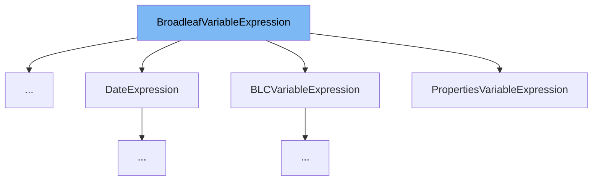

This document will cover the BroadleafVariableExpression interface. We'll cover:

1. What BroadleafVariableExpression is and its purpose.
2. The variables and functions defined in BroadleafVariableExpression.
3. An example of how to use BroadleafVariableExpression in BRCVariableExpression.



# What is BroadleafVariableExpression

BroadleafVariableExpression is an interface in the BroadleafCommerce-demo repository. It is designed to be implemented by classes that need to be exposed to the Thymeleaf expression evaluation context. For example, if an implementing class defines its name as 'theme' and has a method called attr(String name), that method could then be invoked by ${#theme.attr('someName')}.

<SwmSnippet path="/common/src/main/java/org/broadleafcommerce/common/web/expression/BroadleafVariableExpression.java" line="29">

---

# Variables and functions

The function `getName` is a method that is expected to be implemented by any class that implements the BroadleafVariableExpression interface. It is expected to return a String which represents the name of the implementing class.

```java
    public String getName();
```

---

</SwmSnippet>

<SwmSnippet path="/common/src/main/java/org/broadleafcommerce/common/web/expression/BRCVariableExpression.java" line="50">

---

# Usage example

Here is an example of how BroadleafVariableExpression is used in BRCVariableExpression. BRCVariableExpression implements BroadleafVariableExpression, indicating that it can be exposed to the Thymeleaf expression evaluation context.

```java
public class BRCVariableExpression implements BroadleafVariableExpression {
```

---

</SwmSnippet>

&nbsp;

*This is an auto-generated document by Swimm AI 🌊 and has not yet been verified by a human*

<SwmMeta version="3.0.0" repo-id="Z2l0aHViJTNBJTNBQnJvYWRsZWFmQ29tbWVyY2UtZGVtbyUzQSUzQWdpbGFkbmF2b3Q=" repo-name="BroadleafCommerce-demo" doc-type="class"><sup>Powered by [Swimm](/)</sup></SwmMeta>
