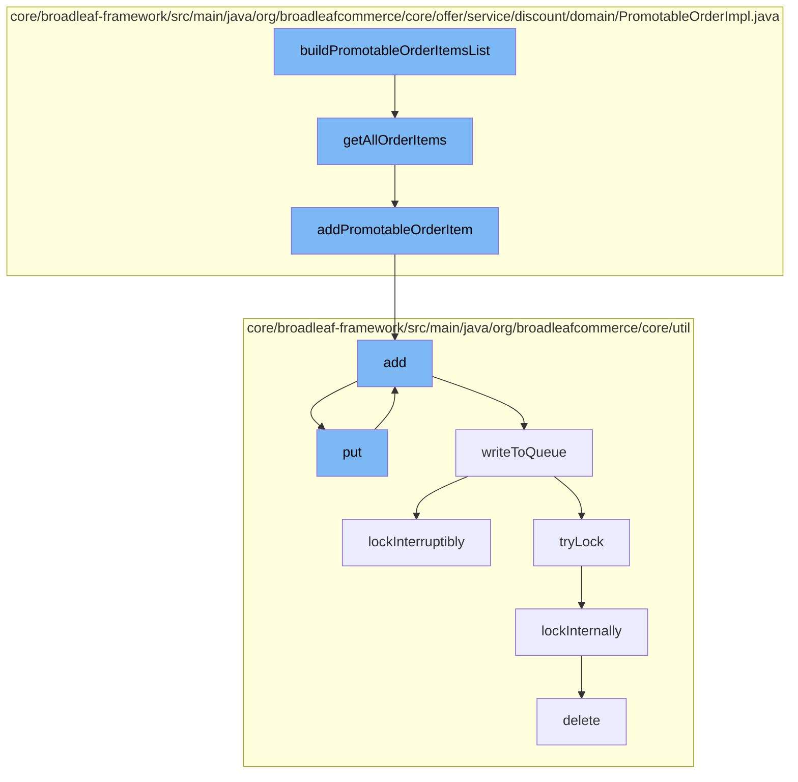

This document will cover the process of building a list of promotable order items in the BroadleafCommerce-demo repository. The process includes the following steps:

1. Building the list of promotable order items
2. Adding each order item to the list
3. Adding the item to the cache
4. Writing the item to the distributed queue
5. Locking the queue for writing
6. Deleting the lock once the operation is complete.



<SwmSnippet path="/core/broadleaf-framework/src/main/java/org/broadleafcommerce/core/offer/service/discount/domain/PromotableOrderImpl.java" line="89">

---

# Building the list of promotable order items

The `buildPromotableOrderItemsList` function starts the process by calling the `getAllOrderItems` function. This function initializes an empty list of `PromotableOrderItem` objects and then iterates over all the order items in the order, adding each one to the list.

```java
    @Override
    public List<PromotableOrderItem> getAllOrderItems() {
        if (allOrderItems == null) {
            allOrderItems = new ArrayList<PromotableOrderItem>();

            for (OrderItem orderItem : order.getOrderItems()) {
                addPromotableOrderItem(orderItem, allOrderItems);
            }
        }

        return allOrderItems;
    }
```

---

</SwmSnippet>

<SwmSnippet path="/core/broadleaf-framework/src/main/java/org/broadleafcommerce/core/offer/service/discount/domain/PromotableOrderImpl.java" line="153">

---

# Adding each order item to the list

The `addPromotableOrderItem` function is called for each order item. It creates a new `PromotableOrderItem` object from the order item and adds it to the list of promotable order items.

```java
    protected void addPromotableOrderItem(OrderItem orderItem, List<PromotableOrderItem> discountableOrderItems) {
        PromotableOrderItem item = itemFactory.createPromotableOrderItem(orderItem, PromotableOrderImpl.this, includeOrderAndItemAdjustments);
        discountableOrderItems.add(item);
    }
```

---

</SwmSnippet>

<SwmSnippet path="/core/broadleaf-framework/src/main/java/org/broadleafcommerce/core/util/service/ResourcePurgeServiceImpl.java" line="593">

---

# Adding the item to the cache

The `add` function is called to add the item to the cache. If the item is not already in the cache, it is added with the current timestamp.

```java
        public Long add(Long entry) {
            if (! cache.containsKey(entry)) {
                return cache.put(entry, new Long(System.currentTimeMillis()));
            }
            return null;
        }
```

---

</SwmSnippet>

<SwmSnippet path="/core/broadleaf-framework/src/main/java/org/broadleafcommerce/core/util/queue/ZookeeperDistributedQueue.java" line="393">

---

# Writing the item to the distributed queue

The `put` function is called to write the item to the distributed queue. It creates a new list containing the item and calls the `writeToQueue` function to write the list to the queue.

```java
    @Override
    public void put(T e) throws InterruptedException {
        final ArrayList<T> elementsToAdd = new ArrayList<>();
        elementsToAdd.add(e);
        writeToQueue(elementsToAdd, -1L);
    }
```

---

</SwmSnippet>

<SwmSnippet path="/core/broadleaf-framework/src/main/java/org/broadleafcommerce/core/util/lock/ReentrantDistributedZookeeperLock.java" line="335">

---

# Locking the queue for writing

The `lockInterruptibly` function is called to lock the queue for writing. If the thread is interrupted before the lock can be acquired, an `InterruptedException` is thrown.

```java
    @Override
    public void lockInterruptibly() throws InterruptedException {
        if (Thread.interrupted()) {
            throw new InterruptedException("Thread was interrupted prior to trying to acquire the lock.");
        }
        
        lockInternally(-1L);
    }
```

---

</SwmSnippet>

<SwmSnippet path="/core/broadleaf-framework/src/main/java/org/broadleafcommerce/core/util/dao/CodeTypeDaoImpl.java" line="51">

---

# Deleting the lock once the operation is complete

The `delete` function is called to delete the lock once the operation is complete. It removes the lock from the entity manager.

```java
    public void delete(CodeType codeType) {
        if (!em.contains(codeType)) {
            codeType = (CodeType) em.find(CodeTypeImpl.class, codeType.getId());
        }
        em.remove(codeType);
    }
```

---

</SwmSnippet>

&nbsp;

*This is an auto-generated document by Swimm AI 🌊 and has not yet been verified by a human*

<SwmMeta version="3.0.0" repo-id="Z2l0aHViJTNBJTNBQnJvYWRsZWFmQ29tbWVyY2UtZGVtbyUzQSUzQWdpbGFkbmF2b3Q=" repo-name="BroadleafCommerce-demo" doc-type="flows"><sup>Powered by [Swimm](/)</sup></SwmMeta>
