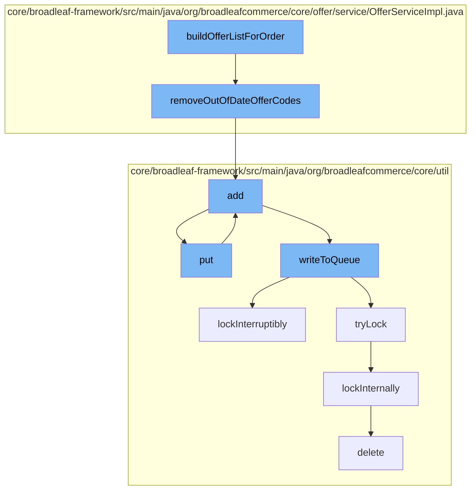

This document will cover the process of building an offer list for an order in the BroadleafCommerce-demo repository. The process includes the following steps:

1. Building the offer list
2. Removing out of date offer codes
3. Adding the offer codes to a resource purge service
4. Putting the offer codes into a distributed queue
5. Writing the offer codes to the queue
6. Locking the process to prevent data inconsistency
7. Deleting the offer codes from the database.



<SwmSnippet path="/core/broadleaf-framework/src/main/java/org/broadleafcommerce/core/offer/service/OfferServiceImpl.java" line="1">

---

# Building the offer list

The `buildOfferListForOrder` function is the starting point of the process. It is responsible for constructing the initial list of offers for an order.

```java
/*-
 * #%L
 * BroadleafCommerce Framework
 * %%
 * Copyright (C) 2009 - 2024 Broadleaf Commerce
 * %%
 * Licensed under the Broadleaf Fair Use License Agreement, Version 1.0
 * (the "Fair Use License" located  at http://license.broadleafcommerce.org/fair_use_license-1.0.txt)
 * unless the restrictions on use therein are violated and require payment to Broadleaf in which case
 * the Broadleaf End User License Agreement (EULA), Version 1.1
```

---

</SwmSnippet>

<SwmSnippet path="/core/broadleaf-framework/src/main/java/org/broadleafcommerce/core/offer/service/OfferServiceImpl.java" line="287">

---

# Removing out of date offer codes

The `removeOutOfDateOfferCodes` function is called to filter out any offer codes that are no longer valid. This includes offer codes that have expired or have a start date in the future.

```java
    /**
     * Removes all out of date offerCodes based on the offerCode and its offer's start and end
     * date.  If an offerCode has a later start date, that offerCode will be removed.
     * OfferCodes without a start date will still be processed. If the offerCode
     * has a end date that has already passed, that offerCode will be removed.  OfferCodes
     * without a end date will be processed.  The start and end dates on the offer will
     * still need to be evaluated.
     *
     * @param offerCodes
     * @return a List of non-expired offers
     */
    protected List<OfferCode> removeOutOfDateOfferCodes(List<OfferCode> offerCodes){
        List<OfferCode> offerCodesToRemove = new ArrayList<OfferCode>();
        for (OfferCode offerCode : offerCodes) {
            if (!offerCode.isActive()){
                offerCodesToRemove.add(offerCode);
            }
        }
        // remove all offers in the offersToRemove list from original offers list
        for (OfferCode offerCode : offerCodesToRemove) {
            offerCodes.remove(offerCode);
```

---

</SwmSnippet>

<SwmSnippet path="/core/broadleaf-framework/src/main/java/org/broadleafcommerce/core/util/service/ResourcePurgeServiceImpl.java" line="593">

---

# Adding the offer codes to a resource purge service

The `add` function is used to add the valid offer codes to a resource purge service. This service is responsible for managing resources that need to be cleaned up at a later time.

```java
        public Long add(Long entry) {
            if (! cache.containsKey(entry)) {
                return cache.put(entry, new Long(System.currentTimeMillis()));
            }
            return null;
        }
```

---

</SwmSnippet>

<SwmSnippet path="/core/broadleaf-framework/src/main/java/org/broadleafcommerce/core/util/queue/ZookeeperDistributedQueue.java" line="393">

---

# Putting the offer codes into a distributed queue

The `put` function is used to add the offer codes to a distributed queue. This queue is used to manage the processing of the offer codes in a distributed system.

```java
    @Override
    public void put(T e) throws InterruptedException {
        final ArrayList<T> elementsToAdd = new ArrayList<>();
        elementsToAdd.add(e);
        writeToQueue(elementsToAdd, -1L);
    }
```

---

</SwmSnippet>

<SwmSnippet path="/core/broadleaf-framework/src/main/java/org/broadleafcommerce/core/util/queue/ZookeeperDistributedQueue.java" line="503">

---

# Writing the offer codes to the queue

The `writeToQueue` function is used to write the offer codes to the queue. This function handles the serialization of the offer codes and ensures they are correctly added to the queue.

```java
    protected int writeToQueue(List<? extends T> entries, final long timeout) throws InterruptedException {
        if (entries == null || entries.isEmpty()) {
            return 0;
        }
        
        int entryCount = 0;
        long waitTime = timeout;
        synchronized (QUEUE_MONITOR) {
            while (true) {
                boolean locked = false;
                DistributedLock lock = getQueueAccessLock();
                if (timeout < 0L) {
                    lock.lockInterruptibly();
                    locked = true;
                } else if (timeout > 0L && waitTime > 0L) {
                    long start = System.currentTimeMillis();
                    locked = lock.tryLock(waitTime, TimeUnit.MILLISECONDS);
                    long end = System.currentTimeMillis();
                    waitTime -= (end - start);
                } else {
                    locked = lock.tryLock();
```

---

</SwmSnippet>

<SwmSnippet path="/core/broadleaf-framework/src/main/java/org/broadleafcommerce/core/util/lock/ReentrantDistributedZookeeperLock.java" line="335">

---

# Locking the process to prevent data inconsistency

The `lockInterruptibly` function is used to lock the process. This is necessary to prevent data inconsistency when multiple processes are trying to write to the queue at the same time.

```java
    @Override
    public void lockInterruptibly() throws InterruptedException {
        if (Thread.interrupted()) {
            throw new InterruptedException("Thread was interrupted prior to trying to acquire the lock.");
        }
        
        lockInternally(-1L);
    }
```

---

</SwmSnippet>

<SwmSnippet path="/core/broadleaf-framework/src/main/java/org/broadleafcommerce/core/util/dao/CodeTypeDaoImpl.java" line="51">

---

# Deleting the offer codes from the database

Finally, the `delete` function is used to remove the offer codes from the database. This is the final step in the process and ensures that the database is kept up to date.

```java
    public void delete(CodeType codeType) {
        if (!em.contains(codeType)) {
            codeType = (CodeType) em.find(CodeTypeImpl.class, codeType.getId());
        }
        em.remove(codeType);
    }
```

---

</SwmSnippet>

&nbsp;

*This is an auto-generated document by Swimm AI 🌊 and has not yet been verified by a human*

<SwmMeta version="3.0.0" repo-id="Z2l0aHViJTNBJTNBQnJvYWRsZWFmQ29tbWVyY2UtZGVtbyUzQSUzQWdpbGFkbmF2b3Q=" repo-name="BroadleafCommerce-demo" doc-type="flows"><sup>Powered by [Swimm](/)</sup></SwmMeta>
