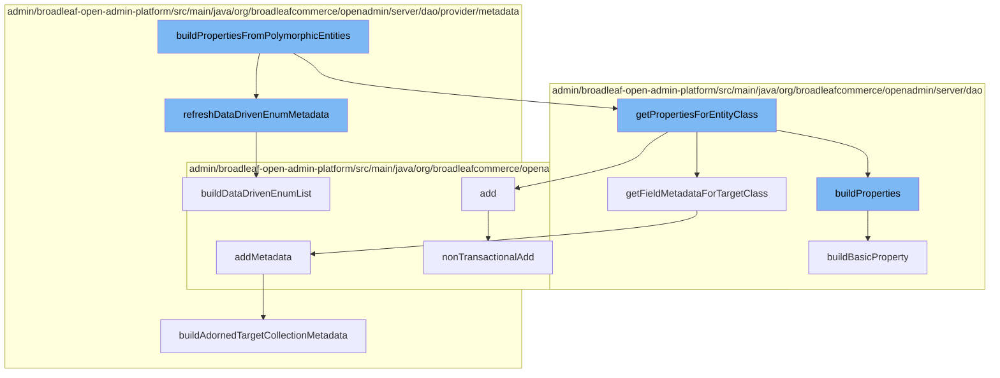

This document will cover the process of building properties from polymorphic entities in the BroadleafCommerce-demo repository. The process includes the following steps:

1. Refreshing data-driven enum metadata
2. Getting properties for entity class
3. Adding metadata
4. Building adorned target collection metadata
5. Non-transactional addition of data
6. Building basic property
7. Building data-driven enum list.



<SwmSnippet path="/admin/broadleaf-open-admin-platform/src/main/java/org/broadleafcommerce/openadmin/server/dao/provider/metadata/BasicFieldMetadataProvider.java" line="742">

---

# Refreshing Data-Driven Enum Metadata

The `refreshDataDrivenEnumMetadata` function is used to build a list of data-driven enums. This is the first step in the process of building properties from polymorphic entities.

```java
    public void refreshDataDrivenEnumMetadata(BasicFieldMetadata metadata){
        buildDataDrivenEnumList(metadata);
    }
```

---

</SwmSnippet>

<SwmSnippet path="/admin/broadleaf-open-admin-platform/src/main/java/org/broadleafcommerce/openadmin/server/dao/DynamicEntityDaoImpl.java" line="1086">

---

# Getting Properties for Entity Class

The `getPropertiesForEntityClass` function is used to build properties for a given entity class. This includes basic properties, component properties, and entity properties.

```java
    protected void buildProperties(
            Class<?> targetClass,
            ForeignKey foreignField,
            ForeignKey[] additionalForeignFields,
            String[] additionalNonPersistentProperties,
            MergedPropertyType mergedPropertyType,
            Map<String, FieldMetadata> presentationAttributes,
            List<Property> componentProperties,
            Map<String, FieldMetadata> fields,
            List<String> propertyNames,
            List<Type> propertyTypes,
            String idProperty,
            Boolean populateManyToOneFields,
            String[] includeFields,
            String[] excludeFields,
            String configurationKey,
            String ceilingEntityFullyQualifiedClassname,
            List<Class<?>> parentClasses,
            String prefix,
            Boolean isParentExcluded,
            Boolean isComponentPrefix,
```

---

</SwmSnippet>

<SwmSnippet path="/admin/broadleaf-open-admin-platform/src/main/java/org/broadleafcommerce/openadmin/server/dao/provider/metadata/AdornedTargetCollectionFieldMetadataProvider.java" line="84">

---

# Adding Metadata

The `addMetadata` function is used to add metadata from the field type. This metadata is used later in the process to build adorned target collection metadata.

```java
    @Override
    public MetadataProviderResponse addMetadata(AddFieldMetadataRequest addMetadataRequest, Map<String, FieldMetadata> metadata) {
        if (!canHandleFieldForConfiguredMetadata(addMetadataRequest, metadata)) {
            return MetadataProviderResponse.NOT_HANDLED;
        }
        AdminPresentationAdornedTargetCollection annot = addMetadataRequest.getRequestedField().getAnnotation(AdminPresentationAdornedTargetCollection.class);
        FieldInfo info = buildFieldInfo(addMetadataRequest.getRequestedField());
        FieldMetadataOverride override = constructAdornedTargetCollectionMetadataOverride(annot);
        buildAdornedTargetCollectionMetadata(addMetadataRequest.getParentClass(), addMetadataRequest.getTargetClass(), metadata, info, override, addMetadataRequest.getDynamicEntityDao());
        setClassOwnership(addMetadataRequest.getParentClass(), addMetadataRequest.getTargetClass(), metadata, info);
        return MetadataProviderResponse.HANDLED;
    }
```

---

</SwmSnippet>

<SwmSnippet path="/admin/broadleaf-open-admin-platform/src/main/java/org/broadleafcommerce/openadmin/server/dao/provider/metadata/AdornedTargetCollectionFieldMetadataProvider.java" line="335">

---

# Building Adorned Target Collection Metadata

The `buildAdornedTargetCollectionMetadata` function is used to build metadata for an adorned target collection. This includes setting various properties such as the target class, field name, and sort property.

```java
    protected void buildAdornedTargetCollectionMetadata(Class<?> parentClass, Class<?> targetClass, Map<String, FieldMetadata> attributes, FieldInfo field, FieldMetadataOverride adornedTargetCollectionMetadata, DynamicEntityDao dynamicEntityDao) {
        AdornedTargetCollectionMetadata serverMetadata = (AdornedTargetCollectionMetadata) attributes.get(field.getName());

        Class<?> resolvedClass = parentClass == null ? targetClass : parentClass;
        AdornedTargetCollectionMetadata metadata;
        if (serverMetadata != null) {
            metadata = serverMetadata;
        } else {
            metadata = new AdornedTargetCollectionMetadata();
        }
        metadata.setTargetClass(targetClass.getName());
        metadata.setFieldName(field.getName());

        if (adornedTargetCollectionMetadata.getReadOnly() != null) {
            metadata.setMutable(!adornedTargetCollectionMetadata.getReadOnly());
        }
        if (adornedTargetCollectionMetadata.getShowIfProperty() != null) {
            metadata.setShowIfProperty(adornedTargetCollectionMetadata.getShowIfProperty());
        }
        if (adornedTargetCollectionMetadata.getShowIfFieldEquals() != null) {
            metadata.setShowIfFieldEquals(adornedTargetCollectionMetadata.getShowIfFieldEquals());
```

---

</SwmSnippet>

<SwmSnippet path="/admin/broadleaf-open-admin-platform/src/main/java/org/broadleafcommerce/openadmin/server/service/DynamicEntityRemoteService.java" line="274">

---

# Non-Transactional Addition of Data

The `nonTransactionalAdd` function is used to add data to the persistence manager in a non-transactional manner. This is used when adding new data to the system.

```java
    @Override
    public PersistenceResponse nonTransactionalAdd(final PersistencePackage persistencePackage) throws ServiceException {
        return persistenceThreadManager.operation(TargetModeType.SANDBOX, persistencePackage, new Persistable <PersistenceResponse, ServiceException>() {
            @Override
            public PersistenceResponse execute() throws ServiceException {
                boolean shouldClean = isShouldClean();
                if (shouldClean && (CollectionUtils.isEmpty(entitiesIgnoreList) ||
                        !entitiesIgnoreList.contains(persistencePackage.getCeilingEntityFullyQualifiedClassname()))) {
                    cleanEntity(persistencePackage.getEntity());
                }
                try {
                    PersistenceManager persistenceManager = PersistenceManagerFactory.getPersistenceManager();
                    return persistenceManager.add(persistencePackage);
                } catch (ServiceException e) {
                    //immediately throw validation exceptions without printing a stack trace
                    if (e instanceof ValidationException) {
                        throw e;
                    } else if (e.getCause() instanceof ValidationException) {
                        throw (ValidationException) e.getCause();
                    }
                    String message = exploitProtectionService.cleanString(e.getMessage());
```

---

</SwmSnippet>

<SwmSnippet path="/admin/broadleaf-open-admin-platform/src/main/java/org/broadleafcommerce/openadmin/server/dao/DynamicEntityDaoImpl.java" line="1259">

---

# Building Basic Property

The `buildBasicProperty` function is used to build a basic property for an entity. This includes setting various properties such as the field name, type, and foreign key.

```java
    protected void buildBasicProperty(
            Field field,
            Class<?> targetClass,
            ForeignKey foreignField,
            ForeignKey[] additionalForeignFields,
            String[] additionalNonPersistentProperties,
            MergedPropertyType mergedPropertyType,
            Map<String, FieldMetadata> presentationAttributes,
            List<Property> componentProperties,
            Map<String, FieldMetadata> fields,
            String idProperty,
            Boolean populateManyToOneFields,
            String[] includeFields,
            String[] excludeFields,
            String configurationKey,
            String ceilingEntityFullyQualifiedClassname,
            List<Class<?>> parentClasses,
            String prefix,
            Boolean isParentExcluded,
            String propertyName,
            Type type,
```

---

</SwmSnippet>

<SwmSnippet path="/admin/broadleaf-open-admin-platform/src/main/java/org/broadleafcommerce/openadmin/server/dao/provider/metadata/BasicFieldMetadataProvider.java" line="690">

---

# Building Data-Driven Enum List

The `buildDataDrivenEnumList` function is used to build a list of data-driven enums. This is used when refreshing data-driven enum metadata.

```java
    protected void buildDataDrivenEnumList(BasicFieldMetadata metadata) {
        try {
            DynamicEntityDao dynamicEntityDao = PersistenceManagerFactory.getDefaultPersistenceManager().getDynamicEntityDao();
            FieldManager fieldManager = dynamicEntityDao.getFieldManager();

            Class criteriaClass = Class.forName(metadata.getOptionListEntity());

            CriteriaBuilder builder = dynamicEntityDao.getStandardEntityManager().getCriteriaBuilder();
            CriteriaQuery criteria = builder.createQuery(criteriaClass);
            Root root = criteria.from(criteriaClass);
            List<Predicate> restrictions = new ArrayList<>();

            if (metadata.getOptionListEntity().equals(DataDrivenEnumerationValueImpl.class.getName())) {
                restrictions.add(builder.equal(root.get("hidden"), false));
            }

            if (metadata.getOptionFilterParams() != null) {
                for (String[] param : metadata.getOptionFilterParams()) {
                    Path current = root;
                    String key = param[0];
                    if (!key.equals(".ignore")) {
```

---

</SwmSnippet>

&nbsp;

*This is an auto-generated document by Swimm AI 🌊 and has not yet been verified by a human*

<SwmMeta version="3.0.0" repo-id="Z2l0aHViJTNBJTNBQnJvYWRsZWFmQ29tbWVyY2UtZGVtbyUzQSUzQWdpbGFkbmF2b3Q=" repo-name="BroadleafCommerce-demo" doc-type="flows"><sup>Powered by [Swimm](/)</sup></SwmMeta>
