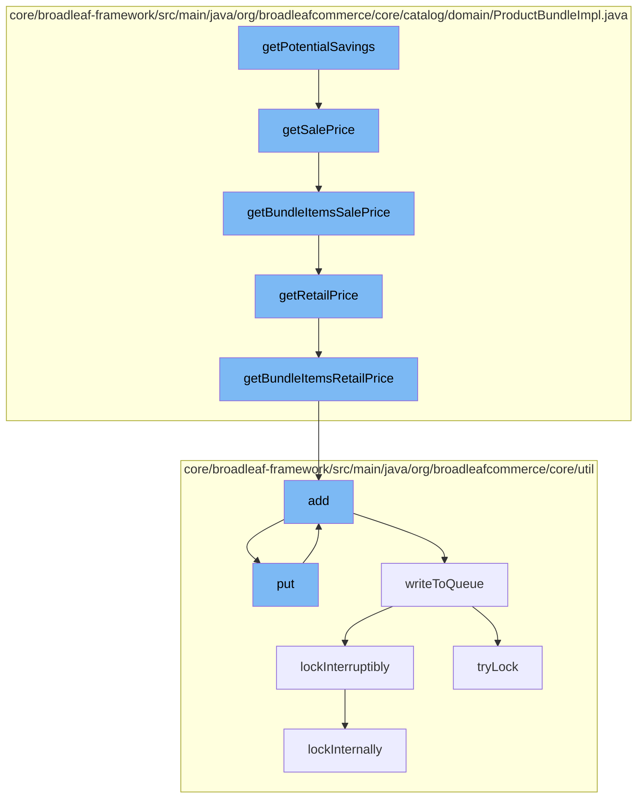

This document will cover the process of calculating potential savings for a product bundle in the BroadleafCommerce-demo repository. The process includes the following steps:

1. Invoking the `getPotentialSavings` function
2. Calculating the sale price of the bundle
3. Calculating the retail price of the bundle
4. Adding the calculated price to a cache
5. Writing the cache to a distributed queue.



<SwmSnippet path="/core/broadleaf-framework/src/main/java/org/broadleafcommerce/core/catalog/domain/ProductBundleImpl.java" line="125">

---

# Invoking the `getPotentialSavings` function

The `getPotentialSavings` function starts the process by calling the `getSalePrice` function to calculate the sale price of the product bundle.

```java
    @Override
    public Money getSalePrice() {
        if (ProductBundlePricingModelType.ITEM_SUM.equals(getPricingModel())) {
            return getBundleItemsSalePrice();
        } else if (ProductBundlePricingModelType.BUNDLE.equals(getPricingModel())) {
            return super.getDefaultSku().getSalePrice();
        }
        return null;
    }
```

---

</SwmSnippet>

<SwmSnippet path="/core/broadleaf-framework/src/main/java/org/broadleafcommerce/core/catalog/domain/ProductBundleImpl.java" line="125">

---

# Calculating the sale price of the bundle

The `getSalePrice` function calculates the sale price of the product bundle. If the pricing model of the product bundle is `ITEM_SUM`, it calls the `getBundleItemsSalePrice` function to calculate the sale price based on the individual items in the bundle. If the pricing model is `BUNDLE`, it retrieves the sale price from the default SKU of the product bundle.

```java
    @Override
    public Money getSalePrice() {
        if (ProductBundlePricingModelType.ITEM_SUM.equals(getPricingModel())) {
            return getBundleItemsSalePrice();
        } else if (ProductBundlePricingModelType.BUNDLE.equals(getPricingModel())) {
            return super.getDefaultSku().getSalePrice();
        }
        return null;
    }
```

---

</SwmSnippet>

<SwmSnippet path="/core/broadleaf-framework/src/main/java/org/broadleafcommerce/core/catalog/domain/ProductBundleImpl.java" line="115">

---

# Calculating the retail price of the bundle

The `getRetailPrice` function calculates the retail price of the product bundle. Similar to the `getSalePrice` function, it calls the `getBundleItemsRetailPrice` function if the pricing model is `ITEM_SUM` and retrieves the retail price from the default SKU if the pricing model is `BUNDLE`.

```java
    @Override
    public Money getRetailPrice() {
        if (ProductBundlePricingModelType.ITEM_SUM.equals(getPricingModel())) {
            return getBundleItemsRetailPrice();
        } else if (ProductBundlePricingModelType.BUNDLE.equals(getPricingModel())) {
            return super.getDefaultSku().getRetailPrice();
        }
        return null;
    }
```

---

</SwmSnippet>

<SwmSnippet path="/core/broadleaf-framework/src/main/java/org/broadleafcommerce/core/util/service/ResourcePurgeServiceImpl.java" line="593">

---

# Adding the calculated price to a cache

The `add` function in `ResourcePurgeServiceImpl` is used to add the calculated price to a cache. If the price is not already in the cache, it is added with the current timestamp.

```java
        public Long add(Long entry) {
            if (! cache.containsKey(entry)) {
                return cache.put(entry, new Long(System.currentTimeMillis()));
            }
            return null;
        }
```

---

</SwmSnippet>

<SwmSnippet path="/core/broadleaf-framework/src/main/java/org/broadleafcommerce/core/util/queue/ZookeeperDistributedQueue.java" line="393">

---

# Writing the cache to a distributed queue

The `put` function in `ZookeeperDistributedQueue` is used to write the cache to a distributed queue. It calls the `writeToQueue` function to perform the actual write operation.

```java
    @Override
    public void put(T e) throws InterruptedException {
        final ArrayList<T> elementsToAdd = new ArrayList<>();
        elementsToAdd.add(e);
        writeToQueue(elementsToAdd, -1L);
    }
```

---

</SwmSnippet>

&nbsp;

*This is an auto-generated document by Swimm AI 🌊 and has not yet been verified by a human*

<SwmMeta version="3.0.0" repo-id="Z2l0aHViJTNBJTNBQnJvYWRsZWFmQ29tbWVyY2UtZGVtbyUzQSUzQWdpbGFkbmF2b3Q=" repo-name="BroadleafCommerce-demo" doc-type="flows"><sup>Powered by [Swimm](/)</sup></SwmMeta>
