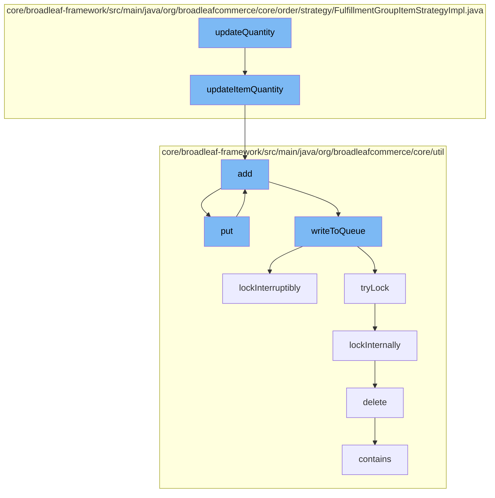

This document will cover the process of updating the quantity of items in a cart in the BroadleafCommerce-demo project. The process includes the following steps:

1. Updating the quantity of an item in the cart
2. Adding the updated item to the resource purge service
3. Adding the updated item to the Zookeeper distributed queue
4. Writing the updated item to the queue
5. Locking the queue to prevent concurrent modifications
6. Deleting the old item from the code type data access object (DAO)
7. Checking if the updated item is in the queue.



<SwmSnippet path="/core/broadleaf-framework/src/main/java/org/broadleafcommerce/core/order/strategy/FulfillmentGroupItemStrategyImpl.java" line="247">

---

# Updating the quantity of an item in the cart

The `updateItemQuantity` function is responsible for updating the quantity of an item in the cart. It checks if the quantity has been incremented or decremented and updates the quantity accordingly.

```java
    protected List<FulfillmentGroupItem> updateItemQuantity(Order order, OrderItem orderItem, 
            Integer orderItemQuantityDelta) throws PricingException {
        List<FulfillmentGroupItem> fgisToDelete = new ArrayList<FulfillmentGroupItem>();
        boolean done = false;
        
        if (orderItemQuantityDelta > 0) {
            // If the quantity is now greater, we can simply add quantity to the first
            // fulfillment group we find that has that order item in it. 
            for (FulfillmentGroup fg : order.getFulfillmentGroups()) {
                for (FulfillmentGroupItem fgItem : fg.getFulfillmentGroupItems()) {
                    if (!done && fgItem.getOrderItem().equals(orderItem)) {
                        fgItem.setQuantity(fgItem.getQuantity() + orderItemQuantityDelta);
                        done = true;
                    }
                }
            }
        } else {
            // The quantity has been decremented. We must ensure that the appropriate number
            // of fulfillment group items are decremented as well.
            int remainingToDecrement = -1 * orderItemQuantityDelta;
            
```

---

</SwmSnippet>

<SwmSnippet path="/core/broadleaf-framework/src/main/java/org/broadleafcommerce/core/util/service/ResourcePurgeServiceImpl.java" line="593">

---

# Adding the updated item to the resource purge service

The `add` function in the `ResourcePurgeServiceImpl` class is used to add the updated item to the resource purge service. It checks if the item is already in the cache and if not, it adds the item to the cache.

```java
        public Long add(Long entry) {
            if (! cache.containsKey(entry)) {
                return cache.put(entry, new Long(System.currentTimeMillis()));
            }
            return null;
        }
```

---

</SwmSnippet>

<SwmSnippet path="/core/broadleaf-framework/src/main/java/org/broadleafcommerce/core/util/queue/ZookeeperDistributedQueue.java" line="359">

---

# Adding the updated item to the Zookeeper distributed queue

The `add` function in the `ZookeeperDistributedQueue` class is used to add the updated item to the Zookeeper distributed queue. It tries to write the item to the queue and if the queue is full, it throws an exception.

```java
    @Override
    public boolean add(T e) {
        try {
            final ArrayList<T> lst = new ArrayList<>();
            lst.add(e);
            int count = writeToQueue(lst, 0L);
            if (count != 1) {
                throw new IllegalStateException("The Zookeeper queue was full.");
            } else {
                return true;
            }
        } catch (InterruptedException ex) {
            Thread.currentThread().interrupt();
            return false;
        }
    }
```

---

</SwmSnippet>

<SwmSnippet path="/core/broadleaf-framework/src/main/java/org/broadleafcommerce/core/util/queue/ZookeeperDistributedQueue.java" line="503">

---

# Writing the updated item to the queue

The `writeToQueue` function in the `ZookeeperDistributedQueue` class is responsible for writing the updated item to the queue. It locks the queue to prevent concurrent modifications, writes the item to the queue, and then unlocks the queue.

```java
    protected int writeToQueue(List<? extends T> entries, final long timeout) throws InterruptedException {
        if (entries == null || entries.isEmpty()) {
            return 0;
        }
        
        int entryCount = 0;
        long waitTime = timeout;
        synchronized (QUEUE_MONITOR) {
            while (true) {
                boolean locked = false;
                DistributedLock lock = getQueueAccessLock();
                if (timeout < 0L) {
                    lock.lockInterruptibly();
                    locked = true;
                } else if (timeout > 0L && waitTime > 0L) {
                    long start = System.currentTimeMillis();
                    locked = lock.tryLock(waitTime, TimeUnit.MILLISECONDS);
                    long end = System.currentTimeMillis();
                    waitTime -= (end - start);
                } else {
                    locked = lock.tryLock();
```

---

</SwmSnippet>

<SwmSnippet path="/core/broadleaf-framework/src/main/java/org/broadleafcommerce/core/util/lock/ReentrantDistributedZookeeperLock.java" line="335">

---

# Locking the queue to prevent concurrent modifications

The `lockInterruptibly` function in the `ReentrantDistributedZookeeperLock` class is used to lock the queue to prevent concurrent modifications. It throws an exception if the thread was interrupted before trying to acquire the lock.

```java
    @Override
    public void lockInterruptibly() throws InterruptedException {
        if (Thread.interrupted()) {
            throw new InterruptedException("Thread was interrupted prior to trying to acquire the lock.");
        }
        
        lockInternally(-1L);
    }
```

---

</SwmSnippet>

<SwmSnippet path="/core/broadleaf-framework/src/main/java/org/broadleafcommerce/core/util/dao/CodeTypeDaoImpl.java" line="51">

---

# Deleting the old item from the code type data access object (DAO)

The `delete` function in the `CodeTypeDaoImpl` class is used to delete the old item from the code type DAO. It checks if the item is in the entity manager and if so, it removes the item.

```java
    public void delete(CodeType codeType) {
        if (!em.contains(codeType)) {
            codeType = (CodeType) em.find(CodeTypeImpl.class, codeType.getId());
        }
        em.remove(codeType);
    }
```

---

</SwmSnippet>

<SwmSnippet path="/core/broadleaf-framework/src/main/java/org/broadleafcommerce/core/util/queue/ZookeeperDistributedQueue.java" line="474">

---

# Checking if the updated item is in the queue

The `contains` function in the `ZookeeperDistributedQueue` class is used to check if the updated item is in the queue. It checks if the queue contains the item.

```java
    @Override
    public boolean contains(Object o) {
        return containsAll(Collections.singletonList(o));
    }
```

---

</SwmSnippet>

&nbsp;

*This is an auto-generated document by Swimm AI 🌊 and has not yet been verified by a human*

<SwmMeta version="3.0.0" repo-id="Z2l0aHViJTNBJTNBQnJvYWRsZWFmQ29tbWVyY2UtZGVtbyUzQSUzQWdpbGFkbmF2b3Q=" repo-name="BroadleafCommerce-demo" doc-type="flows"><sup>Powered by [Swimm](/)</sup></SwmMeta>
