This document will cover the process of notifying and purging carts in the BroadleafCommerce-demo repository. We'll cover:

1. The initiation of the cart purge process
2. The retrieval of carts to be purged
3. The calculation of the number of carts to be purged
4. The addition of carts to a distributed queue for processing

```mermaid
graph TD;
subgraph core/broadleaf-framework/src/main/java/org/broadleafcommerce/core/util
  notifyCarts:::mainFlowStyle --> getCartsToPurge
end
subgraph core/broadleaf-framework/src/main/java/org/broadleafcommerce/core/util
  notifyCarts:::mainFlowStyle --> notifyCart
end
subgraph core/broadleaf-framework/src/main/java/org/broadleafcommerce/core/util
  notifyCarts:::mainFlowStyle --> getCartsToPurgeLength
end
subgraph core/broadleaf-framework/src/main/java/org/broadleafcommerce/core/util
  getCartsToPurge:::mainFlowStyle --> findCarts
end
subgraph core/broadleaf-framework/src/main/java/org/broadleafcommerce/core/util
  getCartsToPurgeLength:::mainFlowStyle --> findCartsCount
end
subgraph core/broadleaf-framework/src/main/java/org/broadleafcommerce/core/util
  findCartsCount:::mainFlowStyle --> buildCartQuery
end
subgraph core/broadleaf-framework/src/main/java/org/broadleafcommerce/core/util
  buildCartQuery:::mainFlowStyle --> applyLimitedInClause
end
subgraph core/broadleaf-framework/src/main/java/org/broadleafcommerce/core/util
  applyLimitedInClause --> add
end
subgraph core/broadleaf-framework/src/main/java/org/broadleafcommerce/core/util
  add --> put
end
subgraph core/broadleaf-framework/src/main/java/org/broadleafcommerce/core/util
  put --> add
end
subgraph core/broadleaf-framework/src/main/java/org/broadleafcommerce/core/util
  add --> writeToQueue
end
subgraph core/broadleaf-framework/src/main/java/org/broadleafcommerce/core/util
  writeToQueue --> lockInterruptibly
end
subgraph core/broadleaf-framework/src/main/java/org/broadleafcommerce/core/util
  writeToQueue --> tryLock
end
subgraph core/broadleaf-framework/src/main/java/org/broadleafcommerce/core/util
  lockInterruptibly --> lockInternally
end

classDef mainFlowStyle color:#000000,fill:#7CB9F4
classDef rootsStyle color:#000000,fill:#00FFF4
classDef Style1 color:#000000,fill:#00FFAA
classDef Style2 color:#000000,fill:#FFFF00
classDef Style3 color:#000000,fill:#AA7CB9
```



<SwmSnippet path="/core/broadleaf-framework/src/main/java/org/broadleafcommerce/core/util/service/ResourcePurgeServiceImpl.java" line="304">

---

# Initiation of the Cart Purge Process

The `notifyCarts` function initiates the cart purge process. It calls `getCartsToPurge`, `notifyCart`, and `getCartsToPurgeLength` functions to retrieve the carts to be purged, notify them, and calculate the number of carts to be purged respectively.

```java
    /**
     * Get the list of carts to delete from the database. Subclasses may override for custom cart retrieval logic.
     *
     * @param purgeParams configured parameters for the Cart purge process
     * @param cartsInError list of cart ids to be ignored/excluded from the query
     * @return list of carts to delete
     */
    protected List<Order> getCartsToPurge(CartPurgeParams purgeParams, int startPos, int length, List<Long> cartsInError) {
        String[] nameArray = purgeParams.getNameArray();
        OrderStatus[] statusArray = purgeParams.getStatusArray();
        Date dateCreatedMinThreshold = purgeParams.getDateCreatedMinThreshold();
        Boolean isPreview = purgeParams.getIsPreview();
        return resourcePurgeDao.findCarts(nameArray, statusArray, dateCreatedMinThreshold, isPreview, startPos, length, cartsInError);
    }
```

---

</SwmSnippet>

<SwmSnippet path="/core/broadleaf-framework/src/main/java/org/broadleafcommerce/core/util/dao/ResourcePurgeDaoImpl.java" line="55">

---

# Retrieval of Carts to be Purged

The `findCarts` function is used to retrieve the carts that need to be purged. It uses the `buildCartQuery` function to construct a query based on the provided parameters, which include names, statuses, dateCreatedMinThreshold, isPreview, and excludedIds.

```java
    @Override
    public List<Order> findCarts(String[] names, OrderStatus[] statuses, Date dateCreatedMinThreshold, Boolean isPreview,
            List<Long> excludedIds) {
        TypedQuery<Order> query = buildCartQuery(names, statuses, dateCreatedMinThreshold, isPreview, Order.class, excludedIds);
        return query.getResultList();
    }
```

---

</SwmSnippet>

<SwmSnippet path="/core/broadleaf-framework/src/main/java/org/broadleafcommerce/core/util/dao/ResourcePurgeDaoImpl.java" line="71">

---

# Calculation of the Number of Carts to be Purged

The `findCartsCount` function is used to calculate the number of carts to be purged. It also uses the `buildCartQuery` function to construct a query based on the provided parameters.

```java
    @Override
    public Long findCartsCount(String[] names, OrderStatus[] statuses, Date dateCreatedMinThreshold, Boolean isPreview,
            List<Long> excludedIds) {
        TypedQuery<Long> query = buildCartQuery(names, statuses, dateCreatedMinThreshold, isPreview, Long.class, excludedIds);
        return query.getSingleResult();
    }
```

---

</SwmSnippet>

<SwmSnippet path="/core/broadleaf-framework/src/main/java/org/broadleafcommerce/core/util/queue/ZookeeperDistributedQueue.java" line="393">

---

# Addition of Carts to a Distributed Queue for Processing

The `put` function is used to add the carts to a distributed queue for processing. It calls the `writeToQueue` function to write the carts to the queue.

```java
    @Override
    public void put(T e) throws InterruptedException {
        final ArrayList<T> elementsToAdd = new ArrayList<>();
        elementsToAdd.add(e);
        writeToQueue(elementsToAdd, -1L);
    }
```

---

</SwmSnippet>

&nbsp;

*This is an auto-generated document by Swimm AI 🌊 and has not yet been verified by a human*

<SwmMeta version="3.0.0" repo-id="Z2l0aHViJTNBJTNBQnJvYWRsZWFmQ29tbWVyY2UtZGVtbyUzQSUzQWdpbGFkbmF2b3Q=" repo-name="BroadleafCommerce-demo" doc-type="flows"><sup>Powered by [Swimm](/)</sup></SwmMeta>
