This document will cover the process of purging carts in the BroadleafCommerce-demo repository. The process includes the following steps:

1. Getting the list of carts to purge
2. Determining the number of carts to purge
3. Building the query to find the carts
4. Applying limitations to the query
5. Adding the carts to a cache
6. Writing the carts to a queue
7. Locking the process to prevent interruptions

```mermaid
graph TD;
subgraph core/broadleaf-framework/src/main/java/org/broadleafcommerce/core/util
  purgeCarts:::mainFlowStyle --> getCartsToPurge
end
subgraph core/broadleaf-framework/src/main/java/org/broadleafcommerce/core/util
  purgeCarts:::mainFlowStyle --> getCartsToPurgeLength
end
subgraph core/broadleaf-framework/src/main/java/org/broadleafcommerce/core/util
  getCartsToPurge:::mainFlowStyle --> findCarts
end
subgraph core/broadleaf-framework/src/main/java/org/broadleafcommerce/core/util
  getCartsToPurgeLength:::mainFlowStyle --> findCartsCount
end
subgraph core/broadleaf-framework/src/main/java/org/broadleafcommerce/core/util
  findCartsCount:::mainFlowStyle --> buildCartQuery
end
subgraph core/broadleaf-framework/src/main/java/org/broadleafcommerce/core/util
  buildCartQuery:::mainFlowStyle --> applyLimitedInClause
end
subgraph core/broadleaf-framework/src/main/java/org/broadleafcommerce/core/util
  applyLimitedInClause --> add
end
subgraph core/broadleaf-framework/src/main/java/org/broadleafcommerce/core/util
  add --> put
end
subgraph core/broadleaf-framework/src/main/java/org/broadleafcommerce/core/util
  put --> add
end
subgraph core/broadleaf-framework/src/main/java/org/broadleafcommerce/core/util
  add --> writeToQueue
end
subgraph core/broadleaf-framework/src/main/java/org/broadleafcommerce/core/util
  writeToQueue --> lockInterruptibly
end
subgraph core/broadleaf-framework/src/main/java/org/broadleafcommerce/core/util
  writeToQueue --> tryLock
end
subgraph core/broadleaf-framework/src/main/java/org/broadleafcommerce/core/util
  lockInterruptibly --> lockInternally
end

classDef mainFlowStyle color:#000000,fill:#7CB9F4
classDef rootsStyle color:#000000,fill:#00FFF4
classDef Style1 color:#000000,fill:#00FFAA
classDef Style2 color:#000000,fill:#FFFF00
classDef Style3 color:#000000,fill:#AA7CB9
```



<SwmSnippet path="/core/broadleaf-framework/src/main/java/org/broadleafcommerce/core/util/service/ResourcePurgeServiceImpl.java" line="304">

---

# Getting the list of carts to purge

The `getCartsToPurge` function is used to get the list of carts that need to be purged. It takes in parameters such as `purgeParams`, `startPos`, `length`, and `cartsInError` to determine which carts to retrieve.

```java
    /**
     * Get the list of carts to delete from the database. Subclasses may override for custom cart retrieval logic.
     *
     * @param purgeParams configured parameters for the Cart purge process
     * @param cartsInError list of cart ids to be ignored/excluded from the query
     * @return list of carts to delete
     */
    protected List<Order> getCartsToPurge(CartPurgeParams purgeParams, int startPos, int length, List<Long> cartsInError) {
        String[] nameArray = purgeParams.getNameArray();
        OrderStatus[] statusArray = purgeParams.getStatusArray();
        Date dateCreatedMinThreshold = purgeParams.getDateCreatedMinThreshold();
        Boolean isPreview = purgeParams.getIsPreview();
        return resourcePurgeDao.findCarts(nameArray, statusArray, dateCreatedMinThreshold, isPreview, startPos, length, cartsInError);
    }
```

---

</SwmSnippet>

<SwmSnippet path="/core/broadleaf-framework/src/main/java/org/broadleafcommerce/core/util/dao/ResourcePurgeDaoImpl.java" line="71">

---

# Determining the number of carts to purge

The `findCartsCount` function is used to determine the number of carts that need to be purged. It builds a query using the provided parameters and returns the count of carts that match the criteria.

```java
    @Override
    public Long findCartsCount(String[] names, OrderStatus[] statuses, Date dateCreatedMinThreshold, Boolean isPreview,
            List<Long> excludedIds) {
        TypedQuery<Long> query = buildCartQuery(names, statuses, dateCreatedMinThreshold, isPreview, Long.class, excludedIds);
        return query.getSingleResult();
    }
```

---

</SwmSnippet>

<SwmSnippet path="/core/broadleaf-framework/src/main/java/org/broadleafcommerce/core/util/dao/ResourcePurgeDaoImpl.java" line="161">

---

# Building the query to find the carts

The `buildCartQuery` function is used to build the query that will find the carts to be purged. It takes in parameters such as `names`, `statuses`, `dateCreatedMinThreshold`, `isPreview`, `returnType`, and `excludedIds` to build the query.

```java
    protected <T> TypedQuery<T> buildCartQuery(String[] names, OrderStatus[] statuses, Date dateCreatedMinThreshold, Boolean isPreview, Class<T> returnType,
            List<Long> excludedIds) {
        CriteriaBuilder builder = em.getCriteriaBuilder();
        CriteriaQuery<T> criteria = builder.createQuery(returnType);
        Root<OrderImpl> root = criteria.from(OrderImpl.class);
        if (Long.class.equals(returnType)) {
            criteria.select((Selection<? extends T>) builder.count(root));
        } else {
            criteria.select((Selection<? extends T>) root);
        }
        List<Predicate> restrictions = new ArrayList<Predicate>();
        List<String> statusList = new ArrayList<String>();
        if (statuses != null) {
            for (OrderStatus status : statuses) {
                statusList.add(status.getType());
            }
        } else {
            statusList.add("IN_PROCESS");
        }
        restrictions.add(root.get("status").in(statusList));
        if (names != null) {
```

---

</SwmSnippet>

<SwmSnippet path="/core/broadleaf-framework/src/main/java/org/broadleafcommerce/core/util/dao/ResourcePurgeDaoImpl.java" line="152">

---

# Applying limitations to the query

The `applyLimitedInClause` function is used to apply limitations to the query. It partitions the list of IDs into smaller lists and adds a restriction to the query for each list.

```java
    protected <T> void applyLimitedInClause(List<Long> ids, CriteriaBuilder builder, Root<T> root, List<Predicate> restrictions) {
        List<List<Long>> listsOfExcludeIds = Lists.partition(ids, RESTRICT_IN_CLAUSE_MAX_SIZE);
        List<Predicate> inRestrictions = new ArrayList<Predicate>();
        for (List<Long> idSetToExclude : listsOfExcludeIds) {
            inRestrictions.add(builder.not(root.get("id").in(idSetToExclude)));
        }
        restrictions.add(builder.and(inRestrictions.toArray(new Predicate[inRestrictions.size()])));
    }
```

---

</SwmSnippet>

<SwmSnippet path="/core/broadleaf-framework/src/main/java/org/broadleafcommerce/core/util/service/ResourcePurgeServiceImpl.java" line="593">

---

# Adding the carts to a cache

The `add` function is used to add the carts to a cache. If the cart is not already in the cache, it is added with the current time as the value.

```java
        public Long add(Long entry) {
            if (! cache.containsKey(entry)) {
                return cache.put(entry, new Long(System.currentTimeMillis()));
            }
            return null;
        }
```

---

</SwmSnippet>

<SwmSnippet path="/core/broadleaf-framework/src/main/java/org/broadleafcommerce/core/util/queue/ZookeeperDistributedQueue.java" line="393">

---

# Writing the carts to a queue

The `put` function is used to write the carts to a queue. It creates a list of entries and writes them to the queue.

```java
    @Override
    public void put(T e) throws InterruptedException {
        final ArrayList<T> elementsToAdd = new ArrayList<>();
        elementsToAdd.add(e);
        writeToQueue(elementsToAdd, -1L);
    }
```

---

</SwmSnippet>

<SwmSnippet path="/core/broadleaf-framework/src/main/java/org/broadleafcommerce/core/util/lock/ReentrantDistributedZookeeperLock.java" line="335">

---

# Locking the process to prevent interruptions

The `lockInterruptibly` function is used to lock the process to prevent interruptions. If the thread is interrupted before trying to acquire the lock, an `InterruptedException` is thrown.

```java
    @Override
    public void lockInterruptibly() throws InterruptedException {
        if (Thread.interrupted()) {
            throw new InterruptedException("Thread was interrupted prior to trying to acquire the lock.");
        }
        
        lockInternally(-1L);
    }
```

---

</SwmSnippet>

&nbsp;

*This is an auto-generated document by Swimm AI 🌊 and has not yet been verified by a human*

<SwmMeta version="3.0.0" repo-id="Z2l0aHViJTNBJTNBQnJvYWRsZWFmQ29tbWVyY2UtZGVtbyUzQSUzQWdpbGFkbmF2b3Q=" repo-name="BroadleafCommerce-demo" doc-type="flows"><sup>Powered by [Swimm](/)</sup></SwmMeta>
