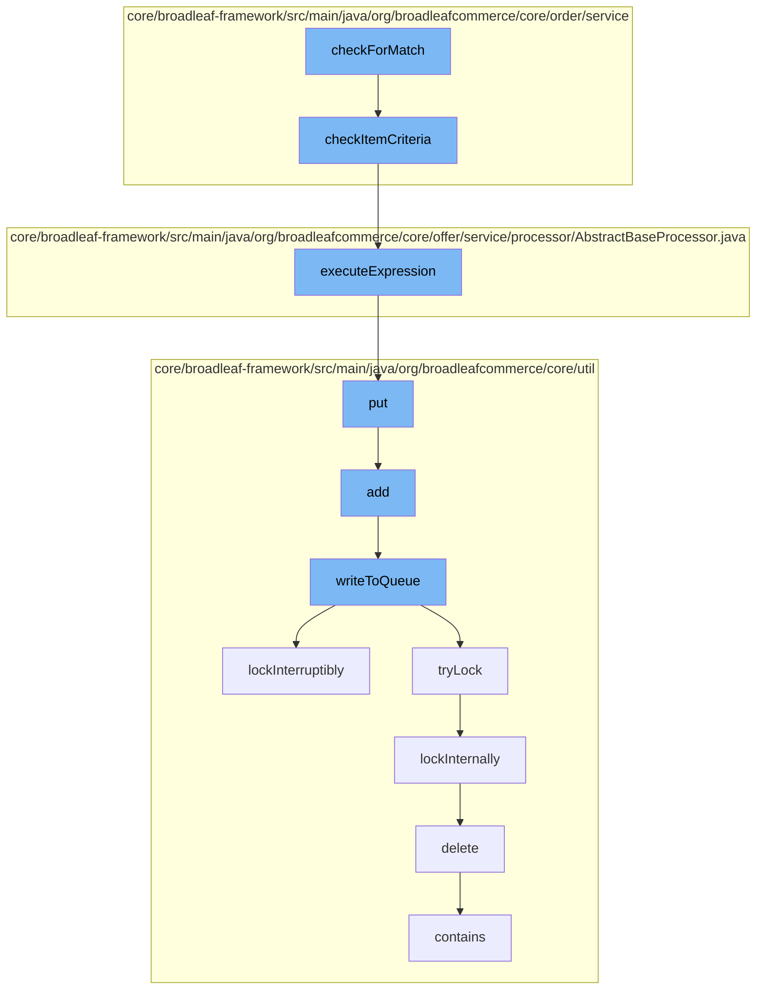

This document will cover the process of evaluating and applying cart rules in the Broadleaf Commerce framework. The process includes:

1. Checking for a match in cart rules
2. Evaluating item criteria
3. Executing the rule expression
4. Adding the result to a distributed queue
5. Locking the queue for thread-safe operations
6. Deleting the lock once the operation is complete.



<SwmSnippet path="/core/broadleaf-framework/src/main/java/org/broadleafcommerce/core/order/service/StructuredContentCartRuleProcessor.java" line="1">

---

# Checking for a match in cart rules

The `checkForMatch` function in `StructuredContentCartRuleProcessor.java` is the entry point for this process. It is responsible for initiating the check for a match in the cart rules.

```java
/*-
 * #%L
 * BroadleafCommerce Framework
 * %%
 * Copyright (C) 2009 - 2024 Broadleaf Commerce
 * %%
 * Licensed under the Broadleaf Fair Use License Agreement, Version 1.0
 * (the "Fair Use License" located  at http://license.broadleafcommerce.org/fair_use_license-1.0.txt)
 * unless the restrictions on use therein are violated and require payment to Broadleaf in which case
 * the Broadleaf End User License Agreement (EULA), Version 1.1
```

---

</SwmSnippet>

<SwmSnippet path="/core/broadleaf-framework/src/main/java/org/broadleafcommerce/core/order/service/AbstractCartRuleProcessor.java" line="46">

---

# Evaluating item criteria

The `checkItemCriteria` function in `AbstractCartRuleProcessor.java` is called next. It evaluates the item criteria against the items in the order.

```java
    protected boolean checkItemCriteria(ItemCriteriaDTO itemCriteria, List<OrderItem> orderItems) {
        Map<String,Object> vars = new HashMap<String, Object>();
        int foundCount = 0;
        Iterator<OrderItem> items = orderItems.iterator();
        while (foundCount < itemCriteria.getQty() && items.hasNext()) {
            OrderItem currentItem = items.next();
            vars.put("discreteOrderItem", currentItem);
            vars.put("orderItem", currentItem);
            boolean match = executeExpression(itemCriteria.getMatchRule(), vars);

            if (match) {
                foundCount = foundCount + currentItem.getQuantity();
            }
        }
        return (foundCount >= itemCriteria.getQty().intValue());
    }
```

---

</SwmSnippet>

<SwmSnippet path="/core/broadleaf-framework/src/main/java/org/broadleafcommerce/core/offer/service/processor/AbstractBaseProcessor.java" line="283">

---

# Executing the rule expression

The `executeExpression` function in `AbstractBaseProcessor.java` is then called. It executes the MVEL expression in the `appliesToOrderRules` to determine if the offer can be applied.

```java
    /**
     * Private method used by couldOfferApplyToOrder to execute the MVEL expression in the
     * appliesToOrderRules to determine if this offer can be applied.
     *
     * @param expression
     * @param vars
     * @return a Boolean object containing the result of executing the MVEL expression
     */
    public Boolean executeExpression(String expression, Map<String, Object> vars) {
        Map<String, Class<?>> contextImports = new HashMap<>();

        expression = usePriceBeforeAdjustments(expression);
        contextImports.put("OfferType", OfferType.class);
        contextImports.put("FulfillmentType", FulfillmentType.class);
        return MvelHelper.evaluateRule(expression, vars, EXPRESSION_CACHE, contextImports);

    }
```

---

</SwmSnippet>

<SwmSnippet path="/core/broadleaf-framework/src/main/java/org/broadleafcommerce/core/util/queue/ZookeeperDistributedQueue.java" line="393">

---

# Adding the result to a distributed queue

The `put` function in `ZookeeperDistributedQueue.java` is called to add the result to a distributed queue. This ensures that the result is available across all nodes in a distributed system.

```java
    @Override
    public void put(T e) throws InterruptedException {
        final ArrayList<T> elementsToAdd = new ArrayList<>();
        elementsToAdd.add(e);
        writeToQueue(elementsToAdd, -1L);
    }
```

---

</SwmSnippet>

<SwmSnippet path="/core/broadleaf-framework/src/main/java/org/broadleafcommerce/core/util/lock/ReentrantDistributedZookeeperLock.java" line="335">

---

# Locking the queue for thread-safe operations

The `lockInterruptibly` function in `ReentrantDistributedZookeeperLock.java` is called to lock the queue. This ensures that the queue operations are thread-safe.

```java
    @Override
    public void lockInterruptibly() throws InterruptedException {
        if (Thread.interrupted()) {
            throw new InterruptedException("Thread was interrupted prior to trying to acquire the lock.");
        }
        
        lockInternally(-1L);
    }
```

---

</SwmSnippet>

<SwmSnippet path="/core/broadleaf-framework/src/main/java/org/broadleafcommerce/core/util/dao/CodeTypeDaoImpl.java" line="51">

---

# Deleting the lock once the operation is complete

Finally, the `delete` function in `CodeTypeDaoImpl.java` is called to delete the lock once the operation is complete. This ensures that the lock is released and other threads can access the queue.

```java
    public void delete(CodeType codeType) {
        if (!em.contains(codeType)) {
            codeType = (CodeType) em.find(CodeTypeImpl.class, codeType.getId());
        }
        em.remove(codeType);
    }
```

---

</SwmSnippet>

&nbsp;

*This is an auto-generated document by Swimm AI 🌊 and has not yet been verified by a human*

<SwmMeta version="3.0.0" repo-id="Z2l0aHViJTNBJTNBQnJvYWRsZWFmQ29tbWVyY2UtZGVtbyUzQSUzQWdpbGFkbmF2b3Q=" repo-name="BroadleafCommerce-demo" doc-type="flows"><sup>Powered by [Swimm](/)</sup></SwmMeta>
