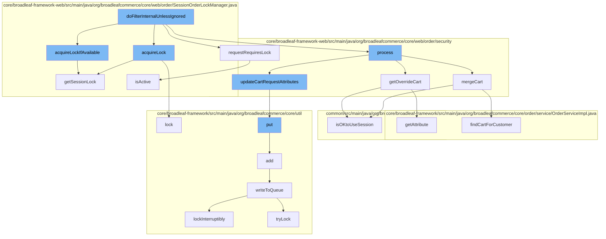

This document will cover the process of handling and updating the cart state in the BroadleafCommerce-demo project. The process includes:

1. Acquiring a lock for the session
2. Checking if the request requires a lock
3. Processing the request and updating the cart state
4. Merging the cart with the customer's cart
5. Updating the cart request attributes
6. Adding the updated cart to the distributed queue



<SwmSnippet path="/core/broadleaf-framework-web/src/main/java/org/broadleafcommerce/core/web/order/SessionOrderLockManager.java" line="56">

---

# Acquiring a lock for the session

The `acquireLock` function is used to prevent parallel operations that require a lock from happening. Instead, it executes them sequentially as locks are released from previous implementations.

```java
    /**
     * Note that although this method accepts an {@link Order} parameter, it does not use it in any way. This 
     * session-based lock manager implementation will prevent all operations that are identified as requiring a
     * lock from happening in parallel. Instead, it will execute them sequentially as locks are released from 
     * previous implementations.
     */
    @Override
    public Object acquireLock(Order order) {
        ReentrantLock lockObject = getSessionLock();
        lockObject.lock();
        return lockObject;
    }
```

---

</SwmSnippet>

<SwmSnippet path="/core/broadleaf-framework-web/src/main/java/org/broadleafcommerce/core/web/order/security/CartStateFilter.java" line="128">

---

# Checking if the request requires a lock

The `isActive` function checks if the session can be used to obtain a lock. If the session is not active, it suggests using a different implementation of OrderLockManager.

```java
        } finally {
            if (lockObject != null) {
                orderLockManager.releaseLock(lockObject);
            }

            if (LOG.isTraceEnabled()) {
                LOG.trace("Thread[" + Thread.currentThread().getId() + "] released lock for order[" + order.getId() +"]");
            }
        }
    }

    /**
     * By default, all POST requests that are not matched by the {@link #getExcludedOrderLockRequestPatterns()} list
     * (using the {@link AntPathRequestMatcher}) will be marked as requiring a lock on the Order.
     * 
```

---

</SwmSnippet>

<SwmSnippet path="/core/broadleaf-framework-web/src/main/java/org/broadleafcommerce/core/web/order/security/CartStateRequestProcessor.java" line="187">

---

# Processing the request and updating the cart state

The `mergeCart` function merges the cart of an anonymous customer with the cart of the logged-in customer. After the merge, the anonymous customer is removed from the session.

```java
    /**
     * Looks up the anonymous customer and merges that cart with the cart from the given logged in <b>customer</b>. This
     * will also remove the customer from session after it has finished since it is no longer needed
     */
    public Order mergeCart(Customer customer, WebRequest request) {
        Customer anonymousCustomer = customerStateRequestProcessor.getAnonymousCustomer(request);
        MergeCartResponse mergeCartResponse;
        try {
            Order cart = orderService.findCartForCustomer(anonymousCustomer);
            mergeCartResponse = mergeCartService.mergeCart(customer, cart);
        } catch (PricingException e) {
            throw new RuntimeException(e);
        } catch (RemoveFromCartException e) {
            throw new RuntimeException(e);
        }
        
        if (BLCRequestUtils.isOKtoUseSession(request)) {
            // The anonymous customer from session is no longer needed; it can be safely removed
            request.removeAttribute(CustomerStateRequestProcessor.getAnonymousCustomerSessionAttributeName(),
                    WebRequest.SCOPE_SESSION);
            request.removeAttribute(CustomerStateRequestProcessor.getAnonymousCustomerIdSessionAttributeName(),
```

---

</SwmSnippet>

<SwmSnippet path="/core/broadleaf-framework-web/src/main/java/org/broadleafcommerce/core/web/order/security/CartStateRequestProcessor.java" line="393">

---

# Updating the cart request attributes

The `put` function adds the updated cart to the distributed queue.

```java

```

---

</SwmSnippet>

<SwmSnippet path="/core/broadleaf-framework/src/main/java/org/broadleafcommerce/core/util/queue/ZookeeperDistributedQueue.java" line="503">

---

# Adding the updated cart to the distributed queue

The `writeToQueue` function writes the updated cart to the distributed queue. It acquires a lock before writing to the queue to ensure that the operation is thread-safe.

```java
    protected int writeToQueue(List<? extends T> entries, final long timeout) throws InterruptedException {
        if (entries == null || entries.isEmpty()) {
            return 0;
        }
        
        int entryCount = 0;
        long waitTime = timeout;
        synchronized (QUEUE_MONITOR) {
            while (true) {
                boolean locked = false;
                DistributedLock lock = getQueueAccessLock();
                if (timeout < 0L) {
                    lock.lockInterruptibly();
                    locked = true;
                } else if (timeout > 0L && waitTime > 0L) {
                    long start = System.currentTimeMillis();
                    locked = lock.tryLock(waitTime, TimeUnit.MILLISECONDS);
                    long end = System.currentTimeMillis();
                    waitTime -= (end - start);
                } else {
                    locked = lock.tryLock();
```

---

</SwmSnippet>

&nbsp;

*This is an auto-generated document by Swimm AI 🌊 and has not yet been verified by a human*

<SwmMeta version="3.0.0" repo-id="Z2l0aHViJTNBJTNBQnJvYWRsZWFmQ29tbWVyY2UtZGVtbyUzQSUzQWdpbGFkbmF2b3Q=" repo-name="BroadleafCommerce-demo" doc-type="flows"><sup>Powered by [Swimm](/)</sup></SwmMeta>
