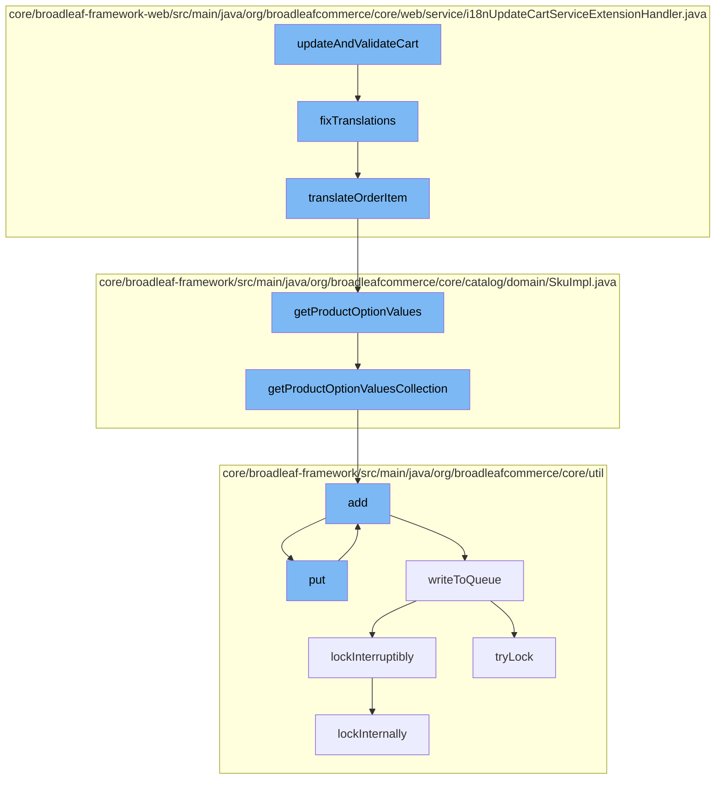

This document will cover the process of updating and validating a cart in the BroadleafCommerce-demo repository. The process includes the following steps:

1. Updating and validating the cart
2. Fixing translations
3. Translating order items
4. Getting product option values
5. Adding entries to the cache
6. Writing to the queue
7. Locking the queue



<SwmSnippet path="/core/broadleaf-framework-web/src/main/java/org/broadleafcommerce/core/web/service/i18nUpdateCartServiceExtensionHandler.java" line="104">

---

# Updating and validating the cart

The `updateAndValidateCart` function starts the process. It calls the `fixTranslations` function for each item in the cart.

```java
    protected void fixTranslations(Order cart) {
        for (DiscreteOrderItem orderItem : cart.getDiscreteOrderItems()) {
            Sku sku = orderItem.getSku();
            translateOrderItem(orderItem, sku);
        }

        for (OrderItem orderItem : cart.getOrderItems()) {
            if (orderItem instanceof BundleOrderItem) {
                BundleOrderItem bundleItem = (BundleOrderItem) orderItem;
                Sku sku = bundleItem.getSku();
                translateOrderItem(orderItem, sku);
            }
        }
    }
```

---

</SwmSnippet>

<SwmSnippet path="/core/broadleaf-framework-web/src/main/java/org/broadleafcommerce/core/web/service/i18nUpdateCartServiceExtensionHandler.java" line="104">

---

# Fixing translations

The `fixTranslations` function iterates over each item in the cart and calls the `translateOrderItem` function to translate the item.

```java
    protected void fixTranslations(Order cart) {
        for (DiscreteOrderItem orderItem : cart.getDiscreteOrderItems()) {
            Sku sku = orderItem.getSku();
            translateOrderItem(orderItem, sku);
        }

        for (OrderItem orderItem : cart.getOrderItems()) {
            if (orderItem instanceof BundleOrderItem) {
                BundleOrderItem bundleItem = (BundleOrderItem) orderItem;
                Sku sku = bundleItem.getSku();
                translateOrderItem(orderItem, sku);
            }
        }
    }
```

---

</SwmSnippet>

<SwmSnippet path="/core/broadleaf-framework-web/src/main/java/org/broadleafcommerce/core/web/service/i18nUpdateCartServiceExtensionHandler.java" line="119">

---

# Translating order items

The `translateOrderItem` function translates the order item and its product option values.

```java
    protected void translateOrderItem(OrderItem orderItem, Sku sku) {
        if (sku != null) {
            orderItem.setName(sku.getName());
            if (sku.getProductOptionValues() != null) {
                for (ProductOptionValue optionValue : sku.getProductOptionValues()) {
                    String key = optionValue.getProductOption().getAttributeName();
                    OrderItemAttribute attr = orderItem.getOrderItemAttributes().get(key);
                    if (attr != null) {
                        attr.setValue(optionValue.getAttributeValue());
                    } else {
                        OrderItemAttribute attribute = new OrderItemAttributeImpl();
                        attribute.setName(key);
                        attribute.setValue(optionValue.getAttributeValue());
                        attribute.setOrderItem(orderItem);
                        orderItem.getOrderItemAttributes().put(key, attribute);
                    }
                }
            }
        }
    }
```

---

</SwmSnippet>

<SwmSnippet path="/core/broadleaf-framework/src/main/java/org/broadleafcommerce/core/catalog/domain/SkuImpl.java" line="1047">

---

# Getting product option values

The `getProductOptionValues` function retrieves the product option values for a SKU.

```java
    @Override
    @Deprecated
    public List<ProductOptionValue> getProductOptionValues() {
        return new ArrayList<>(getProductOptionValuesCollection());
    }
```

---

</SwmSnippet>

<SwmSnippet path="/core/broadleaf-framework/src/main/java/org/broadleafcommerce/core/util/service/ResourcePurgeServiceImpl.java" line="593">

---

# Adding entries to the cache

The `add` function adds an entry to the cache if it does not already exist.

```java
        public Long add(Long entry) {
            if (! cache.containsKey(entry)) {
                return cache.put(entry, new Long(System.currentTimeMillis()));
            }
            return null;
        }
```

---

</SwmSnippet>

<SwmSnippet path="/core/broadleaf-framework/src/main/java/org/broadleafcommerce/core/util/queue/ZookeeperDistributedQueue.java" line="393">

---

# Writing to the queue

The `put` function writes an entry to the queue.

```java
    @Override
    public void put(T e) throws InterruptedException {
        final ArrayList<T> elementsToAdd = new ArrayList<>();
        elementsToAdd.add(e);
        writeToQueue(elementsToAdd, -1L);
    }
```

---

</SwmSnippet>

<SwmSnippet path="/core/broadleaf-framework/src/main/java/org/broadleafcommerce/core/util/lock/ReentrantDistributedZookeeperLock.java" line="335">

---

# Locking the queue

The `lockInterruptibly` function locks the queue to ensure that the entry is written to the queue without interruption.

```java
    @Override
    public void lockInterruptibly() throws InterruptedException {
        if (Thread.interrupted()) {
            throw new InterruptedException("Thread was interrupted prior to trying to acquire the lock.");
        }
        
        lockInternally(-1L);
    }
```

---

</SwmSnippet>

&nbsp;

*This is an auto-generated document by Swimm AI 🌊 and has not yet been verified by a human*

<SwmMeta version="3.0.0" repo-id="Z2l0aHViJTNBJTNBQnJvYWRsZWFmQ29tbWVyY2UtZGVtbyUzQSUzQWdpbGFkbmF2b3Q=" repo-name="BroadleafCommerce-demo" doc-type="flows"><sup>Powered by [Swimm](/)</sup></SwmMeta>
