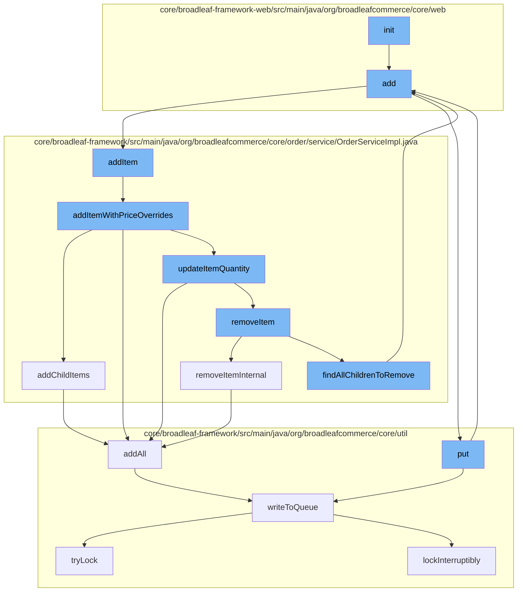

This document will cover the process of updating a shopping cart in the BroadleafCommerce-demo repository. The process includes:

1. Initializing the cart update process
2. Adding an item to the cart
3. Updating the item quantity
4. Removing an item from the cart
5. Adding the updated cart to a distributed queue for further processing.



<SwmSnippet path="/core/broadleaf-framework-web/src/main/java/org/broadleafcommerce/core/web/service/i18nUpdateCartServiceExtensionHandler.java" line="1">

---

# Initializing the cart update process

The `init` function in `i18nUpdateCartServiceExtensionHandler.java` is the entry point for the cart update process. It prepares the cart for the update operation.

```java
/*-
 * #%L
 * BroadleafCommerce Framework Web
 * %%
 * Copyright (C) 2009 - 2024 Broadleaf Commerce
 * %%
 * Licensed under the Broadleaf Fair Use License Agreement, Version 1.0
 * (the "Fair Use License" located  at http://license.broadleafcommerce.org/fair_use_license-1.0.txt)
 * unless the restrictions on use therein are violated and require payment to Broadleaf in which case
 * the Broadleaf End User License Agreement (EULA), Version 1.1
```

---

</SwmSnippet>

<SwmSnippet path="/core/broadleaf-framework-web/src/main/java/org/broadleafcommerce/core/web/controller/account/BroadleafManageWishlistController.java" line="62">

---

# Adding an item to the cart

The `add` function in `BroadleafManageWishlistController.java` is responsible for adding an item to the cart. It checks if the wishlist exists, if not, it creates one. Then it adds the item to the wishlist and saves the updated wishlist.

```java
    public String add(HttpServletRequest request, HttpServletResponse response, Model model,
                      OrderItemRequestDTO itemRequest, String wishlistName) throws IOException, AddToCartException, PricingException  {
        Order wishlist = orderService.findNamedOrderForCustomer(wishlistName, CustomerState.getCustomer(request));

        if (wishlist == null) {
            wishlist = orderService.createNamedOrderForCustomer(wishlistName, CustomerState.getCustomer(request));
        }
        
        wishlist = orderService.addItem(wishlist.getId(), itemRequest, false);
        wishlist = orderService.save(wishlist, true);

        return getAccountWishlistRedirect();
    }
```

---

</SwmSnippet>

<SwmSnippet path="/core/broadleaf-framework/src/main/java/org/broadleafcommerce/core/order/service/OrderServiceImpl.java" line="664">

---

# Updating the item quantity

The `addItemWithPriceOverrides` function in `OrderServiceImpl.java` is responsible for updating the quantity of an item in the cart. If a similar item already exists in the cart, it updates the quantity of the existing item. If not, it adds the new item to the cart.

```java
    @Override
    @Transactional(value = "blTransactionManager", rollbackFor = { AddToCartException.class })
    public Order addItemWithPriceOverrides(Long orderId, OrderItemRequestDTO orderItemRequestDTO, boolean priceOrder) throws AddToCartException {
        Order order = findOrderById(orderId);
        preValidateCartOperation(order);
        if (getAutomaticallyMergeLikeItems()) {
            OrderItem item = findMatchingItem(order, orderItemRequestDTO);
            if (item != null && item.getParentOrderItem() == null) {
                orderItemRequestDTO.setQuantity(item.getQuantity() + orderItemRequestDTO.getQuantity());
                orderItemRequestDTO.setOrderItemId(item.getId());
                try {
                    return updateItemQuantity(orderId, orderItemRequestDTO, priceOrder);
                } catch (RemoveFromCartException e) {
                    throw new AddToCartException("Unexpected error - system tried to remove item while adding to cart", e);
                } catch (UpdateCartException e) {
                    throw new AddToCartException("Could not update quantity for matched item", e);
                }
            }
        }
        try {
            // We only want to price on the last addition for performance reasons and only if the user asked for it.
```

---

</SwmSnippet>

<SwmSnippet path="/core/broadleaf-framework/src/main/java/org/broadleafcommerce/core/order/service/OrderServiceImpl.java" line="851">

---

# Removing an item from the cart

The `removeItemInternal` function in `OrderServiceImpl.java` is responsible for removing an item from the cart. It removes the item and updates the cart.

```java
    protected Order removeItemInternal(Long orderId, Long orderItemId, boolean priceOrder) throws WorkflowException {
        OrderItemRequestDTO orderItemRequestDTO = new OrderItemRequestDTO();
        orderItemRequestDTO.setOrderItemId(orderItemId);
        CartOperationRequest cartOpRequest = new CartOperationRequest(findOrderById(orderId), orderItemRequestDTO, priceOrder);
        Session session = em.unwrap(Session.class);
        FlushMode current = session.getHibernateFlushMode();
        if (!autoFlushRemoveFromCart) {
            //Performance measure. Hibernate will sometimes perform an autoflush when performing query operations and this can
            //be expensive. It is possible to avoid the autoflush if there's no concern about queries in the flow returning
            //incorrect results because something has not been flushed to the database yet.
            session.setHibernateFlushMode(FlushMode.MANUAL);
        }
        ProcessContext<CartOperationRequest> context;
        try {
            context = (ProcessContext<CartOperationRequest>) removeItemWorkflow.doActivities(cartOpRequest);
        } finally {
            if (!autoFlushRemoveFromCart) {
                session.setHibernateFlushMode(current);
            }
        }
        context.getSeedData().getOrder().getOrderMessages().addAll(((ActivityMessages) context).getActivityMessages());
```

---

</SwmSnippet>

<SwmSnippet path="/core/broadleaf-framework/src/main/java/org/broadleafcommerce/core/util/queue/ZookeeperDistributedQueue.java" line="503">

---

# Adding the updated cart to a distributed queue

The `writeToQueue` function in `ZookeeperDistributedQueue.java` is responsible for adding the updated cart to a distributed queue for further processing. It locks the queue, writes the updated cart to the queue, and then unlocks the queue.

```java
    protected int writeToQueue(List<? extends T> entries, final long timeout) throws InterruptedException {
        if (entries == null || entries.isEmpty()) {
            return 0;
        }
        
        int entryCount = 0;
        long waitTime = timeout;
        synchronized (QUEUE_MONITOR) {
            while (true) {
                boolean locked = false;
                DistributedLock lock = getQueueAccessLock();
                if (timeout < 0L) {
                    lock.lockInterruptibly();
                    locked = true;
                } else if (timeout > 0L && waitTime > 0L) {
                    long start = System.currentTimeMillis();
                    locked = lock.tryLock(waitTime, TimeUnit.MILLISECONDS);
                    long end = System.currentTimeMillis();
                    waitTime -= (end - start);
                } else {
                    locked = lock.tryLock();
```

---

</SwmSnippet>

&nbsp;

*This is an auto-generated document by Swimm AI 🌊 and has not yet been verified by a human*

<SwmMeta version="3.0.0" repo-id="Z2l0aHViJTNBJTNBQnJvYWRsZWFmQ29tbWVyY2UtZGVtbyUzQSUzQWdpbGFkbmF2b3Q=" repo-name="BroadleafCommerce-demo" doc-type="flows"><sup>Powered by [Swimm](/)</sup></SwmMeta>
