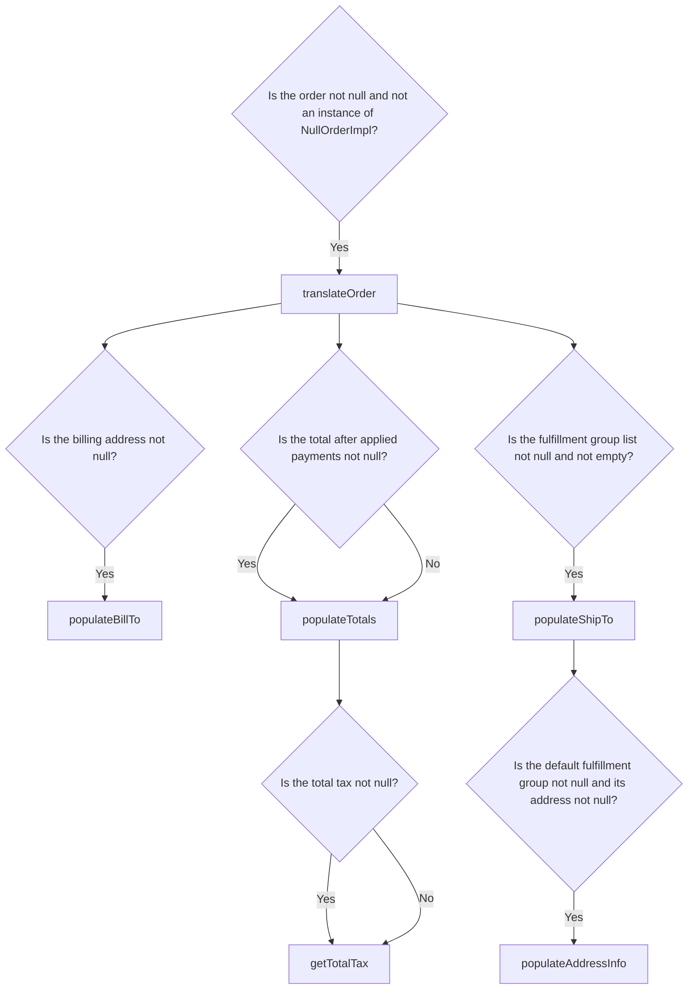
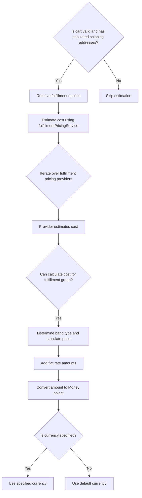

The Checkout Model Population Flow is a crucial part of the e-commerce checkout process in Broadleaf Commerce. This flow ensures that all necessary data is pre-populated and displayed correctly on the checkout page, providing a seamless experience for the user. The flow includes the following sections:

1. Output of the Checkout Model Population
2. Pre-populating Checkout Forms
3. Translating Order to Payment Request
4. Populating Fulfillment Options and Estimation
5. Populating Section View States

Technical document: <SwmLink doc-title="Checkout Page Model Population" repo-id="Z2l0aHViJTNBJTNBQnJvYWRsZWFmQ29tbWVyY2UtZGVtbyUzQSUzQWdpbGFkbmF2b3Q=" repo-name="BroadleafCommerce-demo" path="/.swm/checkout-page-model-population.1234.sw.md">[Checkout Page Model Population](https://app.swimm.io/repos/Z2l0aHViJTNBJTNBQnJvYWRsZWFmQ29tbWVyY2UtZGVtbyUzQSUzQWdpbGFkbmF2b3Q%3D/docs/1234)</SwmLink>

# Output of the Checkout Model Population

The output of the Checkout Model Population flow is a map containing various key-value pairs that represent the state and data needed for the checkout page. This includes:

- `paymentRequestDTO`: Contains payment-related information, translated from the current cart.
- `numShippableFulfillmentGroups`: The number of shippable fulfillment groups in the cart.
- `estimateResponse`: An estimation of the cost for the fulfillment options.
- `fulfillmentOptions`: A list of all available fulfillment options.
- `orderInfoHelpMessage`, `billingInfoHelpMessage`, `shippingInfoHelpMessage`: Help messages for the respective sections.
- `orderInfoPopulated`, `billingPopulated`, `shippingPopulated`: Boolean values indicating whether the respective sections have been populated with data.
- `showBillingInfoSection`, `showAllPaymentMethods`, `showPaymentMethodSection`, `orderContainsThirdPartyPayment`, `orderContainsUnconfirmedCreditCard`, `unconfirmedCC`: Variables controlling the visibility and state of different sections on the checkout page.
- `states`, `countries`: Lists of states and countries.
- `expirationMonths`, `expirationYears`: Lists of expiration months and years for credit card forms.
- `checkoutSectionDTOs`: A list of `CheckoutSectionDTO` objects representing the different sections of the checkout page.
- `processingError`: Any payment processing error that needs to be displayed.

# Pre-populating Checkout Forms

The pre-populating checkout forms section involves initializing various forms with data from the current cart. This includes:

1. **Order Info Form**: Pre-populated with the current order information.
2. **Shipping Info Form**: Pre-populated with the shipping address if available, otherwise checks for a default customer address.
3. **Billing Info Form**: Pre-populated with the billing address from the order payment if it exists. If the shipping address is used for billing, it updates the form accordingly.

This ensures that the user sees the most relevant information and options during the checkout process.

# Translating Order to Payment Request

The translating order to payment request section involves converting the current order into a `PaymentRequestDTO` object. This includes:

1. **Customer Info**: Populated with the customer's details.
2. **Shipping Address**: Populated with the shipping address from the first shippable fulfillment group.
3. **Billing Address**: Populated with the billing address from the active order payment.
4. **Order Totals**: Populated with the total, shipping total, and tax total from the order.

This ensures that all payment-related information is accurately represented in the `PaymentRequestDTO`.

# Populating Fulfillment Options and Estimation

The populating fulfillment options and estimation section involves retrieving all available fulfillment options for the cart and estimating their costs. This includes:

1. **Retrieving Fulfillment Options**: All available fulfillment options are retrieved.
2. **Estimating Costs**: The cost of applying these options to the first shippable fulfillment group is estimated using the `fulfillmentPricingService`.
3. **Handling Currency**: The estimated costs are converted to the appropriate currency, either specified or default.

This ensures that the user sees accurate cost estimations for the available fulfillment options.

# Populating Section View States

The populating section view states section involves determining which sections of the checkout page should be displayed based on the state of the cart. This includes:

1. **Order Info Section**: Displayed if the order information is populated.
2. **Billing Info Section**: Displayed if the billing information is populated and the order does not contain third-party payment or unconfirmed credit card.
3. **Shipping Info Section**: Displayed if the shipping information is populated and there are shippable fulfillment groups.
4. **Payment Methods Section**: Displayed if the total after applied payments is not zero.
5. **Section States**: Each section's state is set to either FORM, SAVED, or INACTIVE based on whether it is populated and the user's actions (e.g., clicking the edit button).

This ensures that the user sees only the relevant sections and options during the checkout process.

&nbsp;

*This is an auto-generated document by Swimm AI 🌊 and has not yet been verified by a human*

<SwmMeta version="3.0.0">Powered by [Swimm](https://app.swimm.io/)</SwmMeta>
