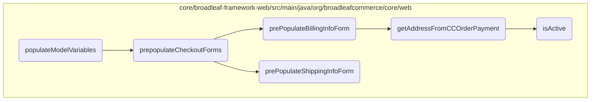
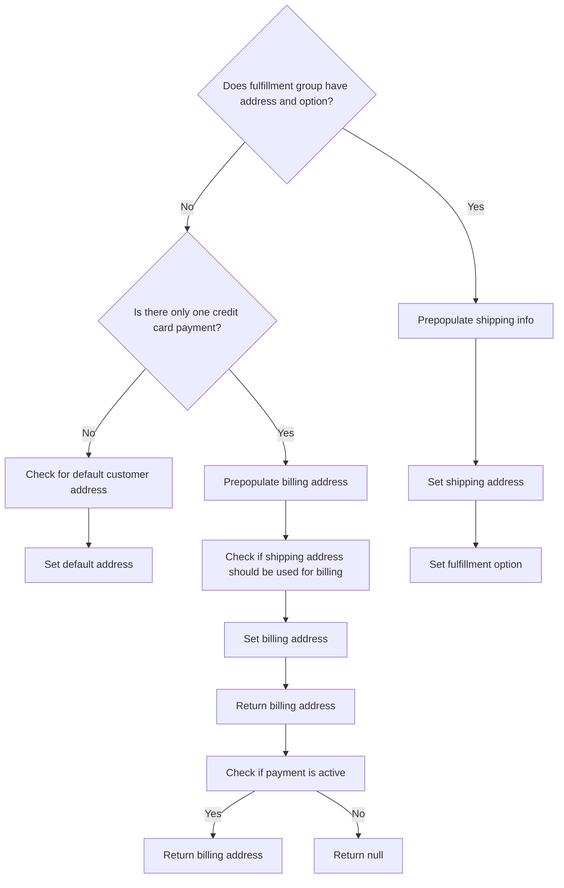
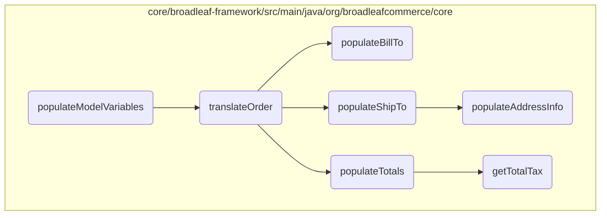
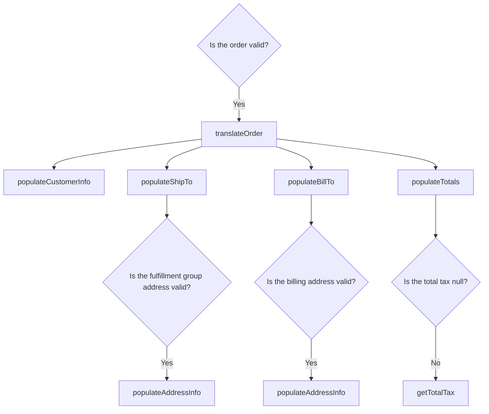
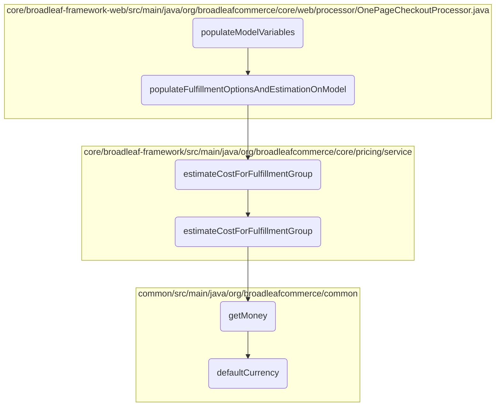
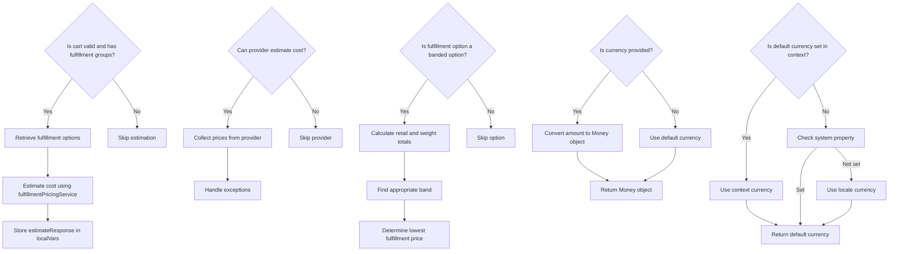
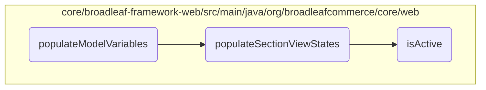
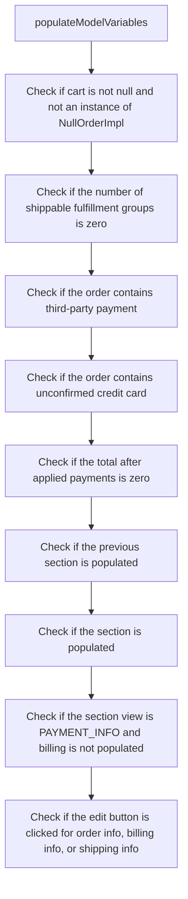

This document explains the process of populating model variables during the checkout process. The method `populateModelVariables` is responsible for setting up various forms and sections required for the checkout page. It ensures that all necessary information, such as order details, shipping info, and billing info, is pre-populated and ready for user interaction.

The flow starts by pre-populating command objects like order, shipping, and billing forms. It then initializes view states by adding help messages for these forms. Next, it checks the state of the order to determine which sections of the checkout page should be displayed. For example, it hides the shipping section if there are no shippable items. It also checks for third-party payments or unconfirmed credit cards and updates the view states accordingly. Finally, it initializes sections to an inactive state and sets their initial view state based on the state of other sections.

<SwmSnippet path="/core/broadleaf-framework-web/src/main/java/org/broadleafcommerce/core/web/processor/OnePageCheckoutProcessor.java" line="135" repo-id="testRepoId">

---

# populateModelVariables Function

The `populateModelVariables` function is responsible for preparing the model variables required for rendering the checkout page. It initializes various forms and populates them with data from the current cart, adds payment request details, fulfillment options, and other necessary information to the model.

```java
    @Override
    public Map<String, Object> populateModelVariables(String tagName, Map<String, String> tagAttributes, BroadleafTemplateContext context) {
        //Pre-populate the command objects
        OrderInfoForm orderInfoForm = context.parseExpression(tagAttributes.get("orderInfoForm"));

        ShippingInfoForm shippingInfoForm = context.parseExpression(tagAttributes.get("shippingInfoForm"));

        BillingInfoForm billingInfoForm = context.parseExpression(tagAttributes.get("billingInfoForm"));

        String orderInfoHelpMessage = context.parseExpression(tagAttributes.get("orderInfoHelpMessage"));

        String billingInfoHelpMessage = context.parseExpression(tagAttributes.get("billingInfoHelpMessage"));

        String shippingInfoHelpMessage = context.parseExpression(tagAttributes.get("shippingInfoHelpMessage"));

        prepopulateCheckoutForms(CartState.getCart(), orderInfoForm, shippingInfoForm, billingInfoForm);

        //Add PaymentRequestDTO to the model in the case of errors or other cases
        Map<String, Object> newModelVars = new HashMap<>();
        Order cart = CartState.getCart();
        if (cart != null && !(cart instanceof NullOrderImpl)) {
```

---

</SwmSnippet>

The output of the `populateModelVariables` function is a map containing various key-value pairs that are used to render the checkout page. Here is a detailed explanation of each part of the output:

- `paymentRequestDTO`: This is obtained by translating the current cart into a `PaymentRequestDTO` object using the `translateOrder` method. It contains payment-related information for the order.


- `numShippableFulfillmentGroups`: This is the number of shippable fulfillment groups in the cart, calculated using the `calculateNumShippableFulfillmentGroups` method.


- `estimateResponse`: This contains the estimated cost for the fulfillment options applied to the first shippable fulfillment group. It is populated by the `populateFulfillmentOptionsAndEstimationOnModel` method.


- `fulfillmentOptions`: A list of all available fulfillment options, retrieved from the `fulfillmentOptionService`.


- `orderInfoHelpMessage`, `billingInfoHelpMessage`, `shippingInfoHelpMessage`: These are help messages for the respective sections, parsed from the tag attributes.


- `states`: A list of states, retrieved from the `stateService`.


- `countries`: A list of countries, retrieved from the `countryService`.


- `expirationMonths`: A list of expiration months for credit cards, populated by the `populateExpirationMonths` method.


- `expirationYears`: A list of expiration years for credit cards, populated by the `populateExpirationYears` method.


- `orderInfoPopulated`, `billingPopulated`, `shippingPopulated`: Boolean values indicating whether the respective sections are populated, determined by the `populateSectionViewStates` method.


- `showBillingInfoSection`, `showAllPaymentMethods`, `showPaymentMethodSection`, `orderContainsThirdPartyPayment`, `orderContainsUnconfirmedCreditCard`, `unconfirmedCC`: Various flags and objects related to the visibility and state of different sections on the checkout page, also set by the `populateSectionViewStates` method.


- `checkoutSectionDTOs`: A list of `CheckoutSectionDTO` objects representing the different sections of the checkout page, their states, and help messages, populated by the `populateSectionViewStates` method.

# Flow diagram

```mermaid
graph TD;
      subgraph "core/broadleaf-framework-web/src/main/java/org/broadleafcommerce/core/web"
a290391198fbf5ec9cf5b7dbef3027e3977675cad65ab6be859d5be30bbd03a9(populateModelVariables) --> 4947c7d268006872e462ab8358234597f1d8e5cc6089a0d09cb110361bdc80e8(populateFulfillmentOptionsAndEstimationOnModel)
end

subgraph "core/broadleaf-framework-web/src/main/java/org/broadleafcommerce/core/web"
a290391198fbf5ec9cf5b7dbef3027e3977675cad65ab6be859d5be30bbd03a9(populateModelVariables) --> 72186cbd844fc532c239a7cc0601b9de0a44f46f80f5c4c6f983f6ac16929f42(populateSectionViewStates)
end

subgraph "core/broadleaf-framework-web/src/main/java/org/broadleafcommerce/core/web"
a290391198fbf5ec9cf5b7dbef3027e3977675cad65ab6be859d5be30bbd03a9(populateModelVariables) --> 798f15f6d8931e0e834284bf9efff9c1c2ea4db95f943ccb1e886f11bea3f651(prepopulateCheckoutForms)
end

subgraph "core/broadleaf-framework/src/main/java/org/broadleafcommerce/core"
a290391198fbf5ec9cf5b7dbef3027e3977675cad65ab6be859d5be30bbd03a9(populateModelVariables) --> 28013cf276395b82b6a372cd971a81f096296e53bf7518d50aad12696fc34ce0(translateOrder)
end

subgraph "core/broadleaf-framework/src/main/java/org/broadleafcommerce/core/pricing/service"
4947c7d268006872e462ab8358234597f1d8e5cc6089a0d09cb110361bdc80e8(populateFulfillmentOptionsAndEstimationOnModel) --> 92f51600ffe7a2f36b84411ef611f50df5cb6ac704249c6c9e48c5592b33e755(estimateCostForFulfillmentGroup)
end

subgraph "core/broadleaf-framework/src/main/java/org/broadleafcommerce/core/pricing/service"
92f51600ffe7a2f36b84411ef611f50df5cb6ac704249c6c9e48c5592b33e755(estimateCostForFulfillmentGroup) --> 099b3121c7da3d519ad05582605fbc2cb12665f1dabfa420d9646ae600cab498(estimateCostForFulfillmentGroup)
end

subgraph "common/src/main/java/org/broadleafcommerce/common"
099b3121c7da3d519ad05582605fbc2cb12665f1dabfa420d9646ae600cab498(estimateCostForFulfillmentGroup) --> c3d1ac37d3df72ce6561cbfc4d539197a744fc6e5d02a585841b14d5bc5af2df(getMoney)
end

subgraph "common/src/main/java/org/broadleafcommerce/common"
c3d1ac37d3df72ce6561cbfc4d539197a744fc6e5d02a585841b14d5bc5af2df(getMoney) --> 03bff02f07f930c64782e79b0fa9897c862a0ab741920b18a49528949eacc95e(defaultCurrency)
end

subgraph "core/broadleaf-framework-web/src/main/java/org/broadleafcommerce/core/web"
72186cbd844fc532c239a7cc0601b9de0a44f46f80f5c4c6f983f6ac16929f42(populateSectionViewStates) --> 7ad177e487e5f242abdadd8812f88bca2d1b5287c9a2ebf68552005af69348c2(isActive)
end

subgraph "core/broadleaf-framework-web/src/main/java/org/broadleafcommerce/core/web"
798f15f6d8931e0e834284bf9efff9c1c2ea4db95f943ccb1e886f11bea3f651(prepopulateCheckoutForms) --> 082c91c5409802a6677cfa6aa551f9b45c35dd5ece8ad6d29ab00c90cd4a1577(prePopulateBillingInfoForm)
end

subgraph "core/broadleaf-framework-web/src/main/java/org/broadleafcommerce/core/web"
798f15f6d8931e0e834284bf9efff9c1c2ea4db95f943ccb1e886f11bea3f651(prepopulateCheckoutForms) --> 1a4e7ca9da8466239bf72c602f5506b3ad94c3edc90ca9c6ef1ba2c613a58553(prePopulateShippingInfoForm)
end

subgraph "core/broadleaf-framework-web/src/main/java/org/broadleafcommerce/core/web"
082c91c5409802a6677cfa6aa551f9b45c35dd5ece8ad6d29ab00c90cd4a1577(prePopulateBillingInfoForm) --> bd64b1a205a5680d46556b1d4dd707d18226c1528a0d29a78f155bc2ea312e12(getAddressFromCCOrderPayment)
end

subgraph "core/broadleaf-framework-web/src/main/java/org/broadleafcommerce/core/web"
bd64b1a205a5680d46556b1d4dd707d18226c1528a0d29a78f155bc2ea312e12(getAddressFromCCOrderPayment) --> 7ad177e487e5f242abdadd8812f88bca2d1b5287c9a2ebf68552005af69348c2(isActive)
end

subgraph "core/broadleaf-framework/src/main/java/org/broadleafcommerce/core"
28013cf276395b82b6a372cd971a81f096296e53bf7518d50aad12696fc34ce0(translateOrder) --> 96c9c502d7266ef367ba2312834ac232286c1ce2678ad00922dae4fc1ef21032(populateBillTo)
end

subgraph "core/broadleaf-framework/src/main/java/org/broadleafcommerce/core"
28013cf276395b82b6a372cd971a81f096296e53bf7518d50aad12696fc34ce0(translateOrder) --> e659047dd7cc6a72569dcd920a28df554928defb1fdedce57efd238316905722(populateTotals)
end

subgraph "core/broadleaf-framework/src/main/java/org/broadleafcommerce/core"
28013cf276395b82b6a372cd971a81f096296e53bf7518d50aad12696fc34ce0(translateOrder) --> 2bf9b7acf66cd16f4b6d3c23a9de423f3e54220c21fff5a650b1fe28f426ce1e(populateShipTo)
end

subgraph "core/broadleaf-framework/src/main/java/org/broadleafcommerce/core"
e659047dd7cc6a72569dcd920a28df554928defb1fdedce57efd238316905722(populateTotals) --> 82be03ce3a0358f0711c109eaef5234cd11105651c5067962faae09f2af64169(getTotalTax)
end

subgraph "common/src/main/java/org/broadleafcommerce/common"
82be03ce3a0358f0711c109eaef5234cd11105651c5067962faae09f2af64169(getTotalTax) --> c3d1ac37d3df72ce6561cbfc4d539197a744fc6e5d02a585841b14d5bc5af2df(getMoney)
end

subgraph "core/broadleaf-framework/src/main/java/org/broadleafcommerce/core"
2bf9b7acf66cd16f4b6d3c23a9de423f3e54220c21fff5a650b1fe28f426ce1e(populateShipTo) --> c36f5f5fb7caddf17b6b4c7f230556c70f08eb600b392d62df7282d922e19fbb(populateAddressInfo)
end

subgraph "core/broadleaf-framework/src/main/java/org/broadleafcommerce/core"
c36f5f5fb7caddf17b6b4c7f230556c70f08eb600b392d62df7282d922e19fbb(populateAddressInfo) --> f22b0cca082e4ce0cd3e65a8465513e6327036c34a6b4dc490e19069173a8cc7(getName)
end


      classDef mainFlowStyle color:#000000,fill:#7CB9F4
classDef rootsStyle color:#000000,fill:#00FFF4
classDef Style1 color:#000000,fill:#00FFAA
classDef Style2 color:#000000,fill:#FFFF00
classDef Style3 color:#000000,fill:#AA7CB9
```



# Flow drill down

First, we'll zoom into this section of the flow:



Here's a logical flow of this section:



<SwmSnippet path="/core/broadleaf-framework-web/src/main/java/org/broadleafcommerce/core/web/processor/OnePageCheckoutProcessor.java" line="183" repo-id="testRepoId">

---

## Prepopulating Checkout Forms

The `prepopulateCheckoutForms` method is responsible for prepopulating the checkout forms with existing order and customer information. It calls three main methods: `prePopulateOrderInfoForm`, `prePopulateShippingInfoForm`, and `prePopulateBillingInfoForm` to fill in the order, shipping, and billing information respectively.

```java
    /**
     * The Checkout page for Heat Clinic will have the shipping information pre-populated
     * with an address if the fulfillment group has an address and fulfillment option
     * associated with it. It also assumes that if there is only one order payment of type
     * credit card on the order, then the billing address will be pre-populated with that payment.
    */
    protected void prepopulateCheckoutForms(Order cart, OrderInfoForm orderInfoForm, ShippingInfoForm shippingForm,
            BillingInfoForm billingForm) {
        checkoutFormService.prePopulateOrderInfoForm(orderInfoForm, cart);
        checkoutFormService.prePopulateShippingInfoForm(shippingForm, cart);
        checkoutFormService.prePopulateBillingInfoForm(billingForm, shippingForm, cart);
    }
```

---

</SwmSnippet>

<SwmSnippet path="/core/broadleaf-framework-web/src/main/java/org/broadleafcommerce/core/web/checkout/service/CheckoutFormServiceImpl.java" line="110" repo-id="testRepoId">

---

### Prepopulating Billing Information

The `prePopulateBillingInfoForm` method sets the billing address in the billing form. It retrieves the billing address from the credit card payment if available and checks if the shipping address should be used for billing.

```java
    @Override
    public BillingInfoForm prePopulateBillingInfoForm(BillingInfoForm billingInfoForm, ShippingInfoForm shippingInfoForm, Order cart) {
        Address orderPaymentBillingAddress = getAddressFromCCOrderPayment(cart);
        if (orderPaymentBillingAddress != null) {
            billingInfoForm.setAddress(orderPaymentBillingAddress);
        }
        boolean shippingAddressUsedForBilling = addressesContentsAreEqual(shippingInfoForm.getAddress(), billingInfoForm.getAddress());
        billingInfoForm.setUseShippingAddress(shippingAddressUsedForBilling);

        return billingInfoForm;
    }
```

---

</SwmSnippet>

<SwmSnippet path="/core/broadleaf-framework-web/src/main/java/org/broadleafcommerce/core/web/checkout/service/CheckoutFormServiceImpl.java" line="83" repo-id="testRepoId">

---

### Prepopulating Shipping Information

The `prePopulateShippingInfoForm` method sets the shipping address in the shipping form. It checks if the cart has fulfillment information and sets the address accordingly. If not, it checks for a default address for the customer.

```java
    @Override
    public ShippingInfoForm prePopulateShippingInfoForm(ShippingInfoForm shippingInfoForm, Order cart) {
        FulfillmentGroup firstShippableFulfillmentGroup = fulfillmentGroupService.getFirstShippableFulfillmentGroup(cart);

        if (firstShippableFulfillmentGroup != null) {
            //if the cart has already has fulfillment information
            if (firstShippableFulfillmentGroup.getAddress() != null) {
                shippingInfoForm.setAddress(firstShippableFulfillmentGroup.getAddress());
            } else {
                //check for a default address for the customer
                CustomerAddress defaultAddress = customerAddressService.findDefaultCustomerAddress(CustomerState.getCustomer().getId());
                if (defaultAddress != null) {
                    shippingInfoForm.setAddress(defaultAddress.getAddress());
                    shippingInfoForm.setAddressName(defaultAddress.getAddressName());
                }
            }

            FulfillmentOption fulfillmentOption = firstShippableFulfillmentGroup.getFulfillmentOption();
            if (fulfillmentOption != null) {
                shippingInfoForm.setFulfillmentOption(fulfillmentOption);
                shippingInfoForm.setFulfillmentOptionId(fulfillmentOption.getId());
```

---

</SwmSnippet>

<SwmSnippet path="/core/broadleaf-framework-web/src/main/java/org/broadleafcommerce/core/web/checkout/service/CheckoutFormServiceImpl.java" line="166" repo-id="testRepoId">

---

### Retrieving Address from Credit Card Payment

The `getAddressFromCCOrderPayment` method retrieves the billing address from the credit card payment if the payment is active, of type credit card, and has a billing address.

```java
    protected Address getAddressFromCCOrderPayment(Order cart) {
        List<OrderPayment> orderPayments = orderPaymentService.readPaymentsForOrder(cart);

        for (OrderPayment payment : CollectionUtils.emptyIfNull(orderPayments)) {
            boolean isCreditCardPaymentType = payment.getType().isCreditCardType();
            boolean paymentHasBillingAddress = (payment.getBillingAddress() != null);

            if (payment.isActive() && isCreditCardPaymentType && paymentHasBillingAddress) {
                return payment.getBillingAddress();
            }
        }

        return null;
    }
```

---

</SwmSnippet>

<SwmSnippet path="/core/broadleaf-framework-web/src/main/java/org/broadleafcommerce/core/web/service/SearchFacetDTOServiceImpl.java" line="114" repo-id="testRepoId">

---

### Checking if Payment is Active

The `isActive` method checks if a payment is active by comparing the request parameters with the search facet result.

```java
    @Override
    @SuppressWarnings("unchecked")
    public boolean isActive(SearchFacetResultDTO result, HttpServletRequest request) {
        Map<String, String[]> params = request.getParameterMap();
        for (Entry<String, String[]> entry : params.entrySet()) {
            String key = entry.getKey();
            if (key.equals(getUrlKey(result))) {
                for (String val : entry.getValue()) {
                    if (val.equals(getValue(result))) {
                        return true;
                    }
                }
            }
        }
        return false;
    }
```

---

</SwmSnippet>

Now, lets zoom into this section of the flow:



Here's a logical flow of this section:



<SwmSnippet path="/core/broadleaf-framework/src/main/java/org/broadleafcommerce/core/payment/service/OrderToPaymentRequestDTOServiceImpl.java" line="72" repo-id="testRepoId">

---

## translateOrder

The `translateOrder` method converts an `Order` object into a `PaymentRequestDTO`. It checks if the order is valid, logs the translation process, and populates various details such as customer info, shipping address, billing address, and order totals.

```java
    @Override
    public PaymentRequestDTO translateOrder(Order order) {
        if (order != null && !(order instanceof NullOrderImpl)) {
            final Long id = order.getId();
            final BroadleafCurrency currency = order.getCurrency();
            PaymentRequestDTO requestDTO = new PaymentRequestDTO().orderId(id.toString());
            
            if (LOG.isTraceEnabled()) {
                LOG.trace(String.format("Translating Order (ID:%s) into a PaymentRequestDTO for the configured " + 
                                        "gateway.", id));
            }
            
            if (currency != null) {
                requestDTO.orderCurrencyCode(currency.getCurrencyCode());
            }

            populateCustomerInfo(order, requestDTO);
            populateShipTo(order, requestDTO);
            populateBillTo(order, requestDTO);
            populateTotals(order, requestDTO);
            populateDefaultLineItemsAndSubtotal(order, requestDTO);
```

---

</SwmSnippet>

<SwmSnippet path="/core/broadleaf-framework/src/main/java/org/broadleafcommerce/core/payment/service/OrderToPaymentRequestDTOServiceImpl.java" line="204" repo-id="testRepoId">

---

### populateBillTo

The `populateBillTo` method iterates over the order payments to find the active payment and then populates the billing address information into the `PaymentRequestDTO`.

```java
    @Override
    public void populateBillTo(Order order, PaymentRequestDTO requestDTO) {
        for (OrderPayment payment : order.getPayments()) {
            if (payment.isActive()) {
                Address billAddress = payment.getBillingAddress();
                if (billAddress != null) {
                    populateAddressInfo(requestDTO.billTo(), billAddress);
                }
            }
        }
    }
```

---

</SwmSnippet>

<SwmSnippet path="/core/broadleaf-framework/src/main/java/org/broadleafcommerce/core/payment/service/OrderToPaymentRequestDTOServiceImpl.java" line="156" repo-id="testRepoId">

---

### populateTotals

The `populateTotals` method sets the total amount, shipping total, and tax total for the order in the `PaymentRequestDTO`. It retrieves these values from the order and formats them as strings.

```java
    @Override
    public void populateTotals(Order order, PaymentRequestDTO requestDTO) {
        String total = ZERO_TOTAL;
        String shippingTotal = ZERO_TOTAL;
        String taxTotal = ZERO_TOTAL;

        if (order.getTotalAfterAppliedPayments() != null) {
            total = order.getTotalAfterAppliedPayments().toString();
        }

        if (order.getTotalShipping() != null) {
            shippingTotal = order.getTotalShipping().toString();
        }

        if (order.getTotalTax() != null) {
            taxTotal = order.getTotalTax().toString();
        }

        requestDTO.transactionTotal(total)
                .shippingTotal(shippingTotal)
                .taxTotal(taxTotal)
```

---

</SwmSnippet>

<SwmSnippet path="/core/broadleaf-framework/src/main/java/org/broadleafcommerce/core/payment/service/OrderToPaymentRequestDTOServiceImpl.java" line="187" repo-id="testRepoId">

---

### populateShipTo

The `populateShipTo` method uses the first shippable fulfillment group from the order to populate the shipping address in the `PaymentRequestDTO`. It ensures that the fulfillment group and its address are not null before populating the address information.

```java
    /**
     * Uses the first shippable fulfillment group to populate the {@link PaymentRequestDTO#shipTo()} object
     * @param order the {@link Order} to get data from
     * @param requestDTO the {@link PaymentRequestDTO} that should be populated
     * @see {@link FulfillmentGroupService#getFirstShippableFulfillmentGroup(Order)}
     */
    @Override
    public void populateShipTo(Order order, PaymentRequestDTO requestDTO) {
        List<FulfillmentGroup> fgs = order.getFulfillmentGroups();
        if (fgs != null && fgs.size() > 0) {
            FulfillmentGroup defaultFg = fgService.getFirstShippableFulfillmentGroup(order);
            if (defaultFg != null && defaultFg.getAddress() != null) {
                populateAddressInfo(requestDTO.shipTo(), defaultFg.getAddress());
            }
        }
    }
```

---

</SwmSnippet>

<SwmSnippet path="/core/broadleaf-framework/src/main/java/org/broadleafcommerce/core/payment/service/OrderToPaymentRequestDTOServiceImpl.java" line="216" repo-id="testRepoId">

---

### populateAddressInfo

The `populateAddressInfo` method fills in the address details such as first name, last name, company name, address lines, city, state, postal code, country code, phone number, county, and email into the `AddressDTO` object.

```java
    protected void populateAddressInfo(final AddressDTO<PaymentRequestDTO> dto, final Address address) {
        String stateAbbr = null;
        String countryAbbr = null;
        String phone = null;

        if (StringUtils.isNotBlank(address.getStateProvinceRegion())) {
            stateAbbr = address.getStateProvinceRegion();
        } else if (address.getState() != null) {
            //support legacy
            stateAbbr = address.getState().getAbbreviation();
        }

        if (address.getIsoCountryAlpha2() != null) {
            countryAbbr = address.getIsoCountryAlpha2().getAlpha2();
        } else if (address.getCountry() != null) {
            //support legacy
            countryAbbr = address.getCountry().getAbbreviation();
        }

        if (address.getPhonePrimary() != null) {
            phone = address.getPhonePrimary().getPhoneNumber();
```

---

</SwmSnippet>

<SwmSnippet path="/core/broadleaf-framework/src/main/java/org/broadleafcommerce/core/order/domain/FulfillmentGroupFeeImpl.java" line="184" repo-id="testRepoId">

---

### getTotalTax

The `getTotalTax` method returns the total tax amount for the fulfillment group. If the total tax is null, it returns null; otherwise, it converts the total tax to the appropriate currency.

```java
    @Override
    public Money getTotalTax() {
        return totalTax == null ? null : BroadleafCurrencyUtils.getMoney(totalTax, getFulfillmentGroup().getOrder().getCurrency());
    }
```

---

</SwmSnippet>

Now, lets zoom into this section of the flow:



Here's a logical flow of this section:



<SwmSnippet path="/core/broadleaf-framework-web/src/main/java/org/broadleafcommerce/core/web/processor/OnePageCheckoutProcessor.java" line="379" repo-id="testRepoId">

---

## Populating Fulfillment Options and Estimation

The function `populateFulfillmentOptionsAndEstimationOnModel` retrieves all fulfillment options for the cart and estimates the cost of applying these options to the first shippable fulfillment group. It first reads all fulfillment options and checks if the cart is valid and has fulfillment groups. If so, it estimates the cost using the `fulfillmentPricingService` and stores the response in `localVars`.

```java
    /**
     * A helper method to retrieve all fulfillment options for the cart and estimate the cost of applying
     * fulfillment options on the first shippable fulfillment group.
     *
     */
    protected void populateFulfillmentOptionsAndEstimationOnModel(Map<String, Object> localVars) {
        List<FulfillmentOption> fulfillmentOptions = fulfillmentOptionService.readAllFulfillmentOptions();
        Order cart = CartState.getCart();

        if (!(cart instanceof NullOrderImpl) && cart.getFulfillmentGroups().size() > 0 && hasPopulatedShippingAddress(cart)) {
            Set<FulfillmentOption> options = new HashSet<>();
            options.addAll(fulfillmentOptions);
            FulfillmentEstimationResponse estimateResponse = null;
            try {
                estimateResponse = fulfillmentPricingService.estimateCostForFulfillmentGroup(fulfillmentGroupService.getFirstShippableFulfillmentGroup(cart), options);
            } catch (FulfillmentPriceException e) {

            }

            localVars.put("estimateResponse", estimateResponse);
        }
```

---

</SwmSnippet>

<SwmSnippet path="/core/broadleaf-framework/src/main/java/org/broadleafcommerce/core/pricing/service/FulfillmentPricingServiceImpl.java" line="69" repo-id="testRepoId">

---

## Estimating Cost for Fulfillment Group

The function `estimateCostForFulfillmentGroup` in `FulfillmentPricingServiceImpl` iterates over all pricing providers to estimate the cost for a given fulfillment group and set of fulfillment options. It collects the prices from each provider and handles any exceptions without failing the entire estimation process.

```java
    @Override
    public FulfillmentEstimationResponse estimateCostForFulfillmentGroup(FulfillmentGroup fulfillmentGroup, Set<FulfillmentOption> options) throws FulfillmentPriceException {
        FulfillmentEstimationResponse response = new FulfillmentEstimationResponse();
        HashMap<FulfillmentOption, Money> prices = new HashMap<FulfillmentOption, Money>();
        response.setFulfillmentOptionPrices(prices);
        for (FulfillmentPricingProvider provider : providers) {
            //Leave it up to the providers to determine if they can respond to a pricing estimate.  If they can't, or if one or more of the options that are passed in can't be responded
            //to, then the response from the pricing provider should not include the options that it could not respond to.
            try {
                FulfillmentEstimationResponse processorResponse = provider.estimateCostForFulfillmentGroup(fulfillmentGroup, options);
                if (processorResponse != null
                        && processorResponse.getFulfillmentOptionPrices() != null
                        && processorResponse.getFulfillmentOptionPrices().size() > 0) {
                    prices.putAll(processorResponse.getFulfillmentOptionPrices());
                }
            } catch (FulfillmentPriceException e) {
                //Shouldn't completely fail the rest of the estimation on a pricing exception. Another provider might still
                //be able to respond
                String errorMessage = "FulfillmentPriceException thrown when trying to estimate fulfillment costs from ";
                errorMessage += provider.getClass().getName();
                errorMessage += ". Underlying message was: " + e.getMessage();
```

---

</SwmSnippet>

<SwmSnippet path="/core/broadleaf-framework/src/main/java/org/broadleafcommerce/core/pricing/service/fulfillment/provider/BandedFulfillmentPricingProvider.java" line="92" repo-id="testRepoId">

---

## Provider-Specific Cost Estimation

The function `estimateCostForFulfillmentGroup` in `BandedFulfillmentPricingProvider` calculates the cost based on different bands (price or weight). It iterates over the fulfillment options and checks if the cost can be calculated. It then calculates the total retail and weight amounts, finds the appropriate band, and determines the lowest fulfillment price.

```java
    @Override
    public FulfillmentEstimationResponse estimateCostForFulfillmentGroup(FulfillmentGroup fulfillmentGroup, Set<FulfillmentOption> options) throws FulfillmentPriceException {

        //Set up the response object
        FulfillmentEstimationResponse res = new FulfillmentEstimationResponse();
        HashMap<FulfillmentOption, Money> shippingPrices = new HashMap<FulfillmentOption, Money>();
        res.setFulfillmentOptionPrices(shippingPrices);

        for (FulfillmentOption option : options) {
            if (canCalculateCostForFulfillmentGroup(fulfillmentGroup, option)) {
                
                List<? extends FulfillmentBand> bands = null;
                if (option instanceof BandedPriceFulfillmentOption) {
                    bands = ((BandedPriceFulfillmentOption) option).getBands();
                } else if (option instanceof BandedWeightFulfillmentOption) {
                    bands = ((BandedWeightFulfillmentOption) option).getBands();
                }
                
                if (bands == null || bands.isEmpty()) {
                    //Something is misconfigured. There are no bands associated with this fulfillment option
                    throw new IllegalStateException("There were no Fulfillment Price Bands configured for a BandedPriceFulfillmentOption with ID: "
```

---

</SwmSnippet>

<SwmSnippet path="/common/src/main/java/org/broadleafcommerce/common/currency/util/BroadleafCurrencyUtils.java" line="45" repo-id="testRepoId">

---

## Handling Currency

The function `getMoney` converts a given amount to a `Money` object using the specified currency. If the currency is not provided, it defaults to the system's default currency.

```java
    public static Money getMoney(BigDecimal amount, BroadleafCurrency currency) {
        if (amount == null) {
            return null;
        }

        if (currency != null) {
            return new Money(amount, currency.getCurrencyCode());
        } else {
            return new Money(amount, Money.defaultCurrency());
        }
    }
```

---

</SwmSnippet>

<SwmSnippet path="/common/src/main/java/org/broadleafcommerce/common/money/Money.java" line="446" repo-id="testRepoId">

---

## Default Currency

The function `defaultCurrency` attempts to load the default currency based on the system's locale or a specified system property. It checks various contexts to determine the appropriate currency to use.

```java
    /**
     * Attempts to load a default currency by using the default locale. {@link Currency#getInstance(Locale)} uses the country component of the locale to resolve the currency. In some instances, the locale may not have a country component, in which case the default currency can be controlled with a
     * system property.
     * @return The default currency to use when none is specified
     */
    public static Currency defaultCurrency() {
        if (CurrencyConsiderationContext.getCurrencyConsiderationContext() != null &&
                CurrencyConsiderationContext.getCurrencyConsiderationContext().size() > 0 &&
                CurrencyConsiderationContext.getCurrencyDeterminationService() != null) {
            return Currency.getInstance(CurrencyConsiderationContext.getCurrencyDeterminationService().getCurrencyCode(CurrencyConsiderationContext.getCurrencyConsiderationContext()));
        }

        // Check the BLC Thread
        BroadleafRequestContext brc = BroadleafRequestContext.getBroadleafRequestContext();

        if (brc != null && brc.getBroadleafCurrency() != null) {
            assert brc.getBroadleafCurrency().getCurrencyCode() != null;
            return Currency.getInstance(brc.getBroadleafCurrency().getCurrencyCode());
        }

        if (System.getProperty("currency.default") != null) {
```

---

</SwmSnippet>

Now, lets zoom into this section of the flow:



Here's a logical flow of this section:



<SwmSnippet path="/core/broadleaf-framework-web/src/main/java/org/broadleafcommerce/core/web/processor/OnePageCheckoutProcessor.java" line="137" repo-id="testRepoId">

---

## Pre-populating Command Objects

The `populateModelVariables` method begins by pre-populating command objects such as `OrderInfoForm`, `ShippingInfoForm`, and `BillingInfoForm` using the `context.parseExpression` method. This ensures that the necessary forms are ready for the checkout process.

```java
        //Pre-populate the command objects
        OrderInfoForm orderInfoForm = context.parseExpression(tagAttributes.get("orderInfoForm"));

        ShippingInfoForm shippingInfoForm = context.parseExpression(tagAttributes.get("shippingInfoForm"));

        BillingInfoForm billingInfoForm = context.parseExpression(tagAttributes.get("billingInfoForm"));

        String orderInfoHelpMessage = context.parseExpression(tagAttributes.get("orderInfoHelpMessage"));

        String billingInfoHelpMessage = context.parseExpression(tagAttributes.get("billingInfoHelpMessage"));

        String shippingInfoHelpMessage = context.parseExpression(tagAttributes.get("shippingInfoHelpMessage"));

        prepopulateCheckoutForms(CartState.getCart(), orderInfoForm, shippingInfoForm, billingInfoForm);
```

---

</SwmSnippet>

<SwmSnippet path="/core/broadleaf-framework-web/src/main/java/org/broadleafcommerce/core/web/processor/OnePageCheckoutProcessor.java" line="165" repo-id="testRepoId">

---

## Initializing View States

The method then initializes view states by adding help messages for order, billing, and shipping information to the model variables. This is followed by calling `populateSectionViewStates` to further configure the view states.

```java
        newModelVars.put("orderInfoHelpMessage", orderInfoHelpMessage);
        newModelVars.put("billingInfoHelpMessage", billingInfoHelpMessage);
        newModelVars.put("shippingInfoHelpMessage", shippingInfoHelpMessage);

        populateSectionViewStates(newModelVars);
```

---

</SwmSnippet>

<SwmSnippet path="/core/broadleaf-framework-web/src/main/java/org/broadleafcommerce/core/web/processor/OnePageCheckoutProcessor.java" line="222" repo-id="testRepoId">

---

### Populating Section View States

The `populateSectionViewStates` method checks if order info, billing, and shipping information have been populated and updates the local variables accordingly. This helps in determining which sections of the checkout page should be displayed.

```java
    protected void populateSectionViewStates(Map<String, Object> localVars) {
        boolean orderInfoPopulated = hasPopulatedOrderInfo(CartState.getCart());
        boolean billingPopulated = hasPopulatedBillingAddress(CartState.getCart());
        boolean shippingPopulated = hasPopulatedShippingAddress(CartState.getCart());

        localVars.put("orderInfoPopulated", orderInfoPopulated);
        localVars.put("billingPopulated", billingPopulated);
        localVars.put("shippingPopulated", shippingPopulated);

```

---

</SwmSnippet>

<SwmSnippet path="/core/broadleaf-framework-web/src/main/java/org/broadleafcommerce/core/web/processor/OnePageCheckoutProcessor.java" line="231" repo-id="testRepoId">

---

The method contains logic to show or hide sections based on the state of the order. For example, it hides the shipping section if there are no shippable items in the order.

```java
        //Logic to show/hide sections based on state of the order
        // show all sections including header unless specifically hidden
        // (e.g. hide shipping if no shippable items in order or hide billing section if the order payment doesn't need
        // an address i.e. PayPal Express)
        boolean showBillingInfoSection = true;
        boolean showShippingInfoSection = true;
        boolean showAllPaymentMethods = true;
        boolean showPaymentMethodSection = true;

        int numShippableFulfillmentGroups = calculateNumShippableFulfillmentGroups();
        if (numShippableFulfillmentGroups == 0) {
            showShippingInfoSection = false;
        }
```

---

</SwmSnippet>

<SwmSnippet path="/core/broadleaf-framework-web/src/main/java/org/broadleafcommerce/core/web/processor/OnePageCheckoutProcessor.java" line="248" repo-id="testRepoId">

---

It also checks if the order contains third-party payments or unconfirmed credit cards and updates the view states accordingly.

```java
        if (CartState.getCart().getPayments() != null) {
            for (OrderPayment payment : CartState.getCart().getPayments()) {
                if (payment.isActive() && PaymentType.THIRD_PARTY_ACCOUNT.equals(payment.getType())) {
                    orderContainsThirdPartyPayment = true;
                }
                if (payment.isActive() && (payment.getType().isCreditCardType() && !PaymentGatewayType.TEMPORARY.equals(payment.getGatewayType()))) {
                    orderContainsUnconfirmedCreditCard = true;
                    unconfirmedCC = payment;
                }
            }
        }
```

---

</SwmSnippet>

<SwmSnippet path="/core/broadleaf-framework-web/src/main/java/org/broadleafcommerce/core/web/processor/OnePageCheckoutProcessor.java" line="260" repo-id="testRepoId">

---

The method toggles the payment info section based on the applied payments. For instance, if all applied payments cover the entire order amount, it hides other payment method options.

```java
        //Toggle the Payment Info Section based on what payments were applied to the order
        //(e.g. Third Party Account (i.e. PayPal Express) or Gift Cards/Customer Credit)
        Money orderTotalAfterAppliedPayments = CartState.getCart().getTotalAfterAppliedPayments();
        if (orderContainsThirdPartyPayment || orderContainsUnconfirmedCreditCard) {
            showBillingInfoSection = false;
            showAllPaymentMethods = false;
        } else if (orderTotalAfterAppliedPayments != null && orderTotalAfterAppliedPayments.isZero()) {
            //If all the applied payments (e.g. gift cards) cover the entire amount
            //we don't need to show all payment method options.
            showAllPaymentMethods = false;
        }
```

---

</SwmSnippet>

<SwmSnippet path="/core/broadleaf-framework-web/src/main/java/org/broadleafcommerce/core/web/processor/OnePageCheckoutProcessor.java" line="279" repo-id="testRepoId">

---

The sections are initialized to an INACTIVE view state. The method then creates `CheckoutSectionDTO` objects for order info, billing info, shipping info, and payment info.

```java
        //The Sections are all initialized to INACTIVE view
        List<CheckoutSectionDTO> drawnSections = new LinkedList<>();
        CheckoutSectionDTO orderInfoSection = new CheckoutSectionDTO(CheckoutSectionViewType.ORDER_INFO, orderInfoPopulated);
        CheckoutSectionDTO billingInfoSection = new CheckoutSectionDTO(CheckoutSectionViewType.BILLING_INFO, billingPopulated);
        CheckoutSectionDTO shippingInfoSection = new CheckoutSectionDTO(CheckoutSectionViewType.SHIPPING_INFO, shippingPopulated);
```

---

</SwmSnippet>

<SwmSnippet path="/core/broadleaf-framework-web/src/main/java/org/broadleafcommerce/core/web/processor/OnePageCheckoutProcessor.java" line="291" repo-id="testRepoId">

---

The method adds the sections to a list and sets their help messages based on the state of the order. It also determines the initial view state for each section.

```java
        drawnSections.add(orderInfoSection);

        //Add the Billing Section
        if (showBillingInfoSection) {
            billingInfoSection.setHelpMessage(orderInfoHelpMessage);
            drawnSections.add(billingInfoSection);
        }

        //Add the Shipping Section
        if (showShippingInfoSection) {

            if (showBillingInfoSection) {
                shippingInfoSection.setHelpMessage(billingInfoHelpMessage);
            } else {
                shippingInfoSection.setHelpMessage(orderInfoHelpMessage);
            }

            drawnSections.add(shippingInfoSection);
        }

        //Add the Payment Section
```

---

</SwmSnippet>

<SwmSnippet path="/core/broadleaf-framework-web/src/main/java/org/broadleafcommerce/core/web/processor/OnePageCheckoutProcessor.java" line="326" repo-id="testRepoId">

---

The method iterates through the sections and sets their state based on the state of other sections. It also handles cases where there may have been an error on the payment gateway, requiring the customer to re-enter their billing address and payment information.

```java
        CheckoutSectionDTO firstSection = drawnSections.get(0);
        firstSection.setState(CheckoutSectionStateType.FORM);
        //iterate through all the drawn sections and set their state based on the state of the other sections.

        for (ListIterator<CheckoutSectionDTO> itr = drawnSections.listIterator(); itr.hasNext();) {
            CheckoutSectionDTO previousSection = null;
            if (itr.hasPrevious()) {
                previousSection = drawnSections.get(itr.previousIndex());
            }
            CheckoutSectionDTO section = itr.next();

            //if the previous section is populated, set this section to a Form View
            if (previousSection != null && previousSection.isPopulated()) {
                section.setState(CheckoutSectionStateType.FORM);
            }
            //If this sections is populated then set this section to the Saved View
            if (section.isPopulated()) {
                section.setState(CheckoutSectionStateType.SAVED);
            }

            //Custom Logic to handle a state where there may have been an error on the Payment Gateway
```

---

</SwmSnippet>

&nbsp;

*This is an auto-generated document by Swimm AI 🌊 and has not yet been verified by a human*

<SwmMeta version="3.0.0" doc-type="flows"><sup>Powered by [Swimm](https://staging.swimm.cloud/)</sup></SwmMeta>
