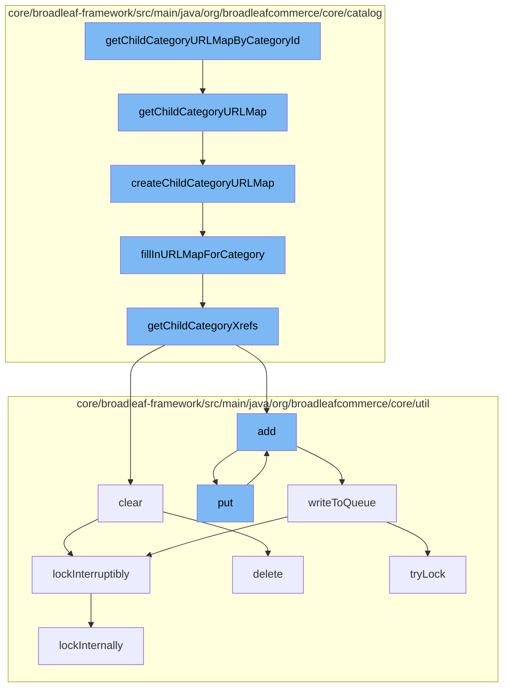

This document will cover the process of generating a URL map for child categories in the Broadleaf Commerce framework. The process includes:

1. Fetching the child category URL map
2. Creating the child category URL map
3. Filling in the URL map for a category
4. Getting child category cross-references
5. Clearing and adding entries to a distributed queue
6. Writing to the queue
7. Locking the queue operation



<SwmSnippet path="/core/broadleaf-framework/src/main/java/org/broadleafcommerce/core/catalog/domain/CategoryImpl.java" line="821">

---

# Fetching the child category URL map

The `getChildCategoryURLMap` function is used to fetch the URL map for child categories. If the map is not already created, it calls the `createChildCategoryURLMap` function to create it.

```java
    @Override
    @Deprecated
    public Map<String, List<Long>> getChildCategoryURLMap() {
        if (childCategoryURLMap == null) {
            createChildCategoryURLMap();
        }
        return childCategoryURLMap;
    }
```

---

</SwmSnippet>

<SwmSnippet path="/core/broadleaf-framework/src/main/java/org/broadleafcommerce/core/catalog/domain/CategoryImpl.java" line="830">

---

# Creating the child category URL map

The `createChildCategoryURLMap` function creates a new URL map for child categories. It calls the `fillInURLMapForCategory` function to fill in the map.

```java
    public Map<String, List<Long>> createChildCategoryURLMap() {
        try {
            Map<String, List<Long>> newMap = new HashMap<String, List<Long>>(50);
            fillInURLMapForCategory(newMap, this, "", new ArrayList<Long>(10));
            return newMap;
        } catch (CacheFactoryException e) {
            throw new RuntimeException(e);
        }
    }
```

---

</SwmSnippet>

<SwmSnippet path="/core/broadleaf-framework/src/main/java/org/broadleafcommerce/core/catalog/domain/CategoryImpl.java" line="142">

---

# Filling in the URL map for a category

The `fillInURLMapForCategory` function fills in the URL map for a given category. It recursively calls itself for each child category.

```java
    private static void fillInURLMapForCategory(Map<String, List<Long>> categoryUrlMap, Category category, String startingPath, List<Long> startingCategoryList) throws CacheFactoryException {
        String urlKey = category.getUrlKey();
        if (urlKey == null) {
            throw new CacheFactoryException("Cannot create childCategoryURLMap - the urlKey for a category("+category.getId()+") was null");
        }

        String currentPath = "";
        if (! "/".equals(category.getUrlKey())) {
            currentPath = startingPath + "/" + category.getUrlKey();
        }

        List<Long> newCategoryList = new ArrayList<Long>(startingCategoryList);
        newCategoryList.add(category.getId());

        categoryUrlMap.put(currentPath, newCategoryList);
        for (CategoryXref currentCategory : category.getChildCategoryXrefs()) {
            fillInURLMapForCategory(categoryUrlMap, currentCategory.getSubCategory(), currentPath, newCategoryList);
        }
    }
```

---

</SwmSnippet>

<SwmSnippet path="/core/broadleaf-framework/src/main/java/org/broadleafcommerce/core/catalog/domain/CategoryImpl.java" line="725">

---

# Getting child category cross-references

The `getChildCategoryXrefs` function fetches cross-references to child categories. It clears the existing cross-references before adding the active ones.

```java
    @Override
    public List<CategoryXref> getChildCategoryXrefs() {
        childCategoryXrefs.clear();
        for (CategoryXref category : allChildCategoryXrefs) {
            if (category.getSubCategory().isActive()) {
                childCategoryXrefs.add(category);
            }
        }
        return Collections.unmodifiableList(childCategoryXrefs);
    }
```

---

</SwmSnippet>

<SwmSnippet path="/core/broadleaf-framework/src/main/java/org/broadleafcommerce/core/util/queue/ZookeeperDistributedQueue.java" line="331">

---

# Clearing and adding entries to a distributed queue

The `clear` function clears the distributed queue. It locks the queue operation, deletes all entries, and then unlocks the operation. The `add` function adds an entry to the queue.

```java
    @Override
    public void clear() {
        DistributedLock lock = getQueueAccessLock();
        try {
            lock.lockInterruptibly();
            try {
                executeOperation(new GenericOperation<Void>() {
                    @Override
                    public Void execute() throws Exception {
                        List<String> entryNames = getZookeeperClient().getChildren(getQueueEntryFolder(), null);
                        if (entryNames != null) {
                            for (String entry : entryNames) {
                                getZookeeperClient().delete(getQueueEntryFolder() + '/' + entry, 0);
                            }
                        }
                        return null;
                    }
                });
                
            } finally {
                lock.unlock();
```

---

</SwmSnippet>

<SwmSnippet path="/core/broadleaf-framework/src/main/java/org/broadleafcommerce/core/util/queue/ZookeeperDistributedQueue.java" line="503">

---

# Writing to the queue

The `writeToQueue` function writes entries to the queue. It locks the queue operation, writes the entries, and then unlocks the operation.

```java
    protected int writeToQueue(List<? extends T> entries, final long timeout) throws InterruptedException {
        if (entries == null || entries.isEmpty()) {
            return 0;
        }
        
        int entryCount = 0;
        long waitTime = timeout;
        synchronized (QUEUE_MONITOR) {
            while (true) {
                boolean locked = false;
                DistributedLock lock = getQueueAccessLock();
                if (timeout < 0L) {
                    lock.lockInterruptibly();
                    locked = true;
                } else if (timeout > 0L && waitTime > 0L) {
                    long start = System.currentTimeMillis();
                    locked = lock.tryLock(waitTime, TimeUnit.MILLISECONDS);
                    long end = System.currentTimeMillis();
                    waitTime -= (end - start);
                } else {
                    locked = lock.tryLock();
```

---

</SwmSnippet>

<SwmSnippet path="/core/broadleaf-framework/src/main/java/org/broadleafcommerce/core/util/lock/ReentrantDistributedZookeeperLock.java" line="335">

---

# Locking the queue operation

The `lockInterruptibly` function locks the queue operation. It calls the `lockInternally` function to perform the locking.

```java
    @Override
    public void lockInterruptibly() throws InterruptedException {
        if (Thread.interrupted()) {
            throw new InterruptedException("Thread was interrupted prior to trying to acquire the lock.");
        }
        
        lockInternally(-1L);
    }
```

---

</SwmSnippet>

&nbsp;

*This is an auto-generated document by Swimm AI 🌊 and has not yet been verified by a human*

<SwmMeta version="3.0.0" repo-id="Z2l0aHViJTNBJTNBQnJvYWRsZWFmQ29tbWVyY2UtZGVtbyUzQSUzQWdpbGFkbmF2b3Q=" repo-name="BroadleafCommerce-demo" doc-type="flows"><sup>Powered by [Swimm](/)</sup></SwmMeta>
